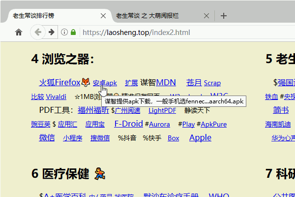

老生常谈 帮助页
==============
大萌 © 202012

	这里是上一代互联网，请“在浏览器打开”。

链接的批注
------------

　　老生常谈的网页有一个显著特点，就是几乎每一个[链接](./helpweb.txt "这里显示的就是批注")都有**批注**。在电脑的浏览器上，鼠标指针悬停就可以看见，如图：
   
而在手机上，只发现火狐浏览器能支持批注(长按链接弹出)。

微信内部打开
------------

　　在手机微信打开本站网址时，会提示“非微信官方网站”，请您点击**继续访问**；或者您愿意实名帮助我，可以点击下方的“申请恢复”，非常感谢！

法律读本的使用
---------------

　　法律读本下载的.ePub文件用什么软件打开呢？在Win10的旧版EDGE浏览器可以直接阅览，但新版取消了该功能。Windows上可以阅读ePub的免费软件有：金山WPS包含的pdf阅读器，程序文件名为 wps-pdf.exe；还有单文件的SumatraPDF 和 Adobe公司的DigitalEditions。  
　　安卓手机上可以找免费的阅读软件 静读天下App。苹果手机可用 iBooks。

排行榜的使用
------------

　　排行榜在以前的导航页中增加了安全性、公益性的权重，所收录的网站符合‘内容健康、稳定运行、无视觉干扰’的特点，非常适合老人、小孩等认知能力有限的用户。网页上还有一些功能没有实现，比如第一段落的搜索框并不起作用。  
　　这个网页做了手机屏幕适配，但我建议您有空的时候，到电脑屏幕上看看。因为几乎每一个连接都有批注，在电脑上才好看到。同时，这个网页在设计的时候，我有意让它容易保存，您可以保存为.html或.mht文件，成为一个永不消逝的网址库。

阅报栏的使用
------------

　　阅报栏收集了中国主要地方性和部门性报纸，也包括了全球范围内一些报纸网站。我们能非常直观地看到，中国在数字报普及方面，在全世界遥遥领先。根据数字报技术的发展，以及对手机屏幕的兼容性，报纸的名字有大有小，大者为好。  
　　很多报纸都大方的给出了整个版面的PDF文件，那我们需要安装pdf阅读器吗？不一定，越来越多的报纸直接提供大幅版面图片，用浏览器就可以直接看到很多好报纸。  

其他页面
---------

　　随着创作的持续，还会有其他页面跟大家见面。

　　“老生常谈”这个小网站托管在GitHub大网站，在某些页面，你能看到底部有一行英文：This site is open source. Improve this page. 这句话跟本站的关系不太大，主要是针对那些软件项目（本站是文档项目），你可以点后面那个链接对网站的源代码进行改进，但这要求你有github的帐号。

　　Github在IT界名气很大，拥有大量开源（免费）的软件项目，前不久被不差钱的微软收购，对免费用户也有了更多服务。对于作者而言，这能降低我分享的成本，节约更多时间来用于内容的制作。

　　祝大家阅读愉快！

	老生常谈 © 作者大萌 2020年9月
	CC-BY-NC-ND-4.0 知识共享 署名-非演绎 4.0

回到首页
 
https://Laosheng.top
