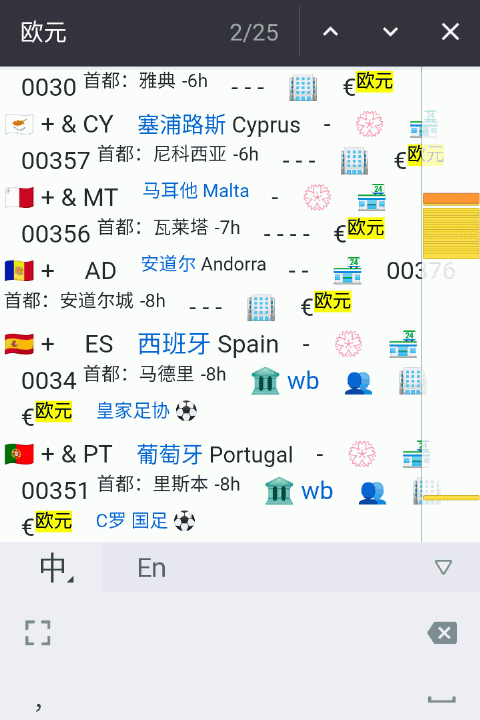

从世界杯看国别表 🏆
==================
大萌	202212 v2

		Now is All —— Qatar2022.qa

　　卡塔尔世界杯正在如火如荼的举行，很多人通过屏幕认识了各国球队和球星。在32支参赛队的背后，某些国家的名字可能会让人感到陌生，比如克罗地亚、摩洛哥(不是摩纳哥)，有什么办法了解呢？一般会用搜索引擎，但是这样搜到的信息比较杂乱，需要读者自己花不少时间筛选；而某些有条理的好网站，又很难被搜到。怎么办呢？

　　这里向大家介绍一个迅速查找世界各国概况的网页：老生常谈网站的《[国别代码速查表](https://diamonwoo.github.io/wx/ydyl/nations)》。这个速查表是一个集成了上千个网址的“大规模集成网页”，里面的内容相当密集，可以迅速找到一国的国情、与我国的关系、常用代码与货币等等。由于该网页信息量大，形式新颖，有必要给大家做一个图例说明。

国别表的图例说明
---------------

　　我们先看本次世界杯的东道主，在亚洲中部的卡塔尔。

　　卡塔尔的国旗后面标记了‘+’与‘&’号，表明其为联合国会员国和一带一路的签约国；从字号大小上看，其国土面积比巴林大、比沙特小；首都多哈与北京时间的时差为-5h，世界杯在进入淘汰赛阶段后，比赛一般在当地时间18时和22时，往后推5个小时，也就是北京时间晚上11点和凌晨3点，[季军赛和决赛](https://worldcup.cctv.com/2022/schedule/)在17日、18日的多哈时间18点、北京时间23点，正好周末。

　　“卡塔尔”三个字可点击，会打开中国外交部为卡塔尔编写的‘国家概况页’，页面显示最后更新时间是今年9月，数据非常新。　右侧红线框内有三个图标，分别是一带一路官网的‘国别美图页’、商务部的‘经贸指南页’、中国驻卡塔尔大使馆的官方网站。我们看第2个，这是中国驻卡塔尔大使馆的经济商务处官方网页，里面有最新的经贸动态，是国家概况的很好补充。

　　红色虚线框内的这三个图标指向的都是中文网页，因为他们是由中方制作，接下去几个图标的指向网页则未必是中文，它们是由对方制作。当然，对方国家既然与中方建交，自然会考虑网页能够适合中方人士阅读，也有可能为网页增加中文版本。

　　黄色虚线框内的两个图标，指向卡塔尔驻中国大使馆官网和微博。点开链接可以看到官网默认为英文，右上角蓝色虚线圈出来的字样是阿拉伯文写的‘阿拉伯文’，这是网站为读者提供了两种语言（英语、阿语），因为大使馆要面对双方（甚至多方）读者。也许是中文对于老外太难了，卡塔尔大使馆并没有制作中文网页，不过他们大使馆开通的微博一直在使用中文，最近的微博正在介绍世界杯。

　　我们再来看实力最强的欧洲。这次欧洲有5支球队进入八强：英国、法国、荷兰、克罗地亚、葡萄牙。先从我们熟悉的英、法两国说起（他们正要进行四分之一决赛）：

　　图中可以看到，英、法等四个欧洲国家，都没有‘&’符号、没有🏔️图标，表明他们都没有同中国签订一带一路协议，(所以)发改委主管的一带一路官网也就没有给这几个国家制作‘国别美图页’。　图中还能看到英、法两国的国际长途区号分别是 44 和 33（这俩真是一对），如果你的电话开通了国际长途，那么你在中国拨打 0044-192 ，就能接通英国的192查号台，[国内收费](http://www.10086.cn/roaming/yewu/idd/bj/)大约每分钟￥8元，想好say what了吗？

　　有人问《国别表》为什么不做成App或小程序？这是大萌考虑项目的公益性和开放性的结果。选择‘大规模集成网页’的形式，使读者可引用、可选择、可保存，还可以利用多种浏览器实现丰富的功能。比如：

1、利用浏览器翻译外文网页
-----------------------

　　我们来看球星梅西所在的阿根廷。

　　点击政府图标🏢，打开的是阿根廷政府的官网，字母有些怪怪的？那是默认的西班牙语，南美洲是西班牙语和葡萄牙语(巴西)的天下。右上角有个‘mi’小图标，那可不是中国的小米，翻译成英文是MyAgent（西语：miArgentina），我的阿根廷，是网站用户登录的地方。　如果你使用的浏览器是Chrome、Edge、Via等，可以直接启动网页的翻译功能，把网页中大部分文字翻译成中文，这个样子：

2、利用浏览器查找/统计
--------------------

　　还有一个浏览器普遍拥有的功能：页面内查找，也非常有用。比如，我用chromium手机浏览器在页面内查找‘欧元’，显示有25个结果，除去图例中的1个，应该有24个国家把欧元作为官方货币。该功能可以很方便地进行统计。您也可以尝试搜索其他有趣的内容，比如有国名中含‘哥’字的国家有多少个？

3、利用搜索引擎查询人民币汇率
--------------------------

　　上面第2点是在当前网页内部搜索，而网页形式可以支持在整个互联网上搜索：在网页中选择感兴趣的文字，弹出菜单中会允许对该关键词联网搜索。　最近习主席出访沙特，外界普遍猜测双方会达成巨额协议，那么当你听到沙特方面的消息时，你能知道‘里纳尔’相当于人民币多少元吗？《国别代码速查表》中为几乎所有国家货币提供了快捷的汇率查找链接，点开后就能看到由必应搜索到的最新汇率。

　　《国别代码速查表》的最后给出了一份[必应世界地图](https://cn.bing.com/maps)，这是国内难得的允许手机浏览器访问的世界地图。其他线上地图都在强迫用户下载App，把用户圈在自己的信息茧房。　在这么一个改革开放的新时代，真正开放的万维网最终会赢得最多数人的欢迎！

　　节约您的搜寻时间，老生常谈，请您收好这一份：

*	[《国别代码速查表》](https://Laosheng.top/ydyl/nations)

