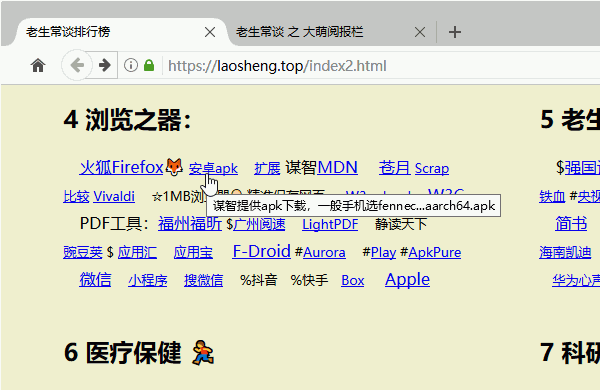
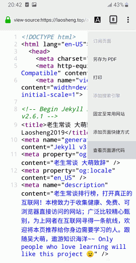

手机App与浏览器的三个区别
==========================
大萌 © 2020~2021

	2021/12/10 第三稿 约四千八百字
	2020/9/23 第二稿 约两千九百字
	2020/8/30 第一稿 约一千七百字

当前形势
--------

　　前几年，手机应用（App）经历了一个爆发期，不仅进入了一些计算机浏览器的传统应用领域：看新闻、发评论、买东西，而且利用手机传感器丰富的特点，开拓了很多全新应用领域：定位置、拍照片、刷身份、各种测量……应该说App帮助手机给人们的衣食住行各方面带来了很大的便利。

　　但与此同时，关于App的负面新闻不断被曝光：偷听用户谈话后推送相关广告[^1]，摄像头偷偷窥探用户[^2]，大数据杀熟让老顾客付的钱反而更多[^3]……隐约浮现出一条黑色产业链。即使[有关部门](https://laosheng.top/fuwu "有关部门在身边")(工信部、市场监督局)和[媒体](https://laosheng.top/fly "老生常谈云媒体")屡次曝光整顿，有劣迹的App仍然层出不穷。这个时候，作为消费者，树立自我保护意识就显得尤为重要。

　　保护自己手机的软件环境可以遵循一个简单原则：**非必须，不安装**。对于浏览器能够胜任的传统应用领域，比如看新闻、看视频，凡是这种以信息单向流动为主的应用，都可以在手机上安装一个可靠的浏览器来实现。

　　很多有头有脸的Web网站，千方百计地诱骗用户下载App。他们给浏览器用户制造阅读障碍：折叠全文、不断弹窗“用APP打开体验更佳”、“该内容仅限APP用户访问”等等。但是这一切其实都在提醒用户：App必然有利可图。那么，利从何来呢？用户的个人信息。

　　**这是一场发生在每个人手机上的信息战。**

　　战争比想象的更诡秘，在利益的驱使下，一些手机浏览器也充当了和App一样的‘信息特务’，它们获取超额权限，或者干脆买通手机厂家植入，防范用户卸载，在默认主页上加入各种道貌岸然的网站图标，等待用户误点弹窗后就下载App，甚至利用系统漏洞直接静默安装，在用户不知情的时候就已经占据了开机自启动的特权。

　　到底谁是我们的敌人，谁是我们的朋友？要想准确区分App和浏览器，需要看到双方在技术上的本质区别。

历史背景
--------

　　首先要给大家科普一个IT常识：浏览器的页面渲染引擎（Rendering engine，也叫‘内核’）是应用软件领域的一座高峰，世界上实现完整功能（HTML/CSS/JS）并且成功商业应用的浏览器引擎屈指可数，而且仍然在市场竞争中向少数集中。

　　目前市面上拥有自研引擎的浏览器只有三家，按发布时间先后排列：谋智公司的Firefox浏览器、苹果公司的Safari浏览器、谷歌公司的chrome浏览器。曾经，微软Windows自带浏览器，欧洲的opera浏览器都拥有自己的引擎，但是在近年来，纷纷改用谷歌公司chrome浏览器相同的引擎（Blink内核），五国大战只剩三国。  
	  

　　可能有人会奇怪，为什么在手机应用市场搜索‘浏览器’会出现一大堆结果呢？而且有很多国产浏览器[^4][^5]，不是只有三家老外吗？答案很简单，套壳了，并且是合法的。因为这仅存的三家内核都是**开源软件**，允许别人改装。当然，改装并不是一件容易的事，以谷歌的chrome为例，目前源代码已经超过两千万行，是一个庞然大物。所以那些充当信息特务的手机浏览器是怎么来的？就是在套壳的时候添加了黑心材料。

　　知道了这个技术背景，那我们很容易想到一个简单的防范方法——只使用有自己内核的浏览器，也就是在上面三家选择。我本人曾经就是这么做的，但有麻烦。

　　首先safari浏览器是苹果手机专属，安卓手机上没的装；Firefox浏览器（火狐）很晚才在手机端发力，即使现在，其桌面版最富盛名的扩展极少出现在手机版；剩下一个chrome，和安卓同为谷歌门下，市场表现优异，但是在国内，书签同步等功能的服务器访问受阻。这种窘况，就好像一辆汽车，虽然发动机好，但是操控、内饰、空调、照明都不行，让人爱不起来。

　　后来我发现了另一条路，有一些 特别小的安卓浏览器。小到什么程度呢？安装包不到1MB！壳子这么小，想加黑材料也困难啊。而且他们解决了夜间模式、网页保存、书签同步等常见问题。这里列出三款，大家可以试一试：Via浏览器、X浏览器、神奇浏览器。值得以后专门写篇文章。  
	  

　　有了可靠的浏览器作为标杆，我们再来看App与浏览器的区别。

第一，浏览器有地址栏，APP没有
=============================

　　我们看app和浏览器在外观上有一个明显的区别，APP没有浏览器的地址栏。 地址栏是做什么的？显示当前的网址，学名叫URL，统一资源定位符（Uniform Resource Locators）。互联网上所有的文件，不管是网页/图片/视频/下载文件包，它们在互联网上要被人们访问，几乎都要有一个URL，这是整个世界网站互联的基础。比如我们用浏览器随便看一个新闻，地址栏会显示该网页的网址；然后在新闻的图片上点右键菜单，就可以仅看到这一张图片，地址栏也就变成了图片的网址。 

　　所以说，地址栏相当于把整个网站的文件路径向用户公开了。在一些不愿意公开的文件路径的网站，比如收费的视频网站，他们会煞费苦心地用技术手段隐藏视频的真正网址。而APP没有地址栏，这并不表示App没有使用网址，只是它不公开。减少地址栏后，App在界面布局上多出了一行空间，但用户就缺失了一个观察网站信息来源的窗口。

　　超市里面有一些讲究的食品，会在包装上印上溯源码，用户扫一扫，就能查到生产地甚至责任人。网址，就是网页的溯源码，提供了信息的来源。有一种信息，特别不喜欢别人知道来源，大家想一想，是什么？这种信息在有地址栏的网站上是很不自在的。是的！谣言。大家回忆一下，是不是谣言在App里面特别多？当谣言发现App里面竟然没有地址栏，它们简直太高兴了。👻

第二，浏览器能查看网页源代码，App不行
=====================================

　　浏览器不仅通过地址栏公开了信息的来源，还公开了信息的呈现方法——网页的源代码。在微软最新的EDGE浏览器中，页面空白处的右键菜单上会有“查看页面源代码”项，点击后就会弹出窗口显示一堆密密麻麻的字符，这就是网页内容的本来面目，通常包括HTML、CSS和JS三种语法的纯文本。这些纯文本把各种文字/表单/影像等等组织在一起，形成了我们看到的丰富多彩的Web网页。

　　Web网站的这种公开特点，使其很容易被审计。审计一个网页比审计一个App，在技术上要容易，至少普通用户就能看到（能否看懂是另一回事）。所以，[证券市场信息披露的法定媒体](8-证券信息披露的法定媒体.txt)是网站和报纸，而不是App。这种公开也带来了整个互联网的安全，安全软件和搜索引擎都也很容易识别或拦截恶意网页。就像政府[公开自己的权力清单、责任清单](http://www.gov.cn/xinwen/2015-03/24/content_2837962.htm)，是一种取信于民的做法。当然，公开也是一种考验。当有人发现App不需要公开的时候，他们巴不得所有的用户都忘记浏览器，改用他们封闭的App。学好三年，学坏三天。这就是为什么国内整顿App比以前整顿Web网站要更为困难的技术原因。

　　公开源代码，会泄露网站技术或阻碍网站发展吗？历史表明，不仅没有限制，反而会促进技术交流与提升。就好像公开透明的政府行为会帮助国家强大。以对Web技术做出重要贡献的谷歌公司为例，他开发了纯网页实现的Gmail邮箱、earth地图、G Suite在线办公套件，把以前需要本地安装众多软件的功能，通通移到浏览器内，减轻了用户电脑的压力，带来了随时可以共享的全新工作方式。几乎可以这么说，凡是要通过网络的应用，没有不能用网页实现的。

第三，App与浏览器的基础权限不同
================================

App与浏览器的出身
-----------------

　　上面说的是二者自身的区别，下面要说的第三个区别，是他们诞生环境的区别。我们首先精确定义这两个概念。

　　App，是英文 Application 的缩写，广义指应用软件，狭义特指**移动设备**的应用软件，本文采用后者。2007年，苹果公司推出的iphone引领智能手机进入互联网时代，App进入了爆发期。这其中就包括可以看作是通用的App的浏览器。用户安装一个浏览器的方法和安装一个App是一样的。

　　浏览器，是网页浏览器（Web Browser）的简称，它的历史比App老得多，是伴随着互联网的兴起而诞生的。1995年，微软公司推出的视窗操作系统Win95搭载了IE 4.0浏览器，IE浏览器开始作为操作系统的一部分，开启了桌面互联网的爆发时代。
　　从此，IE、Windows、互联网，一起茁壮成长。浏览器，在很长时间，它的名字就叫IE，Win98自带的IE浏览器曾经占据市场95%的份额。在Windows电脑上，浏览器是操作系统的一部分，以前是IE，现在是Edge。

　　如果某个浏览器抛弃了上文介绍的两个特点，那它看起来就是个App。事实上，某些App就是一个隐藏源代码和没有地址栏的浏览器，利用浏览器内核是开源软件的特点，套个严严实实的壳子，伪装成了App。要不然App怎么那么多呢。🙄

　　谋智的Firefox浏览器，近年来在手机端发力追赶，版本号一直飙升。在新冠疫情发生后，传来了谋智几度裁员的消息，而大萌自己使用的安卓火狐也停留在68版，官网虽然显示有更新，但下载连接指向谷歌的#Play市场，而以前在页面中隐藏的apk地址也彻底消失，再到谋智官方FTP服务器上，可下载apk版本停留在2020年的68.11。当然，我还是能下载到最新版apk的，但是我发现了一个震惊的改变：安卓平台的Firefox浏览器的查看源代码功能，消失了！😱

　　没想到浓眉大眼的安卓火狐也叛变了革命。反过来，App变成浏览器的还没见过。学坏容易学好难。

检查机制
--------

　　App位于手机上，手机的操作系统决定了App（包括手机浏览器）功能的界限。为什么iPhone给人们的印象更安全呢？是因为苹果公司有较严格的检查。而引领安卓的谷歌，在国内并不能访问官网，检查便无从谈起。国产手机只能依赖于厂商自己的检查，可如果厂商叛变了呢……

宿主权限
--------

　　除了安全检查机制的不同，用户在手机和电脑上的控制权也不同。桌面电脑会允许用户拥有‘根(root)权限’或‘超级管理员(adminstrator)权限’，而正规渠道购买的手机不给用户这个权限，除非用户不顾保修条款，强行‘越狱’。这导致一个很常见的现象，手机里有一些你很讨厌😒但是卸载不了的App。从这个根权限上看，电脑是用户的主场，而手机是用户的客场。

珍惜万维网(WWW)
===============

　　既没有可靠的安全检查，又处于客场地位，再加上手机的传感器丰富，这就导致用户在安卓手机上面临一个巨大的威胁：App获得用户隐私数据犹如探囊取物。在你点开某个App的那一瞬间，厂商服务器就已经完成了对你的用户画像——你的位置和行动路线，你的购物习惯与财务状况，你的社会关系，你的生物学特征（指纹和人脸）……总之，你的手机App数量决定了你的隐私数据暴露程度。

　　可以说，在监管环境完善之前（工信部一直在努力），使用App的过程，就是泄露个人信息的过程。而大规模的个人信息暴露更可以威胁整个社会。我举一个远一点的例子，2018年曝光的美国脸书用户数据泄密事件。一个名叫‘剑桥分析’的英国公司，曾经通过诱导27000用户下载App，进而通过这些App用户的好友列表获得了 8700 0000 脸书用户数据，并借此影响2016年美国总统选举和英国脱欧公投。更多信息可参见北航教授[熊璋发表在光明网](http://theory.gmw.cn/2018-04/06/content_28233003.htm)的评论和[再论](https://world.gmw.cn/2018-04/12/content_28304576.htm)。

　　从上述三个区别来看，在个人电脑上，情况要好很多。这也是有的人坚持**只在电脑上网购**的原因，即使用手机网购，也优先使用可靠的浏览器。

　　越了解真相就越容易悲观，万维网之父 伯纳斯-李 (Tim Berners-Lee)表达了类似看法。这位英国科学家在大约35岁时发明了一系列的东西：HTTP=超文本传送协议（所有web网站的访问协议），HTML=超文本标记语言（所有web网页的源代码语言），URI=统一资源标识符（最常见的形式叫URL，就是网址），并亲自实现了web服务器和web浏览器，然后向世人无偿开放，最终成为最流行的互联网服务——万维网（World Wide Web，简称WWW）。 但是这个流行趋势正在遭受挫折，伯纳斯-李在2017年获得图灵奖(计算机界诺奖)之后，对媒体表示了对互联网现状的失望：“互联网已经丧失最初的精神”，“如果你拍了一张照片上传到Flicker，会发现这无法与LinkedIn上的同事分享。这些数据孤岛让人们感到挫折”，“我们失去了对个人数据的控制权”。访谈详情请见[麻省理工科技评论中文版](http://www.mittrchina.com/news/detail/2998)。

　　这一代互联网已经没救了。要不您看一看[上一代互联网](../index2.html "老生常谈排行榜")？

	老生常谈 © 作者大萌 2020~2021
	可转载-需署名-非演绎-非商用 4.0
	本文介绍：个人信息保卫战中的App与浏览器
	https://laosheng.top/c/App和浏览器的三个区别.txt

参考文献
--------

[^1] 201802 人民网 [App瞄上麦克风监听，越界获取过度惹来祸患](http://media.people.com.cn/n1/2018/0203/c40606-29803601.html "")  
[^2] 201806 品玩 [vivo的升降摄像头：流氓软件检测器](https://www.pingwest.com/a/172690)  
[^3] 201903 新华网 [大数据“杀熟”调查：网购平台、在线旅游和网约车成重灾区](http://www.xinhuanet.com/legal/2019-03/27/c_1124291049.htm "")  
防公关备份：201807 澎湃新闻 [Vivo手机又测出百度手机输入法后台录音](https://www.thepaper.cn/newsDetail_forward_2234532 "")  
[^4] 201808 钛媒体 [中国为什么没有国产浏览器内核](https://www.tmtpost.com/3427552.html)
[^5] 202006 柚子的code [为什么国内没有自主研发的浏览器内核？](https://zhuanlan.zhihu.com/p/145382726)
[^6] 202009 大萌 [手机App和浏览器的三个区别 第二稿](4/App和浏览器的三个区别-v2-1.txt)
[^7] 维基百科[浏览器引擎]条目

	本文首发网址（已更改）：https://laosheng.top/changtan/App和浏览器的三个区别.txt

回到首页
  
点击二维码，“在浏览器打开” https://Laosheng.top
