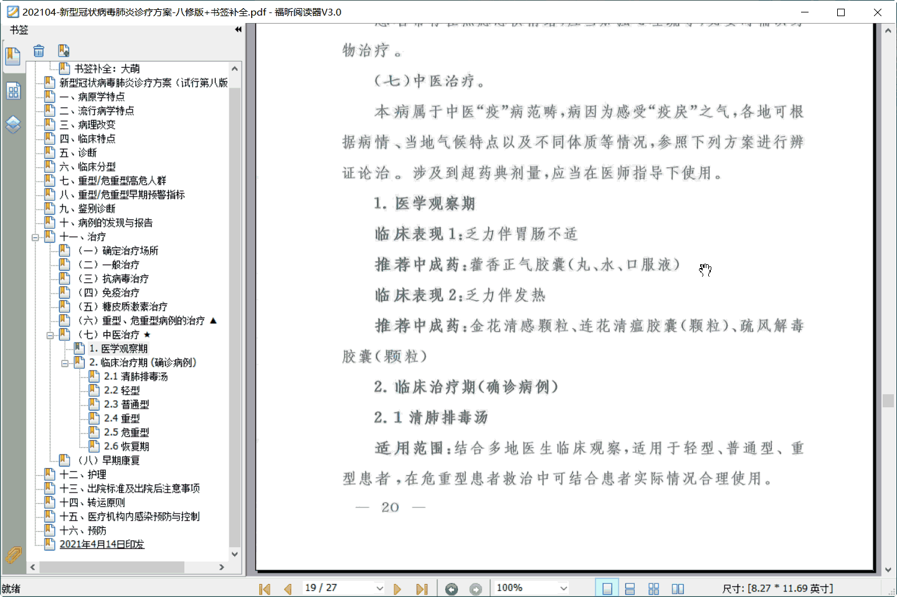

国家《新冠肺炎诊疗方案》中的中医治疗
====================================
大萌 © 202109

	20210922 第一稿

　　今年中秋不太平，新冠疫情牵人心，近期新增的一波本土病例牵动了全国人民的心。不过相对于疫情初期的慌乱，现如今的医护应对与百姓心理都较为成熟。国务院发布的《新型冠状病毒肺炎诊疗方案》也已经更新到了（试行第八版 修订版），印发时间为：20210414，署名单位是：国家卫生健康委办公厅、国家中医药管理局办公室。

　　这个官方文件是pdf格式，除了不易更改，没有用到pdf格式的任何优点，很让人吐槽。1、以图像化呈现纯文字内容，无法复制文字，无法检索文字；2、没有封面或署名，单独拿到文件的人不知道文件来源；3、没有书签或目录，读者很难看到全貌。

　　<small>另外还有一个容易惹争议的问题，《诊疗方案》中的中医部分虽然已经很丰富了，但其目录的层级很低，让人觉得中医仍然难堪大任。</small>

　　为方便大家学习，大萌为官方pdf补全了书签，效果见截图。新文件以压缩格式7z发布，请下载后解压缩使用。

　　其中，中医治疗段落的初始内容文字如下，在pdf的第20页：
~~~
（七）中医治疗。

　　本病属于中医“疫”病范畴，病因为感受“疫戾”之气，各地可根据病情、当地气候特点以及不同体质等情况，参照下列方案进行辨证论治。涉及到超药典剂量，应当在医师指导下使用。

　　1.医学观察期

	临床表现1:乏力伴胃肠不适
	推荐中成药：藿香正气胶囊（丸、水、口服液）

	临床表现2:乏力伴发热
	推荐中成药：金花清感颗粒、连花清瘟胶囊（颗粒）、疏风解毒胶囊（颗粒）

　　2.临床治疗期(确诊病例)

　　2.1清肺排毒汤

　　适用范围：结合多地医生临床观察，适用于轻型、普通型、重型患者，在危重型患者救治中可结合患者实际情况合理使用。
~~~

*	pdf官方文件 	[国务院网站](http://www.gov.cn/zhengce/zhengceku/2021-04/15/content_5599795.htm)
*	pdf补全书签 	[老生常谈网站下载](6-新冠肺炎诊疗方案-补全书签.7z)
*	pdf的全部文本	[中华网转载丁香园整理](http://med.china.com.cn/content/pid/253699/tid/1026)

　　但愿人长久，千里共婵娟~~

	老生常谈 © 作者大萌 2021年
	知识共享4.0 原署名-可转载-非演绎

回到首页
  
点击二维码，“在浏览器打开” https://Laosheng.top
