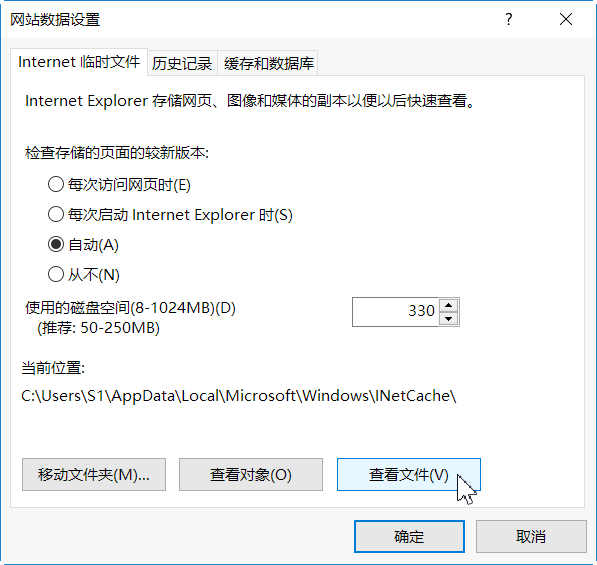

手机App和浏览器的三个区别
==========================
2020 0830-0901

　　现在有很多人在网上获取资讯使用手机APP，而不是传统的浏览器；而那些提供信息的网站，也不断的提醒浏览器用户，“下载我们的APP吧”，“APP上有更多好看的”……有的网站甚至拒绝浏览器访问内容，只允许自家的App访问。我们不禁要问，为什么网站如此强推APP呢？

　　当你意识到这个问题，你就会联想到一串问题：网站使用App的优势是真的吗？如果是真的，为什么网站又同时提供Web服务(浏览器访问)呢、我们应该如何选择APP和浏览器、我可以不做这种选择么……

　　物质决定意识，这些问题的核心问题就一个：APP与浏览器在技术上有什么区别？把这个问题搞清楚了，你就可以根据自己的情况解答上面一连串的问题。下面我就来讲它们俩之间的三个区别。

　　第一，APP与浏览器对网址的态度不同。
　　我们看app和浏览器在外观上有一个明显的区别，APP没有浏览器的地址栏。 地址栏是做什么的？显示当前的网址，又叫URL，统一资源定位符。互联网上所有的文件，不管是网页/图片/视频/下载文件包，它们在互联网上要被人们访问，都要有一个URL。比如我们用浏览器随便看一个新闻，在新闻图片上点击右键，就可以在一个独立的标签页看到这一张图片，而浏览器的地址栏这个时候显示的网址就是这个图片的URL。 APP没有地址栏，并不表示App没有使用网址，只不过，App没有把自己使用的URL公开出来。只要它显示的是互联网内容（而不是本地文件），它就一定要用网址，
　　App因为省略了地址栏，在界面布局上节省了一线空间，在手机小屏幕上，寸土寸金，这也许能成为一点优势，不过，浏览器也支持全屏模式，可以临时性的隐藏菜单和地址栏。

　　第二，App与浏览器对本地文件的默认权限不同。
　　这种文件存取权限的区别，需要仔细体会才能察觉。浏览器默认只保存两项内容，一个是网络文件的缓存，比如看新闻时候的图片，这些缓存图片会被浏览器专门用一个缓存文件夹来保存。这个保存是临时的，容量是有限的，容量快用完的时候，旧的文件就会被自动删除，以腾出空间来接纳新的文件。另一个存储是网站的个性化设置，叫做cookie，小甜饼。这个技术是为每一个有需求的网站保存一个文本文件，以记录网站上的用户偏好，比如你选择的语言，输入的查询关键词，这个存储比较小。通常前一个缓存文件夹的体积会有几百兆，而cookie文件夹只有几KB到几MB。
　　App不一样，App在手机安装时会提示权限许可，用户存储卡的读写权限是最广泛被索取的权限之一。获得用户许可之后，App可以在整个SD卡（通常是手机虚拟出来的一部分内部存储空间，常见的有64GB）进行文件读取和写入。常见的一种情况就是，一个图片类App会默认扫描你整个手机的所有图片，然后编制索引，你会在这个App的窗口内发现你自己都早已遗忘的老照片。😳
+ 

　　第三，App与浏览器对用户身份识别的程度不同。
　　浏览器访问互联网默认是匿名的，除非网站要求登录，而你照做了，否则，网站只看到一个某某浏览器从某个网络地址来请求访问某个网络资源（URL）。以前有个网络说法，没有人知道网络那头是条狗，就从某种角度反映了互联网的这种匿名特点。
　　那么App呢？App比浏览器在识别用户身份上有巨大优势，这一方面和移动互联网的特性有关，手机在到达消费者手中的时候，已经拥有了多个唯一编码，手机硬件识别码（IMEI）、电话号码（139/189）、实名认证绑定的身份证号码，等等。还有一些和身份有关的信息，比如地理位置信息，可以通过手机定位（GPS）功能获得，即使没有打开GPS，也可以通过多个基站计算手机的位置，这个场景在影视剧中经常出现。另一方面，App识别用户身份的程度和网站的初心有关。有的网站特别关心用户身份，没有明确的用户身份，App就不干活。比如银行网站推出的网银，在安装过程中都是最大限度的获取用户授权。网银App是为了确认用户身份，以提供对应的金融服务，而某些网站索取的权限和其功能似乎根本对不上号。比如一个查看天气的App需要读取用户联系人（通讯录），这就让人很奇怪，这个App到底要干什么呢？你问吧，App一定不会回答你。

综上所述，App和浏览器一般有以下区别：
 ^
 · App隐藏网址，而浏览器显示网址；
 · App需要完整本地存储权限，而浏览器只要专用目录的存取权限；
 · App的用户可以看作实名的，而浏览器的用户可以看作是匿名的。

　　放开APP吧，来拥抱真正的互联网！

	《老生常谈排行榜》 © 作者大萌 2020年8月
	本文禁止演绎。

回到首页

https://Laosheng.top
