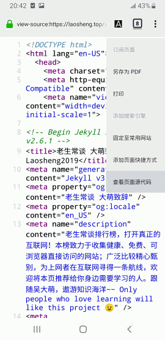

手机App和浏览器的三个区别
==========================
大萌 © 202009

	请“在浏览器打开”本页。
	本文8月发布后收到反馈，仍在修订。

　　现在有很多人在网上获取资讯使用手机APP，而不是传统的浏览器；而那些提供信息的网站，也不断的提醒浏览器用户，“下载我们的APP吧”，“APP上有更多好看的”……有的网站甚至拒绝浏览器访问内容，只允许自家的App访问。我们不禁要问，为什么网站如此强推APP呢？

　　当你意识到这个问题，你就会联想到一串问题：网站使用App的优势是真的吗？如果是真的，为什么网站又同时提供Web服务(浏览器访问)呢、我们应该如何选择APP和浏览器、我可以不做这种选择么……物质决定意识，这些问题的核心问题就一个：APP与浏览器在技术上有什么区别？把这个问题搞清楚了，你就可以根据自己的情况解答上面一连串的问题。

　　寻找答案的一个好方法，就是观察那些同时提供Web网页访问和App访问的网站，比如知乎，比如京东。下面我就来讲App和浏览器之间的三个区别。

第一，浏览器有地址栏，APP没有
----------------------------

　　我们看app和浏览器在外观上有一个明显的区别，APP没有浏览器的地址栏。 地址栏是做什么的？显示当前的URL，统一资源定位符（Uniform Resource Locators），俗称网址。互联网上所有的文件，不管是网页/图片/视频/下载文件包，它们在互联网上要被人们访问，都要有一个URL，这是整个万维网的基础。比如我们用浏览器随便看一个新闻，在新闻图片上点击右键，就可以在一个独立的标签页看到这一张图片，而地址栏内容就从刚才的网页URL变成了现在的图片URL。 

　　所以说，地址栏相当于把整个网站的文件信息向用户公开了。在一些不愿意公开的文件信息的网站，比如收费的视频网站，他们会煞费苦心地用技术手段隐藏视频的真正地址。而APP没有地址栏，这并不表示App没有使用URL，只不过App隐藏了自己用的URL。减少地址栏后，App在界面布局上多出了一块空间，但用户就少了一个观察网站信息的重要渠道。

第二，浏览器能查看网页源代码，App不行。
------------------------------------

　　浏览器不仅通过地址栏向用户公开了自己的文件位置，还公开了网页内容的实现方法——网页的源代码。在互联网发展壮大的时期，最普及的浏览器是微软视窗操作系统的IE，当用户在页面空白处点击右键时，快捷菜单上就会出现“源文件”或“查看源”，选择后就会弹出窗口显示一堆密密麻麻的文本，这些就是网页内容的来源，通常包括HTML、CSS和JS三种语法的纯文本。这些纯文本把各种图片/动画/视频等等组织在一起，形成了我们看到的丰富多彩的万维网。

　　网站通过浏览器把自身的文件信息和网页源代码暴露给用户，这种暴露有很多好处。比如用户想学习我这个《老生常谈》网站的制作，把所看到的页面和图片存下来，就可以在本地得到几乎一样的网站。当然，如果用户想再发布这个复制网站，需要考虑我的著作权声明和国家的《知识产权法》的制约。这种暴露还带来互联网的安全——网站所有行为都可被用户知晓——那网站如果有什么见不得人的行为就会被很快发现。网络安全软件也很容易拦截恶意网页，甚至搜索引擎都会主动提醒用户：这个网站有恶意代码，请谨慎访问。

　　但是App什么都不给用户，网址不给，源代码更不给。它到底会干什么呢？🤔

	需要指出苹果用户的情况，苹果的浏览器Safari在Mac电脑上可以“查看页面源文件”，但是到了iphone手机，该功能需要安装‘快捷指令’。

　　在讨论第三个区别之前，需要说明App和浏览器的概念。在互联网的发展史上，本来没有App的说法，在最普及的桌面操作系统中，Windows自带IE浏览器，这个时候的浏览器并不被看作是需要额外安装的应用程序，而更象是Windows的一部分。等到iphone开创了智能手机时代后，苹果公司把可以安装在手机上的软件称之为App（应用），随后该概念就普及到安卓等智能手机平台。这个时候，各种浏览器竞争激烈，都争相吸引用户把自己作为App安装。就像苹果手机自带Safari浏览器，用户还可以再通过AppStore免费安装一个火狐浏览器。

　　在智能手机上，浏览器可以看作是一个通用的App，而多数App可以看作是一个专用的浏览器。当二者某些区别不慎明显时，我们可以把对比双方转移为 手机App和桌面浏览器，这时候的区别会更鲜明。

第三，App与浏览器的实名制程度不同
-------------------------------

　　浏览器访问互联网默认是匿名的，除非网站要求登录，而你照做了，否则，网站只看到一个某某浏览器从某个网络地址来请求访问某个网络资源（URL）。以前有个网络说法，没有人知道网络那头是条狗，就从某种角度反映了互联网的这种匿名特点。

　　那么App呢？App比浏览器在识别用户身份上有巨大优势，这一方面和移动互联网的特性有关，手机在到达消费者手中的时候，已经拥有了多个唯一编码，手机硬件识别码（IMEI）、电话号码（139/189）、实名认证绑定的身份证号码，等等。还有一些和身份有关的信息，比如地理位置信息，可以通过手机定位（GPS）功能获得，即使没有打开GPS，也可以通过多个基站计算手机的位置，这个场景在影视剧中经常出现。另一方面，App识别用户身份的程度和网站的初心有关。有的网站特别关心用户身份，没有明确的用户身份，App就不干活。比如银行网站推出的网银，在安装过程中都是最大限度的获取用户授权。网银App是为了确认用户身份，以提供对应的金融服务，而某些网站索取的权限和其功能似乎根本对不上号。比如一个查看天气的App需要读取用户联系人（通讯录），这就让人很奇怪，这个App到底要干什么呢？你问吧，App一定不会回答你。

　　忘掉APP吧，来拥抱[真正的互联网](../index2.html "老生常谈 上一代互联网")！

	老生常谈 © 作者大萌 2020年9月
	知识共享 署名-非演绎 4.0
	本文介绍：浏览器相对于App的优势

回到首页
  
点击二维码，“在浏览器打开” https://Laosheng.top
