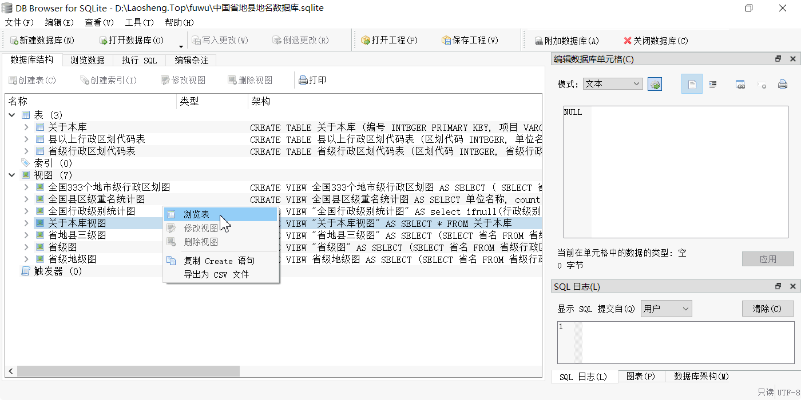
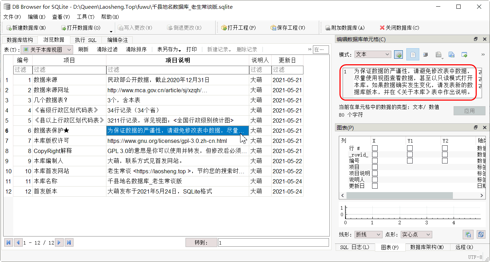

老生常谈

千县地名数据库
===============
大萌 2021/5/24

　　在老生常谈的[云媒体](../fly)、[有关部门](../fuwu)页面均涉及全国各地城市名称，我需要一份严谨准确的全国地名库。正好民政部网站刚刚发布了去年的行政区划数据，这也是国家统计局的区域划分的标准。于是我据此制作了一份SQLite格式的地名数据库，可以查询全国县级地名，以及对应的行政区划代码。  
　　《千县地名数据库》收录中国省/市/县三级行政区划代码及标准名称，并由大萌补充省份简称、副省级城市等信息，增加若干统计视图，组织为数据库文件。计：34个省级行政单位、333个地级单位(地区/市/州/盟)、2844个县(区/旗)。该库暂时未收录乡级行政区(乡/镇/街道/苏木)。  
　　这份中文地名数据库，同时也是一个很好的计算机教学示例库，可以改善Database教材中Smaple Table内容对中文用户不直观的问题。我将此库以GPL 3.0许可协议公布在网站，欢迎各位教师使用。


数据来源
--------

民政部网站公开数据：  
2020年中华人民共和国县以上行政区划代码（截止2020年12月31日）  
<http://www.mca.gov.cn/article/sj/xzqh/2020/20201201.html>  
可以查询全国所有县/区的名称，不包含台港澳地区的地市区县信息。

*在这个网页上，2020年三沙市(460300)新成立的西沙区和南沙区的区划代码仍是空白，大萌根据惯例暂定了两个区的代码：460321与460322，以保证区划代码能成为数据表的主键列。*


数据格式
---------

　　本库采用单文件的*SQLite数据库*格式，体积小巧，使用容易，中文支持良好。这是一种非常适合学习**数据库技术**的入门选择，它的运行非常容易，不像MySQL，Oracle那样需要启动一个服务器进程。用户只需要下载一个客户端软件，就可以像Office软件打开.xlsx文档那样打开一个数据库。

　　由于SQLite本身采用无限制的版权协议（大爱无疆），所以为它开发的客户端软件有很多是免费的开源软件。我这里推荐一款，简称DBB，中文化做的很好。网站在德国，网页是英文，请到官网页面下载。访问 <https://SqliteBrowser.org/dl/> 在页面上找到这一行：

	DB Browser for SQLite - .zip (no installer) for 32-bit Windows

　　下载的zip压缩包大约17MB，解压缩后找到.exe文件运行，中文图形界面，很容易上手。




使用方法
---------

*	下载：[千县地名数据库_老生常谈版.sqlite](千县地名数据库_老生常谈版.sqlite)  
该数据库文件体积只有 96 KB。

　　在DBB中(只读)打开这个数据库后，可以看到数据库结构中有**表**和**视图**两大类，表是存储数据的地方，而视图是表的一种只读呈现。也就是说，不管你对视图怎么操作，都不会损坏数据。所以，放心操练吧！

*	本库中内建了七个视图，在任一视图上右键菜单选‘浏览表’，即可查看数据；
*	从内建视图的Create语句中可以观察SQL语法，右键菜单选‘复制Create语句’；
*	窗口上方选 执行SQL 选项卡，粘贴刚才复制的create语句，只保留select及后面的部分，按播放按钮▶ 看执行结果。

SQL语句示例：

	select * from 省级图;
	select * from 省级地级图 where 副省级="TRUE";
	select * from 全国县区级重名统计图  --两个短线后为注释，分号为语句结束


全国县区级重名统计
-------------------
```sql
	SELECT 单位名称, count(*) AS 个数,
	GROUP_CONCAT(
	(SELECT 省名 FROM 省级行政区划代码表 WHERE 省码 = substr(Ta.区划代码, 1, 2) )
	) AS 所在省 ,	-- 注意要两层括号，删即出错
	GROUP_CONCAT(区划代码) as 区划代码
	FROM 县以上行政区划代码表 AS Ta 
	GROUP BY 单位名称 HAVING 个数 > 1 
	ORDER BY 个数 DESC
```
　　这是本库视图<全国县区级重名统计图>的select语句，对比我下面给出的更复杂的查询结果，尝试自己写出这个select语句。
<pre>
单位名称	个数	所在省	所在地市	区划代码
鼓楼区	4	苏,苏,闽,豫	江苏省南京市,江苏省徐州市,福建省福州市,河南省开封市	320106,320302,350102,410204
市中区	4	鲁,鲁,川,川	山东省济南市,山东省枣庄市,四川省内江市,四川省乐山市	370103,370402,511002,511102
铁西区	3	辽,辽,吉	辽宁省沈阳市,辽宁省鞍山市,吉林省四平市	210106,210303,220302
郊区	3	晋,黑,皖	山西省阳泉市,黑龙江省佳木斯市,安徽省铜陵市	140311,230811,340711
新华区	3	冀,冀,豫	河北省石家庄市,河北省沧州市,河南省平顶山市	130105,130902,410402
城区	3	晋,晋,粤	山西省阳泉市,山西省晋城市,广东省汕尾市	140302,140502,441502
龙华区	2	粤,琼	广东省深圳市,海南省海口市	440309,460106
青山区	2	蒙,鄂	内蒙古自治区包头市,湖北省武汉市	150204,420107
长安区	2	冀,陕	河北省石家庄市,陕西省西安市	130102,610116
铁东区	2	辽,吉	辽宁省鞍山市,吉林省四平市	210302,220303
通州区	2	京,苏	北京市,江苏省南通市	110112,320612
西湖区	2	浙,赣	浙江省杭州市,江西省南昌市	330106,360103
西安区	2	吉,黑	吉林省辽源市,黑龙江省牡丹江市	220403,231005
白云区	2	粤,贵	广东省广州市,贵州省贵阳市	440111,520113
海州区	2	辽,苏	辽宁省阜新市,江苏省连云港市	210902,320706
河东区	2	津,鲁	天津市,山东省临沂市	120102,371312
江北区	2	浙,渝	浙江省宁波市,重庆市	330205,500105
永定区	2	闽,湘	福建省龙岩市,湖南省张家界市	350803,430802
桥西区	2	冀,冀	河北省石家庄市,河北省张家口市	130104,130703
朝阳区	2	京,吉	北京市,吉林省长春市	110105,220104
普陀区	2	沪,浙	上海市,浙江省舟山市	310107,330903
新城区	2	蒙,陕	内蒙古自治区呼和浩特市,陕西省西安市	150102,610102
宝山区	2	黑,沪	黑龙江省双鸭山市,上海市	230506,310113
城关区	2	藏,甘	西藏自治区拉萨市,甘肃省兰州市	540102,620102
城中区	2	桂,青	广西壮族自治区柳州市,青海省西宁市	450202,630103
和平区	2	津,辽	天津市,辽宁省沈阳市	120101,210102
向阳区	2	黑,黑	黑龙江省鹤岗市,黑龙江省佳木斯市	230402,230803
南沙区	2	粤,琼	广东省广州市,海南省三沙市	440115,460322
南山区	2	黑,粤	黑龙江省鹤岗市,广东省深圳市	230404,440305
</pre>

　　可以看出，重名的都是县区级别的‘市辖区’，没有一个县。为什么？因为县的历史都悠久啊~~


省地两级行政区划名称
---------------------

　　查询到或浏览的任何数据都可以导出为csv文本文件。  
　　窗口上方选 浏览数据 选项卡，下拉框找到<省级地级图>，看到数据后右上方点击‘表另存为>导出到csv’，对话框中做几个格式细节的选择，然后输入文件名，你就得到了367行文本。也就是34个省级行政区和333个地市级行政区，合计367个，其中有15个地级城市按副省级管理。

*	下载：[省级地级图导出数据](省级地级图.csv)

　　县区级地名可查询本库；也可到[民政部网页](http://preview.www.mca.gov.cn/article/sj/xzqh/ )查询数据是否变动。


版权提示
---------

　　《千县地名数据库》可转载可引用，但如要修改表中数据，请保持数据的严谨性，在《关于本库》表中新增修改人和修改内容的说明。




```
	老生常谈之地名数据库 © 2021年5月
	GPL 3.0	可复制-可修改-原授权
	20210524	v0.9.3	大萌编制
```
回到首页<a href=".." title="返回老生常谈首页"></a>  
https://Laosheng.top  
<!-- Global site tag (gtag.js) - Google Analytics -->
<script async src="https://www.googletagmanager.com/gtag/js?id=UA-179794713-1"></script>
<script>  window.dataLayer = window.dataLayer || [];
  function gtag(){dataLayer.push(arguments);}
  gtag('js', new Date());  gtag('config', 'UA-179794713-1');
</script>
