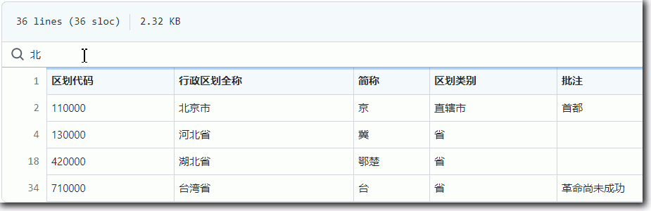

老生常谈 >> [有关部门](.)🕘

中国千县地名库
==============
大萌 2021-2022

	202204  第二稿
	202105  第一稿

　　在老生常谈的[云媒体](../fly)、[有关部门](../fuwu)页面均涉及全国各地城市名称，我需要一份严谨准确的全国地名库。2021年，民政部网站发布了2020年的行政区划数据，这也是国家统计局的区域划分的标准。于是我据此制作了一份SQLite格式的《中国千县地名库》，可以查询全国县级地名，以及对应的行政区划代码。  
　　2022年，本站的托管站Github升级了网页js技术，支持在网页中直接呈现数据表格。于是大萌从《地名库》中导出了.tsv数据，实现了在网页上直接检索、过滤地名。

格式介绍
--------
　　.tsv后缀名，表示该文件是一个制表符(Tab)分隔的数据表格式文本，类似与逗号(comma)分隔的 .csv文本。两者都是 定界符分隔值（DSV，delimiter-separated values）文件。

行政区划介绍
-----------

　　我国行政区域划分为“省、市、县、乡”四级，但地名不止这四种，本库<全国区划级别统计图>统计如下：

	省级	  34 个（含台港澳，不含新疆兵团，包括： 省、自治区、直辖市、特别行政区）
	副省级	  15 个（仍然属于地级市，仅指地方主要领导的行政级别为副省级）
	地市级	 318 个（加副省级为333个，包括： 地区、市（地级）、盟、自治州）
	县区	2844 个（包括： 县、市辖区、市（县级）、自治县、旗、自治旗、林区、特区）
	乡级	-未收录-（包括： 乡、镇、街道、民族乡、苏木、区公所）


省级行政区划
-----------

```TSV
	区划代码	行政区划全称	简称	区划类别	省名	首府驻地		首府级别	批注
	110000	北京市		京	直辖市	北京	通州区		县区	首都
	120000	天津市		津	直辖市	天津	河西区		县区	
	130000	河北省		冀	省	河北	石家庄市		地市级	
	140000	山西省		晋	省	山西	太原市		地市级	
	150000	内蒙古自治区	蒙	自治区	内蒙古	呼和浩特市	地市级	1947年成立自治区
	210000	辽宁省		辽	省	辽宁	沈阳市		副省级	
	220000	吉林省		吉	省	吉林	长春市		副省级	
	230000	黑龙江省		黑	省	黑龙江	哈尔滨市		副省级	
	310000	上海市		沪	直辖市	上海	黄浦区		县区	
	320000	江苏省		苏	省	江苏	南京市		副省级	
	330000	浙江省		浙	省	浙江	杭州市		副省级	
	340000	安徽省		皖	省	安徽	合肥市		地市级	
	350000	福建省		闽	省	福建	福州市		地市级	
	360000	江西省		赣	省	江西	南昌市		地市级	
	370000	山东省		鲁	省	山东	济南市		副省级	
	410000	河南省		豫	省	河南	郑州市		地市级	
	420000	湖北省		鄂楚	省	湖北	武汉市		副省级	
	430000	湖南省		湘	省	湖南	长沙市		地市级	
	440000	广东省		粤	省	广东	广州市		副省级	
	450000	广西壮族自治区	桂	自治区	广西	南宁市		地市级	1958年成立自治区
	460000	海南省		琼	省	海南	海口市		地市级	1988年建省
	500000	重庆市		渝	直辖市	重庆	渝中区		县区	1997年设立直辖市
	510000	四川省		川蜀	省	四川	成都市		副省级	
	520000	贵州省		贵黔	省	贵州	贵阳市		地市级	
	530000	云南省		云滇	省	云南	昆明市		地市级	
	540000	西藏自治区	藏	自治区	西藏	拉萨市		地市级	1965年成立自治区
	610000	陕西省		陕秦	省	陕西	西安市		副省级	
	620000	甘肃省		甘陇	省	甘肃	兰州市		地市级	
	630000	青海省		青	省	青海	西宁市		地市级	
	640000	宁夏回族自治区	宁	自治区	宁夏	银川市		地市级	1958年成立自治区
	650000	新疆维吾尔自治区	新	自治区	新疆	乌鲁木齐市		地市级	1955年成立自治区
	659000	新疆生产建设兵团		省级单位	新疆兵团	乌鲁木齐市		地级市	1954年成立
	710000	台湾省		台	省	台湾	台北市			革命尚未成功
	810000	香港特别行政区		港	特别行政区	香港		1997年回归祖国
	820000	澳门特别行政区		澳	特别行政区	澳门		1999年回归祖国

```

省地县三级行政区划数据
--------------------

+	行政区划<省级图>：[下载](diming省级图.tsv)、[在线浏览](https://github.com/DiamonWoo/Laosheng.top/blob/master/fuwu/diming省级图.tsv){:target="_blank"}
-
+	行政区划<地级图>：[下载](diming地级图.tsv)、[在线浏览](https://github.com/DiamonWoo/Laosheng.top/blob/master/fuwu/diming地级图.tsv){:target="_blank"}
-
+	行政区划<县级地级省级图>：[下载](diming县级地级省级图.tsv)、[在线浏览](https://github.com/DiamonWoo/Laosheng.top/blob/master/fuwu/diming县级地级省级图.tsv){:target="_blank"}
-

　　【在线浏览】支持筛选功能，比如，浏览<省级图>时，当在上方搜索栏中键入‘北’，下方表格会显示数据各列中包含‘北’字的行。如图。




延申阅读
---------

　　本库采用单文件的*SQLite数据库*格式，体积小巧，使用容易，中文支持良好。这是一种非常适合学习**数据库技术**的入门选择。

　　《中国千县地名库》是一个很好的计算机教学示例库，可以改善Database教材中Smaple Table 内容对中文用户不直观的问题。我将此库以GPL 3.0许可协议公布在网站，欢迎各位教师使用。

+	[从地名库学习SQLite数据库](diming4SQLite)


```
	老生常谈 © 2021-2022	大萌编制
	GPL 3.0	可复制-可修改-相同方式授权
	千县地名数据库		v0.9.8
```
回到首页<a href=".." title="返回老生常谈首页"></a>  
https://Laosheng.top  
<!-- Global site tag (gtag.js) - Google Analytics -->
<script async src="https://www.googletagmanager.com/gtag/js?id=UA-179794713-1"></script>
<script>  window.dataLayer = window.dataLayer || [];
  function gtag(){dataLayer.push(arguments);}
  gtag('js', new Date());  gtag('config', 'UA-179794713-1');
</script>
