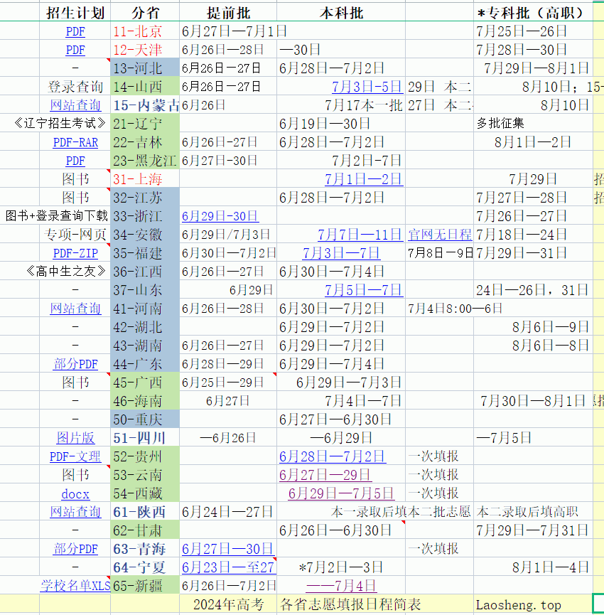

人生之路新高考 🕺 <sup>一山更比一山高</sup>
================
大萌	　202308，202406~	<base target="_blank">


　　每年的<big>6月7日、8日、9日 进行 **普通高等学校**招生全国统一考试，简称‘高考’</big>。全国有7个省份仍采用五科（语数外、文综、理综）全国统一命题；有21个省份采取新高考模式，语/数/外 全国统一命题，其余科目由各省自行出题，俗称‘3+X’。某些地方会有考试科目延长到6月10日。高考总分通常为750分，上海市为660分。

　　根据**新高考**改革进程的推进，全国共有五类高考试卷，分布如下：


*	1、全国甲卷：内蒙/陕西/宁夏，青海、四川（深蓝）
*	2、全国乙卷：无
*	3、新课标I卷：鲁苏浙闽粤，两河两湖，徽赣渝（12省，青色）
*	4、新课标II卷：辽吉黑，甘/疆/藏，山西、广西、云贵琼（11省，浅绿）
*	5、全自主命题：京、津、沪（红色）

　　这里是 [高等院校三千所](yuanxiao) 的配套页面**新高考**。  
　　页面还在设计中……

<h3 id="mulu">〖新高考〗目录</h3>

+	各省志愿填报[日程简表](#ri){:target="_top"} 📅
+	[教育部](#moe){:target="_top"} 门常用网址 🏢
+	民间[大学排行榜](#pai){:target="_top"}
+	QA 高考志愿[常见问题](#qa){:target="_top"} 💬
+	[台湾普通高校](#tw){:target="_top"}网站 🏫
+	[成人高校](#cj){:target="_top"}名单 🌃
+	参考文献 

<div align="right" id="ri">
⏩老生常谈/<a href="https://Laosheng.top/fuwu" target="_top">【有关部门】</a>/人生之路新高考
</div>

各省志愿填报日程简表 📅
--------------------

　　从各省考试院的公告，或者以下两个汇总网站，可以看到全国的高考志愿填报日程与录取批次。　教育部在6月22日至28日开展“云咨询周”活动，工作时间在‘阳光高考’网站免费提供[志愿填报咨询](https://gaokao.chsi.com.cn/zixun.do)。江西、浙江多省向考生提供模拟志愿填报服务。

*	教育部指定‘阳光高考’网[志愿填报](https://gaokao.chsi.com.cn/z/gkbmfslq/zytb.jsp)<sup>慢</sup>、[手机版](https://gaokao.chsi.com.cn/wap/z/gkbmfslq/zytb.jsp)<sup>快</sup>
*	<small>CERNET市场化运营</small>'中国教育在线'[志愿填报时间](https://www.eol.cn/e_html/gk/zytbsj/)

　　各省看下来，大萌感觉 2024年的志愿填报时间更集中，批次更简化，很多省份合并了本一批和本二批，一般分三个批次**填报志愿**：提前批、本科批、专科批；6月底填报提前批/本科批，7月底填报专科批；少数省份只填报两次，甚至一次。招不满学校会再次向考生**征集志愿**。

　　<small>
各省的颜色不同，表示不同的试卷类型，与上面的地图颜色相同。
　西藏是6月27日中午才在考试院官网公布填报志愿时间，这是全国最后一个，河北山西这个时候都已经完成了提前批的填报。
　注意，并不是所有关键信息都会公布在网站。比如安徽省的志愿填报时间，用文件下达到中学、用短信通知到考生，但没有公开在考试院的网站。
</small>

	<!--  -->
<div align="right" id="moe"><a href="#mulu" target="_top">↑ Top</a></div>


教育部门常用网址 🏢
----------------

　各省<sup>教育厅/局</sup>	考试院/高招办：

　11-北京<sup>[市教委](http://jw.beijing.gov.cn)</sup>	[考试院](https://www.bjeea.cn)
　12-天津<sup>[市教委](https://jy.tj.gov.cn)</sup>	[考试院](http://www.zhaokao.net)
　13-河北<sup>[教育厅](http://www.hee.gov.cn)</sup>	[考试院](http://www.hebeea.edu.cn)
　14-山西<sup>[教育厅](http://jyt.shanxi.gov.cn)</sup>	[招考中心](http://www.sxkszx.cn)
　15-内蒙古<sup>[教育厅](https://jyt.nmg.gov.cn)</sup>	[招考中心](https://www.nm.zsks.cn)
　21-辽宁<sup>[教育厅](https://jyt.ln.gov.cn)</sup>	[高招办](https://www.lnzsks.com)
　22-吉林<sup>[教育厅](http://jyt.jl.gov.cn)</sup>	[考试院](http://www.jleea.edu.cn)
　23-黑龙江<sup>[教育厅](http://jyt.hlj.gov.cn)</sup>	[考试院](https://www.hljea.org.cn)
　31-上海<sup>[市教委](https://edu.sh.gov.cn)</sup>	[考试院](https://www.shmeea.edu.cn)
　32-江苏<sup>[教育厅](http://jyt.jiangsu.gov.cn)</sup>	[考试院](https://www.jseea.cn)
　33-浙江<sup>[教育厅](http://jyt.zj.gov.cn)</sup>	[考试院](https://www.zjzs.net)
　34-安徽<sup>[教育厅](http://jyt.ah.gov.cn)</sup>	[考试院](https://www.ahzsks.cn)
　35-福建<sup>[教育厅](http://jyt.fujian.gov.cn)</sup>	[考试院](https://www.eeafj.cn)
　36-江西<sup>[教育厅](http://jyt.jiangxi.gov.cn)</sup>	[考试院](http://www.jxeea.cn)
　37-山东<sup>[教育厅](http://edu.shandong.gov.cn)</sup>	[考试院](https://www.sdzk.cn)
　41-河南<sup>[教育厅](http://jyt.henan.gov.cn)</sup>	[考试院](http://www.heao.com.cn)
　42-湖北<sup>[教育厅](http://jyt.hubei.gov.cn)</sup>	[高招办](http://www.hbea.edu.cn)
　43-湖南<sup>[教育厅](http://jyt.hunan.gov.cn)</sup>	[考试院](https://jyt.hunan.gov.cn/jyt/sjyt/hnsjyksy/)	[信息港](https://www.hneeb.cn)
　44-广东<sup>[教育厅](http://edu.gd.gov.cn)</sup>	[考试院](http://eea.gd.gov.cn)
　45-广西<sup>[教育厅](http://jyt.gxzf.gov.cn)</sup>	[考试院](http://www.gxeea.cn)
　46-海南<sup>[教育厅](http://edu.hainan.gov.cn)</sup>	[考试局](http://ea.hainan.gov.cn)
　50-重庆<sup>[市教委](http://jw.cq.gov.cn)</sup>	[考试院](https://www.cqksy.cn)
　51-四川<sup>[教育厅](http://edu.sc.gov.cn)</sup>	[考试院](http://www.sceea.cn)
　52-贵州<sup>[教育厅](http://jyt.guizhou.gov.cn)</sup>	[考试院](http://zsksy.guizhou.gov.cn)
　53-云南<sup>[教育厅](https://jyt.yn.gov.cn)</sup>	[考试院](http://www.ynzs.cn)
　54-西藏<sup>[教育厅](http://edu.xizang.gov.cn)</sup>	[考试院](http://zsks.edu.xizang.gov.cn)
　61-陕西<sup>[教育厅](http://jyt.shaanxi.gov.cn)</sup>	[考试院](http://www.sneac.com)
　62-甘肃<sup>[教育厅](http://jyt.gansu.gov.cn)</sup>	[考试院](http://www.ganseea.cn)
　63-青海<sup>[教育厅](http://jyt.qinghai.gov.cn)</sup>	[考试院](http://www.qhjyks.com)
　64-宁夏<sup>[教育厅](http://jyt.nx.gov.cn)</sup>	[考试院](http://www.nxjyks.cn)
　65-新疆<sup>[教育厅](http://jyt.xinjiang.gov.cn) / 
[兵团教育局](http://btjyj.xjbt.gov.cn)</sup>	[考试院](http://www.xjzk.gov.cn)  
　71-[台湾教育部门](https://www.edu.tw)
　81-[香港教育局](https://www.edb.gov.hk/sc)
　82-[澳门教育及青年发展局](https://www.dsedj.gov.mo)

　教育部 [MOE官网](http://www.moe.gov.cn) / [教育考试院](https://www.neea.edu.cn/)；
　官方微博：[微言教育](https://weibo.com/jybxwb) 微博粉丝超800万、
	[中国大学生在线](https://weibo.com/univs) 微博粉丝250万……  

　教育部官网[聚焦2024高考](http://www.moe.gov.cn/jyb_xwfb/xw_zt/moe_357/2024/2024_zt12/)专题　
	<del>[聚焦2023高考](http://www.moe.gov.cn/jyb_xwfb/xw_zt/moe_357/2023/2023_zt09/)</del>；
　指定[阳光高考网](https://gaokao.chsi.com.cn/) / 学信网[高考专题](https://www.chsi.com.cn/zthz/yggk.jsp)，[各省高考改革方案汇总](https://gaokao.chsi.com.cn/gkxx/zt/gkggfahz.shtml)，[各省招考办](https://gaokao.chsi.com.cn/gdwz.do)(考试院)


<h3>改革近况</h3>

*	2022年12月，中办国办印发《关于[深化现代职业教育体系建设改革](http://www.moe.gov.cn/jyb_xxgk/moe_1777/moe_1778/202212/t20221222_1035691.html)的意见》，教育部举行专题[新闻发布会](http://www.moe.gov.cn/fbh/live/2022/55031/)。
*	2022年1月，根据教育部《关于推进独立学院转设工作的实施方案》，以后[再无独立学院](https://gaokao.eol.cn/e_html/gk/2021/dlxyzs/dlxyzs/index.html)。
*	2020年10月，中共中央 国务院印发《[深化新时代教育评价改革总体方案](http://www.moe.gov.cn/jyb_xwfb/xw_zt/moe_357/jyzt_2020n/2020_zt21/)》。


<div align="right" id="pai"><a href="#mulu" target="_top">↑ Top</a></div>

<h3>民间大学排行榜</h3>

　　这里列出一些常见的大学排名网站，他们能够提供更多角度的学校筛选方式。

*	(上海)[软科](https://shanghairanking.cn/)，提供全国范围内[大学专业分类](https://shanghairanking.cn/rankings/bcmr/2022)，是本页面的很好补充。(%某些内容要求登录)
*	(广东)[艾瑞深](http://www.chinaxy.com/)校友会大学排名，‘360度全景数据平台’提供各种大学荣誉榜。
*	(深圳)[武书连](https://www.wurank.net)大学排名，始于中管院《中国大学评价》课题，1993年起发布。
*	(草根)中国大学层级图谱：[高等院校三千所](.yuanxiao)，中国高等院校名单和网址全集。
*	(美国)[U.S.News](https://www.usnews.com/education/best-global-universities/rankings "美式全球大学排名")🍴 最早发起大学排名的《美国新闻与世界报道》网站
*	(英国)THE排名 [泰晤士高等教育](https://www.TimesHigherEducation.com)📍
*	(英国)QS世界大学排名 [QS中国](https://www.QSchina.cn)📍


<div align="right" id="qa"><a href="#mulu" target="_top">↑ Top</a></div>

QA 高考志愿常见问题 💬
-------------------

<h3>高考志愿到底填什么？</h3>
　高考志愿需要填写某某学校的某某专业。　志愿的最小单位不是学校，而是学校内某个具体专业(组)。

<h3>志愿上要填写的代码是什么？</h3>
　考生要填写一连串的学校代码和专业代码。　高考招生的单位是省，不同的省可能试卷不同，科目不同，招生名额也不同；虽然教育部为学校分配了5位数字的招生代码(不是更长的学校标识码)，每一个省仍然会为学校分配自己的4位招生代码(内蒙古是3位)，某省具体用的是哪一种编码，请以该省的招生手册为准。

<h3>什么决定志愿是否录取？</h3>
　某个专业的供求关系。　供，是各院校专业在该省的招生名额与录取批次；求，是报考该专业的考生。传统的顺序录取(志愿学校优先)会导致考生落选志愿学校后继续失去同批次其他学校的竞争权，造成‘高分低录’现象；新的‘平行志愿’(分数优先)排除了这个问题。

<h3>大萌，你觉得志愿要怎么填？</h3>
　粗选学校、严选专业。极端分数，一人一策。

<h3>高考志愿填报 参考网站</h3>

*	教育部[国家智慧教育](https://www.smartedu.cn/)公共服务平台，考生可以提前了解专业课程内容。
*	(上海)[软科](https://shanghairanking.cn/)，提供全国范围内[大学专业分类](https://shanghairanking.cn/rankings/bcmr/2022)，是本页面的很好补充。(%某些内容要求登录)
*	(广东)[艾瑞深](http://www.chinaxy.com/)校友会大学排名，‘360度全景数据平台’提供各种大学荣誉榜。
*	(北京)中国教育在线/高考网的[模拟志愿填报](https://mnzy.gaokao.cn/)，可以提前熟悉高考志愿填写，查看院校往年录取分数。
*	[国防部](http://www.mod.gov.cn/gfbw/gffw/zs/)网站招生栏目每年会发布军校招生简章


<div align="right" id="tw"><a href="#mulu" target="_top">↑ Top</a></div>

台湾普通高校名单 🏫
---------------

　　台高校近150所，过去曾有约一百所院校面向大陆招生，请注意政策变化。台湾教育制度与大陆有差异，请注意称呼上的区别('專上教育'、'公帑资助'等)。


**台湾**　148所高校（101 $）私立≈民办

　2006年3月，[大陆单方面](http://www.moe.gov.cn/jyb_hygq/hygq_zczx/moe_1346/moe_1365/201208/t20120829_141212.html)宣布承认台湾教育行政部门核准的台湾高等学校的学历。  
　2019年有89所面向大陆普通高考招生，标记🕊。受新冠疫情影响，2020年起教育部暂停了陆生赴台就读试点工作，新的招生政策请见[海峡两岸招生服务中心](https://hxla.gatzs.com.cn/)。  
　本段只收录普通高校，不收录台湾地区的军警院校(10所)、宗教院校(40所)。  

台湾高等教育体系（一般大学与师范教育）：  
<small>
　0001 🔸[公立政治大学](http://www.nccu.edu.tw)🕊️ 台北市
　0002 🔸[公立清华大学](http://www.nthu.edu.tw)🕊️ 新竹市
　0003 🔸[公立台湾大学](http://www.ntu.edu.tw)🕊️ 台北市
　0005 🔸[公立成功大学](http://www.ncku.edu.tw)🕊️ 台南市
　0006 🔸[公立中兴大学](http://www.nchu.edu.tw)🕊️ 台中市
　0007 🔸[公立阳明交通大学](http://www.nycu.edu.tw) 新竹市
　0008 🔸[公立中央大学](http://www.ncu.edu.tw)🕊️ 桃园市
　0009 🔸[公立中山大学](http://www.nsysu.edu.tw)🕊️ 高雄市
　0012 [公立台湾海洋大学](http://www.ntou.edu.tw)🕊️ 基隆市
　0013 🔸[公立中正大学](http://www.ccu.edu.tw)🕊️ 嘉义县
　0017 [公立台北大学](http://new.ntpu.edu.tw)🕊️ 新北市
　0018 [公立嘉义大学](http://www.ncyu.edu.tw)🕊️ 嘉义市
　0019 [公立高雄大学](http://www.nuk.edu.tw)🕊️ 高雄市
　0020 [公立东华大学](http://www.ndhu.edu.tw)🕊️ 花莲县
　0021 [公立暨南国际大学](http://www.ncnu.edu.tw)🕊️ 南投县
　0028 [公立台北艺术大学](http://www.tnua.edu.tw)🕊️ 台北市
　0029 [公立台湾艺术大学](http://www.ntua.edu.tw)🕊️ 新北市
　0030 [公立台东大学](http://www.nttu.edu.tw)🕊️ 台东县
　0031 [公立宜兰大学](http://www.niu.edu.tw)🕊️ 宜兰县
　0032 [公立联合大学](http://www.nuu.edu.tw)🕊️ 苗栗县
　0035 [公立台南艺术大学](http://www.tnnua.edu.tw)🕊️ 台南市
　0036 [公立台南大学](http://web.nutn.edu.tw)🕊️ 台南市
　0044 [公立体育大学](http://www.ntsu.edu.tw)🕊️ 桃园市
　0048 [公立金门大学](http://www.nqu.edu.tw)🕊️ 金门县
　0049 [公立台湾体育运动大学](https://www.ntus.edu.tw/)🕊️ 台中市
　0052 [公立屏东大学](http://www.nptu.edu.tw)🕊️ 屏东县
　3002 [台北市立大学](http://www.uTaipei.edu.tw) 台北市
　1001 $[东海大学](https://www.thu.edu.tw/)🕊️ 台中市
　1002 $[辅仁大学](http://www.fju.edu.tw)🕊️ 新北市
　1003 $[东吴大学](http://www.scu.edu.tw)🕊️ 台北市
　1004 $[中原大学](http://www.cycu.edu.tw)🕊️ 桃园市
　1005 $[淡江大学](http://www.tku.edu.tw)🕊️ 新北市
　1006 $[中国文化大学](http://www.pccu.edu.tw)🕊️ 台北市
　1007 $[逢甲大学](http://www.fcu.edu.tw)🕊️ 台中市
　1008 $[静宜大学](http://www.pu.edu.tw)🕊️ 台中市
　1009 🔹$[长庚大学](http://www.cgu.edu.tw)🕊️ 桃园市
　1010 $[元智大学](http://www.yzu.edu.tw)🕊️ 桃园市
　1011 $[中华大学](http://www.chu.edu.tw)🕊️ 新竹市
　1012 $[大叶大学](http://www.dyu.edu.tw)🕊️ 彰化县
　1013 $[华梵大学](http://www.hfu.edu.tw) 新北市
　1014 $[义守大学](http://www.isu.edu.tw)🕊️ 高雄市
　1015 $[世新大学](http://www.shu.edu.tw)🕊️ 台北市
　1016 $[铭传大学](http://www.mcu.edu.tw)🕊️ 台北市
　1017 $[实践大学](https://www.usc.edu.tw/)🕊️ 台北市
　1019 🔹$[高雄医学大学](http://www2.kmu.edu.tw)🕊️ 高雄市
　1020 $[南华大学](http://www.nhu.edu.tw)🕊️ 嘉义县
　1021 $[真理大学](http://www.au.edu.tw)🕊️ 新北市
　1022 $[大同大学](http://www.ttu.edu.tw)🕊️ 台北市
　1027 $[慈济大学](http://www.tcu.edu.tw)🕊️ 花莲县
　1028 🔹$[台北医学大学](http://www.tmu.edu.tw)🕊️ 台北市
　1029 $[中山医学大学](http://www.csmu.edu.tw)🕊️ 台中市
　1033 $[长荣大学](http://www.cjcu.edu.tw)🕊️ 台南市
　1035 $[中国医药大学](http://www.cmu.edu.tw)🕊️ 台中市
　1039 $[玄奘大学](http://www.hcu.edu.tw)🕊️ 新竹市
　1048 $[亚洲大学](http://www.asia.edu.tw)🕊️ 台中市
　1049 $[开南大学](http://www.knu.edu.tw)🕊️ 桃园市
　1050 $[佛光大学](http://www.fgu.edu.tw)🕊️ 宜兰县
　1058 $[明道大学](http://www.mdu.edu.tw) 彰化县
　1067 $[台湾首府大学](https://web.tsu.edu.tw/)🕊️ 台南市
　1079 $[康宁大学](http://www.ukn.edu.tw) 台北市
　1125 $[中信金融管理学院](https://www.ctbc.edu.tw/)🕊️ 台南市
　1195 $[马偕医学院](http://www.mmc.edu.tw) 新北市
　1196 $[法鼓文理学院](http://www.dila.edu.tw) 新北市
　0004 🔸[公立台湾师范大学](http://www.ntnu.edu.tw)🕊️ 台北市
　0014 [公立高雄师范大学](http://www.nknu.edu.tw)🕊️ 高雄市
　0015 [公立彰化师范大学](http://www.ncue.edu.tw)🕊️ 彰化县
　0037 [公立台北教育大学](http://www.ntue.edu.tw)🕊️ 台北市
　0039 [公立台中教育大学](http://www.ntcu.edu.tw)🕊️ 台中市
</small>

台湾技职教育体系（科技大学与技术学院）：  
<small>
　0022 [公立台湾科技大学](http://www.ntust.edu.tw)🕊️ 台北市
　0023 [公立云林科技大学](http://www.yuntech.edu.tw)🕊️ 云林县
　0024 [公立屏东科技大学](http://www.npust.edu.tw)🕊️ 屏东县
　0025 [公立台北科技大学](http://www.ntut.edu.tw)🕊️ 台北市
　0033 [公立虎尾科技大学](http://www.nfu.edu.tw)🕊️ 云林县
　0042 [公立澎湖科技大学](http://www.npu.edu.tw) 澎湖县
　0043 [公立勤益科技大学](http://www.ncut.edu.tw)🕊️ 台中市
　0046 [公立台北护理健康大学](http://www.ntunhs.edu.tw) 台北市
　0047 [公立高雄餐旅大学](https://www.nkuht.edu.tw) 高雄市
　0050 [公立台中科技大学](https://www.nutc.edu.tw/)🕊️ 台中市
　0051 [公立台北商业大学](http://www.ntub.edu.tw)🕊️ 台北市
　0053 [公立高雄科技大学](http://www.nkust.edu.tw)🕊️ 高雄市
　0144 [公立台湾戏曲学院](http://www.tcpa.edu.tw)🕊️ 台北市
　0221 [公立台南护理专科学校](http://www.ntin.edu.tw) 台南市
　0222 [公立台东专科学校](http://www.ntc.edu.tw) 台东县
　1018 $[朝阳科技大学](http://www.cyut.edu.tw)🕊️ 台中市
　1023 $[南台科技大学](http://www.stust.edu.tw)🕊️ 台南市
　1024 $[崑山科技大学](http://www.ksu.edu.tw)🕊️ 台南市
　1025 $[嘉南药理大学](http://www.cnu.edu.tw) 台南市
　1026 $[树德科技大学](http://www.stu.edu.tw)🕊️ 高雄市
　1030 $[龙华科技大学](http://www.lhu.edu.tw)🕊️ 桃园市
　1031 $[辅英科技大学](https://www.fy.edu.tw/) 高雄市
　1032 $[明新科技大学](http://www.must.edu.tw)🕊️ 新竹县
　1034 $[弘光科技大学](http://www.hk.edu.tw) 台中市
　1036 $[健行科技大学](http://www.uch.edu.tw) 桃园市
　1037 $[正修科技大学](http://www.csu.edu.tw) 高雄市
　1038 $[万能科技大学](http://www.vnu.edu.tw) 桃园市
　1040 $[建国科技大学](http://www.ctu.edu.tw) 彰化县
　1041 $[明志科技大学](http://www.mcut.edu.tw) 新北市
　1042 $[高苑科技大学](http://www.kyu.edu.tw) 高雄市
　1043 $[大仁科技大学](http://www.tajen.edu.tw) 屏东县
　1044 $[圣约翰科技大学](https://www.sju.edu.tw/)🕊️ 新北市
　1045 $[岭东科技大学](http://www.ltu.edu.tw)🕊️ 台中市
　1046 $[中国科技大学](http://www.cute.edu.tw)🕊️ 台北市
　1047 $[中台科技大学](http://www.ctust.edu.tw)🕊️ 台中市
　1051 $[台南应用科技大学](http://www.tut.edu.tw)🕊️ 台南市
　1052 $[远东科技大学](http://www.feu.edu.tw) 台南市
　1053 $[元培医事科技大学](http://www.ypu.edu.tw) 新竹市
　1054 $[景文科技大学](http://www.just.edu.tw)🕊️ 新北市
　1055 $[中华医事科技大学](http://www.hwai.edu.tw) 台南市
　1056 $[东南科技大学](http://www.tnu.edu.tw)🕊️ 新北市
　1057 $[德明财经科技大学](http://www.takming.edu.tw) 台北市
　1060 $[南开科技大学](http://www.nkut.edu.tw) 南投县
　1061 $[中华科技大学](http://www.cust.edu.tw) 台北市
　1062 $[侨光科技大学](http://www.ocu.edu.tw) 台中市
　1063 $[育达科技大学](http://www.ydu.edu.tw) 苗栗县
　1064 $[美和科技大学](https://www.meiho.edu.tw/) 屏东县
　1065 $[吴凤科技大学](http://www.wfu.edu.tw) 嘉义县
　1066 $[环球科技大学](http://www.twu.edu.tw) 云林县
　1068 $[中州科技大学](http://www.ccut.edu.tw) 彰化县
　1069 $[修平科技大学](http://www.hust.edu.tw)🕊️ 台中市
　1070 $[长庚科技大学](http://www.cgust.edu.tw)🕊️ 桃园市
　1071 $[台北城市科技大学](https://www.tpcu.edu.tw/) 台北市
　1072 $[敏实科技大学](https://www.mitust.edu.tw/) 新竹县
　1073 $[醒吾科技大学](http://www.hwu.edu.tw)🕊️ 新北市
　1075 $[文藻外语大学](http://www.wzu.edu.tw)🕊️ 高雄市
　1076 $[华夏科技大学](http://www.hwh.edu.tw) 新北市
　1077 $[慈济科技大学](http://www.tcust.edu.tw) 花莲县
　1078 $[致理科技大学](http://www.chihlee.edu.tw) 新北市
　1080 $[宏国德霖科技大学](http://www.hdut.edu.tw) 新北市
　1081 $[东方设计大学](http://www.tf.edu.tw)🕊️ 高雄市
　1082 $[崇右影艺科技大学](http://www.cufa.edu.tw/) 基隆市
　1083 $[台北海洋科技大学](https://www.tumt.edu.tw/) 新北市
　1084 $[亚东科技大学](https://www.aeust.edu.tw/) 新北市
　1148 $[大汉技术学院](http://www.dahan.edu.tw) 花莲县
　1159 $[和春技术学院](http://www.fotech.edu.tw) 高雄市
　1168 $[南亚技术学院](http://www.nanya.edu.tw) 桃园市
　1183 $[黎明技术学院](http://www.lit.edu.tw) 新北市
　1185 $[经国管理暨健康学院](http://www.cku.edu.tw) 基隆市
　1188 $[大同技术学院](http://www.ttc.edu.tw) 嘉义市
　1282 $[马偕医护管理专科学校](http://www.mkc.edu.tw) 台北市
　1283 $[仁德医护管理专科学校](http://www.jente.edu.tw) 苗栗县
　1284 $[树人医护管理专科学校](http://www.szmc.edu.tw) 高雄市
　1285 $[慈惠医护管理专科学校](http://www.tzuhui.edu.tw) 屏东县
　1286 $[耕莘健康管理专科学校](http://www.ctcn.edu.tw) 新北市
　1287 $[敏惠医护管理专科学校](https://www.mhchcm.edu.tw/) 台南市
　1289 $[育英医护管理专科学校](https://www.yuhing.edu.tw/) 高雄市
　1291 $[圣母医护管理专科学校](http://www.smc.edu.tw) 宜兰县
　1292 $[新生医护管理专科学校](http://ccwpress.hsc.edu.tw) 桃园市
　1293 $[崇仁医护管理专科学校](http://www.cjc.edu.tw) 嘉义县
</small>


<div align="right" id="cj"><a href="#mulu" target="_top">↑ Top</a></div>

成人高校名单 🌃
------------
（不含港澳台）

　　249所，含15所部属 ❕，2所民办 ¥：108 上海医药、197 广东新华。<small>

　1	北京市海淀区职工大学	<i>中关村学院</i>
　2	北京市东城区职工业余大学
　3	北京市崇文区职工大学
　4	[北京宣武红旗业余大学](http://www.hqdx.com/)
　5	北京市石景山区业余大学
　6	北京市朝阳区职工大学
　7	北京医药职工大学	<i>[同仁堂党校](https://www.tongrentang.com/menu53/newsDetail/21911.html)</i>
　8	[北京市总工会职工大学](https://www.ghgy.com.cn)	<i>干部学院</i>
　9<sup>中共中央党校</sup>❕	<b>中央党校 继续教育学院</b>
　10<sup>中华全国新闻工作者协会</sup>❕	<b>中国记协职工新闻学院</b>
　11<sup>中共中央办公厅</sup>❕	<b>中南海业余大学</b>
　12	[北京教育学院](https://www.bjie.ac.cn)
　13	[北京开放大学](http://www.bjou.edu.cn)
　14<sup>教育部</sup>❕	[<b>国家开放大学</b>](https://www.ouchn.edu.cn)
　15<sup>交通运输部</sup>❕	<b>民航管理干部学院</b>
　16	北京市丰台区职工大学
　17	北京市西城经济科学大学
　18	北京市农工商联合总公司职工大学
　19<sup>公安部</sup>❕	<b>公安部管理干部学院</b>	🛂
　20<sup>最高人民法院</sup>❕	<b>国家法官学院</b>	⚖️
　21	华北电业联合职工大学
　22	[首都联合职工大学](http://sdld.cn)
　23<sup>最高人民检察院</sup>❕	[<b>国家检察官学院</b>](http://www.jcgxy.org)	⚔️
　24	天津市和平区新华职工大学
　25	天津市河西区职工大学
　26	天津市河东区职工大学
　27	天津市红桥区职工大学
　28	天津市南开区职工大学	<i>[招生简章](http://tjnkedu.net/nd.jsp?id=201)</i>
　29	天津市建筑工程职工大学
　30	天津市职工经济技术大学
　31	天津市渤海化工职工学院
　32	天津市管理干部学院
　33	[天津开放大学](http://www.tjrtvu.edu.cn)
　34	天津市政法管理干部学院	⚖️
　35	天津市工会管理干部学院
　36	天津市房地产局职工大学
　37	[河北开放大学](http://www.hebnetu.edu.cn)
　38	[石家庄职工大学](http://www.hbcjpt.com/sjzzgdx/)
　39<sup>海关总署</sup>❕	<b>海关管理干部学院</b>
　40	河北管理干部学院
　41	河北青年管理干部学院
　42	太原化学工业集团有限公司职工大学
　43	山西机电职工学院
　44	太原钢铁(集团)有限公司职工钢铁学院
　45	山西煤炭职工联合大学
　46	山西兵器工业职工大学
　47	山西省职工工艺美术学院	🎨
　48	[山西开放大学](https://www.sxou.cn)
　49	山西省政法管理干部学院	⚖️
　50	包头市职工大学
　51	[内蒙古开放大学](https://www.imou.edu.cn/zhuzhan)
　52	辽宁兵器工业职工大学
　53	大连工人大学
　54<sup>空军装备部</sup>❕	<b>空军第四职工大学</b>
　55<sup>海军装备部</sup>❕	[<b>海军职工大学</b>](http://hjzd.cn)
　56	大连职工大学
　57	抚顺矿务局职工工学院
　58	抚顺石油化工公司职工大学
　59	阜新矿务局职工大学
　60	朝阳职工工学院
　61	大连市教育学院
　62	[辽宁开放大学](http://www.lntvu.com)
　63	阜新煤炭职工医学专科学校
　64	辽宁冶金职工大学
　65	辽宁公安司法管理干部学院	🛂+<i>辽宁政法职业学院</i>
　66	沈阳机械工业职工大学
　67	鞍山钢铁集团公司职工大学
　68	[沈阳开放大学](http://www.sytvu.cn)
　69	[大连开放大学](http://www.dlrtvu.edu.cn)
　70	长春职工大学
　71	长春市建筑职工业余大学
　72	长春职工医科大学
　73	吉林市职工大学
　74	吉林化学工业公司职工大学
　75	通化市职工大学
　76	通化钢铁公司职工大学
　77	四平农村成人高等专科学校
　78	吉林省教育学院
　79	长春教育学院
　80	[吉林开放大学](http://www.jlrtvu.jl.cn)
　81	吉林省经济管理干部学院
　82	吉林职工医科大学
　83	[长春开放大学](http://www.ccrtvu.com)
　84	黑龙江兵器工业职工大学
　85	哈尔滨航空职工大学
　86	哈尔滨市职工大学
　87	齐齐哈尔市建设职工大学
　88	齐齐哈尔市职工大学
　89	鹤岗矿务局职工大学
　90	大庆石油化工总厂职工大学
　91	黑龙江农垦管理干部学院
　92	黑龙江省经济管理干部学院
　93	黑龙江省政法管理干部学院	⚖️
　94	黑龙江省教育学院
　95	绥化市教育学院
　96	[黑龙江开放大学](http://www.hljrtvu.org.cn)
　97	黑龙江省商业职工大学
　98	黑龙江省社会科学院职工大学
　99	[哈尔滨开放大学](http://www.hrbou.org.cn)
　100	上海科技管理干部学院
　101	上海市黄浦区业余大学
　102	上海市徐汇区业余大学
　103	上海市长宁区业余大学
　104	上海市静安区业余大学
　105	上海市普陀区业余大学
　106	上海市杨浦区业余大学
　107	上海纺织工业职工大学
　108¥	[上海医药职工大学](http://www.yxyzdedu.com)
　109	[上海开放大学](http://www.shou.org.cn)
　110	上海青年管理干部学院
　111	上海市宝山区业余大学
　112	南京市职工大学
　113<sup>空军装备部</sup>❕	<b>空军第一职工大学</b>
　114	南通市工人业余大学
　115	[扬州教育学院](https://www.yzpc.edu.cn)	+<i>职业大学/开放大学/环境资源职院</i>
　116	[江苏开放大学](http://www.jsou.cn)
　117	江苏省省级机关管理干部学院
　118	[南京开放大学](http://www.njou.edu.cn)
　119	江苏省青年管理干部学院
　120	浙江省省级机关职工业余大学
　121	杭州市工人业余大学
　122	温州市工人业余大学
　123	金华教育学院
　124	[浙江开放大学](http://www.zjtvu.edu.cn)
　125	浙江经济管理职工大学
　126	浙江嘉兴教育学院
　127	[宁波开放大学](http://www.nbtvu.net.cn)
　128	淮南市职工大学
　129	合肥职工科技大学
　130	合肥市职工大学
　131	安徽经济管理干部学院
　132	宿州教育学院
　133	[安徽开放大学](http://www.ahtvu.ah.cn)
　134	[福建教育学院](https://www.fjjyxy.com)
　135	[福建开放大学](http://www.fjrtvu.edu.cn)
　136	[厦门开放大学](http://www.xmcu.edu.cn)
　137	江西行政管理干部学院
　138	昌河职工工学院
　139	南昌钢铁有限责任公司职工大学
　140	[江西开放大学](http://www.jxrtvu.com)
　142	山东省水利职工大学
　143	山东兵器工业职工大学
　144	新汶矿务局职工大学
　145	济南市职工大学
　146	山东省经济管理干部学院
　147	山东省聊城教育学院
　148	山东省济宁教育学院
　149	[山东开放大学](http://www.sdou.edu.cn)
　150	兖州矿区职工大学
　151	山东财政职工大学
　152	[青岛开放大学](http://www.qdopenu.cn)
　153	长城铝业公司职工工学院
　154	郑州市职工大学
　155	第一拖拉机制造厂拖拉机学院
　156	洛阳轴承职工大学
　157	洛阳有色金属职工大学
　158	开封空分设备厂职工大学
　159	[河南开放大学](https://www.haou.edu.cn)
　160	焦作职工医学院
　161	磨料磨具工业职工大学
　162	驻马店教育学院
　163	[武汉开放大学](http://www.whtvu.com.cn)
　164	湖北兵器工业职工大学
　165	湖北省纺织职工大学
　166	鄂城钢铁厂职工大学
　167	丹江口工程管理局职工大学
　168	湖北省直属机关业余大学
　169	湖北省经济管理干部学院
　170	十堰教育学院
　171	大冶钢厂职工大学
　172	[湖北开放大学](http://www.hubtvu.edu.cn)
　173	武汉冶金管理干部学院
　174	湖北武汉公安管理干部学院	🛂
　175	华中电业联合职工大学
　176	涟源钢铁总厂职工大学
　177	株洲市职工大学
　178	湖南航空工业职工工学院
　179	中钢集团衡阳重机职工大学
　180	衡阳工业职工大学
　181	长沙教育学院
　182	湘潭教育学院
　183	[湖南开放大学](https://www.hnou.edu.cn)
　184	益阳教育学院
　185	湖南金融技术职工大学
　186	湖南纺织职工大学
　187	长沙工业职工大学
　188	广州金桥管理干部学院
　189	南海成人学院
　190	湛江市业余大学
　191	广东省国防工业职工大学
　192	汕头市业余大学
　193	韶关市职工大学
　194	广州市公安管理干部学院	🛂
　195	广东省公安司法管理干部学院	🛂
　196	[广东开放大学](http://www.gdrtvu.edu.cn)
　197¥	广东新华教育学院
　198	广东省职工体育运动技术学院	🏃
　199	广东社会科学大学
　200	[广州开放大学](https://www.ougz.edu.cn)
　201	[深圳开放大学](http://www.szrtvu.com.cn)
　202	桂林市职工大学
　203	广西教育学院
　204	[广西开放大学](http://www.gxou.com.cn)
　205	广西政法管理干部学院	⚖️
　206	[海南开放大学](http://www.hainrtvu.com)
　207	重庆电力职工大学
　208	重庆冶金成人学院
　209	[重庆开放大学](http://www.cqdd.cq.cn)
　210	中国工程物理研究院职工工学院
　211	国营涪江机器厂职工大学
　212	成都冶金职工大学
　213	第五冶金建设公司职工大学
　214	成都工业职工大学
　215	四川省化工职工大学
　216<sup>中国科学院</sup>❕	<b>中国科学院成都分院职工大学</b>
　217	广元职工医学院
　218	南充市职工大学
　219	[四川开放大学](http://www.scrtvu.net)
　220	成都市职工大学
　221	[成都开放大学](http://www.cdou.edu.cn)
　222	贵州铝厂职工大学
　223	贵州机械工业职工大学
　224	[贵州开放大学](https://www.gztvu.com/xysy.htm)
　225	[云南开放大学](https://www.ynou.edu.cn)
　226	陕西航天职工大学
　227	西安航空职工大学
　228	西安飞机工业公司职工工学院
　229	陕西兵器工业职工大学
　230	西北电业职工大学
　231	西安铁路工程职工大学
　232	西安电力机械制造公司机电学院
　233	陕西省建筑工程总公司职工大学
　234	[西安市职工大学](http://www.xazd.cn)
　235	宝鸡市职工大学
　236	陕西省宝鸡教育学院
　237	[陕西开放大学](http://www.sxrtvu.edu)
　238	陕西工运学院
　239	[西安开放大学](http://www.xartvu.sn.cn)
　240	兰州铁路工程职工大学
　241	甘肃核工业职工大学
　242	银光化学材料厂职工大学
　243	[甘肃开放大学](http://www.gsou.edu.cn)
　244	青海省联合职工大学
　245	[青海开放大学](https://www.qhou.edu.cn)
　246	[宁夏开放大学](http://www.nxtvu.edu.cn)
　247<sup>新疆兵团</sup>❕	[<b>兵团开放大学</b>](http://www.btou.cn)	<i>新疆生产建设兵团</i>
　248	[新疆开放大学](http://www.xjou.cn)
　249	喀什教育学院
　250<sup>新疆兵团</sup>❕	<b>新疆生产建设兵团教育学院</b>
　251	和田地区教育学院
　252	[阿克苏教育学院](http://www.xjaksnu.cn)
</small>

<h3 >近年撤销学校标识码</h3>
*	江西经济管理干部学院	4236051285	江西省	南昌市	成教本科		202312设置江西飞行学院，本科

*	202404数据较2023年减少2所：<del>江西经济管理干部学院 4236051285、福建对外经济贸易职业技术学院 4135013771</del>
*	20230619教育部名单较2022年减少2所：<del>山西省吕梁市教育学院 4214050197、四川科技职工大学 4251050081</del>。


<div align="right" id="ck"><a href="#mulu" target="_top">↑ Top</a></div>

参考文献
--------

*	20240607　[中国教育在线](https://gaokao.eol.cn/news/202406/t20240607_2615074.shtml)：全国乙卷没了，2024年高考各省份试卷类型是什么？
*	20240612　大皖新闻发布于腾讯网：[安徽高考考生志愿网上填报办法](https://new.qq.com/rain/a/20240612A03IVH00)公布，此文件在省考试院官网没有找到。
*	20240624　四川省教育考试院发布：2024年普通高校[在川招生专业及名额](https://plan.sceea.cn/lkjh.html)介绍，图片版


```
	老生常谈© 2019-2024 大萌	知识共享许可
	CC-BY-NC-ND-3.0	可转载-原署名-非演绎-非营利
	人生之路新高考	V0.3.8	202407
	https://Laosheng.top/fuwu/gaokao
```

回到首页<a href=".." title="返回老生常谈首页"></a>  
https://Laosheng.top  

🥉🏫🔢🧳 🔠📎
