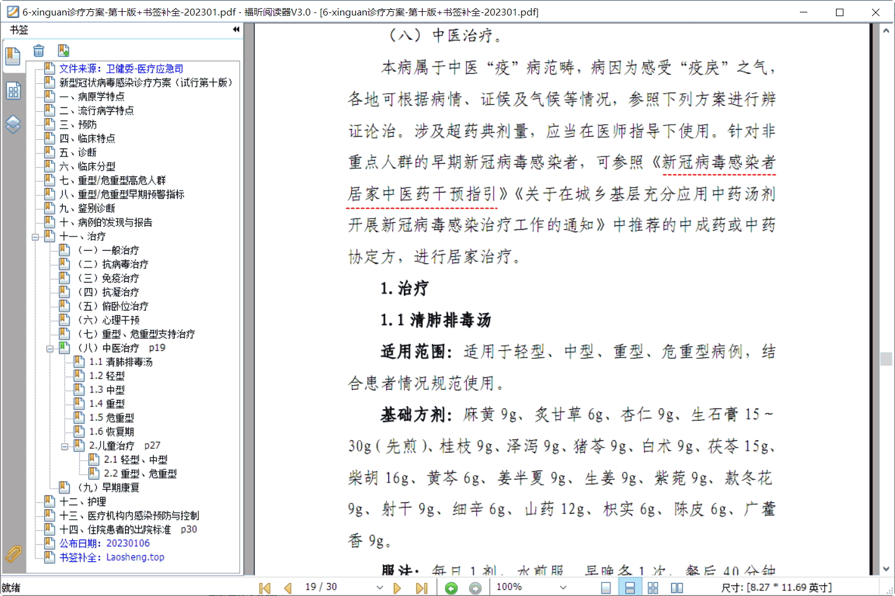

新冠居家指引🤒<sub>文件速查</sub> 
==================
大萌	2023	<base target="_blank">
<meta property="og:type" content="website" />
<meta property="og:site_name" content="老生常谈" />
<meta property="og:url" content="https://Laosheng.top/fuwu/" />

　　年终岁尾，防疫政策迎来重大转变。去年12月26日，国家卫健委发布公告，将‘新型冠状病毒肺炎’更名为‘新型冠状病毒感染’，并将在今年1月8日起不再实施‘乙类甲管’。国家防疫重点从防控转向诊疗，相关文件密集出台，个人学习压力陡增。　大萌收录近期有关居家诊疗的文件，尤其是中医药方案，供大家速查。　网页制作中，欢迎大家[提出意见](https://xoyondo.com/mb/yY8PqZMjKUgdcpn )！
<div align="right">
⏩老生常谈/<a href="https://Laosheng.top/fuwu" target="_top">【有关部门】</a>/新冠居家指引
</div>

预备知识
----------

　　《中国中医药报》网站刊载的**中医优势病种**：
[感冒](http://www.cntcm.com.cn/news.html?aid=112675)、
[咳嗽](http://www.cntcm.com.cn/news.html?aid=112674) 的的辩证与治疗，
[常用中成药](http://www.cntcm.com.cn/column.html?cid=2268)介绍。

按部门隶属
----------

国务院/联防联控 [机制文件](http://www.gov.cn/zhengce/gwylflkjzwj.htm)、 [权威发布](http://www.gov.cn/xinwen/gwylflkjzqwfb/index.shtml)  
国务院/[卫健委](http://www.nhc.gov.cn/) / 新冠病毒疫情[防控工作](http://www.nhc.gov.cn/xcs/xxgzbd/gzbd_index.shtml)  
-	医疗应急司：[诊疗方案第十版](http://www.nhc.gov.cn/ylyjs/pqt/202301/32de5b2ff9bf4eaa88e75bdf7223a65a.shtml)　[图版](https://mp.weixin.qq.com/s/p0yaR3Iw_iALlhVSecnu7Q)🎋中医治疗部分
-	国家中医药管理局：[居家中医药干预指引](http://www.natcm.gov.cn/yizhengsi/gongzuodongtai/2022-12-10/28466.html)　[图版](https://mp.weixin.qq.com/s/AEJ4xA2MAEWpm7FQf60pyg)<big>👨‍⚕️</big>
	- 《[中国中医药](http://www.cntcm.com.cn)报》社
	/ 中医抗疫[学术科普](http://www.cntcm.com.cn/column.html?cid=4045)
-	中国健康教育中心：[居家指引（第一版）](https://www.nihe.org.cn/portal/jkzs/jbyf/news/fkzs/news/webinfo/2023/01/1674531702519756.htm)


按时间顺序
----------
防疫形式变化

2023-01-07 　	中医药局/“中国中医”wx号  
第十版诊疗方案的中医治疗部分🎋  
<https://mp.weixin.qq.com/s/p0yaR3Iw_iALlhVSecnu7Q>  

2023-01-06 　	国卫办医急函〔2023〕4号  
关于印发《新型冠状病毒感染诊疗方案》（试行第十版）的通知  
<http://www.nhc.gov.cn/ylyjs/pqt/202301/32de5b2ff9bf4eaa88e75bdf7223a65a.shtml>  
* 附件：新型冠状病毒感染诊疗方案（试行第十版）.PDF 　	本站已补全书签，见下方

2023-01-05 　	联防联控机制综发〔2023〕1号  
关于在新型冠状病毒感染医疗救治中进一步发挥中医药特色优势的通知  
<http://www.gov.cn/xinwen/2023-01/05/content_5735114.htm>  

2023-01-05 　	中国健康教育中心  
《新冠病毒感染者居家指引》（第一版）  
<https://www.nihe.org.cn/portal/jkzs/jbyf/news/fkzs/news/webinfo/2023/01/1674531702519756.htm>  

2022-12-30 　	联防联控机制综发〔2022〕146号  
关于在城乡基层充分应用中药汤剂开展新冠病毒感染治疗工作的通知  
<http://www.gov.cn/xinwen/2022-12/30/content_5734187.htm>  附  
治疗新冠病毒感染中药协定方范例(.doc)

2022-12-11 　	中医药局/“中国中医”wx号  
一图读懂｜新冠病毒感染者居家中医药干预指引<big>👨‍⚕️</big>  
<https://mp.weixin.qq.com/s/AEJ4xA2MAEWpm7FQf60pyg>  

2022-12-10 　	中医药局/中医疫病防治专家委员会  
《新冠病毒感染者居家中医药干预指引》  
<http://www.natcm.gov.cn/yizhengsi/gongzuodongtai/2022-12-10/28466.html>  

2022-12-08 　	联防联控机制综发〔2022〕117号  
关于印发《新冠病毒感染者居家治疗指南》的通知  
<http://www.gov.cn/xinwen/2022-12/08/content_5730664.htm>  附件：  
* 1.新冠病毒感染者居家治疗常用药参考表.docx 　	老生常谈网站[转换为rtf](xinguan/gov-202212-117-常用药参考表.rtf)
* 2.新冠病毒感染者居家治疗抗原检测指南.docx	


《中医药干预指引》的中成药
----------------------

……

《诊疗方案》内的中医治疗
--------------------

　　今天（20230106）卫健委对诊疗指南发布第十版，中医部分做了加强。大萌继续对该pdf补全书签，以下是pdf中第19页内容：
~~~
（八）中医治疗。

　　本病属于中医“疫”病范畴，病因为感受“疫戾”之气，各地可根据病情、证候及气候等情况，
参照下列方案进行辨证论治。涉及超药典剂量，应当在医师指导下使用。针对非重点人群的早期
新冠病毒感染者，可参照《新冠病毒感染者居家中医药干预指引》 、《关于在城乡基层充分应用
中药汤剂开展新冠病毒感染治疗工作的通知》中推荐的中成药或中药协定方，进行居家治疗。

1.治疗
1.1 清肺排毒汤
　　适用范围：适用于轻型、中型、重型、危重型病例，结合患者情况规范使用。
　　基础方剂：麻黄 9g、炙甘草 6g、杏仁 9g、生石膏15～30g（先煎）、
	桂枝 9g、泽泻 9g、猪苓 9g、白术 9g、茯苓 15g、柴胡 16g、
	黄芩6g、姜半夏9g、生姜9g、紫菀 9g、款冬花 9g、射干 9g、
	细辛 6g、山药 12g、枳实 6g、陈皮 6g、广藿香 9g。
　　服法：每日 1 剂，水煎服。早晚各 1 次，餐后40分钟服用，3日一个疗程。 患者不发热则生石膏用量小，发热或壮热可加大生石膏用量。

　　推荐中成药：清肺排毒颗粒。
~~~


*	pdf官方文件 	[卫健委网站](http://www.nhc.gov.cn/ylyjs/pqt/202301/32de5b2ff9bf4eaa88e75bdf7223a65a.shtml)（2023年1月第十版）
*	pdf书签补全 	[老生常谈网站](xinguan/6-xinguan诊疗方案-第十版+书签补全-202301.pdf ){:target="_top"} （可阅读、可下载）  
　　第十版较第九版新提了两份中医文件，《新冠病毒感染者居家中医药干预指引》、《关于在城乡基层充分应用中药汤剂开展新冠病毒感染治疗工作的通知》，本页均已收录网址。

　　早期的新冠肺炎诊疗方案看这里： [国家《新冠肺炎诊疗方案》中的中医治疗](../c/6-xinguanzhenliao.txt){:target="_top"}（第九版、第八版）

乘胜追击学中医
-------------

　　光明中医教材

　　但愿人长久，千里共婵娟~~

```
	老生常谈© 2019-2023 大萌	知识共享许可证
	CC-BY-NC-ND-3.0	可转载-原署名-非演绎
	https://Laosheng.top/fuwu/jujia
	新冠居家指引文件速查 v0.3.6	202301
```

回到首页
<a href=".." title="返回老生常谈首页"></a>  
点击二维码，“在浏览器打开” https://Laosheng.top  
😷🤒🤧🥴🎴⭐🌟✨🔯✴️✳️⚕️💉🩺👨‍⚕️🏥🥣☕🍵🍱
