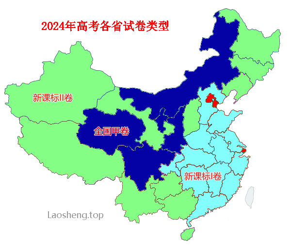

人生之路新高考 🕺 <sup>一山更比一山高</sup>
================
大萌	　202308，202404、06（草稿）<base target="_blank">


　　每年的<big>6月7日、8日、9日 进行 **普通高等学校**招生全国统一考试，简称‘高考’</big>。全国有7个省份仍采用五科（语数外、文综、理综）全国统一命题；有21个省份采取新高考模式，语数外全国统一命题，其余科目由各省自行出题。某些地方会延长考试到6月10日。高考总分通常为750分，上海市为660分，海南省为900分。

　　根据新旧高考模式的不同，2024年高考全国共有五类试卷，**预测**分布如下：

*	1、全国甲卷：四川、西藏
*	2、全国乙卷：内蒙古、陕西、宁夏、青海、新疆
*	3、新课标I卷：冀鲁苏浙，闽粤湘鄂（8个省）
*	4、新课标II卷：辽吉黑，甘、晋、豫、渝、徽、赣、云贵桂琼（13个省）
*	5、自主命题：京、津、沪

　　这里是 [高等院校三千所](yuanxiao) 的配套页面。　页面还在设计中……


<h3>改革近况</h3>

*	2022年12月，中办国办印发《关于[深化现代职业教育体系建设改革](http://www.moe.gov.cn/jyb_xxgk/moe_1777/moe_1778/202212/t20221222_1035691.html)的意见》，教育部举行专题[新闻发布会](http://www.moe.gov.cn/fbh/live/2022/55031/)。
*	2022年1月，根据教育部《关于推进独立学院转设工作的实施方案》，以后[再无独立学院](https://gaokao.eol.cn/e_html/gk/2021/dlxyzs/dlxyzs/index.html)。

*	2020年10月，中共中央 国务院印发《[深化新时代教育评价改革总体方案](http://www.moe.gov.cn/jyb_xwfb/xw_zt/moe_357/jyzt_2020n/2020_zt21/)》。


教育部门常用网址
----------------

　教育部 [MOE官网](http://www.moe.gov.cn) / [教育考试院](https://www.neea.edu.cn/)；
　官方微博：[微言教育](https://weibo.com/jybxwb) 微博粉丝超800万、
	[中国大学生在线](https://weibo.com/univs) 微博粉丝250万……  

　教育部官网[聚焦2024高考](http://www.moe.gov.cn/jyb_xwfb/xw_zt/moe_357/2024/2024_zt12/)专题　
	<del>[聚焦2023高考](http://www.moe.gov.cn/jyb_xwfb/xw_zt/moe_357/2023/2023_zt09/)</del>；
　指定[阳光高考网](https://gaokao.chsi.com.cn/)，[各省高考改革方案汇总](https://gaokao.chsi.com.cn/gkxx/zt/gkggfahz.shtml)，[各省招考办](https://gaokao.chsi.com.cn/gdwz.do)(考试院)

　各省教育厅/局官网 <sup>省招办/考试院</sup>：

　11-北京[市教委](http://jw.beijing.gov.cn)	<sup>[考试院](https://www.bjeea.cn)</sup>
　12-天津[市教委](https://jy.tj.gov.cn)	<sup>[考试院](http://www.zhaokao.net)</sup>
　13-河北[教育厅](http://www.hee.gov.cn)	<sup>[考试院](http://www.hebeea.edu.cn)</sup>
　14-山西[教育厅](http://jyt.shanxi.gov.cn)	<sup>[考试院](http://www.sxkszx.cn)</sup>
　15-内蒙古[教育厅](https://jyt.nmg.gov.cn)	<sup>[考试院](https://www.nm.zsks.cn)</sup>
　21-辽宁[教育厅](https://jyt.ln.gov.cn)	<sup>[考试院](https://www.lnzsks.com)</sup>
　22-吉林[教育厅](http://jyt.jl.gov.cn)	<sup>[考试院](http://www.jleea.edu.cn)</sup>
　23-黑龙江[教育厅](http://jyt.hlj.gov.cn)	<sup>[考试院](https://www.lzk.hl.cn)</sup>
　31-上海[市教委](https://edu.sh.gov.cn)	<sup>[考试院](https://www.shmeea.edu.cn)</sup>
　32-江苏[教育厅](http://jyt.jiangsu.gov.cn)	<sup>[考试院](https://www.jseea.cn)</sup>
　33-浙江[教育厅](http://jyt.zj.gov.cn)	<sup>[考试院](https://www.zjzs.net)</sup>
　34-安徽[教育厅](http://jyt.ah.gov.cn)	<sup>[考试院](https://www.ahzsks.cn)</sup>
　35-福建[教育厅](http://jyt.fujian.gov.cn)	<sup>[考试院](https://www.eeafj.cn)</sup>
　36-江西[教育厅](http://jyt.jiangxi.gov.cn)	<sup>[考试院](http://www.jxeea.cn)</sup>
　37-山东[教育厅](http://edu.shandong.gov.cn)	<sup>[考试院](https://www.sdzk.cn)</sup>
　41-河南[教育厅](http://jyt.henan.gov.cn)	<sup>[考试院](http://www.heao.com.cn)</sup>
　42-湖北[教育厅](http://jyt.hubei.gov.cn)	<sup>[考试院](http://www.hbea.edu.cn)</sup>
　43-湖南[教育厅](http://jyt.hunan.gov.cn)	<sup>[考试院](http://www.hneao.edu.cn)</sup>
　44-广东[教育厅](http://edu.gd.gov.cn)	<sup>[考试院](http://eea.gd.gov.cn)</sup>
　45-广西[教育厅](http://jyt.gxzf.gov.cn)	<sup>[考试院](http://www.gxeea.cn)</sup>
　46-海南[教育厅](http://edu.hainan.gov.cn)	<sup>[考试院](http://ea.hainan.gov.cn)</sup>
　50-重庆[市教委](http://jw.cq.gov.cn)	<sup>[考试院](https://www.cqksy.cn)</sup>
　51-四川[教育厅](http://edu.sc.gov.cn)	<sup>[考试院](http://www.sceea.cn)</sup>
　52-贵州[教育厅](http://jyt.guizhou.gov.cn)	<sup>[考试院](http://zsksy.guizhou.gov.cn)</sup>
　53-云南[教育厅](https://jyt.yn.gov.cn)	<sup>[考试院](http://www.ynzs.cn)</sup>
　54-西藏[教育厅](http://edu.xizang.gov.cn)	<sup>[考试院](http://zsks.edu.xizang.gov.cn)</sup>
　61-陕西[教育厅](http://jyt.shaanxi.gov.cn)	<sup>[考试院](http://www.sneac.com)</sup>
　62-甘肃[教育厅](http://jyt.gansu.gov.cn)	<sup>[考试院](http://www.ganseea.cn)</sup>
　63-青海[教育厅](http://jyt.qinghai.gov.cn)	<sup>[考试院](http://www.qhjyks.com)</sup>
　64-宁夏[教育厅](http://jyt.nx.gov.cn)	<sup>[考试院](http://www.nxjyks.cn)</sup>
　65-新疆[教育厅](http://jyt.xinjiang.gov.cn) / 
[兵团教育局](http://btjyj.xjbt.gov.cn)	<sup>[考试院](http://www.xjzk.gov.cn)</sup>  
　71-[台湾教育部门](https://www.edu.tw)
　81-[香港教育局](https://www.edb.gov.hk/sc)
　82-[澳门教育及青年发展局](https://www.dsedj.gov.mo)


QA 高考志愿常见问题
-----------------

<h3>高考志愿到底填什么？</h3>
　高考志愿需要填写某某学校的某某专业。　志愿的最小单位不是学校，而是学校内某个具体专业(组)。

<h3>志愿上要填写的代码是什么？</h3>
　考生要填写一连串的学校代码和专业代码。　高考招生的单位是省，不同的省可能试卷不同，科目不同，招生名额也不同；虽然教育部为学校分配了5位数字的招生代码(不是更长的学校标识码)，每一个省仍然会为学校分配自己的4位招生代码(内蒙古是3位)，某省具体用的是哪一种编码，请以该省的招生手册为准。

<h3>什么决定志愿是否录取？</h3>
　某个专业的供求关系。　供，是各院校专业在该省的招生名额与录取批次；求，是报考该专业的考生。传统的顺序录取(志愿学校优先)会导致考生落选志愿学校后继续失去同批次其他学校的竞争权，造成‘高分低录’现象；新的‘平行志愿’(分数优先)排除了这个问题。

<h3>大萌，你觉得志愿要怎么填？</h3>
　粗选学校、严选专业。极端分数，一人一策。

<h3>高考志愿填报 参考网站</h3>

*	教育部[国家智慧教育](https://www.smartedu.cn/)公共服务平台，考生可以提前了解专业课程内容。
*	(上海)[软科](https://shanghairanking.cn/)，提供全国范围内[大学专业分类](https://shanghairanking.cn/rankings/bcmr/2022)，是本页面的很好补充。(%某些内容要求登录)
*	(广东)[艾瑞深](http://www.chinaxy.com/)校友会大学排名，‘360度全景数据平台’提供各种大学荣誉榜。
*	(北京)中国教育在线/高考网的[模拟志愿填报](https://mnzy.gaokao.cn/)，可以提前熟悉高考志愿填写，查看院校往年录取分数。
*	[国防部](http://www.mod.gov.cn/gfbw/gffw/zs/)网站招生栏目每年会发布军校招生简章


<div align="right" id="D5"><a href="#tupu" target="_top">↑ Top</a></div>

台湾普通高校名单 🏫
---------------

　　台高校近150所，过去曾有约一百所院校面向大陆招生，请注意政策变化。台湾教育制度与大陆有差异，请注意称呼上的区别('專上教育'、'公帑资助'等)。


**台湾**　148所高校（101 $）私立≈民办

　2006年3月，[大陆单方面](http://www.moe.gov.cn/jyb_hygq/hygq_zczx/moe_1346/moe_1365/201208/t20120829_141212.html)宣布承认台湾教育行政部门核准的台湾高等学校的学历。  
　2019年有89所面向大陆普通高考招生，标记🕊。受新冠疫情影响，2020年起教育部暂停了陆生赴台就读试点工作，新的招生政策请见[海峡两岸招生服务中心](https://hxla.gatzs.com.cn/)。  
　本段只收录普通高校，不收录台湾地区的军警院校(10所)、宗教院校(40所)。  

台湾高等教育体系（一般大学与师范教育）：  
<small>
　0001 🔸[公立政治大学](http://www.nccu.edu.tw)🕊️ 台北市
　0002 🔸[公立清华大学](http://www.nthu.edu.tw)🕊️ 新竹市
　0003 🔸[公立台湾大学](http://www.ntu.edu.tw)🕊️ 台北市
　0005 🔸[公立成功大学](http://www.ncku.edu.tw)🕊️ 台南市
　0006 🔸[公立中兴大学](http://www.nchu.edu.tw)🕊️ 台中市
　0007 🔸[公立阳明交通大学](http://www.nycu.edu.tw) 新竹市
　0008 🔸[公立中央大学](http://www.ncu.edu.tw)🕊️ 桃园市
　0009 🔸[公立中山大学](http://www.nsysu.edu.tw)🕊️ 高雄市
　0012 [公立台湾海洋大学](http://www.ntou.edu.tw)🕊️ 基隆市
　0013 🔸[公立中正大学](http://www.ccu.edu.tw)🕊️ 嘉义县
　0017 [公立台北大学](http://new.ntpu.edu.tw)🕊️ 新北市
　0018 [公立嘉义大学](http://www.ncyu.edu.tw)🕊️ 嘉义市
　0019 [公立高雄大学](http://www.nuk.edu.tw)🕊️ 高雄市
　0020 [公立东华大学](http://www.ndhu.edu.tw)🕊️ 花莲县
　0021 [公立暨南国际大学](http://www.ncnu.edu.tw)🕊️ 南投县
　0028 [公立台北艺术大学](http://www.tnua.edu.tw)🕊️ 台北市
　0029 [公立台湾艺术大学](http://www.ntua.edu.tw)🕊️ 新北市
　0030 [公立台东大学](http://www.nttu.edu.tw)🕊️ 台东县
　0031 [公立宜兰大学](http://www.niu.edu.tw)🕊️ 宜兰县
　0032 [公立联合大学](http://www.nuu.edu.tw)🕊️ 苗栗县
　0035 [公立台南艺术大学](http://www.tnnua.edu.tw)🕊️ 台南市
　0036 [公立台南大学](http://web.nutn.edu.tw)🕊️ 台南市
　0044 [公立体育大学](http://www.ntsu.edu.tw)🕊️ 桃园市
　0048 [公立金门大学](http://www.nqu.edu.tw)🕊️ 金门县
　0049 [公立台湾体育运动大学](https://www.ntus.edu.tw/)🕊️ 台中市
　0052 [公立屏东大学](http://www.nptu.edu.tw)🕊️ 屏东县
　3002 [台北市立大学](http://www.uTaipei.edu.tw) 台北市
　1001 $[东海大学](https://www.thu.edu.tw/)🕊️ 台中市
　1002 $[辅仁大学](http://www.fju.edu.tw)🕊️ 新北市
　1003 $[东吴大学](http://www.scu.edu.tw)🕊️ 台北市
　1004 $[中原大学](http://www.cycu.edu.tw)🕊️ 桃园市
　1005 $[淡江大学](http://www.tku.edu.tw)🕊️ 新北市
　1006 $[中国文化大学](http://www.pccu.edu.tw)🕊️ 台北市
　1007 $[逢甲大学](http://www.fcu.edu.tw)🕊️ 台中市
　1008 $[静宜大学](http://www.pu.edu.tw)🕊️ 台中市
　1009 🔹$[长庚大学](http://www.cgu.edu.tw)🕊️ 桃园市
　1010 $[元智大学](http://www.yzu.edu.tw)🕊️ 桃园市
　1011 $[中华大学](http://www.chu.edu.tw)🕊️ 新竹市
　1012 $[大叶大学](http://www.dyu.edu.tw)🕊️ 彰化县
　1013 $[华梵大学](http://www.hfu.edu.tw) 新北市
　1014 $[义守大学](http://www.isu.edu.tw)🕊️ 高雄市
　1015 $[世新大学](http://www.shu.edu.tw)🕊️ 台北市
　1016 $[铭传大学](http://www.mcu.edu.tw)🕊️ 台北市
　1017 $[实践大学](https://www.usc.edu.tw/)🕊️ 台北市
　1019 🔹$[高雄医学大学](http://www2.kmu.edu.tw)🕊️ 高雄市
　1020 $[南华大学](http://www.nhu.edu.tw)🕊️ 嘉义县
　1021 $[真理大学](http://www.au.edu.tw)🕊️ 新北市
　1022 $[大同大学](http://www.ttu.edu.tw)🕊️ 台北市
　1027 $[慈济大学](http://www.tcu.edu.tw)🕊️ 花莲县
　1028 🔹$[台北医学大学](http://www.tmu.edu.tw)🕊️ 台北市
　1029 $[中山医学大学](http://www.csmu.edu.tw)🕊️ 台中市
　1033 $[长荣大学](http://www.cjcu.edu.tw)🕊️ 台南市
　1035 $[中国医药大学](http://www.cmu.edu.tw)🕊️ 台中市
　1039 $[玄奘大学](http://www.hcu.edu.tw)🕊️ 新竹市
　1048 $[亚洲大学](http://www.asia.edu.tw)🕊️ 台中市
　1049 $[开南大学](http://www.knu.edu.tw)🕊️ 桃园市
　1050 $[佛光大学](http://www.fgu.edu.tw)🕊️ 宜兰县
　1058 $[明道大学](http://www.mdu.edu.tw) 彰化县
　1067 $[台湾首府大学](https://web.tsu.edu.tw/)🕊️ 台南市
　1079 $[康宁大学](http://www.ukn.edu.tw) 台北市
　1125 $[中信金融管理学院](https://www.ctbc.edu.tw/)🕊️ 台南市
　1195 $[马偕医学院](http://www.mmc.edu.tw) 新北市
　1196 $[法鼓文理学院](http://www.dila.edu.tw) 新北市
　0004 🔸[公立台湾师范大学](http://www.ntnu.edu.tw)🕊️ 台北市
　0014 [公立高雄师范大学](http://www.nknu.edu.tw)🕊️ 高雄市
　0015 [公立彰化师范大学](http://www.ncue.edu.tw)🕊️ 彰化县
　0037 [公立台北教育大学](http://www.ntue.edu.tw)🕊️ 台北市
　0039 [公立台中教育大学](http://www.ntcu.edu.tw)🕊️ 台中市
</small>

台湾技职教育体系（科技大学与技术学院）：  
<small>
　0022 [公立台湾科技大学](http://www.ntust.edu.tw)🕊️ 台北市
　0023 [公立云林科技大学](http://www.yuntech.edu.tw)🕊️ 云林县
　0024 [公立屏东科技大学](http://www.npust.edu.tw)🕊️ 屏东县
　0025 [公立台北科技大学](http://www.ntut.edu.tw)🕊️ 台北市
　0033 [公立虎尾科技大学](http://www.nfu.edu.tw)🕊️ 云林县
　0042 [公立澎湖科技大学](http://www.npu.edu.tw) 澎湖县
　0043 [公立勤益科技大学](http://www.ncut.edu.tw)🕊️ 台中市
　0046 [公立台北护理健康大学](http://www.ntunhs.edu.tw) 台北市
　0047 [公立高雄餐旅大学](https://www.nkuht.edu.tw) 高雄市
　0050 [公立台中科技大学](https://www.nutc.edu.tw/)🕊️ 台中市
　0051 [公立台北商业大学](http://www.ntub.edu.tw)🕊️ 台北市
　0053 [公立高雄科技大学](http://www.nkust.edu.tw)🕊️ 高雄市
　0144 [公立台湾戏曲学院](http://www.tcpa.edu.tw)🕊️ 台北市
　0221 [公立台南护理专科学校](http://www.ntin.edu.tw) 台南市
　0222 [公立台东专科学校](http://www.ntc.edu.tw) 台东县
　1018 $[朝阳科技大学](http://www.cyut.edu.tw)🕊️ 台中市
　1023 $[南台科技大学](http://www.stust.edu.tw)🕊️ 台南市
　1024 $[崑山科技大学](http://www.ksu.edu.tw)🕊️ 台南市
　1025 $[嘉南药理大学](http://www.cnu.edu.tw) 台南市
　1026 $[树德科技大学](http://www.stu.edu.tw)🕊️ 高雄市
　1030 $[龙华科技大学](http://www.lhu.edu.tw)🕊️ 桃园市
　1031 $[辅英科技大学](https://www.fy.edu.tw/) 高雄市
　1032 $[明新科技大学](http://www.must.edu.tw)🕊️ 新竹县
　1034 $[弘光科技大学](http://www.hk.edu.tw) 台中市
　1036 $[健行科技大学](http://www.uch.edu.tw) 桃园市
　1037 $[正修科技大学](http://www.csu.edu.tw) 高雄市
　1038 $[万能科技大学](http://www.vnu.edu.tw) 桃园市
　1040 $[建国科技大学](http://www.ctu.edu.tw) 彰化县
　1041 $[明志科技大学](http://www.mcut.edu.tw) 新北市
　1042 $[高苑科技大学](http://www.kyu.edu.tw) 高雄市
　1043 $[大仁科技大学](http://www.tajen.edu.tw) 屏东县
　1044 $[圣约翰科技大学](https://www.sju.edu.tw/)🕊️ 新北市
　1045 $[岭东科技大学](http://www.ltu.edu.tw)🕊️ 台中市
　1046 $[中国科技大学](http://www.cute.edu.tw)🕊️ 台北市
　1047 $[中台科技大学](http://www.ctust.edu.tw)🕊️ 台中市
　1051 $[台南应用科技大学](http://www.tut.edu.tw)🕊️ 台南市
　1052 $[远东科技大学](http://www.feu.edu.tw) 台南市
　1053 $[元培医事科技大学](http://www.ypu.edu.tw) 新竹市
　1054 $[景文科技大学](http://www.just.edu.tw)🕊️ 新北市
　1055 $[中华医事科技大学](http://www.hwai.edu.tw) 台南市
　1056 $[东南科技大学](http://www.tnu.edu.tw)🕊️ 新北市
　1057 $[德明财经科技大学](http://www.takming.edu.tw) 台北市
　1060 $[南开科技大学](http://www.nkut.edu.tw) 南投县
　1061 $[中华科技大学](http://www.cust.edu.tw) 台北市
　1062 $[侨光科技大学](http://www.ocu.edu.tw) 台中市
　1063 $[育达科技大学](http://www.ydu.edu.tw) 苗栗县
　1064 $[美和科技大学](https://www.meiho.edu.tw/) 屏东县
　1065 $[吴凤科技大学](http://www.wfu.edu.tw) 嘉义县
　1066 $[环球科技大学](http://www.twu.edu.tw) 云林县
　1068 $[中州科技大学](http://www.ccut.edu.tw) 彰化县
　1069 $[修平科技大学](http://www.hust.edu.tw)🕊️ 台中市
　1070 $[长庚科技大学](http://www.cgust.edu.tw)🕊️ 桃园市
　1071 $[台北城市科技大学](https://www.tpcu.edu.tw/) 台北市
　1072 $[敏实科技大学](https://www.mitust.edu.tw/) 新竹县
　1073 $[醒吾科技大学](http://www.hwu.edu.tw)🕊️ 新北市
　1075 $[文藻外语大学](http://www.wzu.edu.tw)🕊️ 高雄市
　1076 $[华夏科技大学](http://www.hwh.edu.tw) 新北市
　1077 $[慈济科技大学](http://www.tcust.edu.tw) 花莲县
　1078 $[致理科技大学](http://www.chihlee.edu.tw) 新北市
　1080 $[宏国德霖科技大学](http://www.hdut.edu.tw) 新北市
　1081 $[东方设计大学](http://www.tf.edu.tw)🕊️ 高雄市
　1082 $[崇右影艺科技大学](http://www.cufa.edu.tw/) 基隆市
　1083 $[台北海洋科技大学](https://www.tumt.edu.tw/) 新北市
　1084 $[亚东科技大学](https://www.aeust.edu.tw/) 新北市
　1148 $[大汉技术学院](http://www.dahan.edu.tw) 花莲县
　1159 $[和春技术学院](http://www.fotech.edu.tw) 高雄市
　1168 $[南亚技术学院](http://www.nanya.edu.tw) 桃园市
　1183 $[黎明技术学院](http://www.lit.edu.tw) 新北市
　1185 $[经国管理暨健康学院](http://www.cku.edu.tw) 基隆市
　1188 $[大同技术学院](http://www.ttc.edu.tw) 嘉义市
　1282 $[马偕医护管理专科学校](http://www.mkc.edu.tw) 台北市
　1283 $[仁德医护管理专科学校](http://www.jente.edu.tw) 苗栗县
　1284 $[树人医护管理专科学校](http://www.szmc.edu.tw) 高雄市
　1285 $[慈惠医护管理专科学校](http://www.tzuhui.edu.tw) 屏东县
　1286 $[耕莘健康管理专科学校](http://www.ctcn.edu.tw) 新北市
　1287 $[敏惠医护管理专科学校](https://www.mhchcm.edu.tw/) 台南市
　1289 $[育英医护管理专科学校](https://www.yuhing.edu.tw/) 高雄市
　1291 $[圣母医护管理专科学校](http://www.smc.edu.tw) 宜兰县
　1292 $[新生医护管理专科学校](http://ccwpress.hsc.edu.tw) 桃园市
　1293 $[崇仁医护管理专科学校](http://www.cjc.edu.tw) 嘉义县
</small>


```
	老生常谈© 2019-2024 大萌	知识共享许可
	CC-BY-NC-ND-3.0	可转载-原署名-非演绎-非营利
	人生之路新高考	V0.3.0	202406
	https://Laosheng.top/fuwu/gaokao
```

回到首页<a href=".." title="返回老生常谈首页"></a>  
https://Laosheng.top  

🥉🏫🔢🧳 🔠📎
