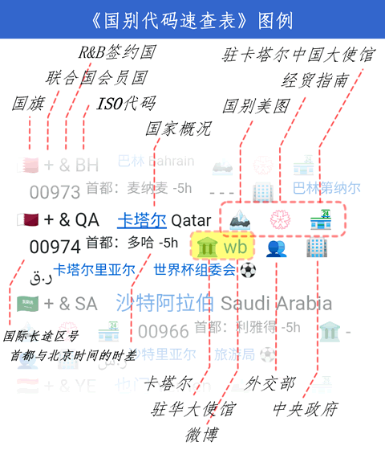

外交国别速查表 🗺
================
大萌	2022-2024	<base target="_blank">

		文明因交流而多彩，文明因互鉴而丰富。——习近平 20140327 于 UNESCO

　　本页面收录全世界249个国家或地区的外交信息与权威网址。外交信息包括：国别旗帜、ISO代码、UN席位、与中方建交年份、R&B签约、中英文名称、电信区号、<sup>首都、时差、主权货币符号与名称</sup>；权威网址包括：外交部的国家概况页、一带一路官网的国别美图页🏞、商务部的经贸指南页🧭、中外双方大使馆网址🏮🛡️、该国别外交部门👥与中央政府网址🏢；并提供必应搜索链接查询本币与人民币的汇率。

　　世界上应用最广泛的国别代码是**ISO 3166-1**标准的二位字母代码，比如：CN=China，US=America。因为ISO的工作语言(en/fr/ru)不包括中文，所以该标准内的国家或地区没有中文名称；与之对应的中国国标(GB/T 2659.1-2022)翻译了中文简称和全称，但是“由于涉及版权保护问题”，在国家标准[全文公开系统](https://openstd.samr.gov.cn/bzgk/gb/newGbInfo?hcno=FBCE39BE204B54F6F944092C209121F2)上“暂不提供”。　这两个原因造成中文用户在互联网上找不到清晰、权威的中文国别代码。

　　大萌因此编纂了这份《外交国别速查表》，简称‘国别表’，结合联合国与中国外交部的官方表述，拟定全表249个国家或地区的中文译名，以“[大规模集成网页](https://diamonwoo.github.io/LSIP/)(LSIP)”形式提供快速查找服务。收录国别按各大洲分段，大致沿丝绸之路行进路线由近及远排序，加权因素：国土面积、UN席位。详细图例与收录口径见页面底部。　网页收录网址超过1200个，信息密集，请善用浏览器页内搜索。

<div align="right">
⏩老生常谈/<a href="https://Laosheng.top/ydyl/dir" target="_top">【一带一路】</a>/世界国别速查表
</div>

<h2 id="mulu" title="世界国别速查表">目录</h2>
LSIP进度　<br>
<a href="#yz" target="_top">1-亚洲</a>🌏　<sub>中国、印度、沙特、土耳其……</sub><br>
<a href="#oz" target="_top">2-欧洲</a>　<sub>俄罗斯、法国、希腊、西班牙……</sub><br>
<a href="#fz" target="_top">3-非洲</a>🌍　<sub>埃及、摩洛哥、尼日利亚、南非……</sub><br>
<a href="#dyz" target="_top">4-大洋洲</a>　<sub>澳大利亚、汤加、新西兰……</sub><br>
<a href="#bmz" target="_top">5-北美洲</a>🌎　<sub>美国、墨西哥、巴拿马、古巴……</sub><br>
<a href="#nmz" target="_top">6-南美洲</a>　<sub>阿根廷、巴西、委内瑞拉……</sub><br>
<a href="#njz" target="_top">7-南极洲</a>　<sub> 布韦岛…</sub><br>
8 <a href="#8" target="_top">必应世界地图</a>　<sub>微软必应提供的世界地图</sub><br>
9 <a href="#9" target="_top">图例</a>　<sub>emoji图标说明</sub><br>
10 <a href="#10" target="_top">数据来源</a>　<sub>鸣谢、收录口径</sub><br>


<h2 id="0" title="LC=链接计数">国别表LSIP进度</h2>

		收录LC = 1452
		设计LC ≈ 1705　= 182×9 + (249-182)  （建交国约9个链接+未建交1个链接）
		完成率 ≈   85.2%

+	202402　正在更新，拟更新2024年复交国瑙鲁、拟新增对中方免签入境标记……
+	202402　‘世界国别速查表’更名为‘外交国别速查表’，简称不变，启用2024年新版图例。v0.8.1
+	202304　补充阿富汗/南苏丹/多哥/纽埃等11个一带一路签约国政府网址。v0.8.0
+	202303　修订洪都拉斯政府网址，仍有少量国别政府网址可能失效。
+	202302　收录ISO保留代码EU=欧盟，UN=联合国。调整国别顺序。
+	202212　标记2022世界杯32支球队所在国。
+	202212　收录全部249个国家和地区的emoji旗帜符号；
+	202209　增加商务部《经贸指南》，增加国际长途区号，正在补充各国使馆网址
+	202209　已收录215个国家货币符号，增加查询汇率连接，上线公开测试
+	202208　收录249个ISO代码及其国别中英文名称，正在测试版式


<h2 id="yz" title="yà zhōu">亚洲 Asia　d<a href="https://cn.bing.com/maps?&cp=p35v3cq48s20&lvl=4" title="限桌面模式">🌏</a></h2>

🇨🇳	+五常 ⠀⠀　⠀	CN	⠀[🏞](大美中国)	<big><big>	[中国](https://www.gov.cn/guoqing/)⠀China	</big></big>		⠀-	⠀[🏮](xx.china-embassy.gov.cn)	⠀[🛡](https://www.mfa.gov.cn/web/zwjg_674741/zwzlg_674757/)	⠀[wb](https://weibo.com/wjxlt)	⠀0086	⠀<sup>首都：北京</sup>	⠀[👥](https://www.mfa.gov.cn/web/wjb_673085/)	⠀[🏢](https://www.gov.cn)	⠀¥<sup>[人民币](https://cn.bing.com/search?q=CNY兑CNY)</sup>		⠀<sup>1949-10-01</sup>  
🇭🇰	　 ⠀⠀　⠀	HK	　	<small>	(中国)香港⠀Hong Kong	</small>	⠀-　	⠀[🧭 ](http://HK.mofcom.gov.cn)	⠀-	⠀-	⠀[wb](https://weibo.com/newsgovhk)	⠀00852	⠀-	⠀-	⠀[🏢](https://www.gov.hk/sc)	⠀$<sup>[港元](https://cn.bing.com/search?q=HKD兑CNY)</sup>		⠀<sup>☆</sup>  
🇲🇴	　 ⠀⠀　⠀	MO	　	<small>	(中国)澳门⠀Macao	</small>	⠀-　	⠀[🧭 ](http://MO.mofcom.gov.cn)	⠀-	⠀-	⠀[wb](https://weibo.com/6190786689)	⠀00853	⠀-	⠀-	⠀[🏢](https://www.gov.mo/zh-hant)	⠀P<sup>[澳门币](https://cn.bing.com/search?q=MOP兑CNY)</sup>		⠀<sup>☆</sup>  
🇹🇼	　 ⠀⠀　⠀	TW	　	<small>	(中国)台湾⠀Taiwan	</small>	⠀-　	⠀-	⠀-	⠀-	⠀-	⠀00886	⠀-	⠀-	⠀-	⠀$<sup>[新台币](https://cn.bing.com/search?q=TWD兑CNY)</sup>		⠀<sup>☆[台北市政府](https://www.gov.taipei)</sup>  
🇰🇵	+ ⠀⠀　⠀	KP	　		[朝鲜](https://www.mfa.gov.cn/web/gjhdq_676201/gj_676203/yz_676205/1206_676404/)⠀North Korea		1949/10/6	⠀[🧭 ](http://KP.mofcom.gov.cn)	⠀[🏮](http://KP.china-embassy.gov.cn)	⠀-	⠀-	⠀00850	⠀<sup>首都：平壤（Pyongyang）</sup>	⠀-	⠀[🏢](http://naenara.com.kp)	⠀₩<sup>[朝鲜圆](https://cn.bing.com/search?q=KPW兑CNY)</sup>		⠀<sup>📍 [友谊协会](https://korea-dpr.com/)</sup>  
🇰🇷	+ &⠀⬇️⠀	KR	⠀[🏞](/2108.htm)		[韩国](https://www.mfa.gov.cn/web/gjhdq_676201/gj_676203/yz_676205/1206_676524/)⠀South Korea		1992/8/24	⠀[🧭 ](http://KR.mofcom.gov.cn)	⠀[🏮](http://KR.china-embassy.gov.cn)	⠀[🛡](https://overseas.mofa.go.kr/cn-zh/index.do)	⠀[wb](https://weibo.com/embassykr)	⠀0082	⠀<sup>首都：首尔（Seoul）</sup>	⠀[👥](https://www.mofa.go.kr/eng/index.do)	⠀[🏢](https://www.president.go.kr)	⠀₩<sup>[韩圆](https://cn.bing.com/search?q=KRW兑CNY)</sup>		⠀<sup>⚽</sup>  
🇯🇵	+ ⠀⠀　⠀	JP	　		[日本](https://www.mfa.gov.cn/web/gjhdq_676201/gj_676203/yz_676205/1206_676836/)⠀Japan		1972/9/29	⠀[🧭 ](http://JP.mofcom.gov.cn)	⠀[🏮](http://JP.china-embassy.gov.cn)	⠀[🛡](https://www.cn.emb-japan.go.jp/itprtop_zh/)	⠀[wb](https://weibo.com/japanembassy)	⠀0081	⠀<sup>首都：东京</sup>	⠀[👥](https://www.mofa.go.jp/)	⠀[🏢](https://www.kantei.go.jp)	⠀¥<sup>[日元](https://cn.bing.com/search?q=JPY兑CNY)</sup>		⠀<sup>📍 ⚽</sup>  
🇵🇭	+ &⠀　⠀	PH	⠀[🏞](/10046.htm)		[菲律宾](https://www.mfa.gov.cn/web/gjhdq_676201/gj_676203/yz_676205/1206_676452/)⠀Philippines		1975/6/9	⠀[🧭 ](http://PH.mofcom.gov.cn)	⠀[🏮](http://PH.china-embassy.gov.cn)	⠀[🛡](https://beijingpe.dfa.gov.ph/)	⠀-	⠀0063	⠀<sup>首都：马尼拉</sup>	⠀[👥](https://dfa.gov.ph/)	⠀[🏢](https://www.gov.ph/)	⠀₱<sup>[菲律宾比索](https://cn.bing.com/search?q=PHP兑CNY)</sup>		⠀<sup>[旅游局wb](https://weibo.com/dotshanghai)</sup>  
🇧🇳	+ &⠀↙⠀	BN	⠀[🏞](/10141.htm)	<sup>	[文莱](https://www.mfa.gov.cn/web/gjhdq_676201/gj_676203/yz_676205/1206_677004/)⠀Brunei	</sup>	1991/9/30	⠀[🧭 ](http://BN.mofcom.gov.cn)	⠀[🏮](http://BN.china-embassy.gov.cn)	⠀-	⠀-	⠀00673	⠀<sup>首都：斯里巴加湾</sup>	⠀-	⠀[🏢](http://www.jpm.gov.bn)	⠀$<sup>[文莱元](https://cn.bing.com/search?q=BND兑CNY)</sup>		  
🇲🇾	+ &⠀🔄⠀	MY	⠀[🏞](/2103.htm)		[马来西亚](https://www.mfa.gov.cn/web/gjhdq_676201/gj_676203/yz_676205/1206_676716/)⠀Malaysia		1974/5/31	⠀[🧭 ](http://MY.mofcom.gov.cn)	⠀[🏮](http://MY.china-embassy.gov.cn)	⠀[🛡](https://www.kln.gov.my/web/chn_beijing)	⠀-	⠀0060	⠀<sup>首都：吉隆坡</sup>	⠀[👥](https://www.kln.gov.my/)	⠀[🏢](https://www.malaysia.gov.my/)	⠀RM<sup>[马来西亚令吉](https://cn.bing.com/search?q=MYR兑CNY)</sup>		⠀<sup>[旅游局](https://weibo.com/tourismmalaysia)</sup>  
🇸🇬	+ &⠀🔄⠀	SG	⠀[🏞](/10131.htm)	<sup>	[新加坡](https://www.mfa.gov.cn/web/gjhdq_676201/gj_676203/yz_676205/1206_677076/)⠀Singapore	</sup>	1990/10/3	⠀[🧭 ](http://SG.mofcom.gov.cn)	⠀[🏮](http://SG.china-embassy.gov.cn)	⠀[🛡](https://www.mfa.gov.sg/beijing-chinese)	⠀[wb](https://weibo.com/xinjiapodashi)	⠀0065	⠀<sup>首都：新加坡</sup>	⠀[👥](https://www.mfa.gov.sg/)	⠀[🏢](https://www.gov.sg)	⠀$<sup>[新加坡元](https://cn.bing.com/search?q=SGD兑CNY)</sup>		⠀<sup>[孙燕姿wb](https://weibo.com/sunyanzi)</sup>  
🇮🇩	+ &⠀↙⠀	ID	⠀[🏞](/10009.htm)	<big>	[印度尼西亚](https://www.mfa.gov.cn/web/gjhdq_676201/gj_676203/yz_676205/1206_677244/)⠀Indonesia	</big>	1950/4/13	⠀[🧭 ](http://ID.mofcom.gov.cn)	⠀[🏮](http://ID.china-embassy.gov.cn)	⠀[🛡](https://kemlu.go.id/beijing/lc)	⠀[wb](https://weibo.com/indonesiagz)	⠀0062	⠀<sup>首都：雅加达</sup>	⠀[👥](https://kemlu.go.id/portal/en)	⠀[🏢](http://www.indonesia.go.id)	⠀Rp<sup>[印度尼西亚卢比](https://cn.bing.com/search?q=IDR兑CNY)</sup>		  
🇹🇱	+ &⠀↙⠀	TL	⠀[🏞](/10143.htm)	<small>	[东帝汶](https://www.mfa.gov.cn/web/gjhdq_676201/gj_676203/yz_676205/1206_676428/)⠀Timor-Leste	</small>	2002/5/20	⠀[🧭 ](http://TL.mofcom.gov.cn)	⠀[🏮](http://TL.china-embassy.gov.cn)	⠀[🛡](http://embtimorleste-beijing.com/embassy_cn.aspx)	⠀-	⠀00670	⠀<sup>首都：帝力</sup>	⠀-	⠀[🏢](http://timor-leste.gov.tl/)	⠀$<sup>[美元](https://cn.bing.com/search?q=USD兑CNY)</sup>	💵	  
🇨🇽	　 ⠀⠀　⠀	CX	　	<small>	(澳属)圣诞岛⠀Christmas Island	</small>	⠀-　	⠀-	⠀-	⠀-	⠀-	⠀0061	⠀<sup>首都：飞鱼湾</sup>	⠀-	⠀-	⠀-		  
🇨🇨	　 ⠀⠀　⠀	CC	　	<small>	(澳属)科科斯群岛⠀Cocos Islands	</small>	⠀-　	⠀-	⠀-	⠀-	⠀-	⠀0061	⠀<sup>首都：西岛</sup>	⠀-	⠀[🏢](https://shire.cc/en/)	⠀-		  
🇻🇳	+ &⠀⬇️⠀	VN	⠀[🏞](/10041.htm)		[越南](https://www.mfa.gov.cn/web/gjhdq_676201/gj_676203/yz_676205/1206_677292/)⠀Vietnam		1950/1/18	⠀[🧭 ](http://VN.mofcom.gov.cn)	⠀[🏮](http://VN.china-embassy.gov.cn)	⠀[🛡](https://www.mofa.gov.vn/vnemb.china/zh)	⠀-	⠀0084	⠀<sup>首都：河内</sup>	⠀[👥](https://www.mofa.gov.vn/en)	⠀[🏢](http://www.chinhphu.vn)	⠀₫<sup>[越南盾](https://cn.bing.com/search?q=VND兑CNY)</sup>		⠀<sup>[今日越南](https://weibo.com/alibaba0579)</sup>  
🇱🇦	+ &⠀↙⠀	LA	⠀[🏞](/2157.htm)		[老挝](https://www.mfa.gov.cn/web/gjhdq_676201/gj_676203/yz_676205/1206_676644/)⠀Laos		1961/4/25	⠀[🧭 ](http://LA.mofcom.gov.cn)	⠀[🏮](http://LA.china-embassy.gov.cn)	⠀[🛡](http://www.mofa.gov.la/index.php/the-ministry/2256-2015-06-19-08-28-34)	⠀-	⠀00856	⠀<sup>首都：万象</sup>	⠀[👥](http://www.mofa.gov.la/)	⠀[🏢](http://www.laogov.gov.la/)	⠀₭<sup>[老挝基普](https://cn.bing.com/search?q=LAK兑CNY)</sup>		⠀<sup>[旅游局](https://www.tourismlaos.org/)</sup>  
🇰🇭	+ &⠀↙⠀	KH	⠀[🏞](/1886.htm)		[柬埔寨](https://www.mfa.gov.cn/web/gjhdq_676201/gj_676203/yz_676205/1206_676572/)⠀Cambodia		1958/7/19	⠀[🧭 ](http://KH.mofcom.gov.cn)	⠀[🏮](http://KH.china-embassy.gov.cn)	⠀-	⠀-	⠀00855	⠀<sup>首都：金边</sup>	⠀-	⠀[🏢](http://www.mfaic.gov.kh)	⠀៛<sup>[柬埔寨瑞尔](https://cn.bing.com/search?q=KHR兑CNY)</sup>		  
🇹🇯	+ &⠀🔄⠀	TH	⠀[🏞](/10039.htm)		[泰国](https://www.mfa.gov.cn/web/gjhdq_676201/gj_676203/yz_676205/1206_676932/)⠀Thailand		1975/7/1	⠀[🧭 ](http://TH.mofcom.gov.cn)	⠀[🏮](http://TH.china-embassy.gov.cn)	⠀[🛡](https://thaiembbeij.org/cn/)	⠀[wb](https://weibo.com/thaiembassybj)	⠀0066	⠀<sup>首都：曼谷</sup>	⠀-	⠀[🏢](http://www.thaigov.go.th)	⠀฿<sup>[泰铢](https://cn.bing.com/search?q=THB兑CNY)</sup>		  
🇲🇲	+ &⠀　⠀	MM	⠀[🏞](/10060.htm)		[缅甸](https://www.mfa.gov.cn/web/gjhdq_676201/gj_676203/yz_676205/1206_676788/)⠀Myanmar		1950/6/8	⠀[🧭 ](http://MM.mofcom.gov.cn)	⠀[🏮](http://MM.china-embassy.gov.cn)	⠀[🛡](http://www.myanmarembassy.com/Ch_index.html)	⠀-	⠀0095	⠀<sup>首都：内比都</sup>	⠀[👥](https://www.mofa.gov.mm/)	⠀[🏢](https://myanmar.gov.mm/)	⠀Ks<sup>[缅元](https://cn.bing.com/search?q=MMK兑CNY)</sup>		⠀<sup>[中方驻缅](https://weibo.com/chinaembinmyanmar)</sup>  
🇧🇹	+ ⠀⠀　⠀	BT	⠀[🏞](/10148.htm)	<small>	[不丹](https://www.mfa.gov.cn/web/gjhdq_676201/gj_676203/yz_676205/1206_676380/)⠀Bhutan	</small>	⠀-　	⠀-	⠀-	⠀-	⠀-	⠀00975	⠀<sup>首都：廷布（Thimphu）</sup>	⠀-	⠀[🏢](http://www.bhutan.gov.bt)	⠀<sup>[努尔特鲁姆](https://cn.bing.com/search?q=BTN兑CNY)</sup>		  
🇳🇵	+ &⠀↙⠀	NP	⠀[🏞](/1924.htm)		[尼泊尔](https://www.mfa.gov.cn/web/gjhdq_676201/gj_676203/yz_676205/1206_676812/)⠀Nepal		1955/8/1	⠀[🧭 ](http://NP.mofcom.gov.cn)	⠀[🏮](http://NP.china-embassy.gov.cn)	⠀[🛡](https://cn.nepalembassy.gov.np/zh/)	⠀-	⠀00977	⠀<sup>首都：加德满都</sup>	⠀[👥](https://nepalpassport.gov.np/)	⠀[🏢](https://nepal.gov.np/)	⠀रू<sup>[尼泊尔卢比](https://cn.bing.com/search?q=NPR兑CNY)</sup>		  
🇧🇩	+ &⠀↙⠀	BD	⠀[🏞](/1873.htm)		[孟加拉国](https://www.mfa.gov.cn/web/gjhdq_676201/gj_676203/yz_676205/1206_676764/)⠀Bangladesh		1975/10/4	⠀[🧭 ](http://BD.mofcom.gov.cn)	⠀[🏮](http://BD.china-embassy.gov.cn)	⠀-	⠀-	⠀00880	⠀<sup>首都：达卡</sup>	⠀[👥](http://www.mofa.gov.bd/)	⠀[🏢](https://bangladesh.gov.bd/)	⠀<sup>[孟加拉塔卡](https://cn.bing.com/search?q=BDT兑CNY)</sup>		  
🇮🇳	+ ⠀⠀　⠀	IN	　	<big>	[印度](https://www.mfa.gov.cn/web/gjhdq_676201/gj_676203/yz_676205/1206_677220/)⠀India	</big>	1950/4/1	⠀[🧭 ](http://IN.mofcom.gov.cn)	⠀[🏮](http://IN.china-embassy.gov.cn)	⠀[🛡](https://www.eoibeijing.gov.in/)	⠀[wb](https://weibo.com/indianembassy)	⠀0091	⠀<sup>首都：新德里</sup>	⠀[👥](https://www.mea.gov.in/)	⠀[🏢](https://www.mygov.in/)	⠀₹<sup>[印度卢比](https://cn.bing.com/search?q=INR兑CNY)</sup>		  
🇱🇰	+ &⠀　⠀	LK	⠀[🏞](/2072.htm)	<small>	[斯里兰卡](https://www.mfa.gov.cn/web/gjhdq_676201/gj_676203/yz_676205/1206_676884/)⠀Sri Lanka	</small>	1957/2/7	⠀[🧭 ](http://LK.mofcom.gov.cn)	⠀[🏮](http://LK.china-embassy.gov.cn)	⠀[🛡](https://www.beijing.embassy.gov.lk/cn)	⠀[wb](https://weibo.com/srilankacggz)	⠀0094	⠀<sup>首都：科伦坡（Colombo）</sup>	⠀-	⠀[🏢](https://www.gov.lk/)	⠀Rs<sup>[斯里兰卡卢比](https://cn.bing.com/search?q=LKR兑CNY)</sup>		  
🇲🇻	+ &⠀🔄⠀	MV	⠀[🏞](/2100.htm)	<sup>	[马尔代夫](https://www.mfa.gov.cn/web/gjhdq_676201/gj_676203/yz_676205/1206_676692/)⠀Maldives	</sup>	1972/10/14	⠀[🧭 ](http://MV.mofcom.gov.cn)	⠀[🏮](http://MV.china-embassy.gov.cn)	⠀-	⠀-	⠀00960	⠀<sup>首都：马利</sup>	⠀-	⠀[🏢](http://www.maldivesinfo.gov.mv)	⠀.ރ<sup>[拉菲亚](https://cn.bing.com/search?q=MVR兑CNY)</sup>		  
🇲🇳	+ &⠀　⠀	MN	⠀[🏞](/1380.htm)	<big>	[蒙古](https://www.mfa.gov.cn/web/gjhdq_676201/gj_676203/yz_676205/1206_676740/)⠀Mongolia	</big>	1949/10/16	⠀[🧭 ](http://MN.mofcom.gov.cn)	⠀[🏮](http://MN.china-embassy.gov.cn)	⠀[🛡](https://beijing.embassy.mn/chn/)	⠀[wb](https://weibo.com/7567719354)	⠀00976	⠀<sup>首都：乌兰巴托</sup>	⠀[👥](https://mfa.gov.mn/en/)	⠀[🏢](http://www.pmis.gov.mn)	⠀₮<sup>[图格里克](https://cn.bing.com/search?q=MNT兑CNY)</sup>		⠀<sup>[中蒙博览会](https://weibo.com/u/6334167491)</sup>  
🇰🇿	+ &⠀🔄⠀	KZ	⠀[🏞](/1600.htm)	<big>	[哈萨克斯坦](https://www.mfa.gov.cn/web/gjhdq_676201/gj_676203/yz_676205/1206_676500/)⠀Kazakhstan	</big>	1992/1/3	⠀[🧭 ](http://KZ.mofcom.gov.cn)	⠀[🏮](http://KZ.china-embassy.gov.cn)	⠀[🛡](https://www.gov.kz/memleket/entities/mfa-beijing?lang=zh)	⠀[wb](https://weibo.com/kazembassy)	⠀00997／0076	⠀<sup>首都：努尔苏丹</sup>	⠀[👥](https://www.gov.kz/memleket/entities/mfa?lang=en)	⠀[🏢](https://www.gov.kz/)	⠀<sup>[哈萨克斯坦坚戈](https://cn.bing.com/search?q=KZT兑CNY)</sup>		⠀<sup>[哈通社](https://weibo.com/informkz) [今日丝路](https://weibo.com/7415670580)</sup>  
🇰🇬	+ &⠀　⠀	KG	⠀[🏞](/1978.htm)		[吉尔吉斯斯坦](https://www.mfa.gov.cn/web/gjhdq_676201/gj_676203/yz_676205/1206_676548/)⠀Kyrgyzstan		1992/1/5	⠀[🧭 ](http://KG.mofcom.gov.cn)	⠀[🏮](http://KG.china-embassy.gov.cn)	⠀[🛡](https://mfa.gov.kg/en/embassies/all)	⠀-	⠀00996	⠀<sup>首都：比什凯克</sup>	⠀[👥](https://mfa.gov.kg/en)	⠀[🏢](https://www.gov.kg/ky)	⠀с<sup>[吉尔吉斯斯坦索姆](https://cn.bing.com/search?q=KGS兑CNY)</sup>		⠀<sup>驻华使馆网址过长</sup>  
🇹🇯	+ &⠀　⠀	TJ	⠀[🏞](/2321.htm)		[塔吉克斯坦](https://www.mfa.gov.cn/web/gjhdq_676201/gj_676203/yz_676205/1206_676908/)⠀Tajikistan		1992/1/4	⠀[🧭 ](http://TJ.mofcom.gov.cn)	⠀[🏮](http://TJ.china-embassy.gov.cn)	⠀[🛡](https://tajikembassychina.org/zh/)	⠀-	⠀00992	⠀<sup>首都：杜尚别</sup>	⠀[👥](https://mfa.tj/en/main)	⠀[🏢](https://www.parlament.tj/)	⠀ЅМ<sup>[索莫尼](https://cn.bing.com/search?q=TJS兑CNY)</sup>		⠀<sup>[总统](http://president.tj/)</sup>  
🇺🇿	+ &⠀⬇️⠀	UZ	⠀[🏞](/2007.htm)		[乌兹别克斯坦](https://www.mfa.gov.cn/web/gjhdq_676201/gj_676203/yz_676205/1206_677052/)⠀Uzbekistan		1992/1/2	⠀[🧭 ](http://UZ.mofcom.gov.cn)	⠀[🏮](http://UZ.china-embassy.gov.cn)	⠀-	⠀-	⠀00998	⠀<sup>首都：塔什干</sup>	⠀[👥](https://mfa.uz/en)	⠀[🏢](https://www.gov.uz/)	⠀so'm<sup>[乌兹别克斯坦索姆](https://cn.bing.com/search?q=UZS兑CNY)</sup>		  
🇹🇲	+ &⠀↙⠀	TM	⠀[🏞](/10147.htm)		[土库曼斯坦](https://www.mfa.gov.cn/web/gjhdq_676201/gj_676203/yz_676205/1206_676980/)⠀Turkmenistan		1992/1/6	⠀[🧭 ](http://TM.mofcom.gov.cn)	⠀[🏮](http://TM.china-embassy.gov.cn)	⠀[🛡](https://china.tmembassy.gov.tm/zh)	⠀-	⠀00993	⠀<sup>首都：阿什哈巴德</sup>	⠀-	⠀[🏢](http://www.turkmenistan.gov.tm)	⠀m<sup>[土库曼斯坦马纳特](https://cn.bing.com/search?q=TMT兑CNY)</sup>		⠀<sup>#[外交部网站](https://www.mfa.gov.tm/)疑似受限</sup>  
🇦🇫	+ &⠀　⠀	AF	⠀[🏞](/2112.htm)		[阿富汗](https://www.mfa.gov.cn/web/gjhdq_676201/gj_676203/yz_676205/1206_676207/)⠀Afghanistan		1955/1/20	⠀[🧭 ](http://AF.mofcom.gov.cn)	⠀[🏮](http://AF.china-embassy.gov.cn)	⠀-	⠀-	⠀0093	⠀<sup>首都：喀布尔/Kabul</sup>	⠀-	⠀[🏢](https://www.alemarah.af)	⠀<sup>[阿富汗尼](https://cn.bing.com/search?q=AFN兑CNY)</sup>		⠀<sup>[English](https://www.alemarahenglish.af)</sup>  
🇵🇰	+ &⠀　⠀	PK	⠀[🏞](/10146.htm)		[巴基斯坦](https://www.mfa.gov.cn/web/gjhdq_676201/gj_676203/yz_676205/1206_676308/)⠀Pakistan		1951/5/21	⠀[🧭 ](http://PK.mofcom.gov.cn)	⠀[🏮](http://PK.china-embassy.gov.cn)	⠀[🛡](http://www.pakbj.org/html/cn/)	⠀[wb](https://weibo.com/7512012640)	⠀0092	⠀<sup>首都：伊斯兰堡</sup>	⠀[👥](https://mofa.gov.pk/)	⠀[🏢](https://pakistan.gov.pk/)	⠀₨<sup>[巴基斯坦卢比](https://cn.bing.com/search?q=PKR兑CNY)</sup>		  
🇮🇷	+ &⠀⬇️⠀	IR	⠀[🏞](/2158.htm)	<big>	[伊朗](https://www.mfa.gov.cn/web/gjhdq_676201/gj_676203/yz_676205/1206_677172/)⠀Iran	</big>	1971/8/16	⠀[🧭 ](http://IR.mofcom.gov.cn)	⠀[🏮](http://IR.china-embassy.gov.cn)	⠀[🛡](https://china.mfa.gov.ir/zh/)	⠀[wb](https://weibo.com/2312751365)	⠀0098	⠀<sup>首都：德黑兰</sup>	⠀[👥](https://en.mfa.gov.ir/)	⠀[🏢](https://irangov.ir/)	⠀<sup>[伊朗里亚尔](https://cn.bing.com/search?q=IRR兑CNY)</sup>		⠀<sup>最高领袖哈梅内伊 [总统](https://www.president.ir/) ⚽</sup>  
🇮🇶	+ &⠀↙⠀	IQ	⠀[🏞](/2164.htm)		[伊拉克](https://www.mfa.gov.cn/web/gjhdq_676201/gj_676203/yz_676205/1206_677148/)⠀Iraq		1958/8/25	⠀[🧭 ](http://IQ.mofcom.gov.cn)	⠀[🏮](http://IQ.china-embassy.gov.cn)	⠀-	⠀-	⠀00964	⠀<sup>首都：巴格达</sup>	⠀[👥](https://mofa.gov.iq/en/)	⠀[🏢](https://gds.gov.iq/)	⠀<sup>[伊拉克第纳尔](https://cn.bing.com/search?q=IQD兑CNY)</sup>		  
🇰🇼	+ &⠀　⠀	KW	⠀[🏞](/2111.htm)	<small>	[科威特](https://www.mfa.gov.cn/web/gjhdq_676201/gj_676203/yz_676205/1206_676620/)⠀Kuwait	</small>	1971/3/22	⠀[🧭 ](http://KW.mofcom.gov.cn)	⠀[🏮](http://KW.china-embassy.gov.cn)	⠀-	⠀-	⠀00965	⠀<sup>首都：科威特城</sup>	⠀[👥](https://www.mofa.gov.kw/en/)	⠀[🏢](https://www.e.gov.kw/)	⠀د.ك<sup>[科威特第纳尔](https://cn.bing.com/search?q=KWD兑CNY)</sup>		  
🇸🇦	+ &⠀↙⠀	SA	⠀[🏞](/2160.htm)	<big>	[沙特阿拉伯](https://www.mfa.gov.cn/web/gjhdq_676201/gj_676203/yz_676205/1206_676860/)⠀Saudi Arabia	</big>	1990/7/21	⠀[🧭 ](http://SA.mofcom.gov.cn)	⠀[🏮](http://SA.china-embassy.gov.cn)	⠀[🛡](https://saudiembassy.net/)	⠀-	⠀00966	⠀<sup>首都：利雅得</sup>	⠀[👥](https://www.mofa.gov.sa/en/)	⠀[🏢](https://dga.gov.sa/)	⠀ر.س<sup>[沙特里亚尔](https://cn.bing.com/search?q=SAR兑CNY)</sup>		⠀<sup>[旅游局](https://weibo.com/7731973660) ⚽</sup>  
🇧🇭	+ &⠀↙⠀	BH	⠀[🏞](/10168.htm)	<sup>	[巴林](https://www.mfa.gov.cn/web/gjhdq_676201/gj_676203/yz_676205/1206_676356/)⠀Bahrain	</sup>	1989/4/18	⠀[🧭 ](http://BH.mofcom.gov.cn)	⠀[🏮](http://BH.china-embassy.gov.cn)	⠀-	⠀-	⠀00973	⠀<sup>首都：麦纳麦</sup>	⠀-	⠀[🏢](http://www.bahrain.gov.bh)	⠀<sup>[巴林第纳尔](https://cn.bing.com/search?q=BHD兑CNY)</sup>		  
🇶🇦	+ &⠀🔄⠀	QA	⠀[🏞](/2110.htm)	<small>	[卡塔尔](https://www.mfa.gov.cn/web/gjhdq_676201/gj_676203/yz_676205/1206_676596/)⠀Qatar	</small>	1988/7/9	⠀[🧭 ](http://QA.mofcom.gov.cn)	⠀[🏮](http://QA.china-embassy.gov.cn)	⠀[🛡](https://beijing.embassy.qa/en/)	⠀[wb](https://weibo.com/7480960163)	⠀00974	⠀<sup>首都：多哈</sup>	⠀[👥](https://www.mofa.gov.qa/en/)	⠀[🏢](https://hukoomi.gov.qa/)	⠀ر.ق<sup>[卡塔尔里亚尔](https://cn.bing.com/search?q=QAR兑CNY)</sup>		⠀<sup>[世界杯组委会](https://weibo.com/Roadto2022) ⚽</sup>  
🇦🇪	+ &⠀🔄⠀	AE	⠀[🏞](/10149.htm)	<small>	[阿联酋](https://www.mfa.gov.cn/web/gjhdq_676201/gj_676203/yz_676205/1206_676234/)⠀UAE	</small>	1984/11/1	⠀[🧭 ](http://AE.mofcom.gov.cn)	⠀[🏮](http://AE.china-embassy.gov.cn)	⠀[🛡](https://www.mofaic.gov.ae/zh-cn/missions/beijing)	⠀[wb](https://weibo.com/6969158398)	⠀00971	⠀<sup>首都：阿布扎比/Abu Dhabi</sup>	⠀[👥](https://www.moec.gov.ae/en/home)	⠀[🏢](https://u.ae/en)	⠀د.إ<sup>[阿联酋迪拉姆](https://cn.bing.com/search?q=AED兑CNY)</sup>		  
🇴🇲	+ &⠀⬇️⠀	OM	⠀[🏞](/10150.htm)		[阿曼](https://www.mfa.gov.cn/web/gjhdq_676201/gj_676203/yz_676205/1206_676259/)⠀Oman		1978/5/25	⠀[🧭 ](http://OM.mofcom.gov.cn)	⠀[🏮](http://OM.china-embassy.gov.cn)	⠀[🛡](https://fm.gov.om/beijing/)	⠀-	⠀00968	⠀<sup>首都：马斯开特</sup>	⠀[👥](https://fm.gov.om/)	⠀[🏢](http://www.omanet.om)	⠀ر.ع.<sup>[阿曼里亚尔](https://cn.bing.com/search?q=OMR兑CNY)</sup>		  
🇾🇪	+ &⠀　⠀	YE	⠀[🏞](/10161.htm)		[也门](https://www.mfa.gov.cn/web/gjhdq_676201/gj_676203/yz_676205/1206_677124/)⠀Yemen		1956/9/24	⠀[🧭 ](http://YE.mofcom.gov.cn)	⠀[🏮](http://YE.china-embassy.gov.cn)	⠀[🛡](https://yemenembassy.cn/zh-hans/)	⠀-	⠀00967	⠀<sup>首都：萨那</sup>	⠀[👥](https://www.mofa-ye.org/)	⠀[🏢](http://www.yemeninfo.gov.ye)	⠀ر.ي<sup>[也门里亚尔](https://cn.bing.com/search?q=YER兑CNY)</sup>		  
🇦🇿	+ &⠀↙⠀	AZ	⠀[🏞](/2116.htm)	<small>	[阿塞拜疆](https://www.mfa.gov.cn/web/gjhdq_676201/gj_676203/yz_676205/1206_676284/)⠀Azerbaijan	</small>	1992/4/2	⠀[🧭 ](http://AZ.mofcom.gov.cn)	⠀[🏮](http://AZ.china-embassy.gov.cn)	⠀[🛡](https://beijing.mfa.gov.az/en)	⠀-	⠀00994	⠀<sup>首都：巴库</sup>	⠀-	⠀[🏢](https://azerbaijan.az/en)	⠀<sup>[阿塞拜疆马纳特](https://cn.bing.com/search?q=AZN兑CNY)</sup>		⠀<sup>[总统府](http://www.president.az)</sup>  
🇦🇲	+ &⠀🔄⠀	AM	⠀[🏞](/1911.htm)	<small>	[亚美尼亚](https://www.mfa.gov.cn/web/gjhdq_676201/gj_676203/yz_676205/1206_677028/)⠀Armenia	</small>	1992/4/6	⠀[🧭 ](http://AM.mofcom.gov.cn)	⠀[🏮](http://AM.china-embassy.gov.cn)	⠀[🛡](https://china.mfa.am/en)	⠀-	⠀00374	⠀<sup>首都：埃里温</sup>	⠀[👥](https://www.mfa.am/en)	⠀[🏢](https://www.gov.am/am/)	⠀<sup>[亚美尼亚德拉姆](https://cn.bing.com/search?q=AMD兑CNY)</sup>		  
🇬🇪	+ &⠀⬇️⠀	GE	⠀[🏞](/1889.htm)	<small>	[格鲁吉亚](https://www.mfa.gov.cn/web/gjhdq_676201/gj_676203/yz_676205/1206_676476/)⠀Georgia	</small>	1992/6/9	⠀[🧭 ](http://GE.mofcom.gov.cn)	⠀[🏮](http://GE.china-embassy.gov.cn)	⠀-	⠀-	⠀00995	⠀<sup>首都：第比利斯</sup>	⠀-	⠀[🏢](http://www.georgia.gov)	⠀<sup>[格鲁吉亚拉里](https://cn.bing.com/search?q=GEL兑CNY)</sup>		  
🇹🇷	+ &⠀　⠀	TR	⠀[🏞](/1763.htm)		[土耳其](https://www.mfa.gov.cn/web/gjhdq_676201/gj_676203/yz_676205/1206_676956/)⠀Turkey		1971/8/4	⠀[🧭 ](http://TR.mofcom.gov.cn)	⠀[🏮](http://TR.china-embassy.gov.cn)	⠀[🛡](http://pekin.be.mfa.gov.tr/)	⠀[wb](https://weibo.com/6430733485)	⠀0090	⠀<sup>首都：安卡拉</sup>	⠀[👥](https://www.mfa.gov.tr/default.zh.mfa)	⠀[🏢](http://www.byegm.gov.tr)	⠀₺<sup>[土耳其里拉](https://cn.bing.com/search?q=TRY兑CNY)</sup>		  
🇸🇾	+ &⠀↙⠀	SY	⠀[🏞](/10118.htm)		[叙利亚](https://www.mfa.gov.cn/web/gjhdq_676201/gj_676203/yz_676205/1206_677100/)⠀Syria		1956/8/1	⠀[🧭 ](http://SY.mofcom.gov.cn)	⠀[🏮](http://SY.china-embassy.gov.cn)	⠀[🛡](http://syrembassy.cn/cn/)	⠀-	⠀00963	⠀<sup>首都：大马士革</sup>	⠀-	⠀[🏢](https://www.egov.sy/)	⠀£<sup>[叙利亚镑](https://cn.bing.com/search?q=SYP兑CNY)</sup>		⠀<sup>💥</sup>  
🇱🇧	+ &⠀↙⠀	LB	⠀[🏞](/10156.htm)	<small>	[黎巴嫩](https://www.mfa.gov.cn/web/gjhdq_676201/gj_676203/yz_676205/1206_676668/)⠀Lebanon	</small>	1971/11/9	⠀[🧭 ](http://LB.mofcom.gov.cn)	⠀[🏮](http://LB.china-embassy.gov.cn)	⠀-	⠀-	⠀00961	⠀<sup>首都：贝鲁特</sup>	⠀-	⠀[🏢](http://www.lp.gov.lb)	⠀ل.ل<sup>[黎巴嫩镑](https://cn.bing.com/search?q=LBP兑CNY)</sup>		  
🇮🇱	+ ⠀⠀　⠀	IL	⠀[🏞](/9977.htm)	<small>	[以色列](https://www.mfa.gov.cn/web/gjhdq_676201/gj_676203/yz_676205/1206_677196/)⠀Israel	</small>	1992/1/24	⠀[🧭 ](http://IL.mofcom.gov.cn)	⠀[🏮](http://IL.china-embassy.gov.cn)	⠀[🛡](https://embassies.gov.il/beijing/)	⠀[wb](https://weibo.com/israelembassy)	⠀00972	⠀<sup>首都：耶路撒冷</sup>	⠀[👥](https://www.gov.il/en/departments/ministry_of_foreign_affairs)	⠀[🏢](https://www.gov.il/)	⠀<sup>[新谢克尔](https://cn.bing.com/search?q=ILS兑CNY)</sup>		⠀<sup>微博粉丝过200万</sup>  
🇵🇸	% &⠀　⠀	PS	⠀[🏞](/10153.htm)	<sup>	[巴勒斯坦](https://www.mfa.gov.cn/web/gjhdq_676201/gj_676203/yz_676205/1206_676332/)⠀Palestine	</sup>	1988/11/20	⠀-	⠀[🏮](http://ps.china-office.gov.cn)	⠀-	⠀[wb](https://weibo.com/palembassy)	⠀00970	⠀<sup>首都：耶路撒冷</sup>	⠀-	⠀[🏢](http://www.gcc.gov.ps)	⠀د.ا<sup>[约旦第纳尔](https://cn.bing.com/search?q=JOD兑CNY)</sup>		⠀<sup>wb于2012年停更</sup>  
🇯🇴	+ &⠀↙⠀	JO	⠀[🏞](/10157.htm)	<small>	[约旦](https://www.mfa.gov.cn/web/gjhdq_676201/gj_676203/yz_676205/1206_677268/)⠀Jordan	</small>	1977/4/7	⠀[🧭 ](http://JO.mofcom.gov.cn)	⠀[🏮](http://JO.china-embassy.gov.cn)	⠀[🛡](https://mfa.gov.jo/zh/embassy/BeijingZh)	⠀-	⠀00962	⠀<sup>首都：安曼</sup>	⠀[👥](https://mfa.gov.jo/)	⠀[🏢](https://portal.jordan.gov.jo/)	⠀<sup>[约旦第纳尔](https://cn.bing.com/search?q=JOD兑CNY)</sup>		  

<h2 id="oz" title="ōu zhōu">欧洲 Europe　<a href="http://www.gditu.net/" title="谷地图">🌍</a></h2>

🇷🇺	+五常 &⠀　⠀	RU	⠀[🏞](/1782.htm)	<big><big>	[俄罗斯](https://www.mfa.gov.cn/web/gjhdq_676201/gj_676203/oz_678770/1206_679110/)⠀Russia	</big></big>	1949/10/2	⠀[🧭 ](http://RU.mofcom.gov.cn)	⠀[🏮](http://RU.china-embassy.gov.cn)	⠀[🛡](http://www.russchinatrade.ru)	⠀[wb](https://weibo.com/ezhuhua)	⠀007	⠀<sup>首都：莫斯科（Москва）</sup>	⠀[👥](https://mid.ru/cn/)	⠀[🏢](http://government.ru)	⠀₽<sup>[俄罗斯卢布](https://cn.bing.com/search?q=RUB兑CNY)</sup>		  
🇪🇪	+ &⠀　⠀	EE	⠀[🏞](/10132.htm)	<small>	[爱沙尼亚](https://www.mfa.gov.cn/web/gjhdq_676201/gj_676203/oz_678770/1206_678820/)⠀Estonia	</small>	1991/9/11	⠀[🧭 ](http://EE.mofcom.gov.cn)	⠀[🏮](http://EE.china-embassy.gov.cn)	⠀[🛡](https://beijing.mfa.ee/zh-hans/)	⠀-	⠀00372	⠀<sup>首都：塔林</sup>	⠀[👥](https://vm.ee/en)	⠀[🏢](https://www.valitsus.ee/)	⠀€<sup>[欧元](https://cn.bing.com/search?q=EUR兑CNY)</sup>	💶	  
🇱🇻	+ &⠀　⠀	LV	⠀[🏞](/10140.htm)	<small>	[拉脱维亚](https://www.mfa.gov.cn/web/gjhdq_676201/gj_676203/oz_678770/1206_679330/)⠀Latvia	</small>	1991/9/12	⠀[🧭 ](http://LV.mofcom.gov.cn)	⠀[🏮](http://LV.china-embassy.gov.cn)	⠀[🛡](https://www2.mfa.gov.lv/cn/)	⠀-	⠀00371	⠀<sup>首都：里加</sup>	⠀[👥](https://www.mfa.gov.lv/lv)	⠀[🏢](https://www.mk.gov.lv/lv)	⠀€<sup>[欧元](https://cn.bing.com/search?q=EUR兑CNY)</sup>	💶	⠀<sup>[投资发展署wb](https://weibo.com/MagneticLatvia)</sup>  
🇱🇹	+ &⠀　⠀	LT	⠀[🏞](/10133.htm)	<small>	[立陶宛](https://www.mfa.gov.cn/web/gjhdq_676201/gj_676203/oz_678770/1206_679354/)⠀Lithuania	</small>	1991/9/14	⠀[🧭 ](http://LT.mofcom.gov.cn)	⠀[🏮](http://LT.china-embassy.gov.cn)	⠀[🛡](https://cn.mfa.lt/cn/cn/)	⠀-	⠀00370	⠀<sup>首都：维尔纽斯</sup>	⠀[👥](https://mfa.lt/)	⠀[🏢](https://lithuania.lt/)	⠀€<sup>[欧元](https://cn.bing.com/search?q=EUR兑CNY)</sup>	💶	  
🇧🇾	+ &⠀🔄⠀	BY	⠀[🏞](/1664.htm)		[白俄罗斯](https://www.mfa.gov.cn/web/gjhdq_676201/gj_676203/oz_678770/1206_678892/)⠀Belarus		1992/1/20	⠀[🧭 ](http://BY.mofcom.gov.cn)	⠀[🏮](http://BY.china-embassy.gov.cn)	⠀[🛡](https://china.mfa.gov.by/zh/)	⠀-	⠀00375	⠀<sup>首都：明斯克</sup>	⠀[👥](https://www.belarus.by/cn/)	⠀[🏢](https://www.belarus.by/)	⠀<sup>[白俄罗斯卢布](https://cn.bing.com/search?q=BYN兑CNY)</sup>		⠀<sup>📍 [理想社](https://weibo.com/7080375)</sup>  
🇺🇦	+ &⠀　⠀	UA	⠀[🏞](/1366.htm)		[乌克兰](https://www.mfa.gov.cn/web/gjhdq_676201/gj_676203/oz_678770/1206_679786/)⠀Ukraine		1992/1/4	⠀[🧭 ](http://UA.mofcom.gov.cn)	⠀[🏮](http://UA.china-embassy.gov.cn)	⠀[🛡](https://china.mfa.gov.ua/zh)	⠀[wb](https://weibo.com/wukelanembassy)	⠀00380	⠀<sup>首都：基辅</sup>	⠀[👥](https://mfa.gov.ua/en)	⠀[🏢](https://www.kmu.gov.ua/)	⠀₴<sup>[乌克兰格里夫纳](https://cn.bing.com/search?q=UAH兑CNY)</sup>		⠀<sup>💥 1991年苏联解体后独立</sup>  
🇲🇩	+ &⠀　⠀	MD	⠀[🏞](/2054.htm)	<small>	[摩尔多瓦](https://www.mfa.gov.cn/web/gjhdq_676201/gj_676203/oz_678770/1206_679498/)⠀Republic of Moldova	</small>	1992/1/30	⠀[🧭 ](http://MD.mofcom.gov.cn)	⠀[🏮](http://MD.china-embassy.gov.cn)	⠀-	⠀-	⠀00373	⠀<sup>首都：基希讷乌</sup>	⠀-	⠀[🏢](http://www.moldova.md)	⠀L<sup>[摩尔多瓦列伊](https://cn.bing.com/search?q=MDL兑CNY)</sup>		  
🇵🇱	+ &⠀　⠀	PL	⠀[🏞](/2314.htm)		[波兰](https://www.mfa.gov.cn/web/gjhdq_676201/gj_676203/oz_678770/1206_679012/)⠀Poland		1949/10/7	⠀[🧭 ](http://PL.mofcom.gov.cn)	⠀[🏮](http://PL.china-embassy.gov.cn)	⠀[🛡](https://www.gov.pl/web/zhongguo/embassy-beijing)	⠀[wb](https://weibo.com/7539086555)	⠀0048	⠀<sup>首都：华沙</sup>	⠀[👥](https://www.gov.pl/web/diplomacy)	⠀[🏢](https://www.gov.pl/)	⠀zł<sup>[波兰兹罗提](https://cn.bing.com/search?q=PLN兑CNY)</sup>		⠀<sup>⚽</sup>  
🇨🇿	+ &⠀　⠀	CZ	⠀[🏞](/2165.htm)	<small>	[捷克](https://www.mfa.gov.cn/web/gjhdq_676201/gj_676203/oz_678770/1206_679282/)⠀Czechia	</small>	1949/10/6	⠀[🧭 ](http://CZ.mofcom.gov.cn)	⠀[🏮](http://CZ.china-embassy.gov.cn)	⠀[🛡](https://www.mzv.cz/beijing/zh/)	⠀[wb](https://weibo.com/czshanghai)	⠀00420	⠀<sup>首都：布拉格</sup>	⠀[👥](https://www.mzv.cz/en)	⠀[🏢](https://www.vlada.cz/)	⠀<sup>[捷克克朗](https://cn.bing.com/search?q=CZK兑CNY)</sup>		  
🇸🇰	+ &⠀　⠀	SK	⠀[🏞](/2139.htm)	<small>	[斯洛伐克](https://www.mfa.gov.cn/web/gjhdq_676201/gj_676203/oz_678770/1206_679714/)⠀Slovakia	</small>	1949/10/6	⠀[🧭 ](http://SK.mofcom.gov.cn)	⠀[🏮](http://SK.china-embassy.gov.cn)	⠀[🛡](https://www.mzv.sk/peking-zh)	⠀-	⠀00421	⠀<sup>首都：布拉迪斯拉发</sup>	⠀[👥](https://www.foreign.gov.sk/en/)	⠀[🏢](https://www.slovensko.sk/sk/)	⠀€<sup>[欧元](https://cn.bing.com/search?q=EUR兑CNY)</sup>	💶	⠀<sup>[新站](https://www.slovakia.com/)</sup>  
🇦🇹	+ &⠀　⠀	AT	⠀[🏞](/52312.htm)	<small>	[奥地利](https://www.mfa.gov.cn/web/gjhdq_676201/gj_676203/oz_678770/1206_678868/)⠀Austria	</small>	1971/5/28	⠀[🧭 ](http://AT.mofcom.gov.cn)	⠀[🏮](http://AT.china-embassy.gov.cn)	⠀[🛡](https://www.bmeia.gv.at/zh/oeb-peking/)	⠀[wb](https://weibo.com/aodilidashiguan)	⠀0043	⠀<sup>首都：维也纳</sup>	⠀-	⠀[🏢](https://www.bundeskanzleramt.gv.at/)	⠀€<sup>[欧元](https://cn.bing.com/search?q=EUR兑CNY)</sup>	💶	  
🇭🇺	+ &⠀　⠀	HU	⠀[🏞](/2147.htm)	<small>	[匈牙利](https://www.mfa.gov.cn/web/gjhdq_676201/gj_676203/oz_678770/1206_679858/)⠀Hungary	</small>	1949/10/6	⠀[🧭 ](http://HU.mofcom.gov.cn)	⠀[🏮](http://HU.china-embassy.gov.cn)	⠀[🛡](https://peking.mfa.gov.hu/zho)	⠀-	⠀0036	⠀<sup>首都：布达佩斯</sup>	⠀-	⠀[🏢](https://regi.magyarorszag.hu/)	⠀Ft<sup>[匈牙利福林](https://cn.bing.com/search?q=HUF兑CNY)</sup>		⠀<sup>[旅游局web](https://weibo.com/mtzrt) [联合报](https://weibo.com/3560131847)</sup>  
🇷🇴	+ &⠀　⠀	RO	⠀[🏞](/1903.htm)		[罗马尼亚](https://www.mfa.gov.cn/web/gjhdq_676201/gj_676203/oz_678770/1206_679426/)⠀Romania		1949/10/5	⠀[🧭 ](http://RO.mofcom.gov.cn)	⠀[🏮](http://RO.china-embassy.gov.cn)	⠀[🛡](https://beijing.mae.ro/cn)	⠀-	⠀0040	⠀<sup>首都：布加勒斯特</sup>	⠀[👥](https://mae.ro/en)	⠀[🏢](https://www.gov.ro/)	⠀lei<sup>[罗马尼亚列伊](https://cn.bing.com/search?q=RON兑CNY)</sup>		  
🇧🇬	+ &⠀　⠀	BG	⠀[🏞](/2143.htm)		[保加利亚](https://www.mfa.gov.cn/web/gjhdq_676201/gj_676203/oz_678770/1206_678916/)⠀Bulgaria		1949/10/4	⠀[🧭 ](http://BG.mofcom.gov.cn)	⠀[🏮](http://BG.china-embassy.gov.cn)	⠀[🛡](https://www.mfa.bg/zh/embassies/china)	⠀-	⠀00359	⠀<sup>首都：索菲亚</sup>	⠀-	⠀[🏢](https://www.government.bg/)	⠀<sup>[保加利亚列弗](https://cn.bing.com/search?q=BGN兑CNY)</sup>		  
🇬🇷	+ &⠀　⠀	GR	⠀[🏞](/64972.htm)		[希腊](https://www.mfa.gov.cn/web/gjhdq_676201/gj_676203/oz_678770/1206_679834/)⠀Greece		1972/6/5	⠀[🧭 ](http://GR.mofcom.gov.cn)	⠀[🏮](http://GR.china-embassy.gov.cn)	⠀-	⠀-	⠀0030	⠀<sup>首都：雅典</sup>	⠀-	⠀[🏢](http://www.opengov.gr)	⠀€<sup>[欧元](https://cn.bing.com/search?q=EUR兑CNY)</sup>	💶	  
🇨🇾	+ &⠀↙⠀	CY	　	<small>	[塞浦路斯](https://www.mfa.gov.cn/web/gjhdq_676201/gj_676203/oz_678770/1206_679666/)⠀Cyprus	</small>	1971/12/14	⠀[🧭 ](http://CY.mofcom.gov.cn)	⠀[🏮](http://CY.china-embassy.gov.cn)	⠀-	⠀-	⠀00357	⠀<sup>首都：尼科西亚</sup>	⠀-	⠀[🏢](https://www.gov.cy/en/)	⠀€<sup>[欧元](https://cn.bing.com/search?q=EUR兑CNY)</sup>	💶	  
🇳🇱	+ ⠀⠀♏⠀	NL	　	<small>	[荷兰](https://www.mfa.gov.cn/web/gjhdq_676201/gj_676203/oz_678770/1206_679234/)⠀Netherlands	</small>	1972/5/18	⠀[🧭 ](http://NL.mofcom.gov.cn)	⠀[🏮](http://NL.china-embassy.gov.cn)	⠀[🛡](https://www.niyuhelan.nl/)	⠀[wb](https://weibo.com/helandashi)	⠀0031	⠀<sup>首都：阿姆斯特丹</sup>	⠀[👥](https://www.government.nl/ministries/ministry-of-foreign-affairs)	⠀[🏢](https://www.rijksoverheid.nl/)	⠀€<sup>[欧元](https://cn.bing.com/search?q=EUR兑CNY)</sup>	💶	⠀<sup>📍 [旅游局](https://weibo.com/1580792577) ⚽</sup>  
🇧🇪	+ ⠀⠀　⠀	BE	　	<small>	[比利时](https://www.mfa.gov.cn/web/gjhdq_676201/gj_676203/oz_678770/1206_678940/)⠀Belgium	</small>	1971/10/25	⠀[🧭 ](http://BE.mofcom.gov.cn)	⠀[🏮](http://BE.china-embassy.gov.cn)	⠀[🛡](https://china.diplomatie.belgium.be/zh-hans)	⠀[wb](https://weibo.com/belgiuminchina)	⠀0032	⠀<sup>首都：布鲁塞尔</sup>	⠀[👥](https://diplomatie.belgium.be/en)	⠀[🏢](https://www.belgium.be/en)	⠀€<sup>[欧元](https://cn.bing.com/search?q=EUR兑CNY)</sup>	💶	⠀<sup>[首相](https://www.premier.be/en) ⚽</sup>  
🇱🇺	+ &⠀　⠀	LU	　	<sup>	[卢森堡](https://www.mfa.gov.cn/web/gjhdq_676201/gj_676203/oz_678770/1206_679402/)⠀Luxembourg	</sup>	1972/11/16	⠀-	⠀[🏮](http://LU.china-embassy.gov.cn)	⠀[🛡](https://pekin.mae.lu/cn)	⠀-	⠀00352	⠀<sup>首都：卢森堡市</sup>	⠀[👥](https://maee.gouvernement.lu/en.html)	⠀[🏢](https://gouvernement.lu/fr.html)	⠀€<sup>[欧元](https://cn.bing.com/search?q=EUR兑CNY)</sup>	💶	  
🇫🇷	+五常 ⠀⠀♏⠀	FR	　		[法国](https://www.mfa.gov.cn/web/gjhdq_676201/gj_676203/oz_678770/1206_679134/)⠀France		1964/1/27	⠀[🧭 ](http://FR.mofcom.gov.cn)	⠀[🏮](http://FR.china-embassy.gov.cn)	⠀[🛡](https://cn.ambafrance.org/-中文-)	⠀[wb](https://weibo.com/ambassadefrance)	⠀0033	⠀<sup>首都：巴黎（Paris）</sup>	⠀[👥](https://www.diplomatie.gouv.fr/en/)	⠀[🏢](https://www.service-public.fr)	⠀€<sup>[欧元](https://cn.bing.com/search?q=EUR兑CNY)</sup>	💶	⠀<sup>⚽</sup>  
🇩🇪	+ ⠀⠀♏⠀	DE	　		[德国](https://www.mfa.gov.cn/web/gjhdq_676201/gj_676203/oz_678770/1206_679086/)⠀Germany		1972/10/11	⠀[🧭 ](http://DE.mofcom.gov.cn)	⠀[🏮](http://DE.china-embassy.gov.cn)	⠀[🛡](https://china.diplo.de/cn-zh)	⠀[wb](https://weibo.com/deguoshiguan)	⠀0049	⠀<sup>首都：柏林（Berlin）</sup>	⠀[👥](https://www.auswaertiges-amt.de/en)	⠀[🏢](https://www.bundesregierung.de/)	⠀€<sup>[欧元](https://cn.bing.com/search?q=EUR兑CNY)</sup>	💶	⠀<sup>⚽</sup>  
🇨🇭	+ ⠀⠀　⠀	CH	　	<small>	[瑞士](https://www.mfa.gov.cn/web/gjhdq_676201/gj_676203/oz_678770/1206_679618/)⠀Switzerland	</small>	1950/9/14	⠀[🧭 ](http://CH.mofcom.gov.cn)	⠀[🏮](http://CH.china-embassy.gov.cn)	⠀[🛡](https://www.eda.admin.ch/countries/china/zh/home.html)	⠀[wb](https://weibo.com/swissembassy)	⠀0041	⠀<sup>首都：伯尔尼（Bern）</sup>	⠀[👥](https://www.eda.admin.ch/eda/en/fdfa.html)	⠀[🏢](https://www.admin.ch/gov/de/start.html)	⠀Fr<sup>[瑞士法郎](https://cn.bing.com/search?q=CHF兑CNY)</sup>		⠀<sup>⚽</sup>  
🇱🇮	+ ⠀⠀　⠀	LI	　	<sup>	[列支敦士登](https://www.mfa.gov.cn/web/gjhdq_676201/gj_676203/oz_678770/1206_679378/)⠀Liechtenstein	</sup>	1950/9/14	⠀-	⠀-	⠀-	⠀-	⠀00423	⠀<sup>首都：瓦杜兹</sup>	⠀[👥](https://www.llv.li/inhalt/11842/amtsstellen/amt-fur-auswartige-angelegenheiten)	⠀[🏢](https://www.liechtenstein.li/)	⠀Fr<sup>[瑞士法郎](https://cn.bing.com/search?q=CHF兑CNY)</sup>		  
🇲🇨	+ ⠀⠀　⠀	MC	　	<sup>	[摩纳哥](https://www.mfa.gov.cn/web/gjhdq_676201/gj_676203/oz_678770/1206_679522/)⠀Monaco	</sup>	1995/1/16	⠀-	⠀[🏮](http://MC.china-embassy.gov.cn)	⠀-	⠀-	⠀00377	⠀<sup>首都：摩纳哥</sup>	⠀-	⠀[🏢](http://www.monaco.gouv.mc)	⠀€<sup>[欧元](https://cn.bing.com/search?q=EUR兑CNY)</sup>	💶	  
🇸🇲	+ ⠀⠀🔄⠀	SM	　	<sup>	[圣马力诺](https://www.mfa.gov.cn/web/gjhdq_676201/gj_676203/oz_678770/1206_679690/)⠀San Marino	</sup>	1971/5/6	⠀-	⠀[🏮](http://SM.china-embassy.gov.cn)	⠀-	⠀-	⠀00378	⠀<sup>首都：圣马力诺</sup>	⠀-	⠀[🏢](http://www.consigliograndeegenerale.sm)	⠀€<sup>[欧元](https://cn.bing.com/search?q=EUR兑CNY)</sup>	💶	  
🇮🇹	+ ⠀⠀♏⠀	IT	　		[意大利](https://www.mfa.gov.cn/web/gjhdq_676201/gj_676203/oz_678770/1206_679882/)⠀Italy		1970/11/6	⠀[🧭 ](http://IT.mofcom.gov.cn)	⠀[🏮](http://IT.china-embassy.gov.cn)	⠀[🛡](https://ambpechino.esteri.it/ambasciata_pechino/zh)	⠀[wb](https://weibo.com/3045655775)	⠀0039	⠀<sup>首都：罗马</sup>	⠀[👥](https://www.esteri.it/en/)	⠀[🏢](https://www.governo.it/)	⠀€<sup>[欧元](https://cn.bing.com/search?q=EUR兑CNY)</sup>	💶	⠀<sup>[旅游](https://www.italia.it/en)，曾于201903-202309签约一带一路</sup>  
🇻🇦	% ⠀⠀　⠀	VA	　	<sup>	[梵蒂冈](https://www.mfa.gov.cn/web/gjhdq_676201/gj_676203/oz_678770/1206_679184/)⠀Holy See	</sup>	⠀-　	⠀-	⠀-	⠀-	⠀-	⠀00379	⠀<sup>首都：梵蒂冈</sup>	⠀-	⠀[🏢](http://www.vatican.va)	⠀€<sup>[欧元](https://cn.bing.com/search?q=EUR兑CNY)</sup>	💶	  
🇲🇹	+ &⠀　⠀	MT	　	<sup>	[马耳他](https://www.mfa.gov.cn/web/gjhdq_676201/gj_676203/oz_678770/1206_679450/)⠀Malta	</sup>	1972/1/31	⠀[🧭 ](http://MT.mofcom.gov.cn)	⠀[🏮](http://MT.china-embassy.gov.cn)	⠀-	⠀-	⠀00356	⠀<sup>首都：瓦莱塔</sup>	⠀-	⠀[🏢](https://www.gov.mt)	⠀€<sup>[欧元](https://cn.bing.com/search?q=EUR兑CNY)</sup>	💶	  
🇸🇮	+ &⠀　⠀	SI	⠀[🏞](/10136.htm)	<small>	[斯洛文尼亚](https://www.mfa.gov.cn/web/gjhdq_676201/gj_676203/oz_678770/1206_679738/)⠀Slovenia	</small>	1992/5/12	⠀[🧭 ](http://SI.mofcom.gov.cn)	⠀[🏮](http://SI.china-embassy.gov.cn)	⠀-	⠀-	⠀00386	⠀<sup>首都：卢布尔雅那</sup>	⠀-	⠀[🏢](http://www.gov.si)	⠀€<sup>[欧元](https://cn.bing.com/search?q=EUR兑CNY)</sup>	💶	  
🇭🇷	+ &⠀　⠀	HR	⠀[🏞](/10138.htm)	<small>	[克罗地亚](https://www.mfa.gov.cn/web/gjhdq_676201/gj_676203/oz_678770/1206_679306/)⠀Croatia	</small>	1992/5/13	⠀[🧭 ](http://HR.mofcom.gov.cn)	⠀[🏮](http://HR.china-embassy.gov.cn)	⠀[🛡](https://mvep.gov.hr/cn/cn/#疑似被墙)	⠀-	⠀00385	⠀<sup>首都：萨格勒布</sup>	⠀[👥](https://mvep.gov.hr/)	⠀[🏢](http://www.vlada.hr/#疑似被墙)	⠀<sup>[克罗地亚库纳](https://cn.bing.com/search?q=HRK兑CNY)</sup>		⠀<sup>[总统](https://www.predsjednik.hr/) [旅游局](https://croatia.hr/en-gb) [球迷](https://weibo.com/3083675050) ⚽</sup>  
🇧🇦	+ &⠀🔄⠀	BA	⠀[🏞](/10142.htm)	<small>	[波黑](https://www.mfa.gov.cn/web/gjhdq_676201/gj_676203/oz_678770/1206_678988/)⠀Bosnia and Herzegovina	</small>	1995/4/3	⠀[🧭 ](http://BA.mofcom.gov.cn)	⠀[🏮](http://BA.china-embassy.gov.cn)	⠀[🛡](http://www.bhembassychina.com/cn/)	⠀-	⠀00387	⠀<sup>首都：萨拉热窝</sup>	⠀-	⠀[🏢](https://fbihvlada.gov.ba/)	⠀<sup>[波黑可兑换马克](https://cn.bing.com/search?q=BAM兑CNY)</sup>		  
🇲🇪	+ &⠀　⠀	ME	⠀[🏞](/10144.htm)	<small>	[黑山](https://www.mfa.gov.cn/web/gjhdq_676201/gj_676203/oz_678770/1206_679258/)⠀Montenegro	</small>	2006/7/6	⠀[🧭 ](http://ME.mofcom.gov.cn)	⠀[🏮](http://ME.china-embassy.gov.cn)	⠀-	⠀-	⠀00382	⠀<sup>首都：波德戈里察</sup>	⠀-	⠀[🏢](http://www.gov.me)	⠀€<sup>[欧元](https://cn.bing.com/search?q=EUR兑CNY)</sup>	💶	⠀<sup>南联盟？</sup>  
🇷🇸	+ &⠀🔄⠀	RS	⠀[🏞](/2299.htm)	<small>	[塞尔维亚](https://www.mfa.gov.cn/web/gjhdq_676201/gj_676203/oz_678770/1206_679642/)⠀Serbia	</small>	1955/1/2	⠀[🧭 ](http://RS.mofcom.gov.cn)	⠀[🏮](http://RS.china-embassy.gov.cn)	⠀[🛡](http://www.beijing.mfa.gov.rs/)	⠀[wb](https://weibo.com/7414294062)	⠀00381	⠀<sup>首都：贝尔格莱德</sup>	⠀[👥](https://www.mfa.gov.rs/en)	⠀[🏢](https://www.srbija.gov.rs)	⠀din.<sup>[塞尔维亚第纳尔](https://cn.bing.com/search?q=RSD兑CNY)</sup>		⠀<sup>⚽</sup>  
🇲🇰	+ &⠀　⠀	MK	⠀[🏞](/2046.htm)	<small>	[北马其顿](https://www.mfa.gov.cn/web/gjhdq_676201/gj_676203/oz_678770/1206_679474/)⠀North Macedonia	</small>	1993/10/12	⠀[🧭 ](http://MK.mofcom.gov.cn)	⠀[🏮](http://MK.china-embassy.gov.cn)	⠀-	⠀-	⠀00389	⠀<sup>首都：斯科普里</sup>	⠀-	⠀[🏢](http://www.vlada.mk)	⠀ден<sup>[北马其顿代纳尔](https://cn.bing.com/search?q=MKD兑CNY)</sup>		  
🇦🇱	+ &⠀🔄⠀	AL	⠀[🏞](/10123.htm)	<small>	[阿尔巴尼亚](https://www.mfa.gov.cn/web/gjhdq_676201/gj_676203/oz_678770/1206_678772/)⠀Albania	</small>	1949/11/23	⠀[🧭 ](http://AL.mofcom.gov.cn)	⠀[🏮](http://AL.china-embassy.gov.cn)	⠀-	⠀-	⠀00355	⠀<sup>首都：地拉那</sup>	⠀-	⠀[🏢](http://www.keshilliministrave.al)	⠀<sup>[列克](https://cn.bing.com/search?q=ALL兑CNY)</sup>		  
🇮🇸	+ ⠀⠀　⠀	IS	　		[冰岛](https://www.mfa.gov.cn/web/gjhdq_676201/gj_676203/oz_678770/1206_678964/)⠀Iceland		1971/12/8	⠀[🧭 ](http://IS.mofcom.gov.cn)	⠀[🏮](http://IS.china-embassy.gov.cn)	⠀[🛡](https://www.government.is/?PageId=5363ff85-d346-4c05-9772-1a5add0ccc68)	⠀[wb](https://weibo.com/6493769399)	⠀00354	⠀<sup>首都：雷克雅未克</sup>	⠀-	⠀[🏢](https://www.government.is/)	⠀kr<sup>[冰岛克朗](https://cn.bing.com/search?q=ISK兑CNY)</sup>		  
🇫🇮	+ ⠀⠀　⠀	FI	　		[芬兰](https://www.mfa.gov.cn/web/gjhdq_676201/gj_676203/oz_678770/1206_679210/)⠀Finland		1950/10/28	⠀[🧭 ](http://FI.mofcom.gov.cn)	⠀[🏮](http://FI.china-embassy.gov.cn)	⠀[🛡](https://finlandabroad.fi/web/chn/zh-frontpage)	⠀-	⠀00358	⠀<sup>首都：赫尔辛基</sup>	⠀[👥](https://um.fi/frontpage)	⠀[🏢](https://valtioneuvosto.fi)	⠀€<sup>[欧元](https://cn.bing.com/search?q=EUR兑CNY)</sup>	💶	⠀<sup>[这就是芬兰](https://finland.fi/zh/)/[wb](https://weibo.com/u/2242101664)</sup>  
🇦🇽	　 ⠀⠀　⠀	AX	　	<small>	(芬兰)奥兰群岛⠀Aland Islands	</small>	⠀-　	⠀-	⠀-	⠀-	⠀-	⠀00358	⠀<sup>首都：玛丽港</sup>	⠀-	⠀-	⠀-		  
🇸🇪	+ ⠀⠀　⠀	SE	　		[瑞典](https://www.mfa.gov.cn/web/gjhdq_676201/gj_676203/oz_678770/1206_679594/)⠀Sweden		1950/5/9	⠀[🧭 ](http://SE.mofcom.gov.cn)	⠀[🏮](http://SE.china-embassy.gov.cn)	⠀[🛡](https://www.swedenabroad.se/zh-cn/embassies/中国北京/)	⠀[wb](https://weibo.com/EmbassyofSweden)	⠀0046	⠀<sup>首都：斯德哥尔摩</sup>	⠀[👥](https://www.swedenabroad.se/en/)	⠀[🏢](http://www.sweden.gov.se)	⠀kr<sup>[瑞典克朗](https://cn.bing.com/search?q=SEK兑CNY)</sup>		  
🇳🇴	+ ⠀⠀　⠀	NO	　		[挪威](https://www.mfa.gov.cn/web/gjhdq_676201/gj_676203/oz_678770/1206_679546/)⠀Norway		1954/10/5	⠀[🧭 ](http://NO.mofcom.gov.cn)	⠀[🏮](http://NO.china-embassy.gov.cn)	⠀[🛡](https://www.norway.no/zh/china)	⠀[wb](https://weibo.comp/1001065394927186)	⠀0047	⠀<sup>首都：奥斯陆</sup>	⠀[👥](https://www.regjeringen.no/en/dep/ud/id833/)	⠀[🏢](https://Government.no/)	⠀kr<sup>[挪威克朗](https://cn.bing.com/search?q=NOK兑CNY)</sup>		  
🇸🇯	　 ⠀⠀　⠀	SJ	　	<small>	(挪威)斯瓦尔巴和扬马延⠀Svalbard and Jan Mayen	</small>	⠀-　	⠀-	⠀-	⠀-	⠀-	⠀0047	⠀-	⠀-	⠀-	⠀-		  
🇩🇰	+ ⠀⠀　⠀	DK	　	<small>	[丹麦](https://www.mfa.gov.cn/web/gjhdq_676201/gj_676203/oz_678770/1206_679062/)⠀Denmark	</small>	1950/5/11	⠀[🧭 ](http://DK.mofcom.gov.cn)	⠀[🏮](http://DK.china-embassy.gov.cn)	⠀[🛡](https://kina.um.dk/zh)	⠀[wb](https://weibo.com/danishembassy)	⠀0045	⠀<sup>首都：哥本哈根</sup>	⠀[👥](https://um.dk/en)	⠀[🏢](https://denmark.dk/)	⠀kr<sup>[丹麦克朗](https://cn.bing.com/search?q=DKK兑CNY)</sup>		⠀<sup>[总理府](https://www.stm.dk/) ⚽</sup>  
🇫🇴	　 ⠀⠀　⠀	FO	　	<small>	(丹麦)法罗群岛⠀Faroe Islands	</small>	⠀-　	⠀-	⠀-	⠀-	⠀-	⠀00298	⠀<sup>首都：托尔斯港</sup>	⠀-	⠀-	⠀kr<sup>[法罗群岛克朗](https://cn.bing.com/search?q=FOK兑CNY)</sup>		  
🇮🇪	+ ⠀⠀　⠀	IE	　	<small>	[爱尔兰](https://www.mfa.gov.cn/web/gjhdq_676201/gj_676203/oz_678770/1206_678796/)⠀Ireland	</small>	1979/6/22	⠀[🧭 ](http://IE.mofcom.gov.cn)	⠀[🏮](http://IE.china-embassy.gov.cn)	⠀[🛡](https://www.dfa.ie/zh/aierlandashiguan/zhong-guo/)	⠀[wb](https://weibo.com/irelandinchina)	⠀00353	⠀<sup>首都：都柏林</sup>	⠀[👥](https://www.dfa.ie/)	⠀[🏢](https://www.gov.ie/en/)	⠀€<sup>[欧元](https://cn.bing.com/search?q=EUR兑CNY)</sup>	💶	  
🇬🇧	+五常 ⠀⠀　⠀	GB	　		[英国](https://www.mfa.gov.cn/web/gjhdq_676201/gj_676203/oz_678770/1206_679906/)⠀Britain		1954/6/17	⠀[🧭 ](http://GB.mofcom.gov.cn)	⠀[🏮](http://GB.china-embassy.gov.cn)	⠀[🛡](https://www.gov.uk/world/organisations/british-embassy-beijing.zh)	⠀[wb](https://weibo.com/britishembassybj)	⠀0044	⠀<sup>首都：伦敦（London）</sup>	⠀[👥](http://www.fco.gov.uk/en)	⠀[🏢](https://www.gov.uk)	⠀£<sup>[英磅](https://cn.bing.com/search?q=GBP兑CNY)</sup>		⠀<sup>国家顶级域是 .uk ⚽ ⚽</sup>  
🇬🇮	　 ⠀⠀　⠀	GI	　	<small>	(英属)直布罗陀⠀Gibraltar	</small>	⠀-　	⠀-	⠀-	⠀-	⠀-	⠀00350	⠀<sup>首都：直布罗陀</sup>	⠀-	⠀[🏢](http://www.gibraltar.gov.gi)	⠀£<sup>[直布罗陀镑](https://cn.bing.com/search?q=GIP兑CNY)</sup>		  
🇬🇬	　 ⠀⠀　⠀	GG	　	<small>	(英属)根西岛⠀Guernsey	</small>	⠀-　	⠀-	⠀-	⠀-	⠀-	⠀0044	⠀-	⠀-	⠀[🏢](http://www.gov.gg)	⠀£<sup>[根西镑](https://cn.bing.com/search?q=GGP兑CNY)</sup>		  
🇮🇲	　 ⠀⠀　⠀	IM	　	<small>	(英属)马恩岛⠀Isle of Man	</small>	⠀-　	⠀-	⠀-	⠀-	⠀-	⠀0044	⠀<sup>首都：道格拉斯</sup>	⠀-	⠀[🏢](http://www.gov.im)	⠀£<sup>[马恩岛镑](https://cn.bing.com/search?q=IMP兑CNY)</sup>		  
🇯🇪	　 ⠀⠀　⠀	JE	　	<small>	(英属)泽西岛⠀Jersey	</small>	⠀-　	⠀-	⠀-	⠀-	⠀-	⠀0044	⠀<sup>首都：圣赫利尔</sup>	⠀-	⠀[🏢](http://www.gov.je)	⠀£<sup>[泽西镑](https://cn.bing.com/search?q=JEP兑CNY)</sup>		  
🇦🇩	+ ⠀⠀　⠀	AD	　	<sup>	[安道尔](https://www.mfa.gov.cn/web/gjhdq_676201/gj_676203/oz_678770/1206_678844/)⠀Andorra	</sup>	1994/6/29	⠀-	⠀[🏮](http://AD.china-embassy.gov.cn)	⠀-	⠀-	⠀00376	⠀<sup>首都：安道尔城</sup>	⠀-	⠀[🏢](http://www.govern.ad)	⠀€<sup>[欧元](https://cn.bing.com/search?q=EUR兑CNY)</sup>	💶	  
🇪🇸	+ ⠀⠀♏⠀	ES	　		[西班牙](https://www.mfa.gov.cn/web/gjhdq_676201/gj_676203/oz_678770/1206_679810/)⠀Spain		1973/3/9	⠀[🧭 ](http://ES.mofcom.gov.cn)	⠀[🏮](http://ES.china-embassy.gov.cn)	⠀[🛡](https://www.exteriores.gob.es/Embajadas/pekin/zh/)	⠀[wb](https://weibo.com/embajadadeespana)	⠀0034	⠀<sup>首都：马德里</sup>	⠀[👥](https://www.exteriores.gob.es/)	⠀[🏢](https://www.lamoncloa.gob.es/)	⠀€<sup>[欧元](https://cn.bing.com/search?q=EUR兑CNY)</sup>	💶	⠀<sup>[皇家足协](https://weibo.com/7400479820) ⚽</sup>  
🇵🇹	+ &⠀　⠀	PT	　	<small>	[葡萄牙](https://www.mfa.gov.cn/web/gjhdq_676201/gj_676203/oz_678770/1206_679570/)⠀Portugal	</small>	1979/2/8	⠀[🧭 ](http://PT.mofcom.gov.cn)	⠀[🏮](http://PT.china-embassy.gov.cn)	⠀[🛡](https://pequim.embaixadaportugal.mne.gov.pt/zh/)	⠀[wb](https://weibo.com/consulateportugal)	⠀00351	⠀<sup>首都：里斯本</sup>	⠀[👥](https://portaldiplomatico.mne.gov.pt/en/)	⠀[🏢](https://www.portugal.gov.pt/#有故障)	⠀€<sup>[欧元](https://cn.bing.com/search?q=EUR兑CNY)</sup>	💶	⠀<sup>[C罗](https://weibo.com/5926318749) [国足](https://weibo.com/PortugalNationalTeam) ⚽</sup>  


<h2 id="fz" title="fēi zhōu">非洲 Africa　d<a href="https://cn.bing.com/maps?cp=hqgwpcjjz3sy&lvl=4" title="限桌面模式">🌍</a></h2>

🇪🇬	+ &⠀↙⠀	EG	⠀[🏞](/2159.htm)		[埃及](https://www.mfa.gov.cn/web/gjhdq_676201/gj_676203/fz_677316/1206_677342/)⠀Egypt		1956/5/30	⠀[🧭 ](http://EG.mofcom.gov.cn)	⠀[🏮](http://EG.china-embassy.gov.cn)	⠀-	⠀[wb](https://weibo.com/etab)	⠀0020	⠀<sup>首都：开罗（Cairo）</sup>	⠀-	⠀[🏢](https://egypt.gov.eg/)	⠀£<sup>[埃及镑](https://cn.bing.com/search?q=EGP兑CNY)</sup>		  
🇱🇾	+ &⠀　⠀	LY	⠀[🏞](/59970.htm)	<big>	[利比亚](https://www.mfa.gov.cn/web/gjhdq_676201/gj_676203/fz_677316/1206_678018/)⠀Libya	</big>	1978/8/9	⠀[🧭 ](http://LY.mofcom.gov.cn)	⠀[🏮](http://LY.china-embassy.gov.cn)	⠀-	⠀-	⠀00218	⠀<sup>首都：的黎波里</sup>	⠀-	⠀-	⠀ل.د<sup>[利比亚第纳尔](https://cn.bing.com/search?q=LYD兑CNY)</sup>		⠀<sup>💥 [央行](https://cbl.gov.ly/en/)</sup>  
🇹🇳	+ &⠀⬇️⠀	TN	⠀[🏞](/59971.htm)		[突尼斯](https://www.mfa.gov.cn/web/gjhdq_676201/gj_676203/fz_677316/1206_678598/)⠀Tunisia		1964/1/10	⠀[🧭 ](http://TN.mofcom.gov.cn)	⠀[🏮](http://TN.china-embassy.gov.cn)	⠀-	⠀-	⠀00216	⠀<sup>首都：突尼斯市</sup>	⠀[👥](https://www.diplomatie.gov.tn/nc/)	⠀[🏢](http://fr.tunisie.gov.tn)	⠀د.ت<sup>[突尼斯第纳尔](https://cn.bing.com/search?q=TND兑CNY)</sup>		⠀<sup>[旅游局](https://weibo.com/nihaotunisia) ⚽</sup>  
🇩🇿	+ &⠀　⠀	DZ	　	<big>	[阿尔及利亚](https://www.mfa.gov.cn/web/gjhdq_676201/gj_676203/fz_677316/1206_677318/)⠀Algeria	</big>	1958/12/20	⠀[🧭 ](http://DZ.mofcom.gov.cn)	⠀[🏮](http://DZ.china-embassy.gov.cn)	⠀[🛡](http://www.algeriaembassychina.net/)	⠀[wb](https://weibo.com/7488112198)	⠀00213	⠀<sup>首都：阿尔及尔（Algiers）</sup>	⠀[👥](http://www.mae.gov.dz/default_en.aspx)	⠀[🏢](https://premier-ministre.gov.dz/ar)	⠀<sup>[阿尔及利亚第纳尔](https://cn.bing.com/search?q=DZD兑CNY)</sup>		⠀<sup>[总统](https://www.el-mouradia.dz/)</sup>  
🇲🇦	+ &⠀⬇️⠀	MA	⠀[🏞](/35389.htm)		[摩洛哥](https://www.mfa.gov.cn/web/gjhdq_676201/gj_676203/fz_677316/1206_678212/)⠀Morocco		1958/11/1	⠀[🧭 ](http://MA.mofcom.gov.cn)	⠀[🏮](http://MA.china-embassy.gov.cn)	⠀[🛡](http://www.moroccoembassy.com.cn/)	⠀-	⠀00212	⠀<sup>首都：拉巴特</sup>	⠀[👥](https://www.diplomatie.ma/en)	⠀[🏢](https://www.maroc.ma/)	⠀د.م.<sup>[摩洛哥迪尔汗](https://cn.bing.com/search?q=MAD兑CNY)</sup>		⠀<sup>[球迷](https://weibo.com/3083675720) ⚽</sup>  
🇪🇭	　 ⠀⠀　⠀	EH	　		西撒哈拉⠀Western Sahara		⠀-　	⠀-	⠀-	⠀-	⠀-	⠀00212	⠀<sup>首都：阿尤恩</sup>	⠀-	⠀-	⠀-		  
🇲🇷	+ &⠀↙⠀	MR	⠀[🏞](/64966.htm)		[毛里塔尼亚](https://www.mfa.gov.cn/web/gjhdq_676201/gj_676203/fz_677316/1206_678188/)⠀Mauritania		1965/7/19	⠀[🧭 ](http://MR.mofcom.gov.cn)	⠀[🏮](http://MR.china-embassy.gov.cn)	⠀[🛡](http://ambarim-beijing.com/cn/)	⠀-	⠀00222	⠀<sup>首都：努瓦克肖特</sup>	⠀-	⠀[🏢](https://www.gov.mr/)	⠀UM<sup>[乌吉亚](https://cn.bing.com/search?q=MRU兑CNY)</sup>		  
🇲🇱	+ &⠀　⠀	ML	　		[马里](https://www.mfa.gov.cn/web/gjhdq_676201/gj_676203/fz_677316/1206_678140/)⠀Mali		1960/10/25	⠀[🧭 ](http://ML.mofcom.gov.cn)	⠀[🏮](http://ML.china-embassy.gov.cn)	⠀-	⠀-	⠀00223	⠀<sup>首都：巴马科</sup>	⠀-	⠀[🏢](http://www.sgg.gov.ml)	⠀Fr<sup>[西非法郎](https://cn.bing.com/search?q=XOF兑CNY)</sup>		  
🇳🇪	+ &⠀　⠀	NE	　		[尼日尔](https://www.mfa.gov.cn/web/gjhdq_676201/gj_676203/fz_677316/1206_678332/)⠀Niger		1974/7/20	⠀[🧭 ](http://NE.mofcom.gov.cn)	⠀[🏮](http://NE.china-embassy.gov.cn)	⠀-	⠀-	⠀00227	⠀<sup>首都：尼亚美</sup>	⠀-	⠀[🏢](https://www.presidence.ne/)	⠀Fr<sup>[西非法郎](https://cn.bing.com/search?q=XOF兑CNY)</sup>		  
🇹🇩	+ &⠀　⠀	TD	　		[乍得](https://www.mfa.gov.cn/web/gjhdq_676201/gj_676203/fz_677316/1206_678722/)⠀Chad		1972/11/28	⠀[🧭 ](http://TD.mofcom.gov.cn)	⠀[🏮](http://TD.china-embassy.gov.cn)	⠀-	⠀-	⠀00235	⠀<sup>首都：恩贾梅纳</sup>	⠀-	⠀[🏢](http://www.primature-tchad.org)	⠀Fr<sup>[中非法郎](https://cn.bing.com/search?q=XAF兑CNY)</sup>		  
🇸🇩	+ &⠀　⠀	SD	⠀[🏞](/60948.htm)	<big>	[苏丹](https://www.mfa.gov.cn/web/gjhdq_676201/gj_676203/fz_677316/1206_678526/)⠀Sudan	</big>	1959/2/4	⠀[🧭 ](http://SD.mofcom.gov.cn)	⠀[🏮](http://SD.china-embassy.gov.cn)	⠀[🛡](http://www.sudanembassybj.com/cn/)	⠀-	⠀00249	⠀<sup>首都：喀土穆</sup>	⠀-	⠀[🏢](http://www.sudan.gov.sd/)	⠀ج.س.‎<sup>[苏丹镑](https://cn.bing.com/search?q=SDG兑CNY)</sup>		  
🇸🇸	+ &⠀　⠀	SS	　		[南苏丹](https://www.mfa.gov.cn/web/gjhdq_676201/gj_676203/fz_677316/nsd_678308/)⠀South Sudan		2011/7/9	⠀[🧭 ](http://SS.mofcom.gov.cn)	⠀[🏮](http://SS.china-embassy.gov.cn)	⠀-	⠀-	⠀00211	⠀<sup>首都：朱巴</sup>	⠀-	⠀[🏢](http://www.sudan.gov.sd)	⠀£<sup>[南苏丹镑](https://cn.bing.com/search?q=SSP兑CNY)</sup>		  
🇪🇷	+ &⠀　⠀	ER	　		[厄立特里亚](https://www.mfa.gov.cn/web/gjhdq_676201/gj_676203/fz_677316/1206_677558/)⠀Eritrea		1993/5/24	⠀[🧭 ](http://ER.mofcom.gov.cn)	⠀[🏮](http://ER.china-embassy.gov.cn)	⠀-	⠀-	⠀00291	⠀<sup>首都：阿斯马拉</sup>	⠀-	⠀-	⠀<sup>[纳克法](https://cn.bing.com/search?q=ERN兑CNY)</sup>		  
🇩🇯	+ &⠀↙⠀	DJ	⠀[🏞](/64965.htm)	<small>	[吉布提](https://www.mfa.gov.cn/web/gjhdq_676201/gj_676203/fz_677316/1206_677704/)⠀Djibouti	</small>	1979/1/8	⠀[🧭 ](http://DJ.mofcom.gov.cn)	⠀[🏮](http://DJ.china-embassy.gov.cn)	⠀-	⠀-	⠀00253	⠀<sup>首都：吉布提市</sup>	⠀-	⠀[🏢](http://www.presidence.dj)	⠀Fr<sup>[吉布堤法郎](https://cn.bing.com/search?q=DJF兑CNY)</sup>		  
🇪🇹	+ &⠀　⠀	ET	⠀[🏞](/10541.htm)		[埃塞俄比亚](https://www.mfa.gov.cn/web/gjhdq_676201/gj_676203/fz_677316/1206_677366/)⠀Ethiopia		1970/11/24	⠀[🧭 ](http://ET.mofcom.gov.cn)	⠀[🏮](http://ET.china-embassy.gov.cn)	⠀[🛡](https://beijing.mfa.gov.et/)	⠀[wb](https://weibo.com/5488518947)	⠀00251	⠀<sup>首都：亚的斯亚贝巴</sup>	⠀[👥](http://www.mfa.gov.et/?Language=English)	⠀[🏢](https://www.eservices.gov.et/)	⠀<sup>[比尔](https://cn.bing.com/search?q=ETB兑CNY)</sup>		⠀<sup>（Addis Ababa）</sup>  
🇸🇴	+ &⠀↙⠀	SO	⠀[🏞](/64970.htm)		[索马里](https://www.mfa.gov.cn/web/gjhdq_676201/gj_676203/fz_677316/1206_678550/)⠀Somalia		1960/12/14	⠀[🧭 ](http://SO.mofcom.gov.cn)	⠀[🏮](http://SO.china-embassy.gov.cn)	⠀-	⠀-	⠀00252	⠀<sup>首都：摩加迪沙</sup>	⠀-	⠀[🏢](http://www.somaligovernment.org)	⠀Sh<sup>[索马里先令](https://cn.bing.com/search?q=SOS兑CNY)</sup>		  
🇰🇪	+ &⠀　⠀	KE	　		[肯尼亚](https://www.mfa.gov.cn/web/gjhdq_676201/gj_676203/fz_677316/1206_677946/)⠀Kenya		1963/12/14	⠀[🧭 ](http://KE.mofcom.gov.cn)	⠀[🏮](http://KE.china-embassy.gov.cn)	⠀-	⠀-	⠀00254	⠀<sup>首都：内罗毕</sup>	⠀[👥](https://mfa.go.ke/)	⠀[🏢](http://www.kenya.go.ke)	⠀Sh<sup>[肯尼亚先令](https://cn.bing.com/search?q=KES兑CNY)</sup>		⠀<sup>[总统](https://www.president.go.ke/)</sup>  
🇺🇬	+ &⠀　⠀	UG	　		[乌干达](https://www.mfa.gov.cn/web/gjhdq_676201/gj_676203/fz_677316/1206_678622/)⠀Uganda		1962/10/18	⠀[🧭 ](http://UG.mofcom.gov.cn)	⠀[🏮](http://UG.china-embassy.gov.cn)	⠀-	⠀-	⠀00256	⠀<sup>首都：坎帕拉</sup>	⠀-	⠀[🏢](https://www.gou.go.ug)	⠀Sh<sup>[乌干达先令](https://cn.bing.com/search?q=UGX兑CNY)</sup>		  
🇧🇮	+ &⠀↙⠀	BI	　	<small>	[布隆迪](https://www.mfa.gov.cn/web/gjhdq_676201/gj_676203/fz_677316/1206_677486/)⠀Burundi	</small>	1963/12/21	⠀[🧭 ](http://BI.mofcom.gov.cn)	⠀[🏮](http://BI.china-embassy.gov.cn)	⠀-	⠀-	⠀00257	⠀<sup>首都：基特加</sup>	⠀-	⠀[🏢](http://www.burundi-gov.bi)	⠀Fr<sup>[布隆迪法郎](https://cn.bing.com/search?q=BIF兑CNY)</sup>		  
🇷🇼	+ &⠀↙⠀	RW	⠀[🏞](/60945.htm)	<small>	[卢旺达](https://www.mfa.gov.cn/web/gjhdq_676201/gj_676203/fz_677316/1206_678068/)⠀Rwanda	</small>	1971/11/12	⠀[🧭 ](http://RW.mofcom.gov.cn)	⠀[🏮](http://RW.china-embassy.gov.cn)	⠀-	⠀-	⠀00250	⠀<sup>首都：基加利</sup>	⠀-	⠀[🏢](http://www.gov.rw)	⠀Fr<sup>[卢旺达法郎](https://cn.bing.com/search?q=RWF兑CNY)</sup>		  
🇹🇿	+ &⠀↙⠀	TZ	　		[坦桑尼亚](https://www.mfa.gov.cn/web/gjhdq_676201/gj_676203/fz_677316/1206_678574/)⠀Tanzania		1964/4/26	⠀[🧭 ](http://TZ.mofcom.gov.cn)	⠀[🏮](http://TZ.china-embassy.gov.cn)	⠀[🛡](https://cn.tzembassy.go.tz)	⠀-	⠀00255	⠀<sup>首都：多多马（Dodoma）</sup>	⠀-	⠀[🏢](http://www.tanzania.go.tz)	⠀Sh<sup>[坦桑尼亚先令](https://cn.bing.com/search?q=TZS兑CNY)</sup>		  
🇿🇲	+ &⠀⬇️⠀	ZM	　		[赞比亚](https://www.mfa.gov.cn/web/gjhdq_676201/gj_676203/fz_677316/1206_678698/)⠀Zambia		1964/10/29	⠀[🧭 ](http://ZM.mofcom.gov.cn)	⠀[🏮](http://ZM.china-embassy.gov.cn)	⠀-	⠀-	⠀00260	⠀<sup>首都：卢萨卡（Lusaka）</sup>	⠀-	⠀[🏢](http://www.statehouse.gov.zm)	⠀ZK<sup>[赞比亚克瓦查](https://cn.bing.com/search?q=ZMW兑CNY)</sup>		  
🇲🇼	+ &⠀　⠀	MW	　		[马拉维](https://www.mfa.gov.cn/web/gjhdq_676201/gj_676203/fz_677316/1206_678116/)⠀Malawi		2007/12/28	⠀[🧭 ](http://MW.mofcom.gov.cn)	⠀[🏮](http://MW.china-embassy.gov.cn)	⠀-	⠀-	⠀00265	⠀<sup>首都：利隆圭</sup>	⠀-	⠀[🏢](http://www.malawi.gov.mw)	⠀MK<sup>[马拉维克瓦查](https://cn.bing.com/search?q=MWK兑CNY)</sup>		⠀<sup>[#](https://www.malawi.gov.mw)</sup>  
🇿🇼	+ &⠀↙⠀	ZW	　		[津巴布韦](https://www.mfa.gov.cn/web/gjhdq_676201/gj_676203/fz_677316/1206_677824/)⠀Zimbabwe		1980/4/18	⠀[🧭 ](http://ZW.mofcom.gov.cn)	⠀[🏮](http://ZW.china-embassy.gov.cn)	⠀-	⠀-	⠀00263	⠀<sup>首都：哈拉雷</sup>	⠀-	⠀[🏢](https://parlzim.gov.zw/)	⠀$<sup>[美元](https://cn.bing.com/search?q=USD兑CNY)</sup>	💵	⠀<sup>[中国使馆wb](https://weibo.com/2218918553)</sup>  
🇲🇿	+ &⠀⬇️⠀	MZ	　		[莫桑比克](https://www.mfa.gov.cn/web/gjhdq_676201/gj_676203/fz_677316/1206_678236/)⠀Mozambique		1975/6/25	⠀[🧭 ](http://MZ.mofcom.gov.cn)	⠀[🏮](http://MZ.china-embassy.gov.cn)	⠀-	⠀-	⠀00258	⠀<sup>首都：马普托</sup>	⠀-	⠀[🏢](http://www.mozambique.mz)	⠀MT<sup>[梅蒂卡尔](https://cn.bing.com/search?q=MZN兑CNY)</sup>		  
🇲🇬	+ &⠀↙⠀	MG	⠀[🏞](/44755.htm)		[马达加斯加](https://www.mfa.gov.cn/web/gjhdq_676201/gj_676203/fz_677316/1206_678092/)⠀Madagascar		1972/11/6	⠀[🧭 ](http://MG.mofcom.gov.cn)	⠀[🏮](http://MG.china-embassy.gov.cn)	⠀-	⠀-	⠀00261	⠀<sup>首都：塔那那利佛</sup>	⠀-	⠀[🏢](http://www.madagascar.gov.mg)	⠀Ar<sup>[阿里亚里](https://cn.bing.com/search?q=MGA兑CNY)</sup>		  
🇲🇺	+ ⠀⠀🔄⠀	MU	　	<sup>	[毛里求斯](https://www.mfa.gov.cn/web/gjhdq_676201/gj_676203/fz_677316/1206_678164/)⠀Mauritius	</sup>	1972/4/15	⠀[🧭 ](http://MU.mofcom.gov.cn)	⠀[🏮](http://MU.china-embassy.gov.cn)	⠀-	⠀-	⠀00230	⠀<sup>首都：路易港</sup>	⠀-	⠀[🏢](http://www.gov.mu)	⠀₨<sup>[毛里求斯卢比](https://cn.bing.com/search?q=MUR兑CNY)</sup>		  
🇷🇪	　 ⠀⠀　⠀	RE	　	<small>	(法属)留尼汪⠀Réunion	</small>	⠀-　	⠀-	⠀-	⠀-	⠀-	⠀00262	⠀<sup>首都：圣丹尼</sup>	⠀-	⠀-	⠀-		  
🇰🇲	+ &⠀↙⠀	KM	　	<sup>	[科摩罗](https://www.mfa.gov.cn/web/gjhdq_676201/gj_676203/fz_677316/1206_677872/)⠀Comoros	</sup>	1975/11/13	⠀[🧭 ](http://KM.mofcom.gov.cn)	⠀[🏮](http://KM.china-embassy.gov.cn)	⠀-	⠀-	⠀00269	⠀<sup>首都：莫罗尼</sup>	⠀-	⠀-	⠀Fr<sup>[科摩罗法郎](https://cn.bing.com/search?q=KMF兑CNY)</sup>		  
🇾🇹	　 ⠀⠀　⠀	YT	　	<small>	(法属)马约特⠀Mayotte	</small>	⠀-　	⠀-	⠀-	⠀-	⠀-	⠀00262	⠀<sup>首都：马穆楚</sup>	⠀-	⠀-	⠀-		  
🇸🇨	+ &⠀🔄⠀	SC	　	<sup>	[塞舌尔](https://www.mfa.gov.cn/web/gjhdq_676201/gj_676203/fz_677316/1206_678428/)⠀Seychelles	</sup>	1976/6/30	⠀[🧭 ](http://SC.mofcom.gov.cn)	⠀[🏮](http://SC.china-embassy.gov.cn)	⠀-	⠀-	⠀00248	⠀<sup>首都：维多利亚</sup>	⠀-	⠀[🏢](http://www.virtualseychelles.sc)	⠀₨<sup>[塞舌尔卢比](https://cn.bing.com/search?q=SCR兑CNY)</sup>		  
🇮🇴	　 ⠀⠀　⠀	IO	　	<small>	英属印度洋领地⠀British Indian Ocean Territory	</small>	⠀-　	⠀-	⠀-	⠀-	⠀-	⠀00246	⠀-	⠀-	⠀-	⠀$<sup>[美元](https://cn.bing.com/search?q=USD兑CNY)</sup>	💵	  
🇨🇻	+ &⠀↙⠀	CV	　	<sup>	[佛得角](https://www.mfa.gov.cn/web/gjhdq_676201/gj_676203/fz_677316/1206_677608/)⠀Cabo Verde	</sup>	1976/4/25	⠀[🧭 ](http://CV.mofcom.gov.cn)	⠀[🏮](http://CV.china-embassy.gov.cn)	⠀-	⠀-	⠀00238	⠀<sup>首都：普拉亚</sup>	⠀-	⠀[🏢](http://www.governo.cv)	⠀<sup>[埃斯库多](https://cn.bing.com/search?q=CVE兑CNY)</sup>		  
🇸🇳	+ &⠀　⠀	SN	⠀[🏞](/60707.htm)		[塞内加尔](https://www.mfa.gov.cn/web/gjhdq_676201/gj_676203/fz_677316/1206_678404/)⠀Senegal		1971/12/7	⠀[🧭 ](http://SN.mofcom.gov.cn)	⠀[🏮](http://SN.china-embassy.gov.cn)	⠀-	⠀-	⠀00221	⠀<sup>首都：达喀尔</sup>	⠀[👥](https://diplomatie.gouv.sn/#网站似在建)	⠀[🏢](https://www.presidence.sn/en/institutions/government)	⠀Fr<sup>[西非法郎](https://cn.bing.com/search?q=XOF兑CNY)</sup>		⠀<sup>⚽</sup>  
🇬🇲	+ &⠀　⠀	GM	　	<small>	[冈比亚](https://www.mfa.gov.cn/web/gjhdq_676201/gj_676203/fz_677316/1206_677632/)⠀Gambia	</small>	1974/12/14	⠀[🧭 ](http://GM.mofcom.gov.cn)	⠀[🏮](http://GM.china-embassy.gov.cn)	⠀-	⠀-	⠀00220	⠀<sup>首都：班珠尔</sup>	⠀-	⠀[🏢](http://www.gambia.gm)	⠀<sup>[达拉西](https://cn.bing.com/search?q=GMD兑CNY)</sup>		  
🇬🇳	+ &⠀　⠀	GN	⠀[🏞](/64968.htm)		[几内亚](https://www.mfa.gov.cn/web/gjhdq_676201/gj_676203/fz_677316/1206_677728/)⠀Guinea		1959/10/4	⠀[🧭 ](http://GN.mofcom.gov.cn)	⠀[🏮](http://GN.china-embassy.gov.cn)	⠀[🛡](http://guineaembassy.cn/)	⠀-	⠀00224	⠀<sup>首都：科纳克里</sup>	⠀-	⠀[🏢](https://presidence.gov.gn/)	⠀Fr<sup>[几内亚法郎](https://cn.bing.com/search?q=GNF兑CNY)</sup>		  
🇬🇼	+ &⠀　⠀	GW	　	<small>	[几内亚比绍](https://www.mfa.gov.cn/web/gjhdq_676201/gj_676203/fz_677316/1206_677752/)⠀Guinea-Bissau	</small>	1974/3/15	⠀[🧭 ](http://GW.mofcom.gov.cn)	⠀[🏮](http://GW.china-embassy.gov.cn)	⠀-	⠀-	⠀00245	⠀<sup>首都：比绍</sup>	⠀-	⠀[🏢](http://www.republica-da-guine-bissau.org)	⠀Fr<sup>[西非法郎](https://cn.bing.com/search?q=XOF兑CNY)</sup>		  
🇸🇱	+ &⠀↙⠀	SL	　	<small>	[塞拉利昂](https://www.mfa.gov.cn/web/gjhdq_676201/gj_676203/fz_677316/1206_678380/)⠀Sierra Leone	</small>	1971/7/29	⠀[🧭 ](http://SL.mofcom.gov.cn)	⠀[🏮](http://SL.china-embassy.gov.cn)	⠀-	⠀-	⠀00232	⠀<sup>首都：弗里敦</sup>	⠀-	⠀[🏢](http://www.statehouse-sl.org)	⠀Le<sup>[塞拉利昂利昂](https://cn.bing.com/search?q=SLL兑CNY)</sup>		  
🇱🇷	+ &⠀　⠀	LR	　		[利比里亚](https://www.mfa.gov.cn/web/gjhdq_676201/gj_676203/fz_677316/1206_677994/)⠀Liberia		1977/2/17	⠀[🧭 ](http://LR.mofcom.gov.cn)	⠀[🏮](http://LR.china-embassy.gov.cn)	⠀-	⠀-	⠀00231	⠀<sup>首都：蒙罗维亚</sup>	⠀-	⠀[🏢](https://emansion.gov.lr)	⠀$<sup>[利比里亚元](https://cn.bing.com/search?q=LRD兑CNY)</sup>		  
🇨🇮	+ &⠀　⠀	CI	　		[科特迪瓦](https://www.mfa.gov.cn/web/gjhdq_676201/gj_676203/fz_677316/1206_677922/)⠀Côte d'Ivoire		1983/3/2	⠀[🧭 ](http://CI.mofcom.gov.cn)	⠀[🏮](http://CI.china-embassy.gov.cn)	⠀[🛡](https://www.chine.diplomatie.gouv.ci/?lang=en)	⠀-	⠀00225	⠀<sup>首都：亚穆苏克罗</sup>	⠀[👥](https://diplomatie.gouv.ci/)	⠀[🏢](https://www.gouv.ci/)	⠀Fr<sup>[西非法郎](https://cn.bing.com/search?q=XOF兑CNY)</sup>		  
🇧🇫	+ &⠀　⠀	BF	　		[布基纳法索](https://www.mfa.gov.cn/web/gjhdq_676201/gj_676203/fz_677316/1206_677462/)⠀Burkina Faso		1973/9/15	⠀[🧭 ](http://BF.mofcom.gov.cn)	⠀[🏮](http://BF.china-embassy.gov.cn)	⠀-	⠀-	⠀00226	⠀<sup>首都：瓦加杜古</sup>	⠀-	⠀[🏢](http://www.gouvernement.gov.bf)	⠀Fr<sup>[西非法郎](https://cn.bing.com/search?q=XOF兑CNY)</sup>		  
🇬🇭	+ &⠀　⠀	GH	　		[加纳](https://www.mfa.gov.cn/web/gjhdq_676201/gj_676203/fz_677316/1206_677776/)⠀Ghana		1960/7/5	⠀[🧭 ](http://GH.mofcom.gov.cn)	⠀[🏮](http://GH.china-embassy.gov.cn)	⠀[🛡](https://beijing.ghanagovernmentmission.com/)	⠀-	⠀00233	⠀<sup>首都：阿克拉</sup>	⠀[👥](https://mfa.gov.gh/)	⠀[🏢](https://www.ghana.gov.gh/)	⠀<sup>[加纳塞地](https://cn.bing.com/search?q=GHS兑CNY)</sup>		⠀<sup>[球迷](https://weibo.com/3083675010) ⚽</sup>  
🇹🇬	+ &⠀　⠀	TG	　	<small>	[多哥](https://www.mfa.gov.cn/web/gjhdq_676201/gj_676203/fz_677316/1206_677534/)⠀Togo	</small>	1972/9/19	⠀[🧭 ](http://TG.mofcom.gov.cn)	⠀[🏮](http://TG.china-embassy.gov.cn)	⠀-	⠀-	⠀00228	⠀<sup>首都：洛美</sup>	⠀-	⠀[🏢](https://togo.gouv.tg)	⠀Fr<sup>[西非法郎](https://cn.bing.com/search?q=XOF兑CNY)</sup>		  
🇧🇯	+ &⠀⬇️⠀	BJ	　		[贝宁](https://www.mfa.gov.cn/web/gjhdq_676201/gj_676203/fz_677316/1206_677414/)⠀Benin		1964/11/12	⠀[🧭 ](http://BJ.mofcom.gov.cn)	⠀[🏮](http://BJ.china-embassy.gov.cn)	⠀-	⠀-	⠀00229	⠀<sup>首都：波多诺伏</sup>	⠀-	⠀[🏢](https://www.gouv.bj/)	⠀Fr<sup>[西非法郎](https://cn.bing.com/search?q=XOF兑CNY)</sup>		  
🇳🇬	+ &⠀↙⠀	NG	　		[尼日利亚](https://www.mfa.gov.cn/web/gjhdq_676201/gj_676203/fz_677316/1206_678356/)⠀Nigeria		1971/2/10	⠀[🧭 ](http://NG.mofcom.gov.cn)	⠀[🏮](http://NG.china-embassy.gov.cn)	⠀[🛡](https://beijing.foreignaffairs.gov.ng/)	⠀-	⠀00234	⠀<sup>首都：阿布贾</sup>	⠀[👥](https://foreignaffairs.gov.ng/)	⠀[🏢](https://nigeria.gov.ng/)	⠀₦<sup>[尼日利亚奈拉](https://cn.bing.com/search?q=NGN兑CNY)</sup>		  
🇨🇲	+ &⠀　⠀	CM	　		[喀麦隆](https://www.mfa.gov.cn/web/gjhdq_676201/gj_676203/fz_677316/1206_677848/)⠀Cameroon		1971/3/26	⠀[🧭 ](http://CM.mofcom.gov.cn)	⠀[🏮](http://CM.china-embassy.gov.cn)	⠀[🛡](https://embacamchina.com)	⠀-	⠀00237	⠀<sup>首都：雅温得</sup>	⠀[👥](https://www.spm.gov.cm/site/?q=en/content/mbella-mbella-lejeune)	⠀[🏢](https://www.spm.gov.cm)	⠀Fr<sup>[中非法郎](https://cn.bing.com/search?q=XAF兑CNY)</sup>		⠀<sup>⚽</sup>  
🇬🇶	+ &⠀↙⠀	GQ	　	<small>	[赤道几内亚](https://www.mfa.gov.cn/web/gjhdq_676201/gj_676203/fz_677316/1206_677510/)⠀Equatorial Guinea	</small>	1970/10/15	⠀[🧭 ](http://GQ.mofcom.gov.cn)	⠀[🏮](http://GQ.china-embassy.gov.cn)	⠀-	⠀-	⠀00240	⠀<sup>首都：马拉博</sup>	⠀-	⠀[🏢](http://www.ceiba-guinea-ecuatorial.org)	⠀Fr<sup>[中非法郎](https://cn.bing.com/search?q=XAF兑CNY)</sup>		  
🇸🇹	+ &⠀↙⠀	ST	　	<sup>	[圣多美和普林西比](https://www.mfa.gov.cn/web/gjhdq_676201/gj_676203/fz_677316/1206_678452/)⠀圣普	</sup>	1975/7/12	⠀-	⠀[🏮](http://ST.china-embassy.gov.cn)	⠀-	⠀-	⠀00239	⠀<sup>首都：圣多美</sup>	⠀-	⠀[🏢](http://www.sao-tome.st)	⠀Db<sup>[圣普多布拉](https://cn.bing.com/search?q=STN兑CNY)</sup>		  
🇬🇦	+ &⠀⬇️⠀	GA	　		[加蓬](https://www.mfa.gov.cn/web/gjhdq_676201/gj_676203/fz_677316/1206_677800/)⠀Gabon		1974/4/20	⠀[🧭 ](http://GA.mofcom.gov.cn)	⠀[🏮](http://GA.china-embassy.gov.cn)	⠀-	⠀-	⠀00241	⠀<sup>首都：利伯维尔</sup>	⠀-	⠀[🏢](https://presidence.ga)	⠀Fr<sup>[西非法郎](https://cn.bing.com/search?q=XAF兑CNY)</sup>		  
🇨🇩	+ &⠀　⠀	CD	　	<big>	[刚果(金)](https://www.mfa.gov.cn/web/gjhdq_676201/gj_676203/fz_677316/1206_677680/)⠀Congo (Kinshasa)	</big>	1961/2/20	⠀[🧭 ](http://CD.mofcom.gov.cn)	⠀[🏮](http://CD.china-embassy.gov.cn)	⠀-	⠀-	⠀00243	⠀<sup>首都：金沙萨</sup>	⠀[👥](https://diplomatie.gouv.cd/)	⠀-	⠀Fr<sup>[刚果法郎](https://cn.bing.com/search?q=CDF兑CNY)</sup>		  
🇨🇬	+ &⠀　⠀	CG	　		[刚果(布)](https://www.mfa.gov.cn/web/gjhdq_676201/gj_676203/fz_677316/1206_677656/)⠀Congo (Brazzaville)		1964/2/22	⠀[🧭 ](http://CG.mofcom.gov.cn)	⠀[🏮](http://CG.china-embassy.gov.cn)	⠀-	⠀-	⠀00242	⠀<sup>首都：布拉柴维尔</sup>	⠀-	⠀[🏢](https://gouvernement.cg/)	⠀Fr<sup>[中非法郎](https://cn.bing.com/search?q=XAF兑CNY)</sup>		⠀<sup>[总统](https://presidence.cg/)</sup>  
🇨🇫	+ &⠀　⠀	CF	　		[中非](https://www.mfa.gov.cn/web/gjhdq_676201/gj_676203/fz_677316/1206_678746/)⠀Central African Republic		1964/9/29	⠀[🧭 ](http://CF.mofcom.gov.cn)	⠀[🏮](http://CF.china-embassy.gov.cn)	⠀-	⠀-	⠀00236	⠀<sup>首都：班吉</sup>	⠀[👥](https://www.diplomatie.gouv.cf/)	⠀[🏢](https://www.gouv.cf/)	⠀Fr<sup>[中非法郎](https://cn.bing.com/search?q=XAF兑CNY)</sup>		  
🇸🇭	　 ⠀⠀　⠀	SH	　	<small>	圣赫勒拿三岛 (英国)⠀Saint Helena and Dependencies	</small>	⠀-　	⠀-	⠀-	⠀-	⠀-	⠀00290	⠀-	⠀-	⠀[🏢](http://www.sainthelena.gov.sh)	⠀£<sup>[圣赫勒拿镑](https://cn.bing.com/search?q=SHP兑CNY)</sup>		  
🇦🇴	+ &⠀⬇️⠀	AO	　		[安哥拉](https://www.mfa.gov.cn/web/gjhdq_676201/gj_676203/fz_677316/1206_677390/)⠀Angola		1983/1/12	⠀[🧭 ](http://AO.mofcom.gov.cn)	⠀[🏮](http://AO.china-embassy.gov.cn)	⠀-	⠀-	⠀00244	⠀<sup>首都：罗安达</sup>	⠀-	⠀[🏢](http://www.angola.gov.ao)	⠀<sup>[安哥拉匡撒](https://cn.bing.com/search?q=AOA兑CNY)</sup>		  
🇳🇦	+ &⠀　⠀	NA	　		[纳米比亚](https://www.mfa.gov.cn/web/gjhdq_676201/gj_676203/fz_677316/1206_678260/)⠀Namibia		1990/3/22	⠀[🧭 ](http://NA.mofcom.gov.cn)	⠀[🏮](http://NA.china-embassy.gov.cn)	⠀-	⠀-	⠀00264	⠀<sup>首都：温得和克</sup>	⠀-	⠀[🏢](http://www.grnnet.gov.na)	⠀$<sup>[纳米比亚元](https://cn.bing.com/search?q=NAD兑CNY)</sup>		  
🇧🇼	+ &⠀↙⠀	BW	　		[博茨瓦纳](https://www.mfa.gov.cn/web/gjhdq_676201/gj_676203/fz_677316/1206_677438/)⠀Botswana		1975/1/6	⠀[🧭 ](http://BW.mofcom.gov.cn)	⠀[🏮](http://BW.china-embassy.gov.cn)	⠀-	⠀-	⠀00267	⠀<sup>首都：哈博罗内</sup>	⠀-	⠀[🏢](http://www.gov.bw)	⠀<sup>[博茨瓦纳普拉](https://cn.bing.com/search?q=BWP兑CNY)</sup>		  
🇿🇦	+ &⠀　⠀	ZA	⠀[🏞](/2128.htm)		[南非](https://www.mfa.gov.cn/web/gjhdq_676201/gj_676203/fz_677316/1206_678284/)⠀South Africa		1998/1/1	⠀[🧭 ](http://ZA.mofcom.gov.cn)	⠀[🏮](http://ZA.china-embassy.gov.cn)	⠀[🛡](http://www.dirco.gov.za/beijing/)	⠀-	⠀0027	⠀<sup>首都：比勒陀利亚</sup>	⠀-	⠀[🏢](https://www.gov.za/)	⠀R<sup>[南非兰特](https://cn.bing.com/search?q=ZAR兑CNY)</sup>		⠀<sup>[旅游局](https://weibo.com/nflyj)，唯一拥有三个首都的国家</sup>  
🇱🇸	+ &⠀　⠀	LS	　	<small>	[莱索托](https://www.mfa.gov.cn/web/gjhdq_676201/gj_676203/fz_677316/1206_677970/)⠀Lesotho	</small>	1983/4/30	⠀[🧭 ](http://LS.mofcom.gov.cn)	⠀[🏮](http://LS.china-embassy.gov.cn)	⠀-	⠀-	⠀00266	⠀<sup>首都：马塞卢</sup>	⠀-	⠀[🏢](http://www.lesotho.gov.ls)	⠀L<sup>[莱索托洛蒂](https://cn.bing.com/search?q=LSLz兑CNY)</sup>		  
🇸🇿	+ ⠀⠀　⠀	SZ	　	<small>	[斯威士兰](https://www.mfa.gov.cn/web/gjhdq_676201/gj_676203/fz_677316/1206_678502/)⠀Eswatini	</small>	⠀-　	⠀-	⠀-	⠀-	⠀-	⠀00268	⠀<sup>首都：姆巴巴纳</sup>	⠀-	⠀[🏢](http://www.gov.sz)	⠀<sup>[里兰基尼](https://cn.bing.com/search?q=SZL兑CNY)</sup>		  

<h2 id="dyz" title="dà yáng zhōu">大洋洲 Ocean　d<a href="https://cn.bing.com/maps?&cp=j7j1xpthdt5b&lvl=3" title="限桌面模式">🌏</a></h2>

🇺🇲	　 ⠀⠀　⠀	UM	　	<small>	美国本土外小岛屿⠀United States Minor Outlying Islands	</small>	⠀-　	⠀-	⠀-	⠀-	⠀-	⠀001	⠀-	⠀-	⠀-	⠀-		  
🇲🇵	　 ⠀⠀　⠀	MP	　	<sup>	北马里亚纳群岛(美国)⠀Northern Mariana Islands	</sup>	⠀-　	⠀-	⠀-	⠀-	⠀-	⠀001670	⠀<sup>首都：塞班</sup>	⠀-	⠀-	⠀-		  
🇬🇺	　 ⠀⠀　⠀	GU	　	<small>	关岛(美国)⠀Guam	</small>	⠀-　	⠀-	⠀-	⠀-	⠀-	⠀001671	⠀<sup>首都：哈加特纳</sup>	⠀-	⠀-	⠀-		  
🇵🇼	+ ⠀⠀↙⠀	PW	　	<sup>	[帕劳](https://www.mfa.gov.cn/web/gjhdq_676201/gj_676203/dyz_681240/1206_681666/)⠀Palau	</sup>	⠀-　	⠀-	⠀-	⠀-	⠀-	⠀00680	⠀<sup>首都：恩吉鲁穆德</sup>	⠀-	⠀[🏢](http://www.palaugov.net)	⠀$<sup>[美元](https://cn.bing.com/search?q=USD兑CNY)</sup>	💵	⠀<sup>海洋专属经济区约63万平方公里</sup>  
🇫🇲	+ &⠀⬇️⠀	FM	　	<sup>	[密克罗尼西亚联邦](https://www.mfa.gov.cn/web/gjhdq_676201/gj_676203/dyz_681240/1206_681568/)⠀Micronesia	</sup>	1989/9/11	⠀-	⠀[🏮](http://FM.china-embassy.gov.cn)	⠀-	⠀-	⠀00691	⠀<sup>首都：帕利基尔</sup>	⠀-	⠀[🏢](http://www.fsmgov.org)	⠀$<sup>[美元](https://cn.bing.com/search?q=USD兑CNY)</sup>	💵	⠀<sup>海洋专属经济区约298万平方公里</sup>  
🇲🇭	+ ⠀⠀　⠀	MH	　	<sup>	[马绍尔群岛](https://www.mfa.gov.cn/web/gjhdq_676201/gj_676203/dyz_681240/1206_681492/)⠀Marshall Islands	</sup>	⠀-　	⠀-	⠀-	⠀-	⠀-	⠀00692	⠀<sup>首都：马朱罗（Majuro）</sup>	⠀-	⠀[🏢](http://www.rmiembassyus.org)	⠀$<sup>[美元](https://cn.bing.com/search?q=USD兑CNY)</sup>	💵	  
🇰🇮	+ &⠀⬇️⠀	KI	　	<sup>	[基里巴斯](https://www.mfa.gov.cn/web/gjhdq_676201/gj_676203/dyz_681240/1206_681418/)⠀Kiribati	</sup>	2019/9/27	⠀-	⠀[🏮](http://KI.china-embassy.gov.cn)	⠀-	⠀-	⠀00686	⠀<sup>首都：南塔拉瓦</sup>	⠀-	⠀[🏢](https://kiribati.gov.ki)	⠀$<sup>[基里巴斯元](https://cn.bing.com/search?q=KID兑CNY)</sup>		⠀<sup>海洋专属经济区350万平方公里，曾于1980-2003与我方建交</sup>  
🇳🇷	+ ⠀⠀　⠀	NR	　	<sup>	[瑙鲁](https://www.mfa.gov.cn/web/gjhdq_676201/gj_676203/dyz_681240/1206_681592/)⠀Nauru	</sup>	2024/1/24	⠀-	⠀[🏮](http://NR.china-embassy.gov.cn)	⠀-	⠀-	⠀00674	⠀<sup>首都：亚伦</sup>	⠀[👥](http://www.nauru.gov.nr/government/departments/department-of-foreign-affairs-and-trade.aspx)	⠀[🏢](http://www.nauru.gov.nr)	⠀$<sup>[澳元](https://cn.bing.com/search?q=AUD兑CNY)</sup>		⠀<sup>曾于2002-2005与我方建交</sup>  
🇸🇧	+ &⠀　⠀	SB	　	<small>	[所罗门群岛](https://www.mfa.gov.cn/web/gjhdq_676201/gj_676203/dyz_681240/1206_681766/)⠀Solomon Islands	</small>	2019/9/21	⠀-	⠀[🏮](http://SB.china-embassy.gov.cn)	⠀-	⠀-	⠀00677	⠀<sup>首都：霍尼亚拉</sup>	⠀-	⠀[🏢](http://www.commerce.gov.sb)	⠀$<sup>[所罗门群岛元](https://cn.bing.com/search?q=SBD兑CNY)</sup>		⠀<sup>与我方建交即日断绝同台湾的所谓“外交关系”</sup>  
🇵🇬	+ &⠀　⠀	PG	⠀[🏞](/58512.htm)		[巴布亚新几内亚](https://www.mfa.gov.cn/web/gjhdq_676201/gj_676203/dyz_681240/1206_681266/)⠀Papua New Guinea		1976/10/12	⠀[🧭 ](http://PG.mofcom.gov.cn)	⠀[🏮](http://PG.china-embassy.gov.cn)	⠀-	⠀-	⠀00675	⠀<sup>首都：莫尔斯比港</sup>	⠀-	⠀[🏢](http://www.pm.gov.pg)	⠀K<sup>[基那](https://cn.bing.com/search?q=PGK兑CNY)</sup>		⠀<sup>海洋专属经济区310万平方公里</sup>  
🇦🇺	+ ⠀⠀　⠀	AU	　	<big><big>	[澳大利亚](https://www.mfa.gov.cn/web/gjhdq_676201/gj_676203/dyz_681240/1206_681242/)⠀Australia	</big></big>	1972/12/21	⠀[🧭 ](http://AU.mofcom.gov.cn)	⠀[🏮](http://AU.china-embassy.gov.cn)	⠀[🛡](https://china.embassy.gov.au/bjngchinese/home.html)	⠀[wb](https://weibo.com/imagineaustralia)	⠀0061	⠀<sup>首都：堪培拉（Canberra）</sup>	⠀[👥](https://www.dfat.gov.au/)	⠀[🏢](https://www.australia.gov.au/)	⠀$<sup>[澳元](https://cn.bing.com/search?q=AUD兑CNY)</sup>		⠀<sup>[中国驻澳wb](https://weibo.com/aozhoufeihong)⚽</sup>  
🇳🇨	　 ⠀⠀　⠀	NC	　	<small>	新喀里多尼亚(法国)⠀New Caledonia	</small>	⠀-　	⠀-	⠀-	⠀-	⠀-	⠀00687	⠀<sup>首都：努美阿</sup>	⠀-	⠀[🏢](http://www.gouv.nc)	⠀₣<sup>[太平洋法郎](https://cn.bing.com/search?q=XPF兑CNY)</sup>		  
🇻🇺	+ &⠀↙⠀	VU	　	<small>	[瓦努阿图](https://www.mfa.gov.cn/web/gjhdq_676201/gj_676203/dyz_681240/1206_681890/)⠀Vanuatu	</small>	1982/3/26	⠀[🧭 ](http://VU.mofcom.gov.cn)	⠀[🏮](http://VU.china-embassy.gov.cn)	⠀-	⠀-	⠀00678	⠀<sup>首都：维拉港</sup>	⠀-	⠀[🏢](http://www.vanuatugovernment.gov.vu)	⠀Vt<sup>[瓦图](https://cn.bing.com/search?q=VUV兑CNY)</sup>		  
🇫🇯	+ &⠀🔄⠀	FJ	　	<small>	[斐济](https://www.mfa.gov.cn/web/gjhdq_676201/gj_676203/dyz_681240/1206_681342/)⠀Fiji	</small>	1975/11/5	⠀[🧭 ](http://FJ.mofcom.gov.cn)	⠀[🏮](http://FJ.china-embassy.gov.cn)	⠀-	⠀-	⠀00679	⠀<sup>首都：苏瓦</sup>	⠀-	⠀[🏢](http://www.fiji.gov.fj)	⠀$<sup>[斐济元](https://cn.bing.com/search?q=FJD兑CNY)</sup>		  
🇼🇫	　 ⠀⠀　⠀	WF	　	<sup>	瓦利斯和富图纳(法国)⠀Wallis and Futuna	</sup>	⠀-　	⠀-	⠀-	⠀-	⠀-	⠀00681	⠀-	⠀-	⠀-	⠀₣<sup>[太平洋法郎](https://cn.bing.com/search?q=XPF兑CNY)</sup>		  
🇹🇻	+ ⠀⠀　⠀	TV	　	<sup>	[图瓦卢](https://www.mfa.gov.cn/web/gjhdq_676201/gj_676203/dyz_681240/1206_681814/)⠀Tuvalu	</sup>	⠀-　	⠀-	⠀-	⠀-	⠀-	⠀00688	⠀<sup>首都：福纳佛提</sup>	⠀-	⠀[🏢](http://www.tuvaluislands.com)	⠀$<sup>[图瓦卢元](https://cn.bing.com/search?q=TVD兑CNY)</sup>		  
🇹🇰	　 ⠀⠀　⠀	TK	　	<sup>	托克劳群岛(新西兰)⠀Tokelau	</sup>	⠀-　	⠀-	⠀-	⠀-	⠀-	⠀00690	⠀-	⠀-	⠀-	⠀-		  
🇼🇸	+ &⠀⬇️⠀	WS	⠀[🏞](/72070.htm)	<sup>	[萨摩亚](https://www.mfa.gov.cn/web/gjhdq_676201/gj_676203/dyz_681240/1206_681716/)⠀Samoa	</sup>	1975/11/6	⠀-	⠀[🏮](http://WS.china-embassy.gov.cn)	⠀-	⠀-	⠀00685	⠀<sup>首都：阿皮亚</sup>	⠀-	⠀[🏢](http://www.govt.ws)	⠀T<sup>[萨摩亚塔拉](https://cn.bing.com/search?q=WST兑CNY)</sup>		  
🇦🇸	　 ⠀⠀　⠀	AS	　	<sup>	美属萨摩亚⠀American Samoa	</sup>	⠀-　	⠀-	⠀-	⠀-	⠀-	⠀001684	⠀<sup>首都：帕果帕果</sup>	⠀-	⠀[🏢](http://www.government.as)	⠀-		  
🇹🇴	+ &⠀🔄⠀	TO	　	<sup>	[汤加](https://www.mfa.gov.cn/web/gjhdq_676201/gj_676203/dyz_681240/1206_681790/)⠀Tonga	</sup>	1998/11/2	⠀[🧭 ](http://TO.mofcom.gov.cn)	⠀[🏮](http://TO.china-embassy.gov.cn)	⠀[🛡](http://www.tongaembassycn.gov.to/zh/)	⠀-	⠀00676	⠀<sup>首都：努库阿洛法（Nuku’alofa）</sup>	⠀-	⠀[🏢](http://www.pmo.gov.to)	⠀T$<sup>[汤加潘加](https://cn.bing.com/search?q=TOP兑CNY)</sup>		⠀<sup>海洋专属经济区70万平方公里</sup>  
🇳🇺	　 &⠀　⠀	NU	⠀[🏞](/64974.htm)	<sup>	[纽埃(新西兰)](https://www.mfa.gov.cn/web/gjhdq_676201/gj_676203/dyz_681240/1206_681616/)⠀Niue	</sup>	2007/12/12	⠀-	⠀[🏮](http://nz.china-embassy.gov.cn)	⠀-	⠀-	⠀00683	⠀<sup>首都：阿洛菲（Alofi）</sup>	⠀-	⠀[🏢](https://www.gov.nu)	⠀$<sup>[新西兰元](https://cn.bing.com/search?q=NZD兑CNY)</sup>		  
🇨🇰	　 &⠀　⠀	CK	　	<sup>	[库克群岛(新西兰)](https://www.mfa.gov.cn/web/gjhdq_676201/gj_676203/dyz_681240/1206_681468/)⠀Cook Islands	</sup>	1997/7/25	⠀-	⠀[🏮](http://nz.china-embassy.gov.cn)	⠀-	⠀-	⠀00682	⠀<sup>首都：阿瓦鲁阿（Avarua）</sup>	⠀-	⠀[🏢](https://www.pmoffice.gov.ck)	⠀$<sup>[库克群岛元](https://cn.bing.com/search?q=CKD兑CNY)</sup>		  
🇵🇫	　 ⠀⠀⬇️⠀	PF	　	<small>	法属波利尼西亚⠀French Polynesia	</small>	⠀-　	⠀-	⠀-	⠀-	⠀-	⠀00689	⠀<sup>首都：帕皮提</sup>	⠀-	⠀-	⠀₣<sup>[太平洋法郎](https://cn.bing.com/search?q=XPF兑CNY)</sup>		  
🇵🇳	　 ⠀⠀　⠀	PN	　	<small>	(英属)皮特凯恩群岛⠀Pitcairn Islands	</small>	⠀-　	⠀-	⠀-	⠀-	⠀-	⠀0064	⠀<sup>首都：亚当斯敦</sup>	⠀-	⠀[🏢](http://www.government.pn)	⠀$<sup>[皮特凯恩群岛元](https://cn.bing.com/search?q=PND兑CNY)</sup>		  
🇳🇫	　 ⠀⠀　⠀	NF	　	<small>	(澳属)诺福克岛⠀Norfolk Island	</small>	⠀-　	⠀-	⠀-	⠀-	⠀-	⠀00672	⠀<sup>首都：金斯敦</sup>	⠀-	⠀-	⠀-		  
🇳🇿	+ &⠀　⠀	NZ	⠀[🏞](/10109.htm)		[新西兰](https://www.mfa.gov.cn/web/gjhdq_676201/gj_676203/dyz_681240/1206_681940/)⠀New Zealand		1972/12/22	⠀[🧭 ](http://NZ.mofcom.gov.cn)	⠀[🏮](http://NZ.china-embassy.gov.cn)	⠀[🛡](https://www.immigration.govt.nz/)	⠀[wb](https://weibo.com/nzembassy)	⠀0064	⠀<sup>首都：惠灵顿（Wellington）</sup>	⠀-	⠀[🏢](http://newzealand.govt.nz)	⠀$<sup>[新西兰元](https://cn.bing.com/search?q=NZD兑CNY)</sup>		  

<h2 id="bmz" title="běi měi zhōu">北美洲　North America　d<a href="https://cn.bing.com/maps?&cp=rnvxpq41tcwf&lvl=3" title="限桌面模式">🌎</a></h2>

🇬🇱	　 ⠀⠀　⠀	GL	　	<big>	格陵兰 (丹麦)⠀Greenland	</big>	⠀-　	⠀-	⠀-	⠀-	⠀-	⠀00299	⠀<sup>首都：努克</sup>	⠀-	⠀-	⠀-		⠀<sup>[自治议会](https://naalakkersuisut.gl/)</sup>  
🇵🇲	　 ⠀⠀　⠀	PM	　	<sup>	圣皮埃尔和密克隆 (法国)⠀Saint Pierre and Miquelon	</sup>	⠀-　	⠀-	⠀-	⠀-	⠀-	⠀00508	⠀-	⠀-	⠀-	⠀-		  
🇧🇲	　 ⠀⠀　⠀	BM	　	<sup>	百慕大 (英国)⠀Bermuda	</sup>	⠀-　	⠀-	⠀-	⠀-	⠀-	⠀001441	⠀<sup>首都：汉密尔顿</sup>	⠀-	⠀[🏢](http://www.gov.bm)	⠀-		  
🇨🇦	+ ⠀⠀　⠀	CA	　	<big><big>	[加拿大](https://www.mfa.gov.cn/web/gjhdq_676201/gj_676203/bmz_679954/1206_680426/)⠀Canada	</big></big>	1970/10/13	⠀[🧭 ](http://CA.mofcom.gov.cn)	⠀[🏮](http://CA.china-embassy.gov.cn)	⠀[🛡](https://www.canadainternational.gc.ca/ci-ci/index.aspx?lang=eng)	⠀[wb](https://weibo.com/canadaweibo)	⠀001	⠀<sup>首都：渥太华（Ottawa）</sup>	⠀[👥](https://www.international.gc.ca/)	⠀[🏢](https://www.canada.ca/)	⠀$<sup>[加拿大元](https://cn.bing.com/search?q=CAD兑CNY)</sup>		⠀<sup>⚽</sup>  
🇺🇸	+五常 ⠀⠀　⠀	US	　	<big><big>	[美国](https://www.mfa.gov.cn/web/gjhdq_676201/gj_676203/bmz_679954/1206_680528/)⠀America	</big></big>	1979/1/1	⠀[🧭 ](http://US.mofcom.gov.cn)	⠀[🏮](http://US.china-embassy.gov.cn)	⠀[🛡](https://china.usembassy-china.org.cn/zh/)	⠀[wb](https://weibo.com/usembassy)	⠀001	⠀<sup>首都：华盛顿哥伦比亚特区</sup>	⠀[👥](https://www.state.gov)	⠀[🏢](https://www.usa.gov)	⠀$<sup>[美元](https://cn.bing.com/search?q=USD兑CNY)</sup>	💵	⠀<sup>[国家地理](https://weibo.com/geochannel) ⚽</sup>  
🇲🇽	+ ⠀⠀　⠀	MX	　	<big>	[墨西哥](https://www.mfa.gov.cn/web/gjhdq_676201/gj_676203/bmz_679954/1206_680604/)⠀Mexico	</big>	1972/2/14	⠀[🧭 ](http://MX.mofcom.gov.cn)	⠀[🏮](http://MX.china-embassy.gov.cn)	⠀[🛡](https://embamex.sre.gob.mx/china/)	⠀[wb](https://weibo.com/2464455037)	⠀0052	⠀<sup>首都：墨西哥城</sup>	⠀[👥](https://www.gob.mx/sre/en)	⠀[🏢](https://www.gob.mx)	⠀$<sup>[墨西哥比索](https://cn.bing.com/search?q=MXN兑CNY)</sup>		⠀<sup>[旅游](https://www.visitmexico.com/) [足球wb](https://weibo.com/3083675034) ⚽</sup>  
🇧🇿	+ ⠀⠀　⠀	BZ	　	<small>	[伯利兹](https://www.mfa.gov.cn/web/gjhdq_676201/gj_676203/bmz_679954/1206_680156/)⠀Belize	</small>	⠀-　	⠀-	⠀-	⠀-	⠀-	⠀00501	⠀<sup>首都：贝尔莫潘</sup>	⠀-	⠀-	⠀$<sup>[伯利兹元](https://cn.bing.com/search?q=BZD兑CNY)</sup>		  
🇬🇹	+ ⠀⠀　⠀	GT	　		[危地马拉](https://www.mfa.gov.cn/web/gjhdq_676201/gj_676203/bmz_679954/1206_680850/)⠀Guatemala		⠀-　	⠀-	⠀-	⠀-	⠀-	⠀00502	⠀<sup>首都：危地马拉城</sup>	⠀-	⠀[🏢](http://www.minex.gob.gt)	⠀<sup>[格查尔](https://cn.bing.com/search?q=GTQ兑CNY)</sup>		  
🇭🇳	+ &⠀　⠀	HN	　		[洪都拉斯](https://www.mfa.gov.cn/web/gjhdq_676201/gj_676203/bmz_679954/1206_680402/)⠀Honduras		2023/3/26	⠀-	⠀[🏮](http://HN.china-embassy.gov.cn)	⠀-	⠀-	⠀00504	⠀<sup>首都：特古西加尔巴</sup>	⠀-	⠀[🏢](https://www.presidencia.gob.hn)	⠀<sup>[伦皮拉](https://cn.bing.com/search?q=HNL兑CNY)</sup>		⠀<sup>总统兼政府首脑，2023年与我方建交</sup>  
🇸🇻	+ &⠀↙⠀	SV	　	<small>	[萨尔瓦多](https://www.mfa.gov.cn/web/gjhdq_676201/gj_676203/bmz_679954/1206_680678/)⠀El Salvador	</small>	2018/8/21	⠀-	⠀[🏮](http://SV.china-embassy.gov.cn)	⠀[🛡](https://www.embajadasv-cn.org/zh)	⠀[wb](https://weibo.com/7673051075)	⠀00503	⠀<sup>首都：圣萨尔瓦多</sup>	⠀-	⠀-	⠀$<sup>[美元](https://cn.bing.com/search?q=USD兑CNY)</sup>	💵	  
🇳🇮	+ &⠀　⠀	NI	　		[尼加拉瓜](https://www.mfa.gov.cn/web/gjhdq_676201/gj_676203/bmz_679954/1206_680654/)⠀Nicaragua		2021/12/10	⠀[🧭 ](http://NI.mofcom.gov.cn)	⠀[🏮](http://NI.china-embassy.gov.cn)	⠀-	⠀-	⠀00505	⠀<sup>首都：马那瓜</sup>	⠀[👥](https://www.migob.gob.ni)	⠀-	⠀C$<sup>[科多巴](https://cn.bing.com/search?q=NIO兑CNY)</sup>		⠀<sup>曾于1985-1990与我方建交</sup>  
🇨🇷	+ &⠀　⠀	CR	⠀[🏞](/65184.htm)	<small>	[哥斯达黎加](https://www.mfa.gov.cn/web/gjhdq_676201/gj_676203/bmz_679954/1206_680228/)⠀Costa Rica	</small>	2007/6/1	⠀[🧭 ](http://CR.mofcom.gov.cn)	⠀[🏮](http://CR.china-embassy.gov.cn)	⠀[🛡](http://www.emb-costarica.cn/?lang=zh)	⠀[wb](https://weibo.com/costaricachina)	⠀00506	⠀<sup>首都：圣何塞</sup>	⠀[👥](https://www.rree.go.cr)	⠀[🏢](https://www.casapres.go.cr/#疑似被限)	⠀<sup>[科朗](https://cn.bing.com/search?q=CRC兑CNY)</sup>		⠀<sup>[球迷](https://weibo.com/3082733262) ⚽</sup>  
🇵🇦	+ &⠀　⠀	PA	⠀[🏞](/35796.htm)	<small>	[巴拿马](https://www.mfa.gov.cn/web/gjhdq_676201/gj_676203/bmz_679954/1206_680080/)⠀Panama	</small>	2017/6/13	⠀[🧭 ](http://PA.mofcom.gov.cn)	⠀[🏮](http://PA.china-embassy.gov.cn)	⠀-	⠀-	⠀00507	⠀<sup>首都：巴拿马城</sup>	⠀-	⠀[🏢](http://www.presidencia.gob.pa)	⠀<sup>[巴拿马巴波亚](https://cn.bing.com/search?q=PAB兑CNY)</sup>		⠀<sup>[旅游](https://www.tourismpanama.com/)</sup>  
🇧🇸	+ ⠀⠀🔄⠀	BS	　	<small>	[巴哈马](https://www.mfa.gov.cn/web/gjhdq_676201/gj_676203/bmz_679954/1206_680056/)⠀Bahamas	</small>	1997/5/23	⠀[🧭 ](http://BS.mofcom.gov.cn)	⠀[🏮](http://BS.china-embassy.gov.cn)	⠀-	⠀-	⠀001242	⠀<sup>首都：拿骚</sup>	⠀-	⠀[🏢](http://www.bahamas.gov.bs)	⠀$<sup>[巴哈马元](https://cn.bing.com/search?q=BSD兑CNY)</sup>		  
🇨🇺	+ &⠀　⠀	CU	　		[古巴](https://www.mfa.gov.cn/web/gjhdq_676201/gj_676203/bmz_679954/1206_680302/)⠀Cuba		1960/9/28	⠀[🧭 ](http://CU.mofcom.gov.cn)	⠀[🏮](http://CU.china-embassy.gov.cn)	⠀[🛡](https://misiones.cubaminrex.cu/zh-hans/zhong-guo)	⠀[wb](https://weibo.com/gubadashiguan)	⠀0053	⠀<sup>首都：哈瓦那</sup>	⠀[👥](https://www.cubaminrex.cu/es)	⠀[🏢](http://www.cuba.cu/)	⠀$<sup>[古巴比索](https://cn.bing.com/search?q=CUP兑CNY)</sup>		⠀<sup>[总统府](https://www.presidencia.gob.cu/)</sup>  
🇰🇾	　 ⠀⠀　⠀	KY	　	<sup>	开曼群岛 (英国)⠀Cayman Islands	</sup>	⠀-　	⠀-	⠀-	⠀-	⠀-	⠀001345	⠀<sup>首都：乔治敦</sup>	⠀-	⠀[🏢](http://www.gov.ky)	⠀$<sup>[开曼群岛元](https://cn.bing.com/search?q=KYD兑CNY)</sup>		  
🇯🇲	+ &⠀⬇️⠀	JM	　	<small>	[牙买加](https://www.mfa.gov.cn/web/gjhdq_676201/gj_676203/bmz_679954/1206_680874/)⠀Jamaica	</small>	1972/11/21	⠀[🧭 ](http://JM.mofcom.gov.cn)	⠀[🏮](http://JM.china-embassy.gov.cn)	⠀-	⠀-	⠀001658	⠀<sup>首都：金斯敦</sup>	⠀-	⠀[🏢](http://www.cabinet.gov.jm)	⠀$<sup>[牙买加元](https://cn.bing.com/search?q=JMD兑CNY)</sup>		⠀<sup>飞人博尔特！</sup>  
🇹🇨	　 ⠀⠀　⠀	TC	　	<sup>	特克斯和凯科斯群岛 (英国)⠀Turks and Caicos Islands	</sup>	⠀-　	⠀-	⠀-	⠀-	⠀-	⠀001649	⠀<sup>首都：科伯恩城</sup>	⠀-	⠀-	⠀$<sup>[美元](https://cn.bing.com/search?q=USD兑CNY)</sup>	💵	  
🇭🇹	+ ⠀⠀⬇️⠀	HT	　	<small>	[海地](https://www.mfa.gov.cn/web/gjhdq_676201/gj_676203/bmz_679954/1206_680352/)⠀Haiti	</small>	⠀-　	⠀-	⠀-	⠀-	⠀-	⠀00509	⠀<sup>首都：太子港</sup>	⠀-	⠀-	⠀<sup>[海地古德](https://cn.bing.com/search?q=HTG兑CNY)</sup>		⠀<sup>海地贸发处[🏮](http://ht.china-office.gov.cn)</sup>  
🇩🇴	+ &⠀　⠀	DO	　	<small>	[多米尼加](https://www.mfa.gov.cn/web/gjhdq_676201/gj_676203/bmz_679954/1206_680180/)⠀Dominican	</small>	2018/5/1	⠀[🧭 ](http://DO.mofcom.gov.cn)	⠀[🏮](http://DO.china-embassy.gov.cn)	⠀-	⠀-	⠀0018	⠀<sup>首都：圣多明各</sup>	⠀-	⠀[🏢](http://www.thedominicanrepublic.net)	⠀$<sup>[多米尼加比索](https://cn.bing.com/search?q=DOP兑CNY)</sup>		  
🇵🇷	　 ⠀⠀　⠀	PR	　	<small>	波多黎各 (美国)⠀Puerto Rico	</small>	⠀-　	⠀-	⠀-	⠀-	⠀-	⠀001787	⠀<sup>首都：圣胡安</sup>	⠀-	⠀[🏢](http://www.gobierno.pr)	⠀-		  
🇻🇮	　 ⠀⠀　⠀	VI	　	<small>	美属维尔京群岛⠀Virgin Islands U.S.	</small>	⠀-　	⠀-	⠀-	⠀-	⠀-	⠀001340	⠀<sup>首都：夏洛特阿马利亚</sup>	⠀-	⠀-	⠀-		  
🇻🇬	　 ⠀⠀　⠀	VG	　	<small>	英属维尔京群岛⠀Virgin Islands (British)	</small>	⠀-　	⠀-	⠀-	⠀-	⠀-	⠀001284	⠀<sup>首都：罗德城</sup>	⠀-	⠀[🏢](http://www.bvi.gov.vg)	⠀$<sup>[美元](https://cn.bing.com/search?q=USD兑CNY)</sup>	💵	  
🇦🇮	　 ⠀⠀　⠀	AI	　	<small>	安圭拉 (英国)⠀Anguilla	</small>	⠀-　	⠀-	⠀-	⠀-	⠀-	⠀001264	⠀<sup>首都：山谷市</sup>	⠀-	⠀[🏢](http://www.gov.ai)	⠀$<sup>[汤加勒比元](https://cn.bing.com/search?q=XCD兑CNY)</sup>		  
🇧🇱	　 ⠀⠀　⠀	BL	　	<small>	圣巴泰勒米 (法国)⠀Saint Barthelemy	</small>	⠀-　	⠀-	⠀-	⠀-	⠀-	⠀00590	⠀<sup>首都：古斯塔维亚</sup>	⠀-	⠀-	⠀-		  
🇲🇫	　 ⠀⠀　⠀	MF	　	<small>	法属圣马丁⠀Saint Martin (French part)	</small>	⠀-　	⠀-	⠀-	⠀-	⠀-	⠀00590	⠀<sup>首都：马里戈特</sup>	⠀-	⠀-	⠀-		  
🇸🇽	　 ⠀⠀　⠀	SX	　	<small>	荷属圣马丁⠀Sint Maarten (Dutch part)	</small>	⠀-　	⠀-	⠀-	⠀-	⠀-	⠀001721	⠀-	⠀-	⠀-	⠀ƒ<sup>[荷属安的列斯盾](https://cn.bing.com/search?q=ANG兑CNY)</sup>		  
🇧🇶	　 ⠀⠀　⠀	BQ	　	<small>	BES群岛 (荷兰)⠀Bonaire Sint Eustatius and Saba	</small>	⠀-　	⠀-	⠀-	⠀-	⠀-	⠀00599	⠀-	⠀-	⠀-	⠀-		  
🇰🇳	+ ⠀⠀⬇️⠀	KN	　	<sup>	[圣基茨和尼维斯](https://www.mfa.gov.cn/web/gjhdq_676201/gj_676203/bmz_679954/1206_680702/)⠀Saint Kitts and Nevis	</sup>	⠀-　	⠀-	⠀-	⠀-	⠀-	⠀001869	⠀<sup>首都：巴斯特尔</sup>	⠀-	⠀[🏢](http://www.gov.kn)	⠀-		  
🇲🇸	　 ⠀⠀　⠀	MS	　	<small>	蒙特塞拉特 (英国)⠀Montserrat	</small>	⠀-　	⠀-	⠀-	⠀-	⠀-	⠀001664	⠀<sup>首都：普利茅斯</sup>	⠀-	⠀-	⠀$<sup>[汤加勒比元](https://cn.bing.com/search?q=XCD兑CNY)</sup>		  
🇦🇬	+ &⠀🔄⠀	AG	⠀[🏞](/57160.htm)	<sup>	[安提瓜和巴布达](https://www.mfa.gov.cn/web/gjhdq_676201/gj_676203/bmz_679954/1206_680008/)⠀安巴	</sup>	1983/1/1	⠀[🧭 ](http://AG.mofcom.gov.cn)	⠀[🏮](http://AG.china-embassy.gov.cn)	⠀-	⠀-	⠀001268	⠀<sup>首都：圣约翰斯</sup>	⠀-	⠀[🏢](http://www.ab.gov.ag)	⠀$<sup>[汤加勒比元](https://cn.bing.com/search?q=XCD兑CNY)</sup>		  
🇬🇵	　 ⠀⠀　⠀	GP	　	<small>	瓜德罗普 (法国)⠀Guadeloupe	</small>	⠀-　	⠀-	⠀-	⠀-	⠀-	⠀00590	⠀<sup>首都：巴斯特尔</sup>	⠀-	⠀-	⠀-		  
🇩🇲	+ &⠀🔄⠀	DM	⠀[🏞](/64976.htm)	<sup>	[多米尼克](https://www.mfa.gov.cn/web/gjhdq_676201/gj_676203/bmz_679954/1206_680204/)⠀Dominica	</sup>	2004/3/23	⠀[🧭 ](http://DM.mofcom.gov.cn)	⠀[🏮](http://DM.china-embassy.gov.cn)	⠀-	⠀-	⠀001767	⠀<sup>首都：罗索</sup>	⠀-	⠀[🏢](http://www.dominica.dm)	⠀-		  
🇲🇶	　 ⠀⠀　⠀	MQ	　	<sup>	马提尼克 (法国)⠀Martinique	</sup>	⠀-　	⠀-	⠀-	⠀-	⠀-	⠀00596	⠀-	⠀-	⠀-	⠀-		  
🇱🇨	+ ⠀⠀⬇️⠀	LC	　	<sup>	[圣卢西亚](https://www.mfa.gov.cn/web/gjhdq_676201/gj_676203/bmz_679954/1206_680726/)⠀Saint Lucia	</sup>	⠀-　	⠀-	⠀-	⠀-	⠀-	⠀001758	⠀<sup>首都：卡斯特里</sup>	⠀-	⠀[🏢](http://www.stlucia.gov.lc)	⠀-		  
🇻🇨	+ ⠀⠀　⠀	VC	　	<sup>	[圣文森特](https://www.mfa.gov.cn/web/gjhdq_676201/gj_676203/bmz_679954/1206_680776/)⠀Saint Vincent	</sup>	⠀-　	⠀-	⠀-	⠀-	⠀-	⠀001784	⠀<sup>首都：金斯敦</sup>	⠀-	⠀[🏢](http://www.gov.vc)	⠀-		  
🇧🇧	+ &⠀🔄⠀	BB	　	<sup>	[巴巴多斯](https://www.mfa.gov.cn/web/gjhdq_676201/gj_676203/bmz_679954/1206_680032/)⠀Barbados	</sup>	1977/5/30	⠀[🧭 ](http://BB.mofcom.gov.cn)	⠀[🏮](http://BB.china-embassy.gov.cn)	⠀-	⠀-	⠀001246	⠀<sup>首都：布里奇敦</sup>	⠀-	⠀[🏢](http://www.barbados.gov.bb)	⠀$<sup>[巴巴多斯元](https://cn.bing.com/search?q=BBD兑CNY)</sup>		  
🇬🇩	+ &⠀🔄⠀	GD	　	<sup>	[格林纳达](https://www.mfa.gov.cn/web/gjhdq_676201/gj_676203/bmz_679954/1206_680252/)⠀Grenada	</sup>	1985/10/1	⠀[🧭 ](http://GD.mofcom.gov.cn)	⠀[🏮](http://GD.china-embassy.gov.cn)	⠀-	⠀-	⠀001473	⠀<sup>首都：圣乔治</sup>	⠀-	⠀[🏢](http://www.gov.gd)	⠀$<sup>[汤加勒比元](https://cn.bing.com/search?q=XCD兑CNY)</sup>		  
🇹🇹	+ &⠀　⠀	TT	⠀[🏞](/55405.htm)	<sup>	[特立尼达和多巴哥](https://www.mfa.gov.cn/web/gjhdq_676201/gj_676203/bmz_679954/1206_680826/)⠀Trinidad and Tobago	</sup>	1974/6/20	⠀[🧭 ](http://TT.mofcom.gov.cn)	⠀[🏮](http://TT.china-embassy.gov.cn)	⠀-	⠀-	⠀001868	⠀<sup>首都：西班牙港</sup>	⠀-	⠀[🏢](http://www.ttconnect.gov.tt)	⠀$<sup>[特和多元](https://cn.bing.com/search?q=TTD兑CNY)</sup>		  
🇦🇼	　 ⠀⠀　⠀	AW	　	<small>	阿鲁巴 (荷兰)⠀Aruba	</small>	⠀-　	⠀-	⠀-	⠀-	⠀-	⠀00297	⠀<sup>首都：阿鲁巴</sup>	⠀-	⠀[🏢](http://www.aruba.com)	⠀-		  
🇨🇼	　 ⠀⠀　⠀	CW	　	<small>	库拉索 (荷兰)⠀Curaçao	</small>	⠀-　	⠀-	⠀-	⠀-	⠀-	⠀00599	⠀<sup>首都：威廉斯塔德</sup>	⠀-	⠀-	⠀<sup>[荷属安的列斯盾](https://cn.bing.com/search?q=ANG兑CNY)</sup>		  

<h2 id="nmz" title="nán měi zhōu">南美洲 South America　d<a href="https://cn.bing.com/maps?&cp=j3tcj483mtvw&lvl=5" title="限桌面模式">🌎</a></h2>
<!-- lā dīng měi zhōu 拉丁美洲 Latin America -->

🇪🇨	+ &⠀🔄⠀	EC	　		[厄瓜多尔](https://www.mfa.gov.cn/web/gjhdq_676201/gj_676203/nmz_680924/1206_681096/)⠀Ecuador		1980/1/2	⠀[🧭 ](http://EC.mofcom.gov.cn)	⠀[🏮](http://EC.china-embassy.gov.cn)	⠀[🛡](https://www.cancilleria.gob.ec/map_maps/china/)	⠀-	⠀00593	⠀<sup>首都：基多</sup>	⠀[👥](https://www.cancilleria.gob.ec/)	⠀[🏢](http://www.presidencia.gov.ec/#打不开)	⠀$<sup>[美元](https://cn.bing.com/search?q=USD兑CNY)</sup>	💵	⠀<sup>⚽</sup>  
🇨🇴	+ ⠀⠀　⠀	CO	　		[哥伦比亚](https://www.mfa.gov.cn/web/gjhdq_676201/gj_676203/nmz_680924/1206_681072/)⠀Colombia		1980/2/7	⠀[🧭 ](http://CO.mofcom.gov.cn)	⠀[🏮](http://CO.china-embassy.gov.cn)	⠀[🛡](https://china.embajada.gov.co/)	⠀-	⠀0057	⠀<sup>首都：波哥大</sup>	⠀-	⠀[🏢](https://www.gov.co/)	⠀$<sup>[哥伦比亚比索](https://cn.bing.com/search?q=COP兑CNY)</sup>		  
🇻🇪	+ &⠀　⠀	VE	　		[委内瑞拉](https://www.mfa.gov.cn/web/gjhdq_676201/gj_676203/nmz_680924/1206_681168/)⠀Venezuela		1974/6/28	⠀[🧭 ](http://VE.mofcom.gov.cn)	⠀[🏮](http://VE.china-embassy.gov.cn)	⠀[🛡](http://china.embajada.gob.ve/)	⠀[wb](https://weibo.com/3247450215)	⠀0058	⠀<sup>首都：加拉加斯</sup>	⠀-	⠀[🏢](http://www.gobiernoenlinea.ve)	⠀Bs.<sup>[玻利瓦尔](https://cn.bing.com/search?q=VES兑CNY)</sup>		  
🇬🇾	+ &⠀　⠀	GY	⠀[🏞](/64978.htm)		[圭亚那](https://www.mfa.gov.cn/web/gjhdq_676201/gj_676203/nmz_680924/1206_681120/)⠀Guyana		1972/6/27	⠀[🧭 ](http://GY.mofcom.gov.cn)	⠀[🏮](http://GY.china-embassy.gov.cn)	⠀[🛡](http://www.guyanaembassybeijing.cn/indexch.asp)	⠀-	⠀00592	⠀<sup>首都：乔治敦</sup>	⠀[👥](https://www.minfor.gov.gy/)	⠀[🏢](https://op.gov.gy/)	⠀$<sup>[圭亚那元](https://cn.bing.com/search?q=GYD兑CNY)</sup>		  
🇸🇷	+ &⠀🔄⠀	SR	⠀[🏞](/67158.htm)		[苏里南](https://www.mfa.gov.cn/web/gjhdq_676201/gj_676203/nmz_680924/1206_681144/)⠀Suriname		1976/5/28	⠀[🧭 ](http://SR.mofcom.gov.cn)	⠀[🏮](http://SR.china-embassy.gov.cn)	⠀[🛡](http://www.surinameembassy.cn/zh/)	⠀-	⠀00597	⠀<sup>首都：帕拉马里博</sup>	⠀-	⠀[🏢](http://www.kabinet.sr.org)	⠀$<sup>[苏里南元](https://cn.bing.com/search?q=SRD兑CNY)</sup>		  
🇬🇫	　 ⠀⠀　⠀	GF	　	<small>	法属圭亚那⠀French Guiana	</small>	⠀-　	⠀-	⠀-	⠀-	⠀-	⠀00594	⠀<sup>首都：卡宴</sup>	⠀-	⠀-	⠀-		  
🇧🇷	+ ⠀⠀　⠀	BR	　	<big><big>	[巴西](https://www.mfa.gov.cn/web/gjhdq_676201/gj_676203/nmz_680924/1206_680974/)⠀Brazil	</big></big>	1974/8/15	⠀[🧭 ](http://BR.mofcom.gov.cn)	⠀[🏮](http://BR.china-embassy.gov.cn)	⠀[🛡](https://brazil.blscn.cn/chinese/)	⠀[wb](https://weibo.com/brazilianembassy)	⠀0055	⠀<sup>首都：巴西利亚</sup>	⠀[👥](https://www.gov.br/mre)	⠀[🏢](https://www.gov.br/pt-br)	⠀<sup>[巴西雷亚尔](https://cn.bing.com/search?q=BRL兑CNY)</sup>		⠀<sup>⚽</sup>  
🇵🇪	+ &⠀　⠀	PE	　		[秘鲁](https://www.mfa.gov.cn/web/gjhdq_676201/gj_676203/nmz_680924/1206_680998/)⠀Peru		1971/11/2	⠀[🧭 ](http://PE.mofcom.gov.cn)	⠀[🏮](http://PE.china-embassy.gov.cn)	⠀-	⠀[wb](https://weibo.com/3216802580)	⠀0051	⠀<sup>首都：利马</sup>	⠀-	⠀[🏢](http://www.peru.gob.pe)	⠀<sup>[秘鲁新索尔](https://cn.bing.com/search?q=PEN兑CNY)</sup>		  
🇧🇴	+ &⠀↙⠀	BO	⠀[🏞](/58329.htm)		[玻利维亚](https://www.mfa.gov.cn/web/gjhdq_676201/gj_676203/nmz_680924/1206_681022/)⠀Bolivia		1985/7/9	⠀[🧭 ](http://BO.mofcom.gov.cn)	⠀[🏮](http://BO.china-embassy.gov.cn)	⠀[🛡](http://embolchina.cn/)	⠀-	⠀00591	⠀<sup>首都：苏克雷</sup>	⠀-	⠀[🏢](http://www.congreso.gov.bo)	⠀<sup>[玻利维亚诺](https://cn.bing.com/search?q=BOB兑CNY)</sup>		  
🇵🇾	+ ⠀⠀　⠀	PY	　		[巴拉圭](https://www.mfa.gov.cn/web/gjhdq_676201/gj_676203/nmz_680924/1206_680950/)⠀Paraguay		⠀-　	⠀-	⠀-	⠀-	⠀-	⠀00595	⠀<sup>首都：亚松森</sup>	⠀-	⠀[🏢](http://www.presidencia.gov.py)	⠀₲<sup>[巴拉圭瓜拉尼](https://cn.bing.com/search?q=PYG兑CNY)</sup>		⠀<sup>驻台机构</sup>  
🇺🇾	+ &⠀　⠀	UY	⠀[🏞](/63306.htm)		[乌拉圭](https://www.mfa.gov.cn/web/gjhdq_676201/gj_676203/nmz_680924/1206_681192/)⠀Uruguay		1988/2/3	⠀[🧭 ](http://UY.mofcom.gov.cn)	⠀[🏮](http://UY.china-embassy.gov.cn)	⠀-	⠀[wb](https://weibo.com/6596601131)	⠀00598	⠀<sup>首都：蒙得维的亚</sup>	⠀[👥](https://www.gub.uy/ministerio-relaciones-exteriores/)	⠀[🏢](https://www.gub.uy/)	⠀$<sup>[乌拉圭比索](https://cn.bing.com/search?q=UYU兑CNY)</sup>		⠀<sup>[球迷](https://weibo.com/3082733210) ⚽</sup>  
🇦🇷	+ &⠀　⠀	AR	　	<big>	[阿根廷](https://www.mfa.gov.cn/web/gjhdq_676201/gj_676203/nmz_680924/1206_680926/)⠀Argentina	</big>	1972/2/19	⠀[🧭 ](http://AR.mofcom.gov.cn)	⠀[🏮](http://AR.china-embassy.gov.cn)	⠀[🛡](https://echin.cancilleria.gob.ar/zh-hans)	⠀[wb](https://weibo.com/6333588348)	⠀0054	⠀<sup>首都：布宜诺斯艾利斯</sup>	⠀[👥](https://www.cancilleria.gob.ar/en)	⠀[🏢](https://www.argentina.gob.ar/)	⠀$<sup>[阿根廷比索](https://cn.bing.com/search?q=ARS兑CNY)</sup>		⠀<sup>[梅西](https://weibo.com/5934019851) [国足](https://weibo.com/6752967536) ⚽</sup>  
🇨🇱	+ &⠀　⠀	CL	　		[智利](https://www.mfa.gov.cn/web/gjhdq_676201/gj_676203/nmz_680924/1206_681216/)⠀Chile		1970/12/15	⠀[🧭 ](http://CL.mofcom.gov.cn)	⠀[🏮](http://CL.china-embassy.gov.cn)	⠀[🛡](https://chile.gob.cl/en/china)	⠀-	⠀0056	⠀<sup>首都：圣地亚哥(Santiago)</sup>	⠀[👥](https://www.gob.cl/ministerios/ministerio-de-relaciones-exteriores/)	⠀[🏢](https://www.gob.cl/)	⠀$<sup>[智利比索](https://cn.bing.com/search?q=CLP兑CNY)</sup>		  
🇫🇰	　 ⠀⠀　⠀	FK	　	<small>	福克兰群岛 (英国)⠀Falkland Islands / Malvinas	</small>	⠀-　	⠀-	⠀-	⠀-	⠀-	⠀00500	⠀<sup>首都：斯坦利港</sup>	⠀-	⠀[🏢](http://www.falklands.gov.fk)	⠀£<sup>[福克兰群岛镑](https://cn.bing.com/search?q=FKP兑CNY)</sup>		  


<h2 id="njz" title="nán jí zhōu">南极洲 Antarctica</h2>

🇦🇶	　 ⠀⠀　⠀	AQ	　	<small>	南极洲⠀Antarctica	</small>	⠀-　	⠀-	⠀-	⠀-	⠀-	⠀00672	⠀-	⠀-	⠀-	⠀-		  
🇧🇻	　 ⠀⠀　⠀	BV	　	<small>	布韦岛 (挪威)⠀Bouvet Island	</small>	⠀-　	⠀-	⠀-	⠀-	⠀-	⠀0047	⠀-	⠀-	⠀-	⠀-		  
🇭🇲	　 ⠀⠀　⠀	HM	　	<small>	赫麦群岛 (澳大利亚)⠀HIMI	</small>	⠀-　	⠀-	⠀-	⠀-	⠀-	⠀00672	⠀-	⠀-	⠀-	⠀-		  
🇬🇸	　 ⠀⠀　⠀	GS	　	<small>	乔桑群岛 (英国)⠀SGSSI	</small>	⠀-　	⠀-	⠀-	⠀-	⠀-	⠀00500	⠀-	⠀-	⠀-	⠀-		  
🇹🇫	　 ⠀⠀　⠀	TF	　	<small>	法属南部领地⠀French Southern Territories	</small>	⠀-　	⠀-	⠀-	⠀-	⠀-	⠀00262	⠀-	⠀-	⠀-	⠀-		  


<div align="right"><a href="#mulu" target="_top">↑ Top</a></div>
<h2 id="8" title="微软必应提供的世界地图">必应世界地图</h2>

<table align="right" border="1" style="" id="必应地图" title="地图可拖动和缩放">
<!-- <caption>微软必应嵌入地图，可拖动，可缩放，d<a id="largeMapLink" target="_blank" href="https://cn.bing.com/maps?cp=rmx47fhyfj9m&amp;sty=r&amp;lvl=5&amp;FORM=MBEDLD">桌面新窗口</a>
</caption> -->
<tbody><tr><td ><!-- 宽度原为500 -->
	<iframe width="800" height="400" frameborder="0" 
	src="https://cn.bing.com/maps/embed?h=400&w=800&cp=rmx47fhyfj9m&lvl=5&typ=d&sty=r&src=SHELL&FORM=MBEDV8" scrolling="no">
	</iframe>
	<span style="white-space: nowrap; font-size: small; ">必应地图，可拖动，可缩放，d
	<a id="largeMapLink" target="_blank" href="https://cn.bing.com/maps?cp=rmx47fhyfj9m&amp;sty=r&amp;lvl=5&amp;FORM=MBEDLD">查看放大的地图</a>
	</span>
</td></tr></tbody>
</table><!-- embed?h=460&w=680&cp=47.65079497672418~16.79013254886261&lvl=5 -->
<div align="right"><a href="#mulu" target="_top">↑ Top</a></div>


<h2 id="9" title="世界国别速查表">图例</h2>

+	🇨🇳/ CN 　国旗或地区旗帜emoji符号/ISO国别代码2位字母
+	+/%/+五常 　+ 🇺🇳联合国的会员国 / % 为2个观察员国 / +五常 为5个安理会常任理事国
+	& 　　　一带一路签约国
+	国别名/Nations　国家(地区)概况，字号大小根据国土面积分5档 / 国别英文名
+	🏞/🧭/🏮　　〖国别美图〗/经济商务处 / 中国使领馆
+	0086/北京 +1h　国际长途电话区号 / 首都 与北京时间的时差
+	🛡 wb/👥/🏢　外方驻华使馆 微博 / 该国外交部 / 中央政府（最高行政机构，内阁/议会等）
+	💱货币名　可查询兑换人民币的当前汇率
+	⚽　　　　入围2022年世界杯的32个国家
+	🔃⤵️⤴️🔄⤵️☑️↩️

　　注1：旗帜图案在Win10默认情况看不见，只能看见两个字母，比如中国🇨🇳只看见CN。想找各国旗帜图案可到[联合国网站](https://www.un.org/zh/about-us/member-states)。  
　　注2：部分货币符号没有收录，主要是阿拉伯文等难以显示/辨认的符号。  
　　有一篇帮助文档可参考：《[从世界杯看国别表](https://laosheng.top/broad/2022/worldcup)🏆》  

<div align="right"><a href="#mulu" target="_top">↑ Top</a></div>


<h2 id="10" title="ISO 3166">数据来源</h2>

*	中国建交国家名单来自[外交部/资料](https://www.mfa.gov.cn/web/ziliao_674904/2193_674977/)
*	与中国互免签证的国家名单来自[中国领事服务网](http://cs.mfa.gov.cn/zggmcg/cgqz/qzxx_660462/)

<h3 >鸣谢</h3>

　　本页指向的国家概况页从[中国外交部网站](https://www.mfa.gov.cn/web/gjhdq_676201/)获取；本站指向的国别美图🏞从中国[‘一带一路’官网](https://www.yidaiyilu.gov.cn/info/iList.jsp?cat_id=10038)获取；本站指向的经贸指南页🧭从中国商务部[“走出去”公共服务平台](http://fec.mofcom.gov.cn/article/gbdqzn/)各驻外经济商务处获取；本站指向的各国货币兑换人民币的即时汇率，由[微软必应搜索引擎](https://cn.bing.com)提供。

<h3 >收录口径</h3>
　　**国别表**收录口径为ISO全部国别249个，以“[大规模集成网页](https://diamonwoo.github.io/LSIP/)(LSIP)”形式收录以下全集：全体联合国会员国193个（+2）、中华人民共和国建交国183个（截至2024年1月）、一带一路签约国153个（截至2023年8月）、中国公民因私护照免签入境国40个（截至2024年2月）。

　　2022年俄乌冲突爆发后，顿涅茨克、卢甘斯克 获得少数国家(RU/SY/KP…)承认，但还没有获得ISO分配的国别代码，故不在本页收录范围。


　　节约您的搜寻时间，欢迎[提出宝贵意见](https://laosheng.top/c/author)，发现网址错误，请[告知大萌](https://xoyondo.com/ap/HPr7pBG7mOPIUGZ)🙇

<div align="right"><a href="#" target="_top">↑ Top</a></div>

```
	老生常谈© 2019~2024 大萌 知识共享许可
	CC-BY-NC-ND-3.0	可转载-原署名-非演绎
	https://laosheng.top/ydyl/nations
	外交国别速查表 Version 0.8.3	202402
```

回到首页<a href=".." title="返回老生常谈首页"></a>  
https://Laosheng.top  
<!-- Global site tag (gtag.js) - Google Analytics -->
<script async src="https://www.googletagmanager.com/gtag/js?id=UA-179794713-1"></script>
<script>  window.dataLayer = window.dataLayer || [];
  function gtag(){dataLayer.push(arguments);}
  gtag('js', new Date());  gtag('config', 'UA-179794713-1');
</script>
