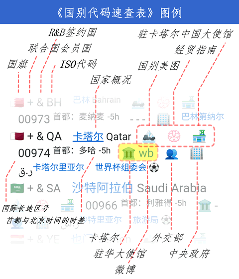

外交国别速查表 🗺
================
大萌	2022-2024	<base target="_blank">

		文明因交流而多彩，文明因互鉴而丰富。——习近平 20140327 于 UNESCO

　　本页面收录**全世界249个**国家或地区的外交信息与权威网址。**外交信息**包括：国别旗帜、ISO代码、UN席位、与中方建交年份、R&B签约、中英文名称、电信区号、<sup>首都、时差、主权货币符号与名称</sup>；**权威网址**包括：外交部的国家概况页、一带一路官网的国别美图页🏞、商务部的经贸指南页🧭、中外双方大使馆网址💐🛡️、该国别外交部门与中央政府网址👥🏢；网页提供必应搜索链接，以查询本币与人民币的汇率。

　　世界上应用最广泛的国别代码是**ISO 3166-1**标准的二位字母代码，比如：CN=China，US=America。因为ISO的工作语言(en/fr/ru)不包括中文，所以该标准内的国家或地区没有中文名称；与之对应的中国国标(GB/T 2659.1-2022)翻译了中文简称和全称，但是“由于涉及版权保护问题”，在国家标准[全文公开系统](https://openstd.samr.gov.cn/bzgk/gb/newGbInfo?hcno=FBCE39BE204B54F6F944092C209121F2)上“暂不提供”。　这两个原因造成中文用户在互联网上找不到清晰、权威的中文国别代码。

　　大萌因此编纂了这份《外交国别速查表》，简称‘**国别表**’，结合联合国与中国外交部的官方表述，拟定全表249个国家或地区的中文译名，以“[大规模集成网页](https://diamonwoo.github.io/LSIP/)(LSIP)”形式提供快速查找服务。收录国别按各大洲分段，大致沿丝绸之路行进路线由近及远、上北下南排序，加权因素：国土面积、UN席位。　网页信息密集，用宽屏模式效果较好；请善用浏览器页内搜索；新手请阅读页面底部的‘图例’。

<div align="right">
⏩老生常谈/<a href="https://Laosheng.top/ydyl/dir" target="_top">【一带一路】</a>/外交国别速查表
</div>

<h2 id="mulu" title="外交国别速查表">目录</h2>
LSIP进度　<br>
<a href="#yz" target="_top">1-亚洲</a>🌏　<sub>中国、印度、沙特、土耳其……</sub><br>
<a href="#oz" target="_top">2-欧洲</a>　<sub>俄罗斯、法国、希腊、西班牙……</sub><br>
<a href="#fz" target="_top">3-非洲</a>🌍　<sub>埃及、摩洛哥、尼日利亚、南非……</sub><br>
<a href="#dyz" target="_top">4-大洋洲</a>　<sub>澳大利亚、汤加、新西兰……</sub><br>
<a href="#bmz" target="_top">5-北美洲</a>🌎　<sub>美国、墨西哥、巴拿马、古巴……</sub><br>
<a href="#nmz" target="_top">6-南美洲</a>　<sub>阿根廷、巴西、委内瑞拉……</sub><br>
<a href="#njz" target="_top">7-南极洲</a>　<sub> 布韦岛…</sub><br>
8 <a href="#8" target="_top">必应世界地图</a>　<sub>微软必应提供的世界地图</sub><br>
9 <a href="#9" target="_top">图例</a>　<sub>emoji图标说明</sub><br>
10 <a href="#10" target="_top">数据来源</a>　<sub>鸣谢、统计</sub><br>


<h2 id="0" title="LC=链接计数">国别表LSIP进度</h2>

		收录LC = 1462				v0.8.3
		设计LC ≈ 1530　= 183×8 + (249-183)	建交国约8个链接+未建交1个链接
		完成率 ≈   95.5%

+	202402　2024新版式亮相，新增签证类与建交日。
+	202402　‘世界国别速查表’更名为‘外交国别速查表’，简称不变，启用2024年新版图例。v0.8.1
+	202304　补充阿富汗/南苏丹/多哥/纽埃等11个一带一路签约国政府网址。v0.8.0
+	202303　修订洪都拉斯政府网址，仍有少量国别政府网址可能失效。
+	202302　调整国别顺序。
+	202212　收录全部249个国家和地区的emoji旗帜符号；标记2022世界杯32支球队
+	202209　增加商务部《经贸指南》，增加国际长途区号，正在补充各国使馆网址
+	202209　已收录215个国家货币符号，增加查询汇率连接，上线公开测试
+	202208　收录249个ISO代码及其国别中英文名称，正在测试版式


<h2 id="yz" title="yà zhōu">亚洲 Asia　d<a href="https://cn.bing.com/maps?&cp=p35v3cq48s20&lvl=4" title="限桌面模式">🌏</a></h2>
🇨🇳	+五常	[🏞](https://www.yidaiyilu.gov.cn大美中国 "国别美图")	CN⠀	<big><big>	<a title="中华人民共和国" href="https://www.gov.cn/guoqing/">中国</a> 	China	</big></big>		⠀1949/10/1新中国成立！	[💐](https://www.mfa.gov.cn/web/zwjg_674741/zwsg_674743/ "中国大使馆")	□	[wb](https://weibo.com/wjxlt "外交部微博")	[👥](https://www.mfa.gov.cn "外交部")	[🏢](https://www.gov.cn "The People's Republic of China")	⠀0086	CNY ¥<sup>	[人民币](https://cn.bing.com/search?q=1克黄金兑CNY)	首都：北京</sup>  
🇭🇰	⠀ ⠀	　	[🧭](http://HK.mofcom.gov.cn "经贸指南")	HK⠀	<small>	<a title="中国香港特别行政区" href="http://www.locpg.gov.cn/fwzn/xggk.htm">(中国)香港</a> 	Hong Kong	</small>		⠀1997/7/1回归	[💐](http://locpg.gov.cn "中央驻港联络办")	□	[wb](https://weibo.com/newsgovhk "香港政府微博")	□	[🏢](https://www.gov.hk/sc "特区政府网站")	⠀00852	$<sup>	[港元](https://cn.bing.com/search?q=HKD兑CNY)	 - 0h ☆</sup>  
🇲🇴	⠀ ⠀	　	[🧭](http://MO.mofcom.gov.cn "经贸指南")	MO⠀	<small>	<a title="中国澳门特别行政区" href="https://www.gcs.gov.mo/news/factSheet/zh-hant?1">(中国)澳门</a> 	Macao	</small>		⠀1999/12/20回归	[💐](http://www.zlb.gov.cn/ "中央驻澳联络办")	□	[wb](https://weibo.com/6190786689 "澳门特区发布")	□	[🏢](https://www.gov.mo/zh-hant "特区政府网站")	⠀00853	P<sup>	[澳门币](https://cn.bing.com/search?q=MOP兑CNY)	 - 0h ☆</sup>  
🇹🇼	⠀ ⠀	　	　	TW⠀	<small>	<a title="中国台湾省" href="https://www.gov.cn/guoqing/2020-07/28/content_5530577.htm">(中国)台湾</a> 	Taiwan	</small>		⠀-/-/-	□	□	[wb](https://weibo.com/6439298407 "国台办微博")	[👥](http://www.gwytb.gov.cn "国台办")	□	⠀00886	$<sup>	[新台币](https://cn.bing.com/search?q=TWD兑CNY)	 - 0h ☆[台北市政府](https://www.gov.taipei) Province of China</sup>  
🇰🇵	+ ⠀	　	[🧭](http://KP.mofcom.gov.cn "经贸指南")	KP⠀		<a title="朝鲜民主主义人民共和国" href="https://www.mfa.gov.cn/web/gjhdq_676201/gj_676203/yz_676205/1206_676404/">朝鲜</a> 	North Korea			⠀1949/10/6建交	[💐](http://KP.china-embassy.gov.cn "中国大使馆")	⠀□	⠀-	⠀□	[🏢](http://naenara.com.kp "Democratic People's Republic of Korea")	⠀00850	₩<sup>	[朝鲜圆](https://cn.bing.com/search?q=KPW兑CNY)	首都：平壤（Pyongyang） 1h 📍 [友谊协会](https://korea-dpr.com/)</sup>  
🇰🇷	+ &	[🏞](https://www.yidaiyilu.gov.cn/gbjg/gbmt/2108.htm "国别美图")	[🧭](http://KR.mofcom.gov.cn "经贸指南")	KR⠀		<a title="南朝鲜／大韩民国" href="https://www.mfa.gov.cn/web/gjhdq_676201/gj_676203/yz_676205/1206_676524/">韩国</a> 	South Korea		⬇️	⠀1992/8/24建交	[💐](http://KR.china-embassy.gov.cn "中国大使馆")	[🛡️](https://overseas.mofa.go.kr/cn-zh/index.do "驻华使馆")	[wb](https://weibo.com/embassykr "驻华使馆微博")	[👥](https://www.mofa.go.kr/eng/index.do "外交部")	[🏢](https://www.president.go.kr "Republic of Korea")	⠀0082	₩<sup>	[韩圆](https://cn.bing.com/search?q=KRW兑CNY)	首都：首尔（Seoul） 1h ⚽</sup>  
🇯🇵	+ ⠀	　	[🧭](http://JP.mofcom.gov.cn "经贸指南")	JP⠀		<a title="日本国" href="https://www.mfa.gov.cn/web/gjhdq_676201/gj_676203/yz_676205/1206_676836/">日本</a> 	Japan			⠀1972/9/29建交	[💐](http://JP.china-embassy.gov.cn "中国大使馆")	[🛡️](https://www.cn.emb-japan.go.jp/itprtop_zh/ "驻华使馆")	[wb](https://weibo.com/japanembassy "驻华使馆微博")	[👥](https://www.mofa.go.jp/ "外交部")	[🏢](https://www.kantei.go.jp "Japanese")	⠀0081	¥<sup>	[日元](https://cn.bing.com/search?q=JPY兑CNY)	首都：东京 1h 📍 ⚽</sup>  
🇵🇭	+ &	[🏞](https://www.yidaiyilu.gov.cn/gbjg/gbmt/10046.htm "国别美图")	[🧭](http://PH.mofcom.gov.cn "经贸指南")	PH⠀		<a title="菲律宾共和国" href="https://www.mfa.gov.cn/web/gjhdq_676201/gj_676203/yz_676205/1206_676452/">菲律宾</a> 	Philippines			⠀1975/6/9建交	[💐](http://PH.china-embassy.gov.cn "中国大使馆")	[🛡️](https://beijingpe.dfa.gov.ph/ "驻华使馆")	⠀-	[👥](https://dfa.gov.ph/ "外交部")	[🏢](https://www.gov.ph/ "Republic of the Philippines")	⠀0063	₱<sup>	[菲律宾比索](https://cn.bing.com/search?q=PHP兑CNY)	首都：马尼拉 0 [旅游局wb](https://weibo.com/dotshanghai)</sup>  
🇧🇳	+ &	[🏞](https://www.yidaiyilu.gov.cn/gbjg/gbmt/10141.htm "国别美图")	[🧭](http://BN.mofcom.gov.cn "经贸指南")	BN⠀	<sup>	<a title="文莱和平之国" href="https://www.mfa.gov.cn/web/gjhdq_676201/gj_676203/yz_676205/1206_677004/">文莱</a> 	Brunei	</sup>	↩️	⠀1991/9/30建交	[💐](http://BN.china-embassy.gov.cn "中国大使馆")	⠀□	⠀-	⠀□	[🏢](http://www.jpm.gov.bn "Nation of Brunei, the Abode of Peace")	⠀00673	$<sup>	[文莱元](https://cn.bing.com/search?q=BND兑CNY)	首都：斯里巴加湾 0 </sup>  
🇲🇾	+ &	[🏞](https://www.yidaiyilu.gov.cn/gbjg/gbmt/2103.htm "国别美图")	[🧭](http://MY.mofcom.gov.cn "经贸指南")	MY⠀		<a title="马来西亚" href="https://www.mfa.gov.cn/web/gjhdq_676201/gj_676203/yz_676205/1206_676716/">马来西亚</a> 	Malaysia		🔄	⠀1974/5/31建交	[💐](http://MY.china-embassy.gov.cn "中国大使馆")	[🛡️](https://www.kln.gov.my/web/chn_beijing "驻华使馆")	⠀-	[👥](https://www.kln.gov.my/ "外交部")	[🏢](https://www.malaysia.gov.my/ "Malaysia")	⠀0060	RM<sup>	[马来西亚令吉](https://cn.bing.com/search?q=MYR兑CNY)	首都：吉隆坡 -0.5h [旅游局](https://weibo.com/tourismmalaysia)</sup>  
🇸🇬	+ &	[🏞](https://www.yidaiyilu.gov.cn/gbjg/gbmt/10131.htm "国别美图")	[🧭](http://SG.mofcom.gov.cn "经贸指南")	SG⠀	<sup>	<a title="新加坡共和国" href="https://www.mfa.gov.cn/web/gjhdq_676201/gj_676203/yz_676205/1206_677076/">新加坡</a> 	Singapore	</sup>	🔄	⠀1990/10/3建交	[💐](http://SG.china-embassy.gov.cn "中国大使馆")	[🛡️](https://www.mfa.gov.sg/beijing-chinese "驻华使馆")	[wb](https://weibo.com/xinjiapodashi "驻华使馆微博")	[👥](https://www.mfa.gov.sg/ "外交部")	[🏢](https://www.gov.sg "Republic of Singapore")	⠀0065	$<sup>	[新加坡元](https://cn.bing.com/search?q=SGD兑CNY)	首都：新加坡 0 [孙燕姿wb](https://weibo.com/sunyanzi)</sup>  
🇮🇩	+ &	[🏞](https://www.yidaiyilu.gov.cn/gbjg/gbmt/10009.htm "国别美图")	[🧭](http://ID.mofcom.gov.cn "经贸指南")	ID⠀	<big>	<a title="印尼/印度尼西亚共和国" href="https://www.mfa.gov.cn/web/gjhdq_676201/gj_676203/yz_676205/1206_677244/">印度尼西亚</a> 	Indonesia	</big>	↩️	⠀1950/4/13建交	[💐](http://ID.china-embassy.gov.cn "中国大使馆")	[🛡️](https://kemlu.go.id/beijing/lc "驻华使馆")	[wb](https://weibo.com/indonesiagz "驻华使馆微博")	[👥](https://kemlu.go.id/portal/en "外交部")	[🏢](http://www.indonesia.go.id "Republic of Indonesia")	⠀0062	Rp<sup>	[印度尼西亚卢比](https://cn.bing.com/search?q=IDR兑CNY)	首都：雅加达 0 </sup>  
🇹🇱	+ &	[🏞](https://www.yidaiyilu.gov.cn/gbjg/gbmt/10143.htm "国别美图")	[🧭](http://TL.mofcom.gov.cn "经贸指南")	TL⠀	<small>	<a title="东帝汶民主共和国" href="https://www.mfa.gov.cn/web/gjhdq_676201/gj_676203/yz_676205/1206_676428/">东帝汶</a> 	Timor-Leste	</small>	↩️	⠀2002/5/20建交	[💐](http://TL.china-embassy.gov.cn "中国大使馆")	[🛡️](http://embtimorleste-beijing.com/embassy_cn.aspx "驻华使馆")	⠀-	⠀□	[🏢](http://timor-leste.gov.tl/ "Democratic Republic of Timor-Leste")	⠀00670	$<sup>	[美元](https://cn.bing.com/search?q=USD兑CNY)	首都：帝力 1h </sup>  
🇨🇽	⠀ ⠀	　	　	CX⠀	<small>	(澳属)圣诞岛	[Christmas Island](https://cn.bing.com/search?q=Christmas Island)	</small>		⠀-/-/-	⠀□	⠀□	⠀-	⠀□	⠀□	⠀0061	<sup>	⠀-	首都：飞鱼湾 -1h </sup>  
🇨🇨	⠀ ⠀	　	　	CC⠀	<small>	<a title="科科斯（基林）群岛">(澳属)科科斯群岛</a>	Cocos Islands	</small>		⠀-/-/-	⠀□	⠀□	⠀-	⠀□	[🏢](https://shire.cc/en/ "Cocos (Keeling) Islands")	⠀0061	<sup>	⠀-	首都：西岛 -1.5h </sup>  
🇻🇳	+ &	[🏞](https://www.yidaiyilu.gov.cn/gbjg/gbmt/10041.htm "国别美图")	[🧭](http://VN.mofcom.gov.cn "经贸指南")	VN⠀		<a title="越南社会主义共和国" href="https://www.mfa.gov.cn/web/gjhdq_676201/gj_676203/yz_676205/1206_677292/">越南</a> 	Vietnam		⬇️	⠀1950/1/18建交	[💐](http://VN.china-embassy.gov.cn "中国大使馆")	[🛡️](https://www.mofa.gov.vn/vnemb.china/zh "驻华使馆")	⠀-	[👥](https://www.mofa.gov.vn/en "外交部")	[🏢](http://www.chinhphu.vn "Socialist Republic of Vietnam")	⠀0084	₫<sup>	[越南盾](https://cn.bing.com/search?q=VND兑CNY)	首都：河内 -1h [今日越南](https://weibo.com/alibaba0579)</sup>  
🇱🇦	+ &	[🏞](https://www.yidaiyilu.gov.cn/gbjg/gbmt/2157.htm "国别美图")	[🧭](http://LA.mofcom.gov.cn "经贸指南")	LA⠀		<a title="老挝人民民主共和国" href="https://www.mfa.gov.cn/web/gjhdq_676201/gj_676203/yz_676205/1206_676644/">老挝</a> 	Laos		↩️	⠀1961/4/25建交	[💐](http://LA.china-embassy.gov.cn "中国大使馆")	[🛡️](http://www.mofa.gov.la/index.php/the-ministry/2256-2015-06-19-08-28-34 "驻华使馆")	⠀-	[👥](http://www.mofa.gov.la/ "外交部")	[🏢](http://www.laogov.gov.la/ "Lao People's Democratic Republic")	⠀00856	₭<sup>	[老挝基普](https://cn.bing.com/search?q=LAK兑CNY)	首都：万象 -1h [旅游局](https://www.tourismlaos.org/)</sup>  
🇰🇭	+ &	[🏞](https://www.yidaiyilu.gov.cn/gbjg/gbmt/1886.htm "国别美图")	[🧭](http://KH.mofcom.gov.cn "经贸指南")	KH⠀		<a title="柬埔寨王国" href="https://www.mfa.gov.cn/web/gjhdq_676201/gj_676203/yz_676205/1206_676572/">柬埔寨</a> 	Cambodia		↩️	⠀1958/7/19建交	[💐](http://KH.china-embassy.gov.cn "中国大使馆")	⠀□	⠀-	⠀□	[🏢](http://www.mfaic.gov.kh "Kingdom of Cambodia")	⠀00855	៛<sup>	[柬埔寨瑞尔](https://cn.bing.com/search?q=KHR兑CNY)	首都：金边 -1h </sup>  
🇹🇯	+ &	[🏞](https://www.yidaiyilu.gov.cn/gbjg/gbmt/10039.htm "国别美图")	[🧭](http://TH.mofcom.gov.cn "经贸指南")	TH⠀		<a title="泰王国" href="https://www.mfa.gov.cn/web/gjhdq_676201/gj_676203/yz_676205/1206_676932/">泰国</a> 	Thailand		🔄	⠀1975/7/1建交	[💐](http://TH.china-embassy.gov.cn "中国大使馆")	[🛡️](https://thaiembbeij.org/cn/ "驻华使馆")	[wb](https://weibo.com/thaiembassybj "驻华使馆微博")	⠀□	[🏢](http://www.thaigov.go.th "Kingdom of Thailand")	⠀0066	฿<sup>	[泰铢](https://cn.bing.com/search?q=THB兑CNY)	首都：曼谷 -1h </sup>  
🇲🇲	+ &	[🏞](https://www.yidaiyilu.gov.cn/gbjg/gbmt/10060.htm "国别美图")	[🧭](http://MM.mofcom.gov.cn "经贸指南")	MM⠀		<a title="缅甸联邦共和国" href="https://www.mfa.gov.cn/web/gjhdq_676201/gj_676203/yz_676205/1206_676788/">缅甸</a> 	Myanmar			⠀1950/6/8建交	[💐](http://MM.china-embassy.gov.cn "中国大使馆")	[🛡️](http://www.myanmarembassy.com/Ch_index.html "驻华使馆")	⠀-	[👥](https://www.mofa.gov.mm/ "外交部")	[🏢](https://myanmar.gov.mm/ "Republic of the Union of Myanmar[t]")	⠀0095	Ks<sup>	[缅元](https://cn.bing.com/search?q=MMK兑CNY)	首都：内比都 -1.5h [中方驻缅](https://weibo.com/chinaembinmyanmar)</sup>  
🇧🇹	+ ⠀	[🏞](https://www.yidaiyilu.gov.cn/gbjg/gbmt/10148.htm "国别美图")	　	BT⠀	<small>	<a title="不丹王国" href="https://www.mfa.gov.cn/web/gjhdq_676201/gj_676203/yz_676205/1206_676380/">不丹</a> 	Bhutan	</small>		⠀-/-/-	⠀□	⠀□	⠀-	⠀□	[🏢](http://www.bhutan.gov.bt "Kingdom of Bhutan")	⠀00975	<sup>	[努尔特鲁姆](https://cn.bing.com/search?q=BTN兑CNY)	首都：廷布（Thimphu） -2h </sup>  
🇳🇵	+ &	[🏞](https://www.yidaiyilu.gov.cn/gbjg/gbmt/1924.htm "国别美图")	[🧭](http://NP.mofcom.gov.cn "经贸指南")	NP⠀		<a title="尼泊尔联邦民主共和国" href="https://www.mfa.gov.cn/web/gjhdq_676201/gj_676203/yz_676205/1206_676812/">尼泊尔</a> 	Nepal		↩️	⠀1955/8/1建交	[💐](http://NP.china-embassy.gov.cn "中国大使馆")	[🛡️](https://cn.nepalembassy.gov.np/zh/ "驻华使馆")	⠀-	[👥](https://nepalpassport.gov.np/ "外交部")	[🏢](https://nepal.gov.np/ "Federal Democratic Republic of Nepal")	⠀00977	रू<sup>	[尼泊尔卢比](https://cn.bing.com/search?q=NPR兑CNY)	首都：加德满都 -2.15h </sup>  
🇧🇩	+ &	[🏞](https://www.yidaiyilu.gov.cn/gbjg/gbmt/1873.htm "国别美图")	[🧭](http://BD.mofcom.gov.cn "经贸指南")	BD⠀		<a title="孟加拉人民共和国" href="https://www.mfa.gov.cn/web/gjhdq_676201/gj_676203/yz_676205/1206_676764/">孟加拉国</a> 	Bangladesh		↩️	⠀1975/10/4建交	[💐](http://BD.china-embassy.gov.cn "中国大使馆")	⠀□	⠀-	[👥](http://www.mofa.gov.bd/ "外交部")	[🏢](https://bangladesh.gov.bd/ "People's Republic of Bangladesh")	⠀00880	<sup>	[孟加拉塔卡](https://cn.bing.com/search?q=BDT兑CNY)	首都：达卡 -2h </sup>  
🇮🇳	+ ⠀	　	[🧭](http://IN.mofcom.gov.cn "经贸指南")	IN⠀	<big>	<a title="印度共和国" href="https://www.mfa.gov.cn/web/gjhdq_676201/gj_676203/yz_676205/1206_677220/">印度</a> 	India	</big>		⠀1950/4/1建交	[💐](http://IN.china-embassy.gov.cn "中国大使馆")	[🛡️](https://www.eoibeijing.gov.in/ "驻华使馆")	[wb](https://weibo.com/indianembassy "驻华使馆微博")	[👥](https://www.mea.gov.in/ "外交部")	[🏢](https://www.mygov.in/ "Republic of India")	⠀0091	₹<sup>	[印度卢比](https://cn.bing.com/search?q=INR兑CNY)	首都：新德里 -2.5h </sup>  
🇱🇰	+ &	[🏞](https://www.yidaiyilu.gov.cn/gbjg/gbmt/2072.htm "国别美图")	[🧭](http://LK.mofcom.gov.cn "经贸指南")	LK⠀	<small>	<a title="斯里兰卡民主社会主义共和国" href="https://www.mfa.gov.cn/web/gjhdq_676201/gj_676203/yz_676205/1206_676884/">斯里兰卡</a> 	Sri Lanka	</small>		⠀1957/2/7建交	[💐](http://LK.china-embassy.gov.cn "中国大使馆")	[🛡️](https://www.beijing.embassy.gov.lk/cn "驻华使馆")	[wb](https://weibo.com/srilankacggz "驻华使馆微博")	⠀□	[🏢](https://www.gov.lk/ "Democratic Socialist Republic of Sri Lanka[u]")	⠀0094	Rs<sup>	[斯里兰卡卢比](https://cn.bing.com/search?q=LKR兑CNY)	首都：科伦坡（Colombo） 0 </sup>  
🇲🇻	+ &	[🏞](https://www.yidaiyilu.gov.cn/gbjg/gbmt/2100.htm "国别美图")	　	MV⠀	<sup>	<a title="马尔代夫共和国" href="https://www.mfa.gov.cn/web/gjhdq_676201/gj_676203/yz_676205/1206_676692/">马尔代夫</a> 	Maldives	</sup>	🔄	⠀1972/10/14建交	[💐](http://MV.china-embassy.gov.cn "中国大使馆")	⠀□	⠀-	⠀□	[🏢](http://www.maldivesinfo.gov.mv "Republic of Maldives")	⠀00960	.ރ<sup>	[拉菲亚](https://cn.bing.com/search?q=MVR兑CNY)	首都：马利 -7h </sup>  
🇲🇳	+ &	[🏞](https://www.yidaiyilu.gov.cn/gbjg/gbmt/1380.htm "国别美图")	[🧭](http://MN.mofcom.gov.cn "经贸指南")	MN⠀	<big>	<a title="蒙古国" href="https://www.mfa.gov.cn/web/gjhdq_676201/gj_676203/yz_676205/1206_676740/">蒙古</a> 	Mongolia	</big>		⠀1949/10/16建交	[💐](http://MN.china-embassy.gov.cn "中国大使馆")	[🛡️](https://beijing.embassy.mn/chn/ "驻华使馆")	[wb](https://weibo.com/7567719354 "驻华使馆微博")	[👥](https://mfa.gov.mn/en/ "外交部")	[🏢](http://www.pmis.gov.mn "Mongolia")	⠀00976	₮<sup>	[图格里克](https://cn.bing.com/search?q=MNT兑CNY)	首都：乌兰巴托 0 [中蒙博览会](https://weibo.com/u/6334167491)</sup>  
🇰🇿	+ &	[🏞](https://www.yidaiyilu.gov.cn/gbjg/gbmt/1600.htm "国别美图")	[🧭](http://KZ.mofcom.gov.cn "经贸指南")	KZ⠀	<big>	<a title="哈萨克斯坦共和国" href="https://www.mfa.gov.cn/web/gjhdq_676201/gj_676203/yz_676205/1206_676500/">哈萨克斯坦</a> 	Kazakhstan	</big>	🔄	⠀1992/1/3建交	[💐](http://KZ.china-embassy.gov.cn "中国大使馆")	[🛡️](https://www.gov.kz/memleket/entities/mfa-beijing?lang=zh "驻华使馆")	[wb](https://weibo.com/kazembassy "驻华使馆微博")	[👥](https://www.gov.kz/memleket/entities/mfa?lang=en "外交部")	[🏢](https://www.gov.kz/ "Republic of Kazakhstan")	⠀00997	₸<sup>	[哈萨克斯坦坚戈](https://cn.bing.com/search?q=KZT兑CNY)	首都：努尔苏丹 -5h [哈通社](https://weibo.com/informkz) [今日丝路](https://weibo.com/7415670580)</sup>  
🇰🇬	+ &	[🏞](https://www.yidaiyilu.gov.cn/gbjg/gbmt/1978.htm "国别美图")	[🧭](http://KG.mofcom.gov.cn "经贸指南")	KG⠀		<a title="吉尔吉斯共和国" href="https://www.mfa.gov.cn/web/gjhdq_676201/gj_676203/yz_676205/1206_676548/">吉尔吉斯斯坦</a> 	Kyrgyzstan			⠀1992/1/5建交	[💐](http://KG.china-embassy.gov.cn "中国大使馆")	[🛡️](https://mfa.gov.kg/en/embassies/all "驻华使馆")	⠀-	[👥](https://mfa.gov.kg/en "外交部")	[🏢](https://www.gov.kg/ky "Kyrgyz Republic")	⠀00996	с<sup>	[吉尔吉斯斯坦索姆](https://cn.bing.com/search?q=KGS兑CNY)	首都：比什凯克 -5h 驻华使馆网址过长</sup>  
🇹🇯	+ &	[🏞](https://www.yidaiyilu.gov.cn/gbjg/gbmt/2321.htm "国别美图")	[🧭](http://TJ.mofcom.gov.cn "经贸指南")	TJ⠀		<a title="塔吉克斯坦共和国" href="https://www.mfa.gov.cn/web/gjhdq_676201/gj_676203/yz_676205/1206_676908/">塔吉克斯坦</a> 	Tajikistan			⠀1992/1/4建交	[💐](http://TJ.china-embassy.gov.cn "中国大使馆")	[🛡️](https://tajikembassychina.org/zh/ "驻华使馆")	⠀-	[👥](https://mfa.tj/en/main "外交部")	[🏢](https://www.parlament.tj/ "Republic of Tajikistan")	⠀00992	ЅМ<sup>	[索莫尼](https://cn.bing.com/search?q=TJS兑CNY)	首都：杜尚别 -5h [总统](http://president.tj/)</sup>  
🇺🇿	+ &	[🏞](https://www.yidaiyilu.gov.cn/gbjg/gbmt/2007.htm "国别美图")	[🧭](http://UZ.mofcom.gov.cn "经贸指南")	UZ⠀		<a title="乌兹别克斯坦共和国" href="https://www.mfa.gov.cn/web/gjhdq_676201/gj_676203/yz_676205/1206_677052/">乌兹别克斯坦</a> 	Uzbekistan		⬇️	⠀1992/1/2建交	[💐](http://UZ.china-embassy.gov.cn "中国大使馆")	⠀□	⠀-	[👥](https://mfa.uz/en "外交部")	[🏢](https://www.gov.uz/ "Republic of Uzbekistan")	⠀00998	so'm<sup>	[乌兹别克斯坦索姆](https://cn.bing.com/search?q=UZS兑CNY)	首都：塔什干 -5h </sup>  
🇹🇲	+ &	[🏞](https://www.yidaiyilu.gov.cn/gbjg/gbmt/10147.htm "国别美图")	[🧭](http://TM.mofcom.gov.cn "经贸指南")	TM⠀		<a title="土库曼斯坦" href="https://www.mfa.gov.cn/web/gjhdq_676201/gj_676203/yz_676205/1206_676980/">土库曼斯坦</a> 	Turkmenistan		↩️	⠀1992/1/6建交	[💐](http://TM.china-embassy.gov.cn "中国大使馆")	[🛡️](https://china.tmembassy.gov.tm/zh "驻华使馆")	⠀-	[👥](https://www.mfa.gov.tm/en "外交部")	[🏢](http://www.turkmenistan.gov.tm "Turkmenistan")	⠀00993	m<sup>	[土库曼斯坦马纳特](https://cn.bing.com/search?q=TMT兑CNY)	首都：阿什哈巴德 -5h </sup>  
🇦🇫	+ &	[🏞](https://www.yidaiyilu.gov.cn/gbjg/gbmt/2112.htm "国别美图")	[🧭](http://AF.mofcom.gov.cn "经贸指南")	AF⠀		<a title="阿富汗伊斯兰酋长国" href="https://www.mfa.gov.cn/web/gjhdq_676201/gj_676203/yz_676205/1206_676207/">阿富汗</a> 	Afghanistan			⠀1955/1/20建交	[💐](http://AF.china-embassy.gov.cn "中国大使馆")	⠀□	⠀-	⠀□	[🏢](https://www.alemarah.af "Islamic Emirate of Afghanistan")	⠀0093	<sup>	[阿富汗尼](https://cn.bing.com/search?q=AFN兑CNY)	首都：喀布尔/Kabul -3.5h [English](https://www.alemarahenglish.af)</sup>  
🇵🇰	+ &	[🏞](https://www.yidaiyilu.gov.cn/gbjg/gbmt/10146.htm "国别美图")	[🧭](http://PK.mofcom.gov.cn "经贸指南")	PK⠀		<a title="巴基斯坦伊斯兰共和国" href="https://www.mfa.gov.cn/web/gjhdq_676201/gj_676203/yz_676205/1206_676308/">巴基斯坦</a> 	Pakistan			⠀1951/5/21建交	[💐](http://PK.china-embassy.gov.cn "中国大使馆")	[🛡️](http://www.pakbj.org/html/cn/ "驻华使馆")	[wb](https://weibo.com/7512012640 "驻华使馆微博")	[👥](https://mofa.gov.pk/ "外交部")	[🏢](https://pakistan.gov.pk/ "Islamic Republic of Pakistan")	⠀0092	₨<sup>	[巴基斯坦卢比](https://cn.bing.com/search?q=PKR兑CNY)	首都：伊斯兰堡 -3h </sup>  
🇮🇷	+ &	[🏞](https://www.yidaiyilu.gov.cn/gbjg/gbmt/2158.htm "国别美图")	[🧭](http://IR.mofcom.gov.cn "经贸指南")	IR⠀	<big>	<a title="伊朗伊斯兰共和国" href="https://www.mfa.gov.cn/web/gjhdq_676201/gj_676203/yz_676205/1206_677172/">伊朗</a> 	Iran	</big>	⬇️	⠀1971/8/16建交	[💐](http://IR.china-embassy.gov.cn "中国大使馆")	[🛡️](https://china.mfa.gov.ir/zh/ "驻华使馆")	[wb](https://weibo.com/2312751365 "驻华使馆微博")	[👥](https://en.mfa.gov.ir/ "外交部")	[🏢](https://irangov.ir/ "Islamic Republic of Iran")	⠀0098	<sup>	[伊朗里亚尔](https://cn.bing.com/search?q=IRR兑CNY)	首都：德黑兰 -4.5h 最高领袖哈梅内伊 [总统](https://www.president.ir/) ⚽</sup>  
🇮🇶	+ &	[🏞](https://www.yidaiyilu.gov.cn/gbjg/gbmt/2164.htm "国别美图")	[🧭](http://IQ.mofcom.gov.cn "经贸指南")	IQ⠀		<a title="伊拉克共和国" href="https://www.mfa.gov.cn/web/gjhdq_676201/gj_676203/yz_676205/1206_677148/">伊拉克</a> 	Iraq		↩️	⠀1958/8/25建交	[💐](http://IQ.china-embassy.gov.cn "中国大使馆")	⠀□	⠀-	[👥](https://mofa.gov.iq/en/ "外交部")	[🏢](https://gds.gov.iq/ "Republic of Iraq")	⠀00964	<sup>	[伊拉克第纳尔](https://cn.bing.com/search?q=IQD兑CNY)	首都：巴格达 -5h </sup>  
🇰🇼	+ &	[🏞](https://www.yidaiyilu.gov.cn/gbjg/gbmt/2111.htm "国别美图")	[🧭](http://KW.mofcom.gov.cn "经贸指南")	KW⠀	<small>	<a title="科威特国" href="https://www.mfa.gov.cn/web/gjhdq_676201/gj_676203/yz_676205/1206_676620/">科威特</a> 	Kuwait	</small>		⠀1971/3/22建交	[💐](http://KW.china-embassy.gov.cn "中国大使馆")	⠀□	⠀-	[👥](https://www.mofa.gov.kw/en/ "外交部")	[🏢](https://www.e.gov.kw/ "State of Kuwait")	⠀00965	د.ك<sup>	[科威特第纳尔](https://cn.bing.com/search?q=KWD兑CNY)	首都：科威特城 -5h </sup>  
🇸🇦	+ &	[🏞](https://www.yidaiyilu.gov.cn/gbjg/gbmt/2160.htm "国别美图")	[🧭](http://SA.mofcom.gov.cn "经贸指南")	SA⠀	<big>	<a title="沙特阿拉伯王国" href="https://www.mfa.gov.cn/web/gjhdq_676201/gj_676203/yz_676205/1206_676860/">沙特阿拉伯</a> 	Saudi Arabia	</big>	↩️	⠀1990/7/21建交	[💐](http://SA.china-embassy.gov.cn "中国大使馆")	[🛡️](https://saudiembassy.net/ "驻华使馆")	⠀-	[👥](https://www.mofa.gov.sa/en/ "外交部")	[🏢](https://dga.gov.sa/ "Kingdom of Saudi Arabia")	⠀00966	ر.س<sup>	[沙特里亚尔](https://cn.bing.com/search?q=SAR兑CNY)	首都：利雅得 -5h [旅游局](https://weibo.com/7731973660) ⚽</sup>  
🇧🇭	+ &	[🏞](https://www.yidaiyilu.gov.cn/gbjg/gbmt/10168.htm "国别美图")	[🧭](http://BH.mofcom.gov.cn "经贸指南")	BH⠀	<sup>	<a title="巴林王国" href="https://www.mfa.gov.cn/web/gjhdq_676201/gj_676203/yz_676205/1206_676356/">巴林</a> 	Bahrain	</sup>	↩️	⠀1989/4/18建交	[💐](http://BH.china-embassy.gov.cn "中国大使馆")	⠀□	⠀-	⠀□	[🏢](http://www.bahrain.gov.bh "Kingdom of Bahrain")	⠀00973	<sup>	[巴林第纳尔](https://cn.bing.com/search?q=BHD兑CNY)	首都：麦纳麦 -5h </sup>  
🇶🇦	+ &	[🏞](https://www.yidaiyilu.gov.cn/gbjg/gbmt/2110.htm "国别美图")	[🧭](http://QA.mofcom.gov.cn "经贸指南")	QA⠀	<small>	<a title="卡塔尔国 " href="https://www.mfa.gov.cn/web/gjhdq_676201/gj_676203/yz_676205/1206_676596/">卡塔尔</a> 	Qatar	</small>	🔄	⠀1988/7/9建交	[💐](http://QA.china-embassy.gov.cn "中国大使馆")	[🛡️](https://beijing.embassy.qa/en/ "驻华使馆")	[wb](https://weibo.com/7480960163 "驻华使馆微博")	[👥](https://www.mofa.gov.qa/en/ "外交部")	[🏢](https://hukoomi.gov.qa/ "State of Qatar")	⠀00974	ر.ق<sup>	[卡塔尔里亚尔](https://cn.bing.com/search?q=QAR兑CNY)	首都：多哈 -5h [世界杯组委会](https://weibo.com/Roadto2022) ⚽</sup>  
🇦🇪	+ &	[🏞](https://www.yidaiyilu.gov.cn/gbjg/gbmt/10149.htm "国别美图")	[🧭](http://AE.mofcom.gov.cn "经贸指南")	AE⠀	<small>	<a title="阿拉伯联合酋长国" href="https://www.mfa.gov.cn/web/gjhdq_676201/gj_676203/yz_676205/1206_676234/">阿联酋</a> 	UAE	</small>	🔄	⠀1984/11/1建交	[💐](http://AE.china-embassy.gov.cn "中国大使馆")	[🛡️](https://www.mofaic.gov.ae/zh-cn/missions/beijing "驻华使馆")	[wb](https://weibo.com/6969158398 "驻华使馆微博")	[👥](https://www.moec.gov.ae/en/home "外交部")	[🏢](https://u.ae/en "United Arab Emirates")	⠀00971	د.إ<sup>	[阿联酋迪拉姆](https://cn.bing.com/search?q=AED兑CNY)	首都：阿布扎比/Abu Dhabi -4h </sup>  
🇴🇲	+ &	[🏞](https://www.yidaiyilu.gov.cn/gbjg/gbmt/10150.htm "国别美图")	[🧭](http://OM.mofcom.gov.cn "经贸指南")	OM⠀		<a title="阿曼苏丹国 " href="https://www.mfa.gov.cn/web/gjhdq_676201/gj_676203/yz_676205/1206_676259/">阿曼</a> 	Oman		⬇️	⠀1978/5/25建交	[💐](http://OM.china-embassy.gov.cn "中国大使馆")	[🛡️](https://fm.gov.om/beijing/ "驻华使馆")	⠀-	[👥](https://fm.gov.om/ "外交部")	[🏢](http://www.omanet.om "Sultanate of Oman")	⠀00968	ر.ع.<sup>	[阿曼里亚尔](https://cn.bing.com/search?q=OMR兑CNY)	首都：马斯开特 -4h </sup>  
🇾🇪	+ &	[🏞](https://www.yidaiyilu.gov.cn/gbjg/gbmt/10161.htm "国别美图")	[🧭](http://YE.mofcom.gov.cn "经贸指南")	YE⠀		<a title="也门共和国" href="https://www.mfa.gov.cn/web/gjhdq_676201/gj_676203/yz_676205/1206_677124/">也门</a> 	Yemen			⠀1956/9/24建交	[💐](http://YE.china-embassy.gov.cn "中国大使馆")	[🛡️](https://yemenembassy.cn/zh-hans/ "驻华使馆")	⠀-	[👥](https://www.mofa-ye.org/ "外交部")	[🏢](http://www.yemeninfo.gov.ye "Republic of Yemen")	⠀00967	ر.ي<sup>	[也门里亚尔](https://cn.bing.com/search?q=YER兑CNY)	首都：萨那 -5h </sup>  
🇦🇿	+ &	[🏞](https://www.yidaiyilu.gov.cn/gbjg/gbmt/2116.htm "国别美图")	[🧭](http://AZ.mofcom.gov.cn "经贸指南")	AZ⠀	<small>	<a title="阿塞拜疆共和国" href="https://www.mfa.gov.cn/web/gjhdq_676201/gj_676203/yz_676205/1206_676284/">阿塞拜疆</a> 	Azerbaijan	</small>	↩️	⠀1992/4/2建交	[💐](http://AZ.china-embassy.gov.cn "中国大使馆")	[🛡️](https://beijing.mfa.gov.az/en "驻华使馆")	⠀-	⠀□	[🏢](https://azerbaijan.az/en "Republic of Azerbaijan")	⠀00994	<sup>	[阿塞拜疆马纳特](https://cn.bing.com/search?q=AZN兑CNY)	首都：巴库 -5h [总统府](http://www.president.az)</sup>  
🇦🇲	+ &	[🏞](https://www.yidaiyilu.gov.cn/gbjg/gbmt/1911.htm "国别美图")	[🧭](http://AM.mofcom.gov.cn "经贸指南")	AM⠀	<small>	<a title="亚美尼亚共和国" href="https://www.mfa.gov.cn/web/gjhdq_676201/gj_676203/yz_676205/1206_677028/">亚美尼亚</a> 	Armenia	</small>	🔄	⠀1992/4/6建交	[💐](http://AM.china-embassy.gov.cn "中国大使馆")	[🛡️](https://china.mfa.am/en "驻华使馆")	⠀-	[👥](https://www.mfa.am/en "外交部")	[🏢](https://www.gov.am/am/ "Republic of Armenia")	⠀00374	<sup>	[亚美尼亚德拉姆](https://cn.bing.com/search?q=AMD兑CNY)	首都：埃里温 -6h </sup>  
🇬🇪	+ &	[🏞](https://www.yidaiyilu.gov.cn/gbjg/gbmt/1889.htm "国别美图")	[🧭](http://GE.mofcom.gov.cn "经贸指南")	GE⠀	<small>	<a title="前成员国：苏联；曾名：格鲁吉亚共和国。" href="https://www.mfa.gov.cn/web/gjhdq_676201/gj_676203/yz_676205/1206_676476/">格鲁吉亚</a> 	Georgia	</small>	⬇️	⠀1992/6/9建交	[💐](http://GE.china-embassy.gov.cn "中国大使馆")	⠀□	⠀-	⠀□	[🏢](http://www.georgia.gov "Georgia")	⠀00995	<sup>	[格鲁吉亚拉里](https://cn.bing.com/search?q=GEL兑CNY)	首都：第比利斯 0 </sup>  
🇹🇷	+ &	[🏞](https://www.yidaiyilu.gov.cn/gbjg/gbmt/1763.htm "国别美图")	[🧭](http://TR.mofcom.gov.cn "经贸指南")	TR⠀		<a title="土耳其共和国" href="https://www.mfa.gov.cn/web/gjhdq_676201/gj_676203/yz_676205/1206_676956/">土耳其</a> 	Turkey			⠀1971/8/4建交	[💐](http://TR.china-embassy.gov.cn "中国大使馆")	[🛡️](http://pekin.be.mfa.gov.tr/ "驻华使馆")	[wb](https://weibo.com/6430733485 "驻华使馆微博")	[👥](https://www.mfa.gov.tr/default.zh.mfa "外交部")	[🏢](http://www.byegm.gov.tr "Republic of Turkey")	⠀0090	₺<sup>	[土耳其里拉](https://cn.bing.com/search?q=TRY兑CNY)	首都：安卡拉 -6h </sup>  
🇸🇾	+ &	[🏞](https://www.yidaiyilu.gov.cn/gbjg/gbmt/10118.htm "国别美图")	[🧭](http://SY.mofcom.gov.cn "经贸指南")	SY⠀		<a title="阿拉伯叙利亚共和国" href="https://www.mfa.gov.cn/web/gjhdq_676201/gj_676203/yz_676205/1206_677100/">叙利亚</a> 	Syria		↩️	⠀1956/8/1建交	[💐](http://SY.china-embassy.gov.cn "中国大使馆")	[🛡️](http://syrembassy.cn/cn/ "驻华使馆")	⠀-	⠀□	[🏢](https://www.egov.sy/ "Syrian Arab Republic")	⠀00963	£<sup>	[叙利亚镑](https://cn.bing.com/search?q=SYP兑CNY)	首都：大马士革 -6h 💥</sup>  
🇱🇧	+ &	[🏞](https://www.yidaiyilu.gov.cn/gbjg/gbmt/10156.htm "国别美图")	[🧭](http://LB.mofcom.gov.cn "经贸指南")	LB⠀	<small>	<a title="黎巴嫩共和国" href="https://www.mfa.gov.cn/web/gjhdq_676201/gj_676203/yz_676205/1206_676668/">黎巴嫩</a> 	Lebanon	</small>	↩️	⠀1971/11/9建交	[💐](http://LB.china-embassy.gov.cn "中国大使馆")	⠀□	⠀-	⠀□	[🏢](http://www.lp.gov.lb "Lebanese Republic")	⠀00961	ل.ل<sup>	[黎巴嫩镑](https://cn.bing.com/search?q=LBP兑CNY)	首都：贝鲁特 -6h </sup>  
🇮🇱	+ ⠀	[🏞](https://www.yidaiyilu.gov.cn/gbjg/gbmt/9977.htm "国别美图")	[🧭](http://IL.mofcom.gov.cn "经贸指南")	IL⠀	<small>	<a title="以色列国" href="https://www.mfa.gov.cn/web/gjhdq_676201/gj_676203/yz_676205/1206_677196/">以色列</a> 	Israel	</small>		⠀1992/1/24建交	[💐](http://IL.china-embassy.gov.cn "中国大使馆")	[🛡️](https://embassies.gov.il/beijing/ "驻华使馆")	[wb](https://weibo.com/israelembassy "驻华使馆微博")	[👥](https://www.gov.il/en/departments/ministry_of_foreign_affairs "外交部")	[🏢](https://www.gov.il/ "State of Israel")	⠀00972	<sup>	[新谢克尔](https://cn.bing.com/search?q=ILS兑CNY)	首都：耶路撒冷 -6h 💥 微博粉丝过200万</sup>  
🇵🇸	% &	[🏞](https://www.yidaiyilu.gov.cn/gbjg/gbmt/10153.htm "国别美图")	　	PS⠀	<sup>	<a title="巴勒斯坦国" href="https://www.mfa.gov.cn/web/gjhdq_676201/gj_676203/yz_676205/1206_676332/">巴勒斯坦</a> 	Palestine	</sup>		⠀1988/11/20建交	[💐](http://ps.china-office.gov.cn "中国大使馆")	⠀□	[wb](https://weibo.com/palembassy "驻华使馆微博")	⠀□	[🏢](http://www.gcc.gov.ps "State of Palestine")	⠀00970	د.ا<sup>	[约旦第纳尔](https://cn.bing.com/search?q=JOD兑CNY)	首都：耶路撒冷 -6h 💥 微博恢复更新</sup>  
🇯🇴	+ &	[🏞](https://www.yidaiyilu.gov.cn/gbjg/gbmt/10157.htm "国别美图")	[🧭](http://JO.mofcom.gov.cn "经贸指南")	JO⠀	<small>	<a title="约旦哈希姆王国" href="https://www.mfa.gov.cn/web/gjhdq_676201/gj_676203/yz_676205/1206_677268/">约旦</a> 	Jordan	</small>	↩️	⠀1977/4/7建交	[💐](http://JO.china-embassy.gov.cn "中国大使馆")	[🛡️](https://mfa.gov.jo/zh/embassy/BeijingZh "驻华使馆")	⠀-	[👥](https://mfa.gov.jo/ "外交部")	[🏢](https://portal.jordan.gov.jo/ "Hashemite Kingdom of Jordan")	⠀00962	<sup>	[约旦第纳尔](https://cn.bing.com/search?q=JOD兑CNY)	首都：安曼 -6h </sup>  

<h2 id="oz" title="ōu zhōu">欧洲 Europe　<a href="http://www.gditu.net/" title="谷地图">🌍</a></h2>
🇷🇺	+五常 &	[🏞](https://www.yidaiyilu.gov.cn/gbjg/gbmt/1782.htm "国别美图")	[🧭](http://RU.mofcom.gov.cn "经贸指南")	RU⠀	<big><big>	<a title="俄罗斯联邦" href="https://www.mfa.gov.cn/web/gjhdq_676201/gj_676203/oz_678770/1206_679110/">俄罗斯</a> 	Russia	</big></big>		⠀1949/10/2建交	[💐](http://RU.china-embassy.gov.cn "中国大使馆")	[🛡️](http://www.russchinatrade.ru "驻华使馆")	[wb](https://weibo.com/ezhuhua "驻华使馆微博")	[👥](https://mid.ru/cn/ "外交部")	[🏢](http://government.ru "Russian Federation")	⠀007	RUB₽<sup>	[俄罗斯卢布](https://cn.bing.com/search?q=RUB兑CNY)	首都：莫斯科（Москва） -5h </sup>  
🇪🇪	+ &	[🏞](https://www.yidaiyilu.gov.cn/gbjg/gbmt/10132.htm "国别美图")	[🧭](http://EE.mofcom.gov.cn "经贸指南")	EE⠀	<small>	<a title="爱沙尼亚共和国" href="https://www.mfa.gov.cn/web/gjhdq_676201/gj_676203/oz_678770/1206_678820/">爱沙尼亚</a> 	Estonia	</small>		⠀1991/9/11建交	[💐](http://EE.china-embassy.gov.cn "中国大使馆")	[🛡️](https://beijing.mfa.ee/zh-hans/ "驻华使馆")	⠀-	[👥](https://vm.ee/en "外交部")	[🏢](https://www.valitsus.ee/ "Republic of Estonia")	⠀00372	€<sup>	[欧元](https://cn.bing.com/search?q=EUR兑CNY)	首都：塔林 -5h </sup>  
🇱🇻	+ &	[🏞](https://www.yidaiyilu.gov.cn/gbjg/gbmt/10140.htm "国别美图")	[🧭](http://LV.mofcom.gov.cn "经贸指南")	LV⠀	<small>	<a title="拉脱维亚共和国" href="https://www.mfa.gov.cn/web/gjhdq_676201/gj_676203/oz_678770/1206_679330/">拉脱维亚</a> 	Latvia	</small>		⠀1991/9/12建交	[💐](http://LV.china-embassy.gov.cn "中国大使馆")	[🛡️](https://www2.mfa.gov.lv/cn/ "驻华使馆")	⠀-	[👥](https://www.mfa.gov.lv/lv "外交部")	[🏢](https://www.mk.gov.lv/lv "Republic of Latvia")	⠀00371	€<sup>	[欧元](https://cn.bing.com/search?q=EUR兑CNY)	首都：里加 -5h [投资发展署wb](https://weibo.com/MagneticLatvia)</sup>  
🇱🇹	+ &	[🏞](https://www.yidaiyilu.gov.cn/gbjg/gbmt/10133.htm "国别美图")	[🧭](http://LT.mofcom.gov.cn "经贸指南")	LT⠀	<small>	<a title="立陶宛共和国" href="https://www.mfa.gov.cn/web/gjhdq_676201/gj_676203/oz_678770/1206_679354/">立陶宛</a> 	Lithuania	</small>		⠀1991/9/14建交	[💐](http://LT.china-embassy.gov.cn "中国大使馆")	[🛡️](https://cn.mfa.lt/cn/cn/ "驻华使馆")	⠀-	[👥](https://mfa.lt/ "外交部")	[🏢](https://lithuania.lt/ "Republic of Lithuania")	⠀00370	€<sup>	[欧元](https://cn.bing.com/search?q=EUR兑CNY)	首都：维尔纽斯 -5h </sup>  
🇧🇾	+ &	[🏞](https://www.yidaiyilu.gov.cn/gbjg/gbmt/1664.htm "国别美图")	[🧭](http://BY.mofcom.gov.cn "经贸指南")	BY⠀		<a title="白俄罗斯共和国" href="https://www.mfa.gov.cn/web/gjhdq_676201/gj_676203/oz_678770/1206_678892/">白俄罗斯</a> 	Belarus		🔄	⠀1992/1/20建交	[💐](http://BY.china-embassy.gov.cn "中国大使馆")	[🛡️](https://china.mfa.gov.by/zh/ "驻华使馆")	⠀-	[👥](https://www.belarus.by/cn/ "外交部")	[🏢](https://www.belarus.by/ "Republic of Belarus")	⠀00375	<sup>	[白俄罗斯卢布](https://cn.bing.com/search?q=BYN兑CNY)	首都：明斯克 -6h 📍 [理想社](https://weibo.com/7080375)</sup>  
🇺🇦	+ &	[🏞](https://www.yidaiyilu.gov.cn/gbjg/gbmt/1366.htm "国别美图")	[🧭](http://UA.mofcom.gov.cn "经贸指南")	UA⠀		<a title="1991年改名前原名：乌克兰苏维埃社会主义共和国" href="https://www.mfa.gov.cn/web/gjhdq_676201/gj_676203/oz_678770/1206_679786/">乌克兰</a> 	Ukraine			⠀1992/1/4建交	[💐](http://UA.china-embassy.gov.cn "中国大使馆")	[🛡️](https://china.mfa.gov.ua/zh "驻华使馆")	[wb](https://weibo.com/wukelanembassy "驻华使馆微博")	[👥](https://mfa.gov.ua/en "外交部")	[🏢](https://www.kmu.gov.ua/ "Ukraine")	⠀00380	₴<sup>	[乌克兰格里夫纳](https://cn.bing.com/search?q=UAH兑CNY)	首都：基辅 -5h 💥 1991年苏联解体后独立</sup>  
🇲🇩	+ &	[🏞](https://www.yidaiyilu.gov.cn/gbjg/gbmt/2054.htm "国别美图")	[🧭](http://MD.mofcom.gov.cn "经贸指南")	MD⠀	<small>	<a title="摩尔多瓦共和国" href="https://www.mfa.gov.cn/web/gjhdq_676201/gj_676203/oz_678770/1206_679498/">摩尔多瓦</a> 	Republic of Moldova	</small>		⠀1992/1/30建交	[💐](http://MD.china-embassy.gov.cn "中国大使馆")	⠀□	⠀-	⠀□	[🏢](http://www.moldova.md "Republic of Moldova")	⠀00373	L<sup>	[摩尔多瓦列伊](https://cn.bing.com/search?q=MDL兑CNY)	首都：基希讷乌 -5h </sup>  
🇵🇱	+ &	[🏞](https://www.yidaiyilu.gov.cn/gbjg/gbmt/2314.htm "国别美图")	[🧭](http://PL.mofcom.gov.cn "经贸指南")	PL⠀		<a title="波兰共和国" href="https://www.mfa.gov.cn/web/gjhdq_676201/gj_676203/oz_678770/1206_679012/">波兰</a> 	Poland			⠀1949/10/7建交	[💐](http://PL.china-embassy.gov.cn "中国大使馆")	[🛡️](https://www.gov.pl/web/zhongguo/embassy-beijing "驻华使馆")	[wb](https://weibo.com/7539086555 "驻华使馆微博")	[👥](https://www.gov.pl/web/diplomacy "外交部")	[🏢](https://www.gov.pl/ "Republic of Poland")	⠀0048	zł<sup>	[波兰兹罗提](https://cn.bing.com/search?q=PLN兑CNY)	首都：华沙 -7h ⚽</sup>  
🇨🇿	+ &	[🏞](https://www.yidaiyilu.gov.cn/gbjg/gbmt/2165.htm "国别美图")	[🧭](http://CZ.mofcom.gov.cn "经贸指南")	CZ⠀	<small>	<a title="捷克共和国" href="https://www.mfa.gov.cn/web/gjhdq_676201/gj_676203/oz_678770/1206_679282/">捷克</a> 	Czechia	</small>		⠀1949/10/6建交	[💐](http://CZ.china-embassy.gov.cn "中国大使馆")	[🛡️](https://www.mzv.cz/beijing/zh/ "驻华使馆")	[wb](https://weibo.com/czshanghai "驻华使馆微博")	[👥](https://www.mzv.cz/en "外交部")	[🏢](https://www.vlada.cz/ "Czech Republic")	⠀00420	<sup>	[捷克克朗](https://cn.bing.com/search?q=CZK兑CNY)	首都：布拉格 -7h </sup>  
🇸🇰	+ &	[🏞](https://www.yidaiyilu.gov.cn/gbjg/gbmt/2139.htm "国别美图")	[🧭](http://SK.mofcom.gov.cn "经贸指南")	SK⠀	<small>	<a title="斯洛伐克共和国" href="https://www.mfa.gov.cn/web/gjhdq_676201/gj_676203/oz_678770/1206_679714/">斯洛伐克</a> 	Slovakia	</small>		⠀1949/10/6建交	[💐](http://SK.china-embassy.gov.cn "中国大使馆")	[🛡️](https://www.mzv.sk/peking-zh "驻华使馆")	⠀-	[👥](https://www.foreign.gov.sk/en/ "外交部")	[🏢](https://www.slovensko.sk/sk/ "Slovak Republic")	⠀00421	€<sup>	[欧元](https://cn.bing.com/search?q=EUR兑CNY)	首都：布拉迪斯拉发 -7h [新站](https://www.slovakia.com/)</sup>  
🇦🇹	+ &	[🏞](https://www.yidaiyilu.gov.cn/gbjg/gbmt/52312.htm "国别美图")	[🧭](http://AT.mofcom.gov.cn "经贸指南")	AT⠀	<small>	<a title="奥地利共和国" href="https://www.mfa.gov.cn/web/gjhdq_676201/gj_676203/oz_678770/1206_678868/">奥地利</a> 	Austria	</small>		⠀1971/5/28建交	[💐](http://AT.china-embassy.gov.cn "中国大使馆")	[🛡️](https://www.bmeia.gv.at/zh/oeb-peking/ "驻华使馆")	[wb](https://weibo.com/aodilidashiguan "驻华使馆微博")	⠀□	[🏢](https://www.bundeskanzleramt.gv.at/ "Republic of Austria")	⠀0043	€<sup>	[欧元](https://cn.bing.com/search?q=EUR兑CNY)	首都：维也纳 -7h </sup>  
🇭🇺	+ &	[🏞](https://www.yidaiyilu.gov.cn/gbjg/gbmt/2147.htm "国别美图")	[🧭](http://HU.mofcom.gov.cn "经贸指南")	HU⠀	<small>	<a title="匈牙利" href="https://www.mfa.gov.cn/web/gjhdq_676201/gj_676203/oz_678770/1206_679858/">匈牙利</a> 	Hungary	</small>		⠀1949/10/6建交	[💐](http://HU.china-embassy.gov.cn "中国大使馆")	[🛡️](https://peking.mfa.gov.hu/zho "驻华使馆")	⠀-	⠀□	[🏢](https://regi.magyarorszag.hu/ "Hungary")	⠀0036	Ft<sup>	[匈牙利福林](https://cn.bing.com/search?q=HUF兑CNY)	首都：布达佩斯 -7h [旅游局web](https://weibo.com/mtzrt) [联合报](https://weibo.com/3560131847)</sup>  
🇷🇴	+ &	[🏞](https://www.yidaiyilu.gov.cn/gbjg/gbmt/1903.htm "国别美图")	[🧭](http://RO.mofcom.gov.cn "经贸指南")	RO⠀		<a href="https://www.mfa.gov.cn/web/gjhdq_676201/gj_676203/oz_678770/1206_679426/">罗马尼亚</a>	Romania			⠀1949/10/5建交	[💐](http://RO.china-embassy.gov.cn "中国大使馆")	[🛡️](https://beijing.mae.ro/cn "驻华使馆")	⠀-	[👥](https://mae.ro/en "外交部")	[🏢](https://www.gov.ro/ "Romania")	⠀0040	lei<sup>	[罗马尼亚列伊](https://cn.bing.com/search?q=RON兑CNY)	首都：布加勒斯特 -6h </sup>  
🇧🇬	+ &	[🏞](https://www.yidaiyilu.gov.cn/gbjg/gbmt/2143.htm "国别美图")	[🧭](http://BG.mofcom.gov.cn "经贸指南")	BG⠀		<a title="保加利亚共和国" href="https://www.mfa.gov.cn/web/gjhdq_676201/gj_676203/oz_678770/1206_678916/">保加利亚</a> 	Bulgaria			⠀1949/10/4建交	[💐](http://BG.china-embassy.gov.cn "中国大使馆")	[🛡️](https://www.mfa.bg/zh/embassies/china "驻华使馆")	⠀-	⠀□	[🏢](https://www.government.bg/ "Republic of Bulgaria")	⠀00359	<sup>	[保加利亚列弗](https://cn.bing.com/search?q=BGN兑CNY)	首都：索菲亚 -6h </sup>  
🇬🇷	+ &	[🏞](https://www.yidaiyilu.gov.cn/gbjg/gbmt/64972.htm "国别美图")	[🧭](http://GR.mofcom.gov.cn "经贸指南")	GR⠀		<a title="希腊共和国" href="https://www.mfa.gov.cn/web/gjhdq_676201/gj_676203/oz_678770/1206_679834/">希腊</a> 	Greece			⠀1972/6/5建交	[💐](http://GR.china-embassy.gov.cn "中国大使馆")	⠀□	⠀-	⠀□	[🏢](http://www.opengov.gr "Hellenic Republic")	⠀0030	€<sup>	[欧元](https://cn.bing.com/search?q=EUR兑CNY)	首都：雅典 -6h </sup>  
🇨🇾	+ &	[🏞](https://www.yidaiyilu.gov.cn/p/0A7TB0U5.html "国别美图")	[🧭](http://CY.mofcom.gov.cn "经贸指南")	CY⠀	<small>	<a title="塞浦路斯共和国" href="https://www.mfa.gov.cn/web/gjhdq_676201/gj_676203/oz_678770/1206_679666/">塞浦路斯</a> 	Cyprus	</small>	↩️	⠀1971/12/14建交	[💐](http://CY.china-embassy.gov.cn "中国大使馆")	⠀□	⠀-	⠀□	[🏢](https://www.gov.cy/en/ "Republic of Cyprus")	⠀00357	€<sup>	[欧元](https://cn.bing.com/search?q=EUR兑CNY)	首都：尼科西亚 -6h </sup>  
🇳🇱	+ ⠀	　	[🧭](http://NL.mofcom.gov.cn "经贸指南")	NL⠀	<small>	<a title="荷兰王国" href="https://www.mfa.gov.cn/web/gjhdq_676201/gj_676203/oz_678770/1206_679234/">荷兰</a> 	Netherlands	</small>	♏	⠀1972/5/18建交	[💐](http://NL.china-embassy.gov.cn "中国大使馆")	[🛡️](https://www.niyuhelan.nl/ "驻华使馆")	[wb](https://weibo.com/helandashi "驻华使馆微博")	[👥](https://www.government.nl/ministries/ministry-of-foreign-affairs "外交部")	[🏢](https://www.rijksoverheid.nl/ "Kingdom of the Netherlands")	⠀0031	€<sup>	[欧元](https://cn.bing.com/search?q=EUR兑CNY)	首都：阿姆斯特丹 -7h 📍 [旅游局](https://weibo.com/1580792577) ⚽</sup>  
🇧🇪	+ ⠀	　	[🧭](http://BE.mofcom.gov.cn "经贸指南")	BE⠀	<small>	<a title="比利时王国" href="https://www.mfa.gov.cn/web/gjhdq_676201/gj_676203/oz_678770/1206_678940/">比利时</a> 	Belgium	</small>		⠀1971/10/25建交	[💐](http://BE.china-embassy.gov.cn "中国大使馆")	[🛡️](https://china.diplomatie.belgium.be/zh-hans "驻华使馆")	[wb](https://weibo.com/belgiuminchina "驻华使馆微博")	[👥](https://diplomatie.belgium.be/en "外交部")	[🏢](https://www.belgium.be/en "Kingdom of Belgium")	⠀0032	€<sup>	[欧元](https://cn.bing.com/search?q=EUR兑CNY)	首都：布鲁塞尔 -7h [首相](https://www.premier.be/en) ⚽</sup>  
🇱🇺	+ &	[🏞](https://www.yidaiyilu.gov.cn/p/09QFTTVD.html "国别美图")	　	LU⠀	<sup>	<a title="卢森堡大公国" href="https://www.mfa.gov.cn/web/gjhdq_676201/gj_676203/oz_678770/1206_679402/">卢森堡</a> 	Luxembourg	</sup>		⠀1972/11/16建交	[💐](http://LU.china-embassy.gov.cn "中国大使馆")	[🛡️](https://pekin.mae.lu/cn "驻华使馆")	⠀-	[👥](https://maee.gouvernement.lu/en.html "外交部")	[🏢](https://gouvernement.lu/fr.html "Grand Duchy of Luxembourg")	⠀00352	€<sup>	[欧元](https://cn.bing.com/search?q=EUR兑CNY)	首都：卢森堡市 -7h </sup>  
🇫🇷	+五常		[🧭](http://FR.mofcom.gov.cn "经贸指南")	FR⠀		<a title="法兰西共和国" href="https://www.mfa.gov.cn/web/gjhdq_676201/gj_676203/oz_678770/1206_679134/">法国</a> 	France		♏	⠀1964/1/27建交	[💐](http://FR.china-embassy.gov.cn "中国大使馆")	[🛡️](https://cn.ambafrance.org/-中文- "驻华使馆")	[wb](https://weibo.com/ambassadefrance "驻华使馆微博")	[👥](https://www.diplomatie.gouv.fr/en/ "外交部")	[🏢](https://www.service-public.fr "French Republic")	⠀0033	EUR€<sup>	[欧元](https://cn.bing.com/search?q=EUR兑CNY)	首都：巴黎（Paris） -8h ⚽</sup>  
🇩🇪	+ ⠀	　	[🧭](http://DE.mofcom.gov.cn "经贸指南")	DE⠀		<a title="德意志联邦共和国" href="https://www.mfa.gov.cn/web/gjhdq_676201/gj_676203/oz_678770/1206_679086/">德国</a> 	Germany		♏	⠀1972/10/11建交	[💐](http://DE.china-embassy.gov.cn "中国大使馆")	[🛡️](https://china.diplo.de/cn-zh "驻华使馆")	[wb](https://weibo.com/deguoshiguan "驻华使馆微博")	[👥](https://www.auswaertiges-amt.de/en "外交部")	[🏢](https://www.bundesregierung.de/ "Federal Republic of Germany")	⠀0049	€<sup>	[欧元](https://cn.bing.com/search?q=EUR兑CNY)	首都：柏林（Berlin） -7h ⚽</sup>  
🇨🇭	+ ⠀	　	[🧭](http://CH.mofcom.gov.cn "经贸指南")	CH⠀	<small>	<a title="瑞士联邦" href="https://www.mfa.gov.cn/web/gjhdq_676201/gj_676203/oz_678770/1206_679618/">瑞士</a> 	Switzerland	</small>		⠀1950/9/14建交	[💐](http://CH.china-embassy.gov.cn "中国大使馆")	[🛡️](https://www.eda.admin.ch/countries/china/zh/home.html "驻华使馆")	[wb](https://weibo.com/swissembassy "驻华使馆微博")	[👥](https://www.eda.admin.ch/eda/en/fdfa.html "外交部")	[🏢](https://www.admin.ch/gov/de/start.html "Swiss Confederation")	⠀0041	Fr<sup>	[瑞士法郎](https://cn.bing.com/search?q=CHF兑CNY)	首都：伯尔尼（Bern） -7h ⚽</sup>  
🇱🇮	+ ⠀	　	　	LI⠀	<sup>	<a title="列支敦士登公国" href="https://www.mfa.gov.cn/web/gjhdq_676201/gj_676203/oz_678770/1206_679378/">列支敦士登</a> 	Liechtenstein	</sup>		⠀1950/9/14建交	⠀□	⠀□	⠀-	[👥](https://www.llv.li/inhalt/11842/amtsstellen/amt-fur-auswartige-angelegenheiten "外交部")	[🏢](https://www.liechtenstein.li/ "Principality of Liechtenstein")	⠀00423	Fr<sup>	[瑞士法郎](https://cn.bing.com/search?q=CHF兑CNY)	首都：瓦杜兹 -7h </sup>  
🇲🇨	+ ⠀	　	　	MC⠀	<sup>	<a title="摩纳哥公国" href="https://www.mfa.gov.cn/web/gjhdq_676201/gj_676203/oz_678770/1206_679522/">摩纳哥</a> 	Monaco	</sup>		⠀1995/1/16建交	[💐](http://MC.china-embassy.gov.cn "中国大使馆")	⠀□	⠀-	⠀□	[🏢](http://www.monaco.gouv.mc "Principality of Monaco")	⠀00377	€<sup>	[欧元](https://cn.bing.com/search?q=EUR兑CNY)	首都：摩纳哥 -7h </sup>  
🇸🇲	+ ⠀	　	　	SM⠀	<sup>	<a title="圣马力诺共和国" href="https://www.mfa.gov.cn/web/gjhdq_676201/gj_676203/oz_678770/1206_679690/">圣马力诺</a> 	San Marino	</sup>	🔄	⠀1971/5/6建交	[💐](http://SM.china-embassy.gov.cn "中国大使馆")	⠀□	⠀-	⠀□	[🏢](http://www.consigliograndeegenerale.sm "Republic of San Marino")	⠀00378	€<sup>	[欧元](https://cn.bing.com/search?q=EUR兑CNY)	首都：圣马力诺 -7h </sup>  
🇮🇹	+ ⠀	[🏞](https://www.yidaiyilu.gov.cn/p/0ASQ9KCH.html "国别美图")	[🧭](http://IT.mofcom.gov.cn "经贸指南")	IT⠀		<a title="意大利共和国" href="https://www.mfa.gov.cn/web/gjhdq_676201/gj_676203/oz_678770/1206_679882/">意大利</a> 	Italy		♏	⠀1970/11/6建交	[💐](http://IT.china-embassy.gov.cn "中国大使馆")	[🛡️](https://ambpechino.esteri.it/ambasciata_pechino/zh "驻华使馆")	[wb](https://weibo.com/3045655775 "驻华使馆微博")	[👥](https://www.esteri.it/en/ "外交部")	[🏢](https://www.governo.it/ "Italian Republic")	⠀0039	€<sup>	[欧元](https://cn.bing.com/search?q=EUR兑CNY)	首都：罗马 -7h [旅游](https://www.italia.it/en)，曾于201903-202309签约一带一路</sup>  
🇻🇦	% ⠀	　	　	VA⠀	<sup>	<a title="梵蒂冈城国" href="https://www.mfa.gov.cn/web/gjhdq_676201/gj_676203/oz_678770/1206_679184/">梵蒂冈</a> 	Holy See	</sup>		⠀-/-/-	⠀□	⠀□	⠀-	⠀□	[🏢](http://www.vatican.va "Vatican City State")	⠀00379	€<sup>	[欧元](https://cn.bing.com/search?q=EUR兑CNY)	首都：梵蒂冈 -7h </sup>  
🇲🇹	+ &	[🏞](https://www.yidaiyilu.gov.cn/p/72219.html "国别美图")	[🧭](http://MT.mofcom.gov.cn "经贸指南")	MT⠀	<sup>	<a title="马耳他共和国" href="https://www.mfa.gov.cn/web/gjhdq_676201/gj_676203/oz_678770/1206_679450/">马耳他</a> 	Malta	</sup>		⠀1972/1/31建交	[💐](http://MT.china-embassy.gov.cn "中国大使馆")	⠀□	⠀-	⠀□	[🏢](https://www.gov.mt "Republic of Malta")	⠀00356	€<sup>	[欧元](https://cn.bing.com/search?q=EUR兑CNY)	首都：瓦莱塔 -7h </sup>  
🇸🇮	+ &	[🏞](https://www.yidaiyilu.gov.cn/gbjg/gbmt/10136.htm "国别美图")	[🧭](http://SI.mofcom.gov.cn "经贸指南")	SI⠀	<small>	<a title="斯洛文尼亚共和国" href="https://www.mfa.gov.cn/web/gjhdq_676201/gj_676203/oz_678770/1206_679738/">斯洛文尼亚</a> 	Slovenia	</small>		⠀1992/5/12建交	[💐](http://SI.china-embassy.gov.cn "中国大使馆")	⠀□	⠀-	⠀□	[🏢](http://www.gov.si "Republic of Slovenia")	⠀00386	€<sup>	[欧元](https://cn.bing.com/search?q=EUR兑CNY)	首都：卢布尔雅那 -7h </sup>  
🇭🇷	+ &	[🏞](https://www.yidaiyilu.gov.cn/p/03QHG20J.html "国别美图")	[🧭](http://HR.mofcom.gov.cn "经贸指南")	HR⠀	<small>	<a title="克罗地亚共和国" href="https://www.mfa.gov.cn/web/gjhdq_676201/gj_676203/oz_678770/1206_679306/">克罗地亚</a> 	Croatia	</small>		⠀1992/5/13建交	[💐](http://HR.china-embassy.gov.cn "中国大使馆")	[🛡️](https://mvep.gov.hr/cn/cn/#疑似被墙 "驻华使馆")	⠀-	[👥](https://mvep.gov.hr/ "外交部")	[🏢](http://www.vlada.hr/#疑似被墙 "Republic of Croatia")	⠀00385	<sup>	[克罗地亚库纳](https://cn.bing.com/search?q=HRK兑CNY)	首都：萨格勒布 -7h [总统](https://www.predsjednik.hr/) [旅游局](https://croatia.hr/en-gb) [球迷](https://weibo.com/3083675050) ⚽</sup>  
🇧🇦	+ &	[🏞](https://www.yidaiyilu.gov.cn/gbjg/gbmt/10142.htm "国别美图")	[🧭](http://BA.mofcom.gov.cn "经贸指南")	BA⠀	<small>	<a title="波斯尼亚和黑塞哥维那共和国" href="https://www.mfa.gov.cn/web/gjhdq_676201/gj_676203/oz_678770/1206_678988/">波黑</a> 	Bosnia and Herzegovina	</small>	🔄	⠀1995/4/3建交	[💐](http://BA.china-embassy.gov.cn "中国大使馆")	[🛡️](http://www.bhembassychina.com/cn/ "驻华使馆")	⠀-	⠀□	[🏢](https://fbihvlada.gov.ba/ "Republic of Bosnia and Herzegovina")	⠀00387	<sup>	[波黑可兑换马克](https://cn.bing.com/search?q=BAM兑CNY)	首都：萨拉热窝 -7h </sup>  
🇲🇪	+ &	[🏞](https://www.yidaiyilu.gov.cn/gbjg/gbmt/10144.htm "国别美图")	[🧭](http://ME.mofcom.gov.cn "经贸指南")	ME⠀	<small>	<a title="音译：蒙特内哥罗。" href="https://www.mfa.gov.cn/web/gjhdq_676201/gj_676203/oz_678770/1206_679258/">黑山</a> 	Montenegro	</small>		⠀2006/7/6建交	[💐](http://ME.china-embassy.gov.cn "中国大使馆")	⠀□	⠀-	⠀□	[🏢](http://www.gov.me "Montenegro")	⠀00382	€<sup>	[欧元](https://cn.bing.com/search?q=EUR兑CNY)	首都：波德戈里察 -7h 南联盟？</sup>  
🇷🇸	+ &	[🏞](https://www.yidaiyilu.gov.cn/gbjg/gbmt/2299.htm "国别美图")	[🧭](http://RS.mofcom.gov.cn "经贸指南")	RS⠀	<small>	<a title="塞尔维亚共和国" href="https://www.mfa.gov.cn/web/gjhdq_676201/gj_676203/oz_678770/1206_679642/">塞尔维亚</a> 	Serbia	</small>	🔄	⠀1955/1/2建交	[💐](http://RS.china-embassy.gov.cn "中国大使馆")	[🛡️](http://www.beijing.mfa.gov.rs/ "驻华使馆")	[wb](https://weibo.com/7414294062 "驻华使馆微博")	[👥](https://www.mfa.gov.rs/en "外交部")	[🏢](https://www.srbija.gov.rs "Republic of Serbia")	⠀00381	din.<sup>	[塞尔维亚第纳尔](https://cn.bing.com/search?q=RSD兑CNY)	首都：贝尔格莱德 -7h ⚽</sup>  
🇲🇰	+ &	[🏞](https://www.yidaiyilu.gov.cn/gbjg/gbmt/2046.htm "国别美图")	[🧭](http://MK.mofcom.gov.cn "经贸指南")	MK⠀	<small>	<a title="北马其顿共和国" href="https://www.mfa.gov.cn/web/gjhdq_676201/gj_676203/oz_678770/1206_679474/">北马其顿</a> 	North Macedonia	</small>		⠀1993/10/12建交	[💐](http://MK.china-embassy.gov.cn "中国大使馆")	⠀□	⠀-	⠀□	[🏢](http://www.vlada.mk "Republic of North Macedonia[ag]")	⠀00389	ден<sup>	[北马其顿代纳尔](https://cn.bing.com/search?q=MKD兑CNY)	首都：斯科普里 -7h </sup>  
🇦🇱	+ &	[🏞](https://www.yidaiyilu.gov.cn/gbjg/gbmt/10123.htm "国别美图")	[🧭](http://AL.mofcom.gov.cn "经贸指南")	AL⠀	<small>	<a title="阿尔巴尼亚共和国" href="https://www.mfa.gov.cn/web/gjhdq_676201/gj_676203/oz_678770/1206_678772/">阿尔巴尼亚</a> 	Albania	</small>	🔄	⠀1949/11/23建交	[💐](http://AL.china-embassy.gov.cn "中国大使馆")	⠀□	⠀-	⠀□	[🏢](http://www.keshilliministrave.al "Republic of Albania")	⠀00355	<sup>	[列克](https://cn.bing.com/search?q=ALL兑CNY)	首都：地拉那 -7h </sup>  
🇮🇸	+ ⠀	　	[🧭](http://IS.mofcom.gov.cn "经贸指南")	IS⠀		<a title="冰岛共和国" href="https://www.mfa.gov.cn/web/gjhdq_676201/gj_676203/oz_678770/1206_678964/">冰岛</a> 	Iceland			⠀1971/12/8建交	[💐](http://IS.china-embassy.gov.cn "中国大使馆")	[🛡️](https://www.government.is/?PageId=5363ff85-d346-4c05-9772-1a5add0ccc68 "驻华使馆")	[wb](https://weibo.com/6493769399 "驻华使馆微博")	⠀□	[🏢](https://www.government.is/ "Republic of Iceland")	⠀00354	kr<sup>	[冰岛克朗](https://cn.bing.com/search?q=ISK兑CNY)	首都：雷克雅未克 -9h </sup>  
🇫🇮	+ ⠀	　	[🧭](http://FI.mofcom.gov.cn "经贸指南")	FI⠀		<a title="芬兰共和国" href="https://www.mfa.gov.cn/web/gjhdq_676201/gj_676203/oz_678770/1206_679210/">芬兰</a> 	Finland			⠀1950/10/28建交	[💐](http://FI.china-embassy.gov.cn "中国大使馆")	[🛡️](https://finlandabroad.fi/web/chn/zh-frontpage "驻华使馆")	⠀-	[👥](https://um.fi/frontpage "外交部")	[🏢](https://valtioneuvosto.fi "Republic of Finland")	⠀00358	€<sup>	[欧元](https://cn.bing.com/search?q=EUR兑CNY)	首都：赫尔辛基 -6h [这就是芬兰](https://finland.fi/zh/)/[wb](https://weibo.com/u/2242101664)</sup>  
🇦🇽	⠀ ⠀	　	　	AX⠀	<small>	<a title="芬兰的一个自治省。ISO用的是瑞典语">(芬兰)奥兰群岛</a>	[Aland Islands](https://cn.bing.com/search?q=Aland Islands)	</small>		⠀-/-/-	⠀□	⠀□	⠀-	⠀□	⠀□	⠀00358	<sup>	⠀-	首都：玛丽港  </sup>  
🇸🇪	+ ⠀	　	[🧭](http://SE.mofcom.gov.cn "经贸指南")	SE⠀		<a title="瑞典王国" href="https://www.mfa.gov.cn/web/gjhdq_676201/gj_676203/oz_678770/1206_679594/">瑞典</a> 	Sweden			⠀1950/5/9建交	[💐](http://SE.china-embassy.gov.cn "中国大使馆")	[🛡️](https://www.swedenabroad.se/zh-cn/embassies/中国北京/ "驻华使馆")	[wb](https://weibo.com/EmbassyofSweden "驻华使馆微博")	[👥](https://www.swedenabroad.se/en/ "外交部")	[🏢](http://www.sweden.gov.se "Kingdom of Sweden")	⠀0046	kr<sup>	[瑞典克朗](https://cn.bing.com/search?q=SEK兑CNY)	首都：斯德哥尔摩 -7h </sup>  
🇳🇴	+ ⠀	　	[🧭](http://NO.mofcom.gov.cn "经贸指南")	NO⠀		<a title="挪威王国" href="https://www.mfa.gov.cn/web/gjhdq_676201/gj_676203/oz_678770/1206_679546/">挪威</a> 	Norway			⠀1954/10/5建交	[💐](http://NO.china-embassy.gov.cn "中国大使馆")	[🛡️](https://www.norway.no/zh/china "驻华使馆")	[wb](https://weibo.comp/1001065394927186 "驻华使馆微博")	[👥](https://www.regjeringen.no/en/dep/ud/id833/ "外交部")	[🏢](https://Government.no/ "Kingdom of Norway")	⠀0047	kr<sup>	[挪威克朗](https://cn.bing.com/search?q=NOK兑CNY)	首都：奥斯陆 -7h </sup>  
🇸🇯	⠀ ⠀	　	　	SJ⠀	<small>	<a title="由位于北极的两个挪威领土组成">(挪威)斯瓦尔巴和扬马延</a>	[Svalbard and Jan Mayen](https://cn.bing.com/search?q=Svalbard and Jan Mayen)	</small>		⠀-/-/-	⠀□	⠀□	⠀-	⠀□	⠀□	⠀0047	<sup>	⠀-	 -  </sup>  
🇩🇰	+ ⠀	　	[🧭](http://DK.mofcom.gov.cn "经贸指南")	DK⠀	<small>	<a title="丹麦王国" href="https://www.mfa.gov.cn/web/gjhdq_676201/gj_676203/oz_678770/1206_679062/">丹麦</a> 	Denmark	</small>		⠀1950/5/11建交	[💐](http://DK.china-embassy.gov.cn "中国大使馆")	[🛡️](https://kina.um.dk/zh "驻华使馆")	[wb](https://weibo.com/danishembassy "驻华使馆微博")	[👥](https://um.dk/en "外交部")	[🏢](https://denmark.dk/ "Kingdom of Denmark")	⠀0045	kr<sup>	[丹麦克朗](https://cn.bing.com/search?q=DKK兑CNY)	首都：哥本哈根 -7h [总理府](https://www.stm.dk/) ⚽</sup>  
🇫🇴	⠀ ⠀	　	　	FO⠀	<small>	<a title="代码源自其法罗语国名：Føroyar">(丹麦)法罗群岛</a>	[Faroe Islands](https://cn.bing.com/search?q=Faroe Islands)	</small>		⠀-/-/-	⠀□	⠀□	⠀-	⠀□	⠀□	⠀00298	kr<sup>	[法罗群岛克朗](https://cn.bing.com/search?q=FOK兑CNY)	首都：托尔斯港 -8h </sup>  
🇮🇪	+ ⠀	　	[🧭](http://IE.mofcom.gov.cn "经贸指南")	IE⠀	<small>	<a title="爱尔兰共和国" href="https://www.mfa.gov.cn/web/gjhdq_676201/gj_676203/oz_678770/1206_678796/">爱尔兰</a> 	Ireland	</small>		⠀1979/6/22建交	[💐](http://IE.china-embassy.gov.cn "中国大使馆")	[🛡️](https://www.dfa.ie/zh/aierlandashiguan/zhong-guo/ "驻华使馆")	[wb](https://weibo.com/irelandinchina "驻华使馆微博")	[👥](https://www.dfa.ie/ "外交部")	[🏢](https://www.gov.ie/en/ "Republic of Ireland")	⠀00353	€<sup>	[欧元](https://cn.bing.com/search?q=EUR兑CNY)	首都：都柏林 0 </sup>  
🇬🇧	+五常		[🧭](http://GB.mofcom.gov.cn "经贸指南")	GB⠀		<a title="大不列颠及北爱尔兰联合王国" href="https://www.mfa.gov.cn/web/gjhdq_676201/gj_676203/oz_678770/1206_679906/">英国</a> 	Britain			⠀1954/6/17建交	[💐](http://GB.china-embassy.gov.cn "中国大使馆")	[🛡️](https://www.gov.uk/world/organisations/british-embassy-beijing.zh "驻华使馆")	[wb](https://weibo.com/britishembassybj "驻华使馆微博")	[👥](http://www.fco.gov.uk/en "外交部")	[🏢](https://www.gov.uk "United Kingdom")	⠀0044	GBP£<sup>	[英磅](https://cn.bing.com/search?q=GBP兑CNY)	首都：伦敦（London） -8h 国家顶级域是 .uk ⚽ ⚽</sup>  
🇬🇮	⠀ ⠀	　	　	GI⠀	<small>	(英属)直布罗陀	Gibraltar	</small>		⠀-/-/-	⠀□	⠀□	⠀-	⠀□	[🏢](http://www.gibraltar.gov.gi "政府")	⠀00350	£<sup>	[直布罗陀镑](https://cn.bing.com/search?q=GIP兑CNY)	首都：直布罗陀 -7h </sup>  
🇬🇬	⠀ ⠀	　	　	GG⠀	<small>	<a title="英国的一个皇家属地">(英属)根西岛</a>	Guernsey	</small>		⠀-/-/-	⠀□	⠀□	⠀-	⠀□	[🏢](http://www.gov.gg "政府")	⠀0044	£<sup>	[根西镑](https://cn.bing.com/search?q=GGP兑CNY)	 -  </sup>  
🇮🇲	⠀ ⠀	　	　	IM⠀	<small>	<a title="英国的一个皇家属地">(英属)马恩岛</a>	Isle of Man	</small>		⠀-/-/-	⠀□	⠀□	⠀-	⠀□	[🏢](http://www.gov.im "政府")	⠀0044	£<sup>	[马恩岛镑](https://cn.bing.com/search?q=IMP兑CNY)	首都：道格拉斯  </sup>  
🇯🇪	⠀ ⠀	　	　	JE⠀	<small>	<a title="英国的一个皇家属地">(英属)泽西岛</a>	Jersey	</small>		⠀-/-/-	⠀□	⠀□	⠀-	⠀□	[🏢](http://www.gov.je "政府")	⠀0044	£<sup>	[泽西镑](https://cn.bing.com/search?q=JEP兑CNY)	首都：圣赫利尔 -8h </sup>  
🇦🇩	+ ⠀	　	　	AD⠀	<sup>	<a title="安道尔公国" href="https://www.mfa.gov.cn/web/gjhdq_676201/gj_676203/oz_678770/1206_678844/">安道尔</a> 	Andorra	</sup>		⠀1994/6/29建交	[💐](http://AD.china-embassy.gov.cn "中国大使馆")	⠀□	⠀-	⠀□	[🏢](http://www.govern.ad "Principality of Andorra")	⠀00376	€<sup>	[欧元](https://cn.bing.com/search?q=EUR兑CNY)	首都：安道尔城 -8h </sup>  
🇪🇸	+ ⠀	　	[🧭](http://ES.mofcom.gov.cn "经贸指南")	ES⠀		<a title="西班牙王国" href="https://www.mfa.gov.cn/web/gjhdq_676201/gj_676203/oz_678770/1206_679810/">西班牙</a> 	Spain		♏	⠀1973/3/9建交	[💐](http://ES.china-embassy.gov.cn "中国大使馆")	[🛡️](https://www.exteriores.gob.es/Embajadas/pekin/zh/ "驻华使馆")	[wb](https://weibo.com/embajadadeespana "驻华使馆微博")	[👥](https://www.exteriores.gob.es/ "外交部")	[🏢](https://www.lamoncloa.gob.es/ "Kingdom of Spain")	⠀0034	€<sup>	[欧元](https://cn.bing.com/search?q=EUR兑CNY)	首都：马德里 -8h [皇家足协](https://weibo.com/7400479820) ⚽</sup>  
🇵🇹	+ &	[🏞](https://www.yidaiyilu.gov.cn/p/00GDI1EM.html "国别美图")	[🧭](http://PT.mofcom.gov.cn "经贸指南")	PT⠀	<small>	<a title="葡萄牙共和国" href="https://www.mfa.gov.cn/web/gjhdq_676201/gj_676203/oz_678770/1206_679570/">葡萄牙</a> 	Portugal	</small>		⠀1979/2/8建交	[💐](http://PT.china-embassy.gov.cn "中国大使馆")	[🛡️](https://pequim.embaixadaportugal.mne.gov.pt/zh/ "驻华使馆")	[wb](https://weibo.com/consulateportugal "驻华使馆微博")	[👥](https://portaldiplomatico.mne.gov.pt/en/ "外交部")	[🏢](https://www.portugal.gov.pt/#有故障 "Portuguese Republic")	⠀00351	€<sup>	[欧元](https://cn.bing.com/search?q=EUR兑CNY)	首都：里斯本 -8h [C罗](https://weibo.com/5926318749) [国足](https://weibo.com/PortugalNationalTeam) ⚽</sup>  

<h2 id="fz" title="fēi zhōu">非洲 Africa　d<a href="https://cn.bing.com/maps?cp=hqgwpcjjz3sy&lvl=4" title="限桌面模式">🌍</a></h2>
🇪🇬	+ &	[🏞](https://www.yidaiyilu.gov.cn/gbjg/gbmt/2159.htm "国别美图")	[🧭](http://EG.mofcom.gov.cn "经贸指南")	EG⠀		<a title="阿拉伯埃及共和国" href="https://www.mfa.gov.cn/web/gjhdq_676201/gj_676203/fz_677316/1206_677342/">埃及</a> 	Egypt		↩️	⠀1956/5/30建交	[💐](http://EG.china-embassy.gov.cn "中国大使馆")	⠀□	[wb](https://weibo.com/etab "驻华使馆微博")	⠀□	[🏢](https://egypt.gov.eg/ "Arab Republic of Egypt")	⠀0020	£<sup>	[埃及镑](https://cn.bing.com/search?q=EGP兑CNY)	首都：开罗（Cairo） -6h </sup>  
🇱🇾	+ &	[🏞](https://www.yidaiyilu.gov.cn/gbjg/gbmt/59970.htm "国别美图")	[🧭](http://LY.mofcom.gov.cn "经贸指南")	LY⠀	<big>	<a title="利比亚国" href="https://www.mfa.gov.cn/web/gjhdq_676201/gj_676203/fz_677316/1206_678018/">利比亚</a> 	[Libya](https://cn.bing.com/search?q=Libya)	</big>		⠀1978/8/9建交	[💐](http://LY.china-embassy.gov.cn "中国大使馆")	⠀□	⠀-	⠀□	⠀□	⠀00218	ل.د<sup>	[利比亚第纳尔](https://cn.bing.com/search?q=LYD兑CNY)	首都：的黎波里 -6h 💥 [央行](https://cbl.gov.ly/en/)</sup>  
🇹🇳	+ &	[🏞](https://www.yidaiyilu.gov.cn/gbjg/gbmt/59971.htm "国别美图")	[🧭](http://TN.mofcom.gov.cn "经贸指南")	TN⠀		<a title="突尼斯共和国" href="https://www.mfa.gov.cn/web/gjhdq_676201/gj_676203/fz_677316/1206_678598/">突尼斯</a> 	Tunisia		⬇️	⠀1964/1/10建交	[💐](http://TN.china-embassy.gov.cn "中国大使馆")	⠀□	⠀-	[👥](https://www.diplomatie.gov.tn/nc/ "外交部")	[🏢](http://fr.tunisie.gov.tn "Republic of Tunisia")	⠀00216	د.ت<sup>	[突尼斯第纳尔](https://cn.bing.com/search?q=TND兑CNY)	首都：突尼斯市 -7h [旅游局](https://weibo.com/nihaotunisia) ⚽</sup>  
🇩🇿	+ &	　	[🧭](http://DZ.mofcom.gov.cn "经贸指南")	DZ⠀	<big>	<a title="阿尔及利亚民主人民共和国" href="https://www.mfa.gov.cn/web/gjhdq_676201/gj_676203/fz_677316/1206_677318/">阿尔及利亚</a> 	Algeria	</big>		⠀1958/12/20建交	[💐](http://DZ.china-embassy.gov.cn "中国大使馆")	[🛡️](http://www.algeriaembassychina.net/ "驻华使馆")	[wb](https://weibo.com/7488112198 "驻华使馆微博")	[👥](http://www.mae.gov.dz/default_en.aspx "外交部")	[🏢](https://premier-ministre.gov.dz/ar "People's Democratic Republic of Algeria")	⠀00213	<sup>	[阿尔及利亚第纳尔](https://cn.bing.com/search?q=DZD兑CNY)	首都：阿尔及尔（Algiers） -8h [总统](https://www.el-mouradia.dz/)</sup>  
🇲🇦	+ &	[🏞](https://www.yidaiyilu.gov.cn/gbjg/gbmt/35389.htm "国别美图")	[🧭](http://MA.mofcom.gov.cn "经贸指南")	MA⠀		<a title="摩洛哥王国" href="https://www.mfa.gov.cn/web/gjhdq_676201/gj_676203/fz_677316/1206_678212/">摩洛哥</a> 	Morocco		⬇️	⠀1958/11/1建交	[💐](http://MA.china-embassy.gov.cn "中国大使馆")	[🛡️](http://www.moroccoembassy.com.cn/ "驻华使馆")	⠀-	[👥](https://www.diplomatie.ma/en "外交部")	[🏢](https://www.maroc.ma/ "Kingdom of Morocco")	⠀00212	د.م.<sup>	[摩洛哥迪尔汗](https://cn.bing.com/search?q=MAD兑CNY)	首都：拉巴特 -6h [球迷](https://weibo.com/3083675720) ⚽</sup>  
🇪🇭	⠀ ⠀	　	　	EH⠀		<a title="阿拉伯撒哈拉民主共和国">西撒哈拉</a>	[Western Sahara](https://cn.bing.com/search?q=Western Sahara)			⠀-/-/-	⠀□	⠀□	⠀-	⠀□	⠀□	⠀00212	<sup>	⠀-	首都：阿尤恩  </sup>  
🇲🇷	+ &	[🏞](https://www.yidaiyilu.gov.cn/gbjg/gbmt/64966.htm "国别美图")	[🧭](http://MR.mofcom.gov.cn "经贸指南")	MR⠀		<a title="毛里塔尼亚伊斯兰共和国" href="https://www.mfa.gov.cn/web/gjhdq_676201/gj_676203/fz_677316/1206_678188/">毛里塔尼亚</a> 	Mauritania		↩️	⠀1965/7/19建交	[💐](http://MR.china-embassy.gov.cn "中国大使馆")	[🛡️](http://ambarim-beijing.com/cn/ "驻华使馆")	⠀-	⠀□	[🏢](https://www.gov.mr/ "Islamic Republic of Mauritania")	⠀00222	UM<sup>	[乌吉亚](https://cn.bing.com/search?q=MRU兑CNY)	首都：努瓦克肖特 -8h </sup>  
🇲🇱	+ &	　	[🧭](http://ML.mofcom.gov.cn "经贸指南")	ML⠀		<a title="马里共和国" href="https://www.mfa.gov.cn/web/gjhdq_676201/gj_676203/fz_677316/1206_678140/">马里</a> 	Mali			⠀1960/10/25建交	[💐](http://ML.china-embassy.gov.cn "中国大使馆")	⠀□	⠀-	⠀□	[🏢](http://www.sgg.gov.ml "Republic of Mali")	⠀00223	Fr<sup>	[西非法郎](https://cn.bing.com/search?q=XOF兑CNY)	首都：巴马科 -8h </sup>  
🇳🇪	+ &	　	[🧭](http://NE.mofcom.gov.cn "经贸指南")	NE⠀		<a title="尼日尔共和国" href="https://www.mfa.gov.cn/web/gjhdq_676201/gj_676203/fz_677316/1206_678332/">尼日尔</a> 	Niger			⠀1974/7/20建交	[💐](http://NE.china-embassy.gov.cn "中国大使馆")	⠀□	⠀-	⠀□	[🏢](https://www.presidence.ne/ "Republic of Niger")	⠀00227	Fr<sup>	[西非法郎](https://cn.bing.com/search?q=XOF兑CNY)	首都：尼亚美 -8h </sup>  
🇹🇩	+ &	　	[🧭](http://TD.mofcom.gov.cn "经贸指南")	TD⠀		<a title="乍得共和国" href="https://www.mfa.gov.cn/web/gjhdq_676201/gj_676203/fz_677316/1206_678722/">乍得</a> 	Chad			⠀1972/11/28建交	[💐](http://TD.china-embassy.gov.cn "中国大使馆")	⠀□	⠀-	⠀□	[🏢](http://www.primature-tchad.org "Republic of Chad")	⠀00235	Fr<sup>	[中非法郎](https://cn.bing.com/search?q=XAF兑CNY)	首都：恩贾梅纳 -7h </sup>  
🇸🇩	+ &	[🏞](https://www.yidaiyilu.gov.cn/gbjg/gbmt/60948.htm "国别美图")	[🧭](http://SD.mofcom.gov.cn "经贸指南")	SD⠀	<big>	<a title="苏丹共和国" href="https://www.mfa.gov.cn/web/gjhdq_676201/gj_676203/fz_677316/1206_678526/">苏丹</a> 	Sudan	</big>		⠀1959/2/4建交	[💐](http://SD.china-embassy.gov.cn "中国大使馆")	[🛡️](http://www.sudanembassybj.com/cn/ "驻华使馆")	⠀-	⠀□	[🏢](http://www.sudan.gov.sd/ "Republic of the Sudan")	⠀00249	ج.س.‎<sup>	[苏丹镑](https://cn.bing.com/search?q=SDG兑CNY)	首都：喀土穆 -6h </sup>  
🇸🇸	+ &	　	[🧭](http://SS.mofcom.gov.cn "经贸指南")	SS⠀		<a title="南苏丹共和国" href="https://www.mfa.gov.cn/web/gjhdq_676201/gj_676203/fz_677316/nsd_678308/">南苏丹</a> 	South Sudan			⠀2011/7/9建交	[💐](http://SS.china-embassy.gov.cn "中国大使馆")	⠀□	⠀-	⠀□	[🏢](http://www.sudan.gov.sd "Republic of South Sudan")	⠀00211	£<sup>	[南苏丹镑](https://cn.bing.com/search?q=SSP兑CNY)	首都：朱巴 -5h </sup>  
🇪🇷	+ &	[🏞](https://www.yidaiyilu.gov.cn/p/00ARE42U.html "国别美图")	[🧭](http://ER.mofcom.gov.cn "经贸指南")	ER⠀		<a title="厄立特里亚国" href="https://www.mfa.gov.cn/web/gjhdq_676201/gj_676203/fz_677316/1206_677558/">厄立特里亚</a> 	[Eritrea](https://cn.bing.com/search?q=Eritrea)			⠀1993/5/24建交	[💐](http://ER.china-embassy.gov.cn "中国大使馆")	⠀□	⠀-	⠀□	⠀□	⠀00291	<sup>	[纳克法](https://cn.bing.com/search?q=ERN兑CNY)	首都：阿斯马拉 -5h </sup>  
🇩🇯	+ &	[🏞](https://www.yidaiyilu.gov.cn/gbjg/gbmt/64965.htm "国别美图")	[🧭](http://DJ.mofcom.gov.cn "经贸指南")	DJ⠀	<small>	<a title="吉布提共和国" href="https://www.mfa.gov.cn/web/gjhdq_676201/gj_676203/fz_677316/1206_677704/">吉布提</a> 	Djibouti	</small>	↩️	⠀1979/1/8建交	[💐](http://DJ.china-embassy.gov.cn "中国大使馆")	⠀□	⠀-	⠀□	[🏢](http://www.presidence.dj "Republic of Djibouti")	⠀00253	Fr<sup>	[吉布堤法郎](https://cn.bing.com/search?q=DJF兑CNY)	首都：吉布提市 -5h </sup>  
🇪🇹	+ &	[🏞](https://www.yidaiyilu.gov.cn/gbjg/gbmt/10541.htm "国别美图")	[🧭](http://ET.mofcom.gov.cn "经贸指南")	ET⠀		<a title="埃塞俄比亚联邦民主共和国" href="https://www.mfa.gov.cn/web/gjhdq_676201/gj_676203/fz_677316/1206_677366/">埃塞俄比亚</a> 	Ethiopia			⠀1970/11/24建交	[💐](http://ET.china-embassy.gov.cn "中国大使馆")	[🛡️](https://beijing.mfa.gov.et/ "驻华使馆")	[wb](https://weibo.com/5488518947 "驻华使馆微博")	[👥](http://www.mfa.gov.et/?Language=English "外交部")	[🏢](https://www.eservices.gov.et/ "Federal Democratic Republic of Ethiopia")	⠀00251	<sup>	[比尔](https://cn.bing.com/search?q=ETB兑CNY)	首都：亚的斯亚贝巴 -5h （Addis Ababa）</sup>  
🇸🇴	+ &	[🏞](https://www.yidaiyilu.gov.cn/gbjg/gbmt/64970.htm "国别美图")	[🧭](http://SO.mofcom.gov.cn "经贸指南")	SO⠀		<a title="索马里联邦共和国" href="https://www.mfa.gov.cn/web/gjhdq_676201/gj_676203/fz_677316/1206_678550/">索马里</a> 	Somalia		↩️	⠀1960/12/14建交	[💐](http://SO.china-embassy.gov.cn "中国大使馆")	⠀□	⠀-	⠀□	[🏢](http://www.somaligovernment.org "Federal Republic of Somalia")	⠀00252	Sh<sup>	[索马里先令](https://cn.bing.com/search?q=SOS兑CNY)	首都：摩加迪沙 -5h </sup>  
🇰🇪	+ &	　	[🧭](http://KE.mofcom.gov.cn "经贸指南")	KE⠀		<a title="肯尼亚共和国" href="https://www.mfa.gov.cn/web/gjhdq_676201/gj_676203/fz_677316/1206_677946/">肯尼亚</a> 	Kenya		⬇️	⠀1963/12/14建交	[💐](http://KE.china-embassy.gov.cn "中国大使馆")	⠀□	⠀-	[👥](https://mfa.go.ke/ "外交部")	[🏢](http://www.kenya.go.ke "Republic of Kenya")	⠀00254	Sh<sup>	[肯尼亚先令](https://cn.bing.com/search?q=KES兑CNY)	首都：内罗毕 -5h [总统](https://www.president.go.ke/)，2024年起全球免签</sup>  
🇺🇬	+ &	　	[🧭](http://UG.mofcom.gov.cn "经贸指南")	UG⠀		<a title="乌干达共和国" href="https://www.mfa.gov.cn/web/gjhdq_676201/gj_676203/fz_677316/1206_678622/">乌干达</a> 	Uganda			⠀1962/10/18建交	[💐](http://UG.china-embassy.gov.cn "中国大使馆")	⠀□	⠀-	⠀□	[🏢](https://www.gou.go.ug "Republic of Uganda")	⠀00256	Sh<sup>	[乌干达先令](https://cn.bing.com/search?q=UGX兑CNY)	首都：坎帕拉 -5h </sup>  
🇧🇮	+ &	　	[🧭](http://BI.mofcom.gov.cn "经贸指南")	BI⠀	<small>	<a title="布隆迪共和国" href="https://www.mfa.gov.cn/web/gjhdq_676201/gj_676203/fz_677316/1206_677486/">布隆迪</a> 	Burundi	</small>	↩️	⠀1963/12/21建交	[💐](http://BI.china-embassy.gov.cn "中国大使馆")	⠀□	⠀-	⠀□	[🏢](http://www.burundi-gov.bi "Republic of Burundi")	⠀00257	Fr<sup>	[布隆迪法郎](https://cn.bing.com/search?q=BIF兑CNY)	首都：基特加 -6h </sup>  
🇷🇼	+ &	[🏞](https://www.yidaiyilu.gov.cn/gbjg/gbmt/60945.htm "国别美图")	[🧭](http://RW.mofcom.gov.cn "经贸指南")	RW⠀	<small>	<a title="卢旺达共和国" href="https://www.mfa.gov.cn/web/gjhdq_676201/gj_676203/fz_677316/1206_678068/">卢旺达</a> 	Rwanda	</small>	↩️	⠀1971/11/12建交	[💐](http://RW.china-embassy.gov.cn "中国大使馆")	⠀□	⠀-	⠀□	[🏢](http://www.gov.rw "Republic of Rwanda")	⠀00250	Fr<sup>	[卢旺达法郎](https://cn.bing.com/search?q=RWF兑CNY)	首都：基加利 -6h </sup>  
🇹🇿	+ &	　	[🧭](http://TZ.mofcom.gov.cn "经贸指南")	TZ⠀		<a title="坦桑尼亚联合共和国" href="https://www.mfa.gov.cn/web/gjhdq_676201/gj_676203/fz_677316/1206_678574/">坦桑尼亚</a> 	Tanzania		↩️	⠀1964/4/26建交	[💐](http://TZ.china-embassy.gov.cn "中国大使馆")	[🛡️](https://cn.tzembassy.go.tz "驻华使馆")	⠀-	⠀□	[🏢](http://www.tanzania.go.tz "United Republic of Tanzania")	⠀00255	Sh<sup>	[坦桑尼亚先令](https://cn.bing.com/search?q=TZS兑CNY)	首都：多多马（Dodoma） -5h </sup>  
🇿🇲	+ &	　	[🧭](http://ZM.mofcom.gov.cn "经贸指南")	ZM⠀		<a title="赞比亚共和国" href="https://www.mfa.gov.cn/web/gjhdq_676201/gj_676203/fz_677316/1206_678698/">赞比亚</a> 	Zambia		⬇️	⠀1964/10/29建交	[💐](http://ZM.china-embassy.gov.cn "中国大使馆")	⠀□	⠀-	⠀□	[🏢](http://www.statehouse.gov.zm "Republic of Zambia")	⠀00260	ZK<sup>	[赞比亚克瓦查](https://cn.bing.com/search?q=ZMW兑CNY)	首都：卢萨卡（Lusaka） -6h </sup>  
🇲🇼	+ &	[🏞](https://www.yidaiyilu.gov.cn/p/0LP4JJEQ.html "国别美图")	[🧭](http://MW.mofcom.gov.cn "经贸指南")	MW⠀		<a title="马拉维共和国" href="https://www.mfa.gov.cn/web/gjhdq_676201/gj_676203/fz_677316/1206_678116/">马拉维</a> 	Malawi			⠀2007/12/28建交	[💐](http://MW.china-embassy.gov.cn "中国大使馆")	⠀□	⠀-	⠀□	[🏢](http://www.malawi.gov.mw "Republic of Malawi")	⠀00265	MK<sup>	[马拉维克瓦查](https://cn.bing.com/search?q=MWK兑CNY)	首都：利隆圭 -6h [#](https://www.malawi.gov.mw)</sup>  
🇿🇼	+ &	[🏞](https://www.yidaiyilu.gov.cn/p/0AASMRUS.html "国别美图")	[🧭](http://ZW.mofcom.gov.cn "经贸指南")	ZW⠀		<a title="津巴布韦共和国" href="https://www.mfa.gov.cn/web/gjhdq_676201/gj_676203/fz_677316/1206_677824/">津巴布韦</a> 	Zimbabwe		↩️	⠀1980/4/18建交	[💐](http://ZW.china-embassy.gov.cn "中国大使馆")	⠀□	⠀-	⠀□	[🏢](https://parlzim.gov.zw/ "Republic of Zimbabwe")	⠀00263	$<sup>	[美元](https://cn.bing.com/search?q=USD兑CNY)	首都：哈拉雷 -6h [中国使馆wb](https://weibo.com/2218918553)</sup>  
🇲🇿	+ &	　	[🧭](http://MZ.mofcom.gov.cn "经贸指南")	MZ⠀		<a title="莫桑比克共和国" href="https://www.mfa.gov.cn/web/gjhdq_676201/gj_676203/fz_677316/1206_678236/">莫桑比克</a> 	Mozambique		⬇️	⠀1975/6/25建交	[💐](http://MZ.china-embassy.gov.cn "中国大使馆")	⠀□	⠀-	⠀□	[🏢](http://www.mozambique.mz "Republic of Mozambique")	⠀00258	MT<sup>	[梅蒂卡尔](https://cn.bing.com/search?q=MZN兑CNY)	首都：马普托 -6h </sup>  
🇲🇬	+ &	[🏞](https://www.yidaiyilu.gov.cn/gbjg/gbmt/44755.htm "国别美图")	[🧭](http://MG.mofcom.gov.cn "经贸指南")	MG⠀		<a title="马达加斯加共和国" href="https://www.mfa.gov.cn/web/gjhdq_676201/gj_676203/fz_677316/1206_678092/">马达加斯加</a> 	Madagascar		↩️	⠀1972/11/6建交	[💐](http://MG.china-embassy.gov.cn "中国大使馆")	⠀□	⠀-	⠀□	[🏢](http://www.madagascar.gov.mg "Republic of Madagascar")	⠀00261	Ar<sup>	[阿里亚里](https://cn.bing.com/search?q=MGA兑CNY)	首都：塔那那利佛 -5h </sup>  
🇲🇺	+ ⠀	　	[🧭](http://MU.mofcom.gov.cn "经贸指南")	MU⠀	<sup>	<a title="毛里求斯共和国" href="https://www.mfa.gov.cn/web/gjhdq_676201/gj_676203/fz_677316/1206_678164/">毛里求斯</a> 	Mauritius	</sup>	🔄	⠀1972/4/15建交	[💐](http://MU.china-embassy.gov.cn "中国大使馆")	⠀□	⠀-	⠀□	[🏢](http://www.gov.mu "Republic of Mauritius")	⠀00230	₨<sup>	[毛里求斯卢比](https://cn.bing.com/search?q=MUR兑CNY)	首都：路易港 -4h </sup>  
🇷🇪	⠀ ⠀	　	　	RE⠀	<small>	(法属)留尼汪	[Réunion](https://cn.bing.com/search?q=Réunion)	</small>		⠀-/-/-	⠀□	⠀□	⠀-	⠀□	⠀□	⠀00262	<sup>	⠀-	首都：圣丹尼 -4h </sup>  
🇰🇲	+ &	[🏞](https://www.yidaiyilu.gov.cn/p/0DBPBN32.html "国别美图")	[🧭](http://KM.mofcom.gov.cn "经贸指南")	KM⠀	<sup>	<a title="科摩罗联盟" href="https://www.mfa.gov.cn/web/gjhdq_676201/gj_676203/fz_677316/1206_677872/">科摩罗</a> 	[Comoros](https://cn.bing.com/search?q=Comoros)	</sup>	↩️	⠀1975/11/13建交	[💐](http://KM.china-embassy.gov.cn "中国大使馆")	⠀□	⠀-	⠀□	⠀□	⠀00269	Fr<sup>	[科摩罗法郎](https://cn.bing.com/search?q=KMF兑CNY)	首都：莫罗尼 -5h </sup>  
🇾🇹	⠀ ⠀	　	　	YT⠀	<small>	(法属)马约特	[Mayotte](https://cn.bing.com/search?q=Mayotte)	</small>		⠀-/-/-	⠀□	⠀□	⠀-	⠀□	⠀□	⠀00262	<sup>	⠀-	首都：马穆楚 -5h </sup>  
🇸🇨	+ &	　	[🧭](http://SC.mofcom.gov.cn "经贸指南")	SC⠀	<sup>	<a title="塞舌尔共和国" href="https://www.mfa.gov.cn/web/gjhdq_676201/gj_676203/fz_677316/1206_678428/">塞舌尔</a> 	Seychelles	</sup>	🔄	⠀1976/6/30建交	[💐](http://SC.china-embassy.gov.cn "中国大使馆")	⠀□	⠀-	⠀□	[🏢](http://www.virtualseychelles.sc "Republic of Seychelles")	⠀00248	₨<sup>	[塞舌尔卢比](https://cn.bing.com/search?q=SCR兑CNY)	首都：维多利亚 -4h </sup>  
🇮🇴	⠀ ⠀	　	　	IO⠀	<small>	英属印度洋领地	[British Indian Ocean Territory](https://cn.bing.com/search?q=British Indian Ocean Territory)	</small>		⠀-/-/-	⠀□	⠀□	⠀-	⠀□	⠀□	⠀00246	$<sup>	[美元](https://cn.bing.com/search?q=USD兑CNY)	 - -2h </sup>  
🇨🇻	+ &	　	[🧭](http://CV.mofcom.gov.cn "经贸指南")	CV⠀	<sup>	<a title="佛得角共和国" href="https://www.mfa.gov.cn/web/gjhdq_676201/gj_676203/fz_677316/1206_677608/">佛得角</a> 	Cabo Verde	</sup>	↩️	⠀1976/4/25建交	[💐](http://CV.china-embassy.gov.cn "中国大使馆")	⠀□	⠀-	⠀□	[🏢](http://www.governo.cv "Republic of Cabo Verde")	⠀00238	<sup>	[埃斯库多](https://cn.bing.com/search?q=CVE兑CNY)	首都：普拉亚 -9h </sup>  
🇸🇳	+ &	[🏞](https://www.yidaiyilu.gov.cn/gbjg/gbmt/60707.htm "国别美图")	[🧭](http://SN.mofcom.gov.cn "经贸指南")	SN⠀		<a title="塞内加尔共和国" href="https://www.mfa.gov.cn/web/gjhdq_676201/gj_676203/fz_677316/1206_678404/">塞内加尔</a> 	Senegal			⠀1971/12/7建交	[💐](http://SN.china-embassy.gov.cn "中国大使馆")	⠀□	⠀-	[👥](https://diplomatie.gouv.sn/#网站似在建 "外交部")	[🏢](https://www.presidence.sn/en/institutions/government "Republic of Senegal")	⠀00221	Fr<sup>	[西非法郎](https://cn.bing.com/search?q=XOF兑CNY)	首都：达喀尔 -8h ⚽</sup>  
🇬🇲	+ &	　	[🧭](http://GM.mofcom.gov.cn "经贸指南")	GM⠀	<small>	<a title="冈比亚共和国" href="https://www.mfa.gov.cn/web/gjhdq_676201/gj_676203/fz_677316/1206_677632/">冈比亚</a> 	Gambia	</small>		⠀2016年复交	[💐](http://GM.china-embassy.gov.cn "中国大使馆")	⠀□	⠀-	[👥](https://gambia.gov.gm/ministries/#mofa? "外交部")	[🏢](https://gambia.gov.gm "Republic of The Gambia")	⠀00220	<sup>	[达拉西](https://cn.bing.com/search?q=GMD兑CNY)	首都：班珠尔 -8h 曾于1974-1995与我方建交，2016/3/17</sup>  
🇬🇳	+ &	[🏞](https://www.yidaiyilu.gov.cn/gbjg/gbmt/64968.htm "国别美图")	[🧭](http://GN.mofcom.gov.cn "经贸指南")	GN⠀		<a title="几内亚共和国" href="https://www.mfa.gov.cn/web/gjhdq_676201/gj_676203/fz_677316/1206_677728/">几内亚</a> 	Guinea			⠀1959/10/4建交	[💐](http://GN.china-embassy.gov.cn "中国大使馆")	[🛡️](http://guineaembassy.cn/ "驻华使馆")	⠀-	⠀□	[🏢](https://presidence.gov.gn/ "Republic of Guinea[j]")	⠀00224	Fr<sup>	[几内亚法郎](https://cn.bing.com/search?q=GNF兑CNY)	首都：科纳克里 -8h </sup>  
🇬🇼	+ &	[🏞](https://www.yidaiyilu.gov.cn/p/0NSIV8EE.html "国别美图")	[🧭](http://GW.mofcom.gov.cn "经贸指南")	GW⠀	<small>	<a title="几内亚比绍共和国" href="https://www.mfa.gov.cn/web/gjhdq_676201/gj_676203/fz_677316/1206_677752/">几内亚比绍</a> 	Guinea-Bissau	</small>		⠀1974/3/15建交	[💐](http://GW.china-embassy.gov.cn "中国大使馆")	⠀□	⠀-	⠀□	[🏢](http://www.republica-da-guine-bissau.org "Republic of Guinea-Bissau")	⠀00245	Fr<sup>	[西非法郎](https://cn.bing.com/search?q=XOF兑CNY)	首都：比绍 -8h </sup>  
🇸🇱	+ &	[🏞](https://www.yidaiyilu.gov.cn/p/304611.html "国别美图")	[🧭](http://SL.mofcom.gov.cn "经贸指南")	SL⠀	<small>	<a title="塞拉利昂共和国" href="https://www.mfa.gov.cn/web/gjhdq_676201/gj_676203/fz_677316/1206_678380/">塞拉利昂</a> 	Sierra Leone	</small>	↩️	⠀1971/7/29建交	[💐](http://SL.china-embassy.gov.cn "中国大使馆")	⠀□	⠀-	⠀□	[🏢](http://www.statehouse-sl.org "Republic of Sierra Leone")	⠀00232	Le<sup>	[塞拉利昂利昂](https://cn.bing.com/search?q=SLL兑CNY)	首都：弗里敦 -8h </sup>  
🇱🇷	+ &	　	[🧭](http://LR.mofcom.gov.cn "经贸指南")	LR⠀		<a title="利比里亚共和国" href="https://www.mfa.gov.cn/web/gjhdq_676201/gj_676203/fz_677316/1206_677994/">利比里亚</a> 	Liberia			⠀1977/2/17建交	[💐](http://LR.china-embassy.gov.cn "中国大使馆")	⠀□	⠀-	⠀□	[🏢](https://emansion.gov.lr "Republic of Liberia")	⠀00231	$<sup>	[利比里亚元](https://cn.bing.com/search?q=LRD兑CNY)	首都：蒙罗维亚 -8h </sup>  
🇨🇮	+ &	　	[🧭](http://CI.mofcom.gov.cn "经贸指南")	CI⠀		<a title="科特迪瓦共和国" href="https://www.mfa.gov.cn/web/gjhdq_676201/gj_676203/fz_677316/1206_677922/">科特迪瓦</a> 	Côte d'Ivoire			⠀1983/3/2建交	[💐](http://CI.china-embassy.gov.cn "中国大使馆")	[🛡️](https://www.chine.diplomatie.gouv.ci/?lang=en "驻华使馆")	⠀-	[👥](https://diplomatie.gouv.ci/ "外交部")	[🏢](https://www.gouv.ci/ "Republic of Côte d'Ivoire")	⠀00225	Fr<sup>	[西非法郎](https://cn.bing.com/search?q=XOF兑CNY)	首都：亚穆苏克罗 -8h </sup>  
🇧🇫	+ &	　	[🧭](http://BF.mofcom.gov.cn "经贸指南")	BF⠀		<a href="https://www.mfa.gov.cn/web/gjhdq_676201/gj_676203/fz_677316/1206_677462/">布基纳法索</a>	Burkina Faso			⠀2018年复交	[💐](http://BF.china-embassy.gov.cn "中国大使馆")	⠀□	⠀-	[👥](http://mae.gov.bf/? "外交部")	[🏢](http://www.gouvernement.gov.bf/ "Burkina Faso")	⠀00226	Fr<sup>	[西非法郎](https://cn.bing.com/search?q=XOF兑CNY)	首都：瓦加杜古 -8h 曾于1973-1994与我方建交，2018/5/24</sup>  
🇬🇭	+ &	　	[🧭](http://GH.mofcom.gov.cn "经贸指南")	GH⠀		<a title="迦纳共和国" href="https://www.mfa.gov.cn/web/gjhdq_676201/gj_676203/fz_677316/1206_677776/">加纳</a> 	Ghana			⠀1960/7/5建交	[💐](http://GH.china-embassy.gov.cn "中国大使馆")	[🛡️](https://beijing.ghanagovernmentmission.com/ "驻华使馆")	⠀-	[👥](https://mfa.gov.gh/ "外交部")	[🏢](https://www.ghana.gov.gh/ "Republic of Ghana")	⠀00233	<sup>	[加纳塞地](https://cn.bing.com/search?q=GHS兑CNY)	首都：阿克拉 -8h [球迷](https://weibo.com/3083675010) ⚽</sup>  
🇹🇬	+ &	　	[🧭](http://TG.mofcom.gov.cn "经贸指南")	TG⠀	<small>	<a title="多哥共和国" href="https://www.mfa.gov.cn/web/gjhdq_676201/gj_676203/fz_677316/1206_677534/">多哥</a> 	Togo	</small>		⠀1972/9/19建交	[💐](http://TG.china-embassy.gov.cn "中国大使馆")	⠀□	⠀-	⠀□	[🏢](https://togo.gouv.tg "Togolese Republic")	⠀00228	Fr<sup>	[西非法郎](https://cn.bing.com/search?q=XOF兑CNY)	首都：洛美 -8h </sup>  
🇧🇯	+ &	[🏞](https://www.yidaiyilu.gov.cn/p/00R9FII8.html "国别美图")	[🧭](http://BJ.mofcom.gov.cn "经贸指南")	BJ⠀		<a title="贝宁共和国" href="https://www.mfa.gov.cn/web/gjhdq_676201/gj_676203/fz_677316/1206_677414/">贝宁</a> 	Benin		⬇️	⠀1964/11/12建交	[💐](http://BJ.china-embassy.gov.cn "中国大使馆")	⠀□	⠀-	⠀□	[🏢](https://www.gouv.bj/ "Republic of Benin")	⠀00229	Fr<sup>	[西非法郎](https://cn.bing.com/search?q=XOF兑CNY)	首都：波多诺伏 -7h </sup>  
🇳🇬	+ &	　	[🧭](http://NG.mofcom.gov.cn "经贸指南")	NG⠀		<a title="尼日利亚联邦共和国" href="https://www.mfa.gov.cn/web/gjhdq_676201/gj_676203/fz_677316/1206_678356/">尼日利亚</a> 	Nigeria		↩️	⠀1971/2/10建交	[💐](http://NG.china-embassy.gov.cn "中国大使馆")	[🛡️](https://beijing.foreignaffairs.gov.ng/ "驻华使馆")	⠀-	[👥](https://foreignaffairs.gov.ng/ "外交部")	[🏢](https://nigeria.gov.ng/ "Federal Republic of Nigeria")	⠀00234	₦<sup>	[尼日利亚奈拉](https://cn.bing.com/search?q=NGN兑CNY)	首都：阿布贾 -7h </sup>  
🇨🇲	+ &	　	[🧭](http://CM.mofcom.gov.cn "经贸指南")	CM⠀		<a title="喀麦隆共和国" href="https://www.mfa.gov.cn/web/gjhdq_676201/gj_676203/fz_677316/1206_677848/">喀麦隆</a> 	Cameroon			⠀1971/3/26建交	[💐](http://CM.china-embassy.gov.cn "中国大使馆")	[🛡️](https://embacamchina.com "驻华使馆")	⠀-	[👥](https://www.spm.gov.cm/site/?q=en/content/mbella-mbella-lejeune "外交部")	[🏢](https://www.spm.gov.cm "Republic of Cameroon")	⠀00237	Fr<sup>	[中非法郎](https://cn.bing.com/search?q=XAF兑CNY)	首都：雅温得 -7h ⚽</sup>  
🇬🇶	+ &	　	[🧭](http://GQ.mofcom.gov.cn "经贸指南")	GQ⠀	<small>	<a title="赤道几内亚共和国" href="https://www.mfa.gov.cn/web/gjhdq_676201/gj_676203/fz_677316/1206_677510/">赤道几内亚</a> 	Equatorial Guinea	</small>	↩️	⠀1970/10/15建交	[💐](http://GQ.china-embassy.gov.cn "中国大使馆")	⠀□	⠀-	⠀□	[🏢](http://www.ceiba-guinea-ecuatorial.org "Republic of Equatorial Guinea")	⠀00240	Fr<sup>	[中非法郎](https://cn.bing.com/search?q=XAF兑CNY)	首都：马拉博 -7h </sup>  
🇸🇹	+ &	[🏞](https://www.yidaiyilu.gov.cn/p/05EL4E5N.html "国别美图")	　	ST⠀	<sup>	<a title="圣多美和普林西比民主共和国" href="https://www.mfa.gov.cn/web/gjhdq_676201/gj_676203/fz_677316/1206_678452/">圣多美和普林西比</a> 	[Sao Tome and Principe](https://cn.bing.com/search?q=Sao Tome and Principe)	</sup>	↩️	⠀2016年复交	[💐](http://ST.china-embassy.gov.cn "中国大使馆")	⠀□	⠀-	⠀□	⠀□	⠀00239	Db<sup>	[圣普多布拉](https://cn.bing.com/search?q=STN兑CNY)	首都：圣多美 -8h 曾于1975-2016年与我方建交，2016/12/26。[驻法](http://www.sao-tome.st)</sup>  
🇬🇦	+ &	　	[🧭](http://GA.mofcom.gov.cn "经贸指南")	GA⠀		<a title="加蓬共和国" href="https://www.mfa.gov.cn/web/gjhdq_676201/gj_676203/fz_677316/1206_677800/">加蓬</a> 	Gabon		⬇️	⠀1974/4/20建交	[💐](http://GA.china-embassy.gov.cn "中国大使馆")	⠀□	⠀-	⠀□	[🏢](https://presidence.ga "Gabonese Republic")	⠀00241	Fr<sup>	[西非法郎](https://cn.bing.com/search?q=XAF兑CNY)	首都：利伯维尔 -7h </sup>  
🇨🇩	+ &	　	[🧭](http://CD.mofcom.gov.cn "经贸指南")	CD⠀	<big>	<a title="刚果民主共和国" href="https://www.mfa.gov.cn/web/gjhdq_676201/gj_676203/fz_677316/1206_677680/">刚果(金)</a> 	[Congo (Kinshasa)](https://cn.bing.com/search?q=Congo (Kinshasa))	</big>		⠀1961/2/20建交	[💐](http://CD.china-embassy.gov.cn "中国大使馆")	⠀□	⠀-	[👥](https://diplomatie.gouv.cd/ "外交部")	⠀□	⠀00243	Fr<sup>	[刚果法郎](https://cn.bing.com/search?q=CDF兑CNY)	首都：金沙萨 -7h </sup>  
🇨🇬	+ &	　	[🧭](http://CG.mofcom.gov.cn "经贸指南")	CG⠀		<a title="刚果共和国" href="https://www.mfa.gov.cn/web/gjhdq_676201/gj_676203/fz_677316/1206_677656/">刚果(布)</a> 	Congo (Brazzaville)			⠀1964/2/22建交	[💐](http://CG.china-embassy.gov.cn "中国大使馆")	⠀□	⠀-	⠀□	[🏢](https://gouvernement.cg/ "Republic of the Congo")	⠀00242	Fr<sup>	[中非法郎](https://cn.bing.com/search?q=XAF兑CNY)	首都：布拉柴维尔 -7h [总统](https://presidence.cg/)</sup>  
🇨🇫	+ &	[🏞](https://www.yidaiyilu.gov.cn/p/0D7QPFLQ.html "国别美图")	[🧭](http://CF.mofcom.gov.cn "经贸指南")	CF⠀		<a title="中非共和国" href="https://www.mfa.gov.cn/web/gjhdq_676201/gj_676203/fz_677316/1206_678746/">中非</a> 	Central African Republic			⠀1964/9/29建交	[💐](http://CF.china-embassy.gov.cn "中国大使馆")	⠀□	⠀-	[👥](https://www.diplomatie.gouv.cf/ "外交部")	[🏢](https://www.gouv.cf/ "Central African Republic")	⠀00236	Fr<sup>	[中非法郎](https://cn.bing.com/search?q=XAF兑CNY)	首都：班吉 -7h </sup>  
🇸🇭	⠀ ⠀	　	　	SH⠀	<small>	<a title="圣赫勒拿、阿森松和特里斯坦-达库尼亚">圣赫勒拿三岛 (英国)</a>	Saint Helena and Dependencies	</small>		⠀-/-/-	⠀□	⠀□	⠀-	⠀□	[🏢](http://www.sainthelena.gov.sh "政府")	⠀00290	£<sup>	[圣赫勒拿镑](https://cn.bing.com/search?q=SHP兑CNY)	 - -8h </sup>  
🇦🇴	+ &	　	[🧭](http://AO.mofcom.gov.cn "经贸指南")	AO⠀		<a title="安哥拉共和国" href="https://www.mfa.gov.cn/web/gjhdq_676201/gj_676203/fz_677316/1206_677390/">安哥拉</a> 	Angola		⬇️	⠀1983/1/12建交	[💐](http://AO.china-embassy.gov.cn "中国大使馆")	⠀□	⠀-	⠀□	[🏢](http://www.angola.gov.ao "Republic of Angola")	⠀00244	<sup>	[安哥拉匡撒](https://cn.bing.com/search?q=AOA兑CNY)	首都：罗安达 -7h </sup>  
🇳🇦	+ &	　	[🧭](http://NA.mofcom.gov.cn "经贸指南")	NA⠀		<a title="纳米比亚共和国" href="https://www.mfa.gov.cn/web/gjhdq_676201/gj_676203/fz_677316/1206_678260/">纳米比亚</a> 	Namibia			⠀1990/3/22建交	[💐](http://NA.china-embassy.gov.cn "中国大使馆")	⠀□	⠀-	⠀□	[🏢](http://www.grnnet.gov.na "Republic of Namibia")	⠀00264	$<sup>	[纳米比亚元](https://cn.bing.com/search?q=NAD兑CNY)	首都：温得和克 -7h </sup>  
🇧🇼	+ &	[🏞](https://www.yidaiyilu.gov.cn/p/06QQICNJ.html "国别美图")	[🧭](http://BW.mofcom.gov.cn "经贸指南")	BW⠀		<a title="博茨瓦纳共和国" href="https://www.mfa.gov.cn/web/gjhdq_676201/gj_676203/fz_677316/1206_677438/">博茨瓦纳</a> 	Botswana		↩️	⠀1975/1/6建交	[💐](http://BW.china-embassy.gov.cn "中国大使馆")	⠀□	⠀-	⠀□	[🏢](http://www.gov.bw "Republic of Botswana")	⠀00267	<sup>	[博茨瓦纳普拉](https://cn.bing.com/search?q=BWP兑CNY)	首都：哈博罗内 -6h </sup>  
🇿🇦	+ &	[🏞](https://www.yidaiyilu.gov.cn/gbjg/gbmt/2128.htm "国别美图")	[🧭](http://ZA.mofcom.gov.cn "经贸指南")	ZA⠀		<a title="南非共和国" href="https://www.mfa.gov.cn/web/gjhdq_676201/gj_676203/fz_677316/1206_678284/">南非</a> 	South Africa			⠀1998/1/1建交	[💐](http://ZA.china-embassy.gov.cn "中国大使馆")	[🛡️](http://www.dirco.gov.za/beijing/ "驻华使馆")	⠀-	⠀□	[🏢](https://www.gov.za/ "Republic of South Africa")	⠀0027	R<sup>	[南非兰特](https://cn.bing.com/search?q=ZAR兑CNY)	首都：比勒陀利亚 -6h [旅游局](https://weibo.com/nflyj)，唯一拥有三个首都的国家</sup>  
🇱🇸	+ &	[🏞](https://www.yidaiyilu.gov.cn/p/05Q2MD5Q.html "国别美图")	[🧭](http://LS.mofcom.gov.cn "经贸指南")	LS⠀	<small>	<a title="莱索托王国" href="https://www.mfa.gov.cn/web/gjhdq_676201/gj_676203/fz_677316/1206_677970/">莱索托</a> 	Lesotho	</small>		⠀1983/4/30建交	[💐](http://LS.china-embassy.gov.cn "中国大使馆")	⠀□	⠀-	⠀□	[🏢](http://www.lesotho.gov.ls "Kingdom of Lesotho")	⠀00266	L<sup>	[莱索托洛蒂](https://cn.bing.com/search?q=LSLz兑CNY)	首都：马塞卢 -6h </sup>  
🇸🇿	+ ⠀	　	　	SZ⠀	<small>	<a title="斯威士兰王国" href="https://www.mfa.gov.cn/web/gjhdq_676201/gj_676203/fz_677316/1206_678502/">斯威士兰</a> 	Eswatini	</small>		⠀-/-/-	⠀□	⠀□	⠀-	⠀□	[🏢](http://www.gov.sz "Kingdom of Eswatini[i]")	⠀00268	<sup>	[里兰基尼](https://cn.bing.com/search?q=SZL兑CNY)	首都：姆巴巴纳 -6h </sup>  

<h2 id="dyz" title="dà yáng zhōu">大洋洲 Ocean　d<a href="https://cn.bing.com/maps?&cp=j7j1xpthdt5b&lvl=3" title="限桌面模式">🌏</a></h2>
🇺🇲	⠀ ⠀	　	　	UM⠀	<small>	<a title="共九个小岛礁">美国本土外小岛屿</a>	[United States Minor Outlying Islands](https://cn.bing.com/search?q=United States Minor Outlying Islands)	</small>		⠀-/-/-	⠀□	⠀□	⠀-	⠀□	⠀□	⠀001	<sup>	⠀-	 -  </sup>  
🇲🇵	⠀ ⠀	　	　	MP⠀	<sup>	北马里亚纳群岛(美国)	[Northern Mariana Islands](https://cn.bing.com/search?q=Northern Mariana Islands)	</sup>		⠀-/-/-	⠀□	⠀□	⠀-	⠀□	⠀□	⠀001670	<sup>	⠀-	首都：塞班 2h </sup>  
🇬🇺	⠀ ⠀	　	　	GU⠀	<small>	关岛(美国)	[Guam](https://cn.bing.com/search?q=Guam)	</small>		⠀-/-/-	⠀□	⠀□	⠀-	⠀□	⠀□	⠀001671	<sup>	⠀-	首都：哈加特纳 2h </sup>  
🇵🇼	+ ⠀	　	　	PW⠀	<sup>	<a title="帕劳共和国" href="https://www.mfa.gov.cn/web/gjhdq_676201/gj_676203/dyz_681240/1206_681666/">帕劳</a> 	Palau	</sup>	↩️	⠀-/-/-	⠀□	⠀□	⠀-	⠀□	[🏢](http://www.palaugov.net "Republic of Palau")	⠀00680	$<sup>	[美元](https://cn.bing.com/search?q=USD兑CNY)	首都：恩吉鲁穆德 1h 海洋专属经济区约63万平方公里</sup>  
🇫🇲	+ &	[🏞](https://www.yidaiyilu.gov.cn/p/0KBUG717.html "国别美图")	[🧭](http://FM.mofcom.gov.cn "经贸指南")	FM⠀	<sup>	<a title="UN中文名比英文多了‘联邦’二字" href="https://www.mfa.gov.cn/web/gjhdq_676201/gj_676203/dyz_681240/1206_681568/">密克罗尼西亚联邦</a> 	Micronesia	</sup>	⬇️	⠀1989/9/11建交	[💐](http://FM.china-embassy.gov.cn "中国大使馆")	⠀□	⠀-	⠀□	[🏢](http://www.fsmgov.org "Federated States of Micronesia")	⠀00691	$<sup>	[美元](https://cn.bing.com/search?q=USD兑CNY)	首都：帕利基尔 2h 海洋专属经济区约298万平方公里</sup>  
🇲🇭	+ ⠀	　	　	MH⠀	<sup>	<a title="马绍尔群岛共和国" href="https://www.mfa.gov.cn/web/gjhdq_676201/gj_676203/dyz_681240/1206_681492/">马绍尔群岛</a> 	Marshall Islands	</sup>		⠀-/-/-	⠀□	⠀□	⠀-	⠀□	[🏢](http://www.rmiembassyus.org "Republic of the Marshall Islands")	⠀00692	$<sup>	[美元](https://cn.bing.com/search?q=USD兑CNY)	首都：马朱罗（Majuro） 4h </sup>  
🇰🇮	+ &	[🏞](https://www.yidaiyilu.gov.cn/p/0SSE3LCP.html "国别美图")	　	KI⠀	<sup>	<a title="基里巴斯共和国" href="https://www.mfa.gov.cn/web/gjhdq_676201/gj_676203/dyz_681240/1206_681418/">基里巴斯</a> 	Kiribati	</sup>	⬇️	⠀2019年复交	[💐](http://KI.china-embassy.gov.cn "中国大使馆")	⠀□	⠀-	[👥](https://www.mfa.gov.ki "外交部")	[🏢](https://kiribati.gov.ki "Republic of Kiribati")	⠀00686	$<sup>	[基里巴斯元](https://cn.bing.com/search?q=KID兑CNY)	首都：南塔拉瓦 4h 曾于1980-2003与我方建交，2019/9/27。海洋专属经济区350万平方公里</sup>  
🇳🇷	+ ⠀	　	　	NR⠀	<sup>	<a title="瑙鲁共和国" href="https://www.mfa.gov.cn/web/gjhdq_676201/gj_676203/dyz_681240/1206_681592/">瑙鲁</a> 	Nauru	</sup>		⠀2024年复交	[💐](http://NR.china-embassy.gov.cn "中国大使馆")	⠀□	⠀-	[👥](http://www.nauru.gov.nr/government/departments/department-of-foreign-affairs-and-trade.aspx "外交部")	[🏢](http://www.nauru.gov.nr "Republic of Nauru")	⠀00674	$<sup>	[澳元](https://cn.bing.com/search?q=AUD兑CNY)	首都：亚伦 4h 曾于2002-2005与我方建交，2024/1/24</sup>  
🇸🇧	+ &	[🏞](https://www.yidaiyilu.gov.cn/p/082Q1O5E.html "国别美图")	　	SB⠀	<small>	<a href="https://www.mfa.gov.cn/web/gjhdq_676201/gj_676203/dyz_681240/1206_681766/">所罗门群岛</a>	Solomon Islands	</small>		⠀2019/9/21建交	[💐](http://SB.china-embassy.gov.cn "中国大使馆")	⠀□	⠀-	[👥](https://www.mfaet.gov.sb "外交部")	[🏢](https://solomons.gov.sb "Solomon Islands")	⠀00677	$<sup>	[所罗门群岛元](https://cn.bing.com/search?q=SBD兑CNY)	首都：霍尼亚拉 3h 与我方建交即日断绝同台湾的所谓“外交关系”</sup>  
🇵🇬	+ &	[🏞](https://www.yidaiyilu.gov.cn/gbjg/gbmt/58512.htm "国别美图")	[🧭](http://PG.mofcom.gov.cn "经贸指南")	PG⠀		<a title="巴布亚新几内亚独立国" href="https://www.mfa.gov.cn/web/gjhdq_676201/gj_676203/dyz_681240/1206_681266/">巴布亚新几内亚</a> 	Papua New Guinea			⠀1976/10/12建交	[💐](http://PG.china-embassy.gov.cn "中国大使馆")	⠀□	⠀-	⠀□	[🏢](http://www.pm.gov.pg "Independent State of Papua New Guinea")	⠀00675	K<sup>	[基那](https://cn.bing.com/search?q=PGK兑CNY)	首都：莫尔斯比港 2h 海洋专属经济区310万平方公里</sup>  
🇦🇺	+ ⠀	　	[🧭](http://AU.mofcom.gov.cn "经贸指南")	AU⠀	<big><big>	<a title="澳大利亚联邦" href="https://www.mfa.gov.cn/web/gjhdq_676201/gj_676203/dyz_681240/1206_681242/">澳大利亚</a> 	Australia	</big></big>		⠀1972/12/21建交	[💐](http://AU.china-embassy.gov.cn "中国大使馆")	[🛡️](https://china.embassy.gov.au/bjngchinese/home.html "驻华使馆")	[wb](https://weibo.com/imagineaustralia "驻华使馆微博")	[👥](https://www.dfat.gov.au/ "外交部")	[🏢](https://www.australia.gov.au/ "Commonwealth of Australia")	⠀0061	$<sup>	[澳元](https://cn.bing.com/search?q=AUD兑CNY)	首都：堪培拉（Canberra） 2h [中国驻澳wb](https://weibo.com/aozhoufeihong)⚽</sup>  
🇳🇨	⠀ ⠀	　	　	NC⠀	<small>	<a title="法国海外属地">新喀里多尼亚(法国)</a>	New Caledonia	</small>		⠀-/-/-	⠀□	⠀□	⠀-	⠀□	[🏢](http://www.gouv.nc "政府")	⠀00687	₣<sup>	[太平洋法郎](https://cn.bing.com/search?q=XPF兑CNY)	首都：努美阿  </sup>  
🇻🇺	+ &	[🏞](https://www.yidaiyilu.gov.cn/p/0S8LVV9I.html "国别美图")	[🧭](http://VU.mofcom.gov.cn "经贸指南")	VU⠀	<small>	<a title="瓦努阿图共和国" href="https://www.mfa.gov.cn/web/gjhdq_676201/gj_676203/dyz_681240/1206_681890/">瓦努阿图</a> 	Vanuatu	</small>	↩️	⠀1982/3/26建交	[💐](http://VU.china-embassy.gov.cn "中国大使馆")	⠀□	⠀-	⠀□	[🏢](http://www.vanuatugovernment.gov.vu "Republic of Vanuatu")	⠀00678	Vt<sup>	[瓦图](https://cn.bing.com/search?q=VUV兑CNY)	首都：维拉港 3h </sup>  
🇫🇯	+ &	[🏞](https://www.yidaiyilu.gov.cn/p/72220.html "国别美图")	[🧭](http://FJ.mofcom.gov.cn "经贸指南")	FJ⠀	<small>	<a title="斐济共和国" href="https://www.mfa.gov.cn/web/gjhdq_676201/gj_676203/dyz_681240/1206_681342/">斐济</a> 	Fiji	</small>	🔄	⠀1975/11/5建交	[💐](http://FJ.china-embassy.gov.cn "中国大使馆")	⠀□	⠀-	⠀□	[🏢](http://www.fiji.gov.fj "Republic of Fiji")	⠀00679	$<sup>	[斐济元](https://cn.bing.com/search?q=FJD兑CNY)	首都：苏瓦 4h </sup>  
🇼🇫	⠀ ⠀	　	　	WF⠀	<sup>	<a title="法国海外属地">瓦利斯和富图纳(法国)</a>	[Wallis and Futuna](https://cn.bing.com/search?q=Wallis and Futuna)	</sup>		⠀-/-/-	⠀□	⠀□	⠀-	⠀□	⠀□	⠀00681	₣<sup>	[太平洋法郎](https://cn.bing.com/search?q=XPF兑CNY)	 -  </sup>  
🇹🇻	+ ⠀	　	　	TV⠀	<sup>	<a title="九个环形珊瑚岛群" href="https://www.mfa.gov.cn/web/gjhdq_676201/gj_676203/dyz_681240/1206_681814/">图瓦卢</a> 	Tuvalu	</sup>		⠀-/-/-	⠀□	⠀□	⠀-	⠀□	[🏢](http://www.tuvaluislands.com "Tuvalu")	⠀00688	$<sup>	[图瓦卢元](https://cn.bing.com/search?q=TVD兑CNY)	首都：福纳佛提 4h </sup>  
🇹🇰	⠀ ⠀	　	　	TK⠀	<sup>	<a title="新西兰属地">托克劳群岛(新西兰)</a>	[Tokelau](https://cn.bing.com/search?q=Tokelau)	</sup>		⠀-/-/-	⠀□	⠀□	⠀-	⠀□	⠀□	⠀00690	<sup>	⠀-	 -  </sup>  
🇼🇸	+ &	[🏞](https://www.yidaiyilu.gov.cn/gbjg/gbmt/72070.htm "国别美图")	　	WS⠀	<sup>	<a title="萨摩亚独立国" href="https://www.mfa.gov.cn/web/gjhdq_676201/gj_676203/dyz_681240/1206_681716/">萨摩亚</a> 	Samoa	</sup>	⬇️	⠀1975/11/6建交	[💐](http://WS.china-embassy.gov.cn "中国大使馆")	⠀□	⠀-	⠀□	[🏢](http://www.govt.ws "Independent State of Samoa")	⠀00685	T<sup>	[萨摩亚塔拉](https://cn.bing.com/search?q=WST兑CNY)	首都：阿皮亚 5h </sup>  
🇦🇸	⠀ ⠀	　	　	AS⠀	<sup>	<a title="另一部分独立建国了">美属萨摩亚</a>	American Samoa	</sup>		⠀-/-/-	⠀□	⠀□	⠀-	⠀□	[🏢](http://www.government.as "政府")	⠀001684	<sup>	⠀-	首都：帕果帕果 3h </sup>  
🇹🇴	+ &	[🏞](https://www.yidaiyilu.gov.cn/p/0147VFPO.html "国别美图")	[🧭](http://TO.mofcom.gov.cn "经贸指南")	TO⠀	<sup>	<a title="汤加王国" href="https://www.mfa.gov.cn/web/gjhdq_676201/gj_676203/dyz_681240/1206_681790/">汤加</a> 	Tonga	</sup>	🔄	⠀1998/11/2建交	[💐](http://TO.china-embassy.gov.cn "中国大使馆")	[🛡️](http://www.tongaembassycn.gov.to/zh/ "驻华使馆")	⠀-	⠀□	[🏢](http://www.pmo.gov.to "Kingdom of Tonga")	⠀00676	T$<sup>	[汤加潘加](https://cn.bing.com/search?q=TOP兑CNY)	首都：努库阿洛法（Nuku’alofa） 4h 海洋专属经济区70万平方公里</sup>  
🇳🇺	⠀ &	[🏞](https://www.yidaiyilu.gov.cn/gbjg/gbmt/64974.htm "国别美图")	　	NU⠀	<sup>	<a title="新西兰的联系国" href="https://www.mfa.gov.cn/web/gjhdq_676201/gj_676203/dyz_681240/1206_681616/">纽埃(新西兰)</a> 	Niue	</sup>		⠀2007/12/12建交	[💐](http://nz.china-embassy.gov.cn "中国大使馆")	⠀□	⠀-	⠀□	[🏢](https://www.gov.nu "政府")	⠀00683	$<sup>	[新西兰元](https://cn.bing.com/search?q=NZD兑CNY)	首都：阿洛菲（Alofi）  </sup>  
🇨🇰	⠀ &	[🏞](https://www.yidaiyilu.gov.cn/p/0QIDBD7P.html "国别美图")	　	CK⠀	<sup>	<a title="新西兰行政区划" href="https://www.mfa.gov.cn/web/gjhdq_676201/gj_676203/dyz_681240/1206_681468/">库克群岛(新西兰)</a> 	Cook Islands	</sup>		⠀1997/7/25建交	[💐](http://nz.china-embassy.gov.cn "中国大使馆")	⠀□	⠀-	⠀□	[🏢](https://www.pmoffice.gov.ck "政府")	⠀00682	$<sup>	[库克群岛元](https://cn.bing.com/search?q=CKD兑CNY)	首都：阿瓦鲁阿（Avarua） -18h </sup>  
🇵🇫	⠀ ⠀	　	　	PF⠀	<small>	<a title="代码源自其法国名称：Polynésie française">法属波利尼西亚</a>	[French Polynesia](https://cn.bing.com/search?q=French Polynesia)	</small>	⬇️	⠀-/-/-	⠀□	⠀□	⠀-	⠀□	⠀□	⠀00689	₣<sup>	[太平洋法郎](https://cn.bing.com/search?q=XPF兑CNY)	首都：帕皮提 3h </sup>  
🇵🇳	⠀ ⠀	　	　	PN⠀	<small>	<a title="英国海外属地">(英属)皮特凯恩群岛</a>	Pitcairn Islands	</small>		⠀-/-/-	⠀□	⠀□	⠀-	⠀□	[🏢](http://www.government.pn "政府")	⠀0064	$<sup>	[皮特凯恩群岛元](https://cn.bing.com/search?q=PND兑CNY)	首都：亚当斯敦  </sup>  
🇳🇫	⠀ ⠀	　	　	NF⠀	<small>	<a title="澳大利亚属地">(澳属)诺福克岛</a>	[Norfolk Island](https://cn.bing.com/search?q=Norfolk Island)	</small>		⠀-/-/-	⠀□	⠀□	⠀-	⠀□	⠀□	⠀00672	<sup>	⠀-	首都：金斯敦  </sup>  
🇳🇿	+ &	[🏞](https://www.yidaiyilu.gov.cn/gbjg/gbmt/10109.htm "国别美图")	[🧭](http://NZ.mofcom.gov.cn "经贸指南")	NZ⠀		<a title="新西兰王国" href="https://www.mfa.gov.cn/web/gjhdq_676201/gj_676203/dyz_681240/1206_681940/">新西兰</a> 	New Zealand			⠀1972/12/22建交	[💐](http://NZ.china-embassy.gov.cn "中国大使馆")	[🛡️](https://www.immigration.govt.nz/ "驻华使馆")	[wb](https://weibo.com/nzembassy "驻华使馆微博")	⠀□	[🏢](http://newzealand.govt.nz "Realm of New Zealand")	⠀0064	$<sup>	[新西兰元](https://cn.bing.com/search?q=NZD兑CNY)	首都：惠灵顿（Wellington） 4h </sup>  

<h2 id="bmz" title="běi měi zhōu">北美洲　North America　d<a href="https://cn.bing.com/maps?&cp=rnvxpq41tcwf&lvl=3" title="限桌面模式">🌎</a></h2>
🇬🇱	⠀ ⠀	　	　	GL⠀	<big>	<a title="丹麦海外属地，世界最大岛">格陵兰 (丹麦)</a>	[Greenland](https://cn.bing.com/search?q=Greenland)	</big>		⠀-/-/-	⠀□	⠀□	⠀-	⠀□	⠀□	⠀00299	<sup>	⠀-	首都：努克 -5h [自治议会](https://naalakkersuisut.gl/)</sup>  
🇵🇲	⠀ ⠀	　	　	PM⠀	<sup>	<a title="法国：圣皮埃尔和密克隆">圣皮埃尔和密克隆 (法国)</a>	[Saint Pierre and Miquelon](https://cn.bing.com/search?q=Saint Pierre and Miquelon)	</sup>		⠀-/-/-	⠀□	⠀□	⠀-	⠀□	⠀□	⠀00508	<sup>	⠀-	 -  </sup>  
🇧🇲	⠀ ⠀	　	　	BM⠀	<sup>	<a title="英国海外属地">百慕大 (英国)</a>	Bermuda	</sup>		⠀-/-/-	⠀□	⠀□	⠀-	⠀□	[🏢](http://www.gov.bm "政府")	⠀001441	<sup>	⠀-	首都：汉密尔顿 -12h </sup>  
🇨🇦	+ ⠀	　	[🧭](http://CA.mofcom.gov.cn "经贸指南")	CA⠀	<big><big>	<a href="https://www.mfa.gov.cn/web/gjhdq_676201/gj_676203/bmz_679954/1206_680426/">加拿大</a>	Canada	</big></big>		⠀1970/10/13建交	[💐](http://CA.china-embassy.gov.cn "中国大使馆")	[🛡️](https://www.canadainternational.gc.ca/ci-ci/index.aspx?lang=eng "驻华使馆")	[wb](https://weibo.com/canadaweibo "驻华使馆微博")	[👥](https://www.international.gc.ca/ "外交部")	[🏢](https://www.canada.ca/ "Canada")	⠀001	$<sup>	[加拿大元](https://cn.bing.com/search?q=CAD兑CNY)	首都：渥太华（Ottawa） -13h ⚽</sup>  
🇺🇸	+五常		[🧭](http://US.mofcom.gov.cn "经贸指南")	US⠀	<big><big>	<a title="美利坚合众国" href="https://www.mfa.gov.cn/web/gjhdq_676201/gj_676203/bmz_679954/1206_680528/">美国</a> 	America	</big></big>		⠀1979/1/1建交	[💐](http://US.china-embassy.gov.cn "中国大使馆")	[🛡️](https://china.usembassy-china.org.cn/zh/ "驻华使馆")	[wb](https://weibo.com/usembassy "驻华使馆微博")	[👥](https://www.state.gov "外交部")	[🏢](https://www.usa.gov "United States of America")	⠀001	USD$<sup>	[美元](https://cn.bing.com/search?q=USD兑CNY)	首都：华盛顿哥伦比亚特区 -13h [国家地理](https://weibo.com/geochannel) ⚽</sup>  
🇲🇽	+ ⠀	　	[🧭](http://MX.mofcom.gov.cn "经贸指南")	MX⠀	<big>	<a title="墨西哥合众国" href="https://www.mfa.gov.cn/web/gjhdq_676201/gj_676203/bmz_679954/1206_680604/">墨西哥</a> 	Mexico	</big>		⠀1972/2/14建交	[💐](http://MX.china-embassy.gov.cn "中国大使馆")	[🛡️](https://embamex.sre.gob.mx/china/ "驻华使馆")	[wb](https://weibo.com/2464455037 "驻华使馆微博")	[👥](https://www.gob.mx/sre/en "外交部")	[🏢](https://www.gob.mx "United Mexican States")	⠀0052	$<sup>	[墨西哥比索](https://cn.bing.com/search?q=MXN兑CNY)	首都：墨西哥城 -15h [旅游](https://www.visitmexico.com/) [足球wb](https://weibo.com/3083675034) ⚽</sup>  
🇧🇿	+ ⠀	　	　	BZ⠀	<small>	<a title="又称贝里斯，前身为英属洪都拉斯" href="https://www.mfa.gov.cn/web/gjhdq_676201/gj_676203/bmz_679954/1206_680156/">伯利兹</a> 	[Belize](https://cn.bing.com/search?q=Belize)	</small>		⠀-/-/-	⠀□	⠀□	⠀-	⠀□	⠀□	⠀00501	$<sup>	[伯利兹元](https://cn.bing.com/search?q=BZD兑CNY)	首都：贝尔莫潘 -14h </sup>  
🇬🇹	+ ⠀	　	　	GT⠀		<a title="危地马拉共和国" href="https://www.mfa.gov.cn/web/gjhdq_676201/gj_676203/bmz_679954/1206_680850/">危地马拉</a> 	Guatemala			⠀-/-/-	⠀□	⠀□	⠀-	⠀□	[🏢](http://www.minex.gob.gt "Republic of Guatemala")	⠀00502	<sup>	[格查尔](https://cn.bing.com/search?q=GTQ兑CNY)	首都：危地马拉城 -14h </sup>  
🇭🇳	+ &	[🏞](https://www.yidaiyilu.gov.cn/p/049ASNRC.html "国别美图")	　	HN⠀		<a title="洪都拉斯共和国" href="https://www.mfa.gov.cn/web/gjhdq_676201/gj_676203/bmz_679954/1206_680402/">洪都拉斯</a> 	Honduras			⠀2023/3/26建交	[💐](http://HN.china-embassy.gov.cn "中国大使馆")	⠀□	⠀-	⠀□	[🏢](https://www.presidencia.gob.hn "Republic of Honduras")	⠀00504	<sup>	[伦皮拉](https://cn.bing.com/search?q=HNL兑CNY)	首都：特古西加尔巴 -14h 总统兼政府首脑</sup>  
🇸🇻	+ &	[🏞](https://www.yidaiyilu.gov.cn/p/72218.html "国别美图")	　	SV⠀	<small>	<a title="萨尔瓦多共和国" href="https://www.mfa.gov.cn/web/gjhdq_676201/gj_676203/bmz_679954/1206_680678/">萨尔瓦多</a> 	El Salvador	</small>	↩️	⠀2018/8/21建交	[💐](http://SV.china-embassy.gov.cn "中国大使馆")	[🛡️](https://www.embajadasv-cn.org/zh "驻华使馆")	[wb](https://weibo.com/7673051075 "驻华使馆微博")	[👥](https://rree.gob.sv "外交部")	[🏢](https://www.presidencia.gob.sv "Republic of El Salvador")	⠀00503	$<sup>	[美元](https://cn.bing.com/search?q=USD兑CNY)	首都：圣萨尔瓦多 -14h </sup>  
🇳🇮	+ &	[🏞](https://www.yidaiyilu.gov.cn/p/0GEO69GV.html "国别美图")	　	NI⠀		<a title="尼加拉瓜共和国" href="https://www.mfa.gov.cn/web/gjhdq_676201/gj_676203/bmz_679954/1206_680654/">尼加拉瓜</a> 	[Nicaragua](https://cn.bing.com/search?q=Nicaragua)			⠀2021年复交	[💐](http://NI.china-embassy.gov.cn "中国大使馆")	⠀□	⠀-	[👥](https://www.migob.gob.ni/migracion/ "外交部")	⠀□	⠀00505	C$<sup>	[科多巴](https://cn.bing.com/search?q=NIO兑CNY)	首都：马那瓜 -14h 曾于1985-1990与我方建交，2021/12/10</sup>  
🇨🇷	+ &	[🏞](https://www.yidaiyilu.gov.cn/gbjg/gbmt/65184.htm "国别美图")	[🧭](http://CR.mofcom.gov.cn "经贸指南")	CR⠀	<small>	<a title="哥斯达黎加共和国" href="https://www.mfa.gov.cn/web/gjhdq_676201/gj_676203/bmz_679954/1206_680228/">哥斯达黎加</a> 	Costa Rica	</small>		⠀2007/6/1建交	[💐](http://CR.china-embassy.gov.cn "中国大使馆")	[🛡️](http://www.emb-costarica.cn/?lang=zh "驻华使馆")	[wb](https://weibo.com/costaricachina "驻华使馆微博")	[👥](https://www.rree.go.cr "外交部")	[🏢](https://www.casapres.go.cr/#疑似被限 "Republic of Costa Rica")	⠀00506	<sup>	[科朗](https://cn.bing.com/search?q=CRC兑CNY)	首都：圣何塞 -14h [球迷](https://weibo.com/3082733262) ⚽</sup>  
🇵🇦	+ &	[🏞](https://www.yidaiyilu.gov.cn/gbjg/gbmt/35796.htm "国别美图")	　	PA⠀	<small>	<a title="巴拿马共和国" href="https://www.mfa.gov.cn/web/gjhdq_676201/gj_676203/bmz_679954/1206_680080/">巴拿马</a> 	Panama	</small>		⠀2017/6/13建交	[💐](http://PA.china-embassy.gov.cn "中国大使馆")	⠀□	⠀-	[👥](https://mire.gob.pa "外交部")	[🏢](http://www.presidencia.gob.pa "Republic of Panama")	⠀00507	<sup>	[巴拿马巴波亚](https://cn.bing.com/search?q=PAB兑CNY)	首都：巴拿马城 -13h [旅游](https://www.tourismpanama.com/)</sup>  
🇧🇸	+ ⠀	　	[🧭](http://BS.mofcom.gov.cn "经贸指南")	BS⠀	<small>	<a title="巴哈马国" href="https://www.mfa.gov.cn/web/gjhdq_676201/gj_676203/bmz_679954/1206_680056/">巴哈马</a> 	Bahamas	</small>	🔄	⠀1997/5/23建交	[💐](http://BS.china-embassy.gov.cn "中国大使馆")	⠀□	⠀-	⠀□	[🏢](http://www.bahamas.gov.bs "Commonwealth of the Bahamas")	⠀001242	$<sup>	[巴哈马元](https://cn.bing.com/search?q=BSD兑CNY)	首都：拿骚 -13h </sup>  
🇨🇺	+ &	[🏞](https://www.yidaiyilu.gov.cn/p/0U556RFV.html "国别美图")	[🧭](http://CU.mofcom.gov.cn "经贸指南")	CU⠀		<a title="古巴共和国" href="https://www.mfa.gov.cn/web/gjhdq_676201/gj_676203/bmz_679954/1206_680302/">古巴</a> 	Cuba			⠀1960/9/28建交	[💐](http://CU.china-embassy.gov.cn "中国大使馆")	[🛡️](https://misiones.cubaminrex.cu/zh-hans/zhong-guo "驻华使馆")	[wb](https://weibo.com/gubadashiguan "驻华使馆微博")	[👥](https://www.cubaminrex.cu/es "外交部")	[🏢](http://www.cuba.cu/ "Republic of Cuba")	⠀0053	$<sup>	[古巴比索](https://cn.bing.com/search?q=CUP兑CNY)	首都：哈瓦那 -13h [总统府](https://www.presidencia.gob.cu/)</sup>  
🇰🇾	⠀ ⠀	　	　	KY⠀	<sup>	<a title="英国海外属地。世界第四大离岸金融中心">开曼群岛 (英国)</a>	Cayman Islands	</sup>		⠀-/-/-	⠀□	⠀□	⠀-	⠀□	[🏢](http://www.gov.ky "政府")	⠀001345	$<sup>	[开曼群岛元](https://cn.bing.com/search?q=KYD兑CNY)	首都：乔治敦  </sup>  
🇯🇲	+ &	　	[🧭](http://JM.mofcom.gov.cn "经贸指南")	JM⠀	<small>	<a title="1509年被西班牙宣称为殖民地，曾改名圣迭戈（Santiago）" href="https://www.mfa.gov.cn/web/gjhdq_676201/gj_676203/bmz_679954/1206_680874/">牙买加</a> 	Jamaica	</small>	⬇️	⠀1972/11/21建交	[💐](http://JM.china-embassy.gov.cn "中国大使馆")	⠀□	⠀-	⠀□	[🏢](http://www.cabinet.gov.jm "Jamaica")	⠀001658	$<sup>	[牙买加元](https://cn.bing.com/search?q=JMD兑CNY)	首都：金斯敦 -12h 飞人博尔特！</sup>  
🇹🇨	⠀ ⠀	　	　	TC⠀	<sup>	<a title="英国：特克斯和凯科斯群岛">特克斯和凯科斯群岛 (英国)</a>	[Turks and Caicos Islands](https://cn.bing.com/search?q=Turks and Caicos Islands)	</sup>		⠀-/-/-	⠀□	⠀□	⠀-	⠀□	⠀□	⠀001649	$<sup>	[美元](https://cn.bing.com/search?q=USD兑CNY)	首都：科伯恩城  </sup>  
🇭🇹	+ ⠀	　	　	HT⠀	<small>	<a title="海地共和国" href="https://www.mfa.gov.cn/web/gjhdq_676201/gj_676203/bmz_679954/1206_680352/">海地</a> 	[Haiti](https://cn.bing.com/search?q=Haiti)	</small>	⬇️	⠀-/-/-	⠀□	⠀□	⠀-	⠀□	⠀□	⠀00509	<sup>	[海地古德](https://cn.bing.com/search?q=HTG兑CNY)	首都：太子港 -13h 海地贸发处[🏮](http://ht.china-office.gov.cn)</sup>  
🇩🇴	+ &	[🏞](https://www.yidaiyilu.gov.cn/p/72217.html "国别美图")	[🧭](http://DO.mofcom.gov.cn "经贸指南")	DO⠀	<small>	<a title="多米尼加共和国" href="https://www.mfa.gov.cn/web/gjhdq_676201/gj_676203/bmz_679954/1206_680180/">多米尼加</a> 	Dominican	</small>		⠀2018/5/1建交	[💐](http://DO.china-embassy.gov.cn "中国大使馆")	⠀□	⠀-	[👥](https://mirex.gob.do/ "外交部")	[🏢](https://www.gob.do "Dominican Republic")	⠀0018	$<sup>	[多米尼加比索](https://cn.bing.com/search?q=DOP兑CNY)	首都：圣多明各 -13h 政府网站似受限</sup>  
🇵🇷	⠀ ⠀	　	　	PR⠀	<small>	<a title="美国：波多黎各自由邦">波多黎各 (美国)</a>	Puerto Rico	</small>		⠀-/-/-	⠀□	⠀□	⠀-	⠀□	[🏢](http://www.gobierno.pr "Commonwealth of Puerto Rico")	⠀001787	<sup>	⠀-	首都：圣胡安 -12h </sup>  
🇻🇮	⠀ ⠀	　	　	VI⠀	<small>	美属维尔京群岛	[Virgin Islands U.S.](https://cn.bing.com/search?q=Virgin Islands U.S.)	</small>		⠀-/-/-	⠀□	⠀□	⠀-	⠀□	⠀□	⠀001340	<sup>	⠀-	首都：夏洛特阿马利亚  </sup>  
🇻🇬	⠀ ⠀	　	　	VG⠀	<small>	英属维尔京群岛	Virgin Islands (British)	</small>		⠀-/-/-	⠀□	⠀□	⠀-	⠀□	[🏢](http://www.bvi.gov.vg "政府")	⠀001284	$<sup>	[美元](https://cn.bing.com/search?q=USD兑CNY)	首都：罗德城  </sup>  
🇦🇮	⠀ ⠀	　	　	AI⠀	<small>	<a title="英国海外属地。">安圭拉 (英国)</a>	Anguilla	</small>		⠀-/-/-	⠀□	⠀□	⠀-	⠀□	[🏢](http://www.gov.ai "政府")	⠀001264	$<sup>	[汤加勒比元](https://cn.bing.com/search?q=XCD兑CNY)	首都：山谷市 -12h </sup>  
🇧🇱	⠀ ⠀	　	　	BL⠀	<small>	<a title="法国：圣巴泰勒米集体">圣巴泰勒米 (法国)</a>	[Saint Barthelemy](https://cn.bing.com/search?q=Saint Barthelemy)	</small>		⠀-/-/-	⠀□	⠀□	⠀-	⠀□	⠀□	⠀00590	<sup>	⠀-	首都：古斯塔维亚  </sup>  
🇲🇫	⠀ ⠀	　	　	MF⠀	<small>	<a title="另有一半是荷兰领土">法属圣马丁</a>	[Saint Martin (French part)](https://cn.bing.com/search?q=Saint Martin (French part))	</small>		⠀-/-/-	⠀□	⠀□	⠀-	⠀□	⠀□	⠀00590	<sup>	⠀-	首都：马里戈特  </sup>  
🇸🇽	⠀ ⠀	　	　	SX⠀	<small>	<a title="荷兰王国成员。岛另有一半是法国领土">荷属圣马丁</a>	[Sint Maarten (Dutch part)](https://cn.bing.com/search?q=Sint Maarten (Dutch part))	</small>		⠀-/-/-	⠀□	⠀□	⠀-	⠀□	⠀□	⠀001721	ƒ<sup>	[荷属安的列斯盾](https://cn.bing.com/search?q=ANG兑CNY)	 -  </sup>  
🇧🇶	⠀ ⠀	　	　	BQ⠀	<small>	<a title="荷兰加勒比区">BES群岛 (荷兰)</a>	[Bonaire Sint Eustatius and Saba](https://cn.bing.com/search?q=Bonaire Sint Eustatius and Saba)	</small>		⠀-/-/-	⠀□	⠀□	⠀-	⠀□	⠀□	⠀00599	<sup>	⠀-	 -  </sup>  
🇰🇳	+ ⠀	　	　	KN⠀	<sup>	<a title="圣尼／圣基茨和尼维斯联邦" href="https://www.mfa.gov.cn/web/gjhdq_676201/gj_676203/bmz_679954/1206_680702/">圣基茨和尼维斯</a> 	Saint Kitts and Nevis	</sup>	⬇️	⠀-/-/-	⠀□	⠀□	⠀-	⠀□	[🏢](http://www.gov.kn "Federation of Saint Kitts and Nevis")	⠀001869	<sup>	⠀-	首都：巴斯特尔 -12h </sup>  
🇲🇸	⠀ ⠀	　	　	MS⠀	<small>	<a title="英国海外属地">蒙特塞拉特 (英国)</a>	[Montserrat](https://cn.bing.com/search?q=Montserrat)	</small>		⠀-/-/-	⠀□	⠀□	⠀-	⠀□	⠀□	⠀001664	$<sup>	[汤加勒比元](https://cn.bing.com/search?q=XCD兑CNY)	首都：普利茅斯 -12h </sup>  
🇦🇬	+ &	[🏞](https://www.yidaiyilu.gov.cn/gbjg/gbmt/57160.htm "国别美图")	[🧭](http://AG.mofcom.gov.cn "经贸指南")	AG⠀	<sup>	<a href="https://www.mfa.gov.cn/web/gjhdq_676201/gj_676203/bmz_679954/1206_680008/">安提瓜和巴布达</a>	安巴	</sup>	🔄	⠀1983/1/1建交	[💐](http://AG.china-embassy.gov.cn "中国大使馆")	⠀□	⠀-	⠀□	[🏢](http://www.ab.gov.ag "Antigua and Barbuda")	⠀001268	$<sup>	[汤加勒比元](https://cn.bing.com/search?q=XCD兑CNY)	首都：圣约翰斯 -12h </sup>  
🇬🇵	⠀ ⠀	　	　	GP⠀	<small>	<a title="法国属地">瓜德罗普 (法国)</a>	[Guadeloupe](https://cn.bing.com/search?q=Guadeloupe)	</small>		⠀-/-/-	⠀□	⠀□	⠀-	⠀□	⠀□	⠀00590	<sup>	⠀-	首都：巴斯特尔  </sup>  
🇩🇲	+ &	[🏞](https://www.yidaiyilu.gov.cn/gbjg/gbmt/64976.htm "国别美图")	[🧭](http://DM.mofcom.gov.cn "经贸指南")	DM⠀	<sup>	<a title="多米尼克国" href="https://www.mfa.gov.cn/web/gjhdq_676201/gj_676203/bmz_679954/1206_680204/">多米尼克</a> 	Dominica	</sup>	🔄	⠀2004/3/23建交	[💐](http://DM.china-embassy.gov.cn "中国大使馆")	⠀□	⠀-	⠀□	[🏢](http://www.dominica.dm "Commonwealth of Dominica")	⠀001767	<sup>	⠀-	首都：罗索 -12h </sup>  
🇲🇶	⠀ ⠀	　	　	MQ⠀	<sup>	<a title="法国海外属地">马提尼克 (法国)</a>	[Martinique](https://cn.bing.com/search?q=Martinique)	</sup>		⠀-/-/-	⠀□	⠀□	⠀-	⠀□	⠀□	⠀00596	<sup>	⠀-	 -  </sup>  
🇱🇨	+ ⠀	　	　	LC⠀	<sup>	<a href="https://www.mfa.gov.cn/web/gjhdq_676201/gj_676203/bmz_679954/1206_680726/">圣卢西亚</a>	Saint Lucia	</sup>	⬇️	⠀-/-/-	⠀□	⠀□	⠀-	⠀□	[🏢](http://www.stlucia.gov.lc "Saint Lucia")	⠀001758	<sup>	⠀-	首都：卡斯特里 -12h </sup>  
🇻🇨	+ ⠀	　	　	VC⠀	<sup>	<a title="圣文森特和格林纳丁斯" href="https://www.mfa.gov.cn/web/gjhdq_676201/gj_676203/bmz_679954/1206_680776/">圣文森特</a> 	Saint Vincent	</sup>		⠀-/-/-	⠀□	⠀□	⠀-	⠀□	[🏢](http://www.gov.vc "Saint Vincent and the Grenadines")	⠀001784	<sup>	⠀-	首都：金斯敦 -12h </sup>  
🇧🇧	+ &	　	[🧭](http://BB.mofcom.gov.cn "经贸指南")	BB⠀	<sup>	<a title="台湾称为巴贝多" href="https://www.mfa.gov.cn/web/gjhdq_676201/gj_676203/bmz_679954/1206_680032/">巴巴多斯</a> 	Barbados	</sup>	🔄	⠀1977/5/30建交	[💐](http://BB.china-embassy.gov.cn "中国大使馆")	⠀□	⠀-	⠀□	[🏢](http://www.barbados.gov.bb "Barbados")	⠀001246	$<sup>	[巴巴多斯元](https://cn.bing.com/search?q=BBD兑CNY)	首都：布里奇敦 -12h </sup>  
🇬🇩	+ &	　	[🧭](http://GD.mofcom.gov.cn "经贸指南")	GD⠀	<sup>	<a href="https://www.mfa.gov.cn/web/gjhdq_676201/gj_676203/bmz_679954/1206_680252/">格林纳达</a>	Grenada	</sup>	🔄	⠀1985/10/1建交	[💐](http://GD.china-embassy.gov.cn "中国大使馆")	⠀□	⠀-	⠀□	[🏢](http://www.gov.gd "Grenada")	⠀001473	$<sup>	[汤加勒比元](https://cn.bing.com/search?q=XCD兑CNY)	首都：圣乔治 -14h </sup>  
🇹🇹	+ &	[🏞](https://www.yidaiyilu.gov.cn/gbjg/gbmt/55405.htm "国别美图")	[🧭](http://TT.mofcom.gov.cn "经贸指南")	TT⠀	<sup>	<a title="特多／特立尼达和多巴哥共和国" href="https://www.mfa.gov.cn/web/gjhdq_676201/gj_676203/bmz_679954/1206_680826/">特立尼达和多巴哥</a> 	Trinidad and Tobago	</sup>		⠀1974/6/20建交	[💐](http://TT.china-embassy.gov.cn "中国大使馆")	⠀□	⠀-	⠀□	[🏢](http://www.ttconnect.gov.tt "Republic of Trinidad and Tobago")	⠀001868	$<sup>	[特和多元](https://cn.bing.com/search?q=TTD兑CNY)	首都：西班牙港 -12h </sup>  
🇦🇼	⠀ ⠀	　	　	AW⠀	<small>	<a title="荷兰王国成员">阿鲁巴 (荷兰)</a>	Aruba	</small>		⠀-/-/-	⠀□	⠀□	⠀-	⠀□	[🏢](http://www.aruba.com "政府")	⠀00297	<sup>	⠀-	首都：阿鲁巴  </sup>  
🇨🇼	⠀ ⠀	　	　	CW⠀	<small>	<a title="荷兰王国成员">库拉索 (荷兰)</a>	[Curaçao](https://cn.bing.com/search?q=Curaçao)	</small>		⠀-/-/-	⠀□	⠀□	⠀-	⠀□	⠀□	⠀00599	<sup>	[荷属安的列斯盾](https://cn.bing.com/search?q=ANG兑CNY)	首都：威廉斯塔德  </sup>  

<h2 id="nmz" title="nán měi zhōu">南美洲 South America　d<a href="https://cn.bing.com/maps?&cp=j3tcj483mtvw&lvl=5" title="限桌面模式">🌎</a></h2>
<!-- lā dīng měi zhōu 拉丁美洲 Latin America -->
🇪🇨	+ &	　	[🧭](http://EC.mofcom.gov.cn "经贸指南")	EC⠀		<a title="厄瓜多尔共和国" href="https://www.mfa.gov.cn/web/gjhdq_676201/gj_676203/nmz_680924/1206_681096/">厄瓜多尔</a> 	Ecuador		🔄	⠀1980/1/2建交	[💐](http://EC.china-embassy.gov.cn "中国大使馆")	[🛡️](https://www.cancilleria.gob.ec/map_maps/china/ "驻华使馆")	⠀-	[👥](https://www.cancilleria.gob.ec/ "外交部")	[🏢](http://www.presidencia.gov.ec/#打不开 "Republic of Ecuador")	⠀00593	$<sup>	[美元](https://cn.bing.com/search?q=USD兑CNY)	首都：基多 -13h ⚽</sup>  
🇨🇴	+ ⠀	　	[🧭](http://CO.mofcom.gov.cn "经贸指南")	CO⠀		<a title="哥伦比亚共和国" href="https://www.mfa.gov.cn/web/gjhdq_676201/gj_676203/nmz_680924/1206_681072/">哥伦比亚</a> 	Colombia			⠀1980/2/7建交	[💐](http://CO.china-embassy.gov.cn "中国大使馆")	[🛡️](https://china.embajada.gov.co/ "驻华使馆")	⠀-	⠀□	[🏢](https://www.gov.co/ "Republic of Colombia")	⠀0057	$<sup>	[哥伦比亚比索](https://cn.bing.com/search?q=COP兑CNY)	首都：波哥大 0 </sup>  
🇻🇪	+ &	　	[🧭](http://VE.mofcom.gov.cn "经贸指南")	VE⠀		<a title="委内瑞拉玻利瓦尔共和国" href="https://www.mfa.gov.cn/web/gjhdq_676201/gj_676203/nmz_680924/1206_681168/">委内瑞拉</a> 	Venezuela			⠀1974/6/28建交	[💐](http://VE.china-embassy.gov.cn "中国大使馆")	[🛡️](http://china.embajada.gob.ve/ "驻华使馆")	[wb](https://weibo.com/3247450215 "驻华使馆微博")	⠀□	[🏢](http://www.gobiernoenlinea.ve "Bolivarian Republic of Venezuela")	⠀0058	Bs.<sup>	[玻利瓦尔](https://cn.bing.com/search?q=VES兑CNY)	首都：加拉加斯 -12h </sup>  
🇬🇾	+ &	[🏞](https://www.yidaiyilu.gov.cn/gbjg/gbmt/64978.htm "国别美图")	[🧭](http://GY.mofcom.gov.cn "经贸指南")	GY⠀		<a title="圭亚那合作共和国" href="https://www.mfa.gov.cn/web/gjhdq_676201/gj_676203/nmz_680924/1206_681120/">圭亚那</a> 	Guyana			⠀1972/6/27建交	[💐](http://GY.china-embassy.gov.cn "中国大使馆")	[🛡️](http://www.guyanaembassybeijing.cn/indexch.asp "驻华使馆")	⠀-	[👥](https://www.minfor.gov.gy/ "外交部")	[🏢](https://op.gov.gy/ "Co-operative Republic of Guyana")	⠀00592	$<sup>	[圭亚那元](https://cn.bing.com/search?q=GYD兑CNY)	首都：乔治敦 -11h </sup>  
🇸🇷	+ &	[🏞](https://www.yidaiyilu.gov.cn/gbjg/gbmt/67158.htm "国别美图")	[🧭](http://SR.mofcom.gov.cn "经贸指南")	SR⠀		<a title="苏里南共和国" href="https://www.mfa.gov.cn/web/gjhdq_676201/gj_676203/nmz_680924/1206_681144/">苏里南</a> 	Suriname		🔄	⠀1976/5/28建交	[💐](http://SR.china-embassy.gov.cn "中国大使馆")	[🛡️](http://www.surinameembassy.cn/zh/ "驻华使馆")	⠀-	⠀□	[🏢](http://www.kabinet.sr.org "Republic of Suriname")	⠀00597	$<sup>	[苏里南元](https://cn.bing.com/search?q=SRD兑CNY)	首都：帕拉马里博 -11h </sup>  
🇬🇫	⠀ ⠀	　	　	GF⠀	<small>	<a title="代码源自其法语国名：Guyane française">法属圭亚那</a>	[French Guiana](https://cn.bing.com/search?q=French Guiana)	</small>		⠀-/-/-	⠀□	⠀□	⠀-	⠀□	⠀□	⠀00594	<sup>	⠀-	首都：卡宴 -12h </sup>  
🇧🇷	+ ⠀	　	[🧭](http://BR.mofcom.gov.cn "经贸指南")	BR⠀	<big><big>	<a title="巴西联邦共和国" href="https://www.mfa.gov.cn/web/gjhdq_676201/gj_676203/nmz_680924/1206_680974/">巴西</a> 	Brazil	</big></big>		⠀1974/8/15建交	[💐](http://BR.china-embassy.gov.cn "中国大使馆")	[🛡️](https://brazil.blscn.cn/chinese/ "驻华使馆")	[wb](https://weibo.com/brazilianembassy "驻华使馆微博")	[👥](https://www.gov.br/mre "外交部")	[🏢](https://www.gov.br/pt-br "Federative Republic of Brazil")	⠀0055	<sup>	[巴西雷亚尔](https://cn.bing.com/search?q=BRL兑CNY)	首都：巴西利亚 -11h ⚽</sup>  
🇵🇪	+ &	　	[🧭](http://PE.mofcom.gov.cn "经贸指南")	PE⠀		<a title="秘鲁共和国" href="https://www.mfa.gov.cn/web/gjhdq_676201/gj_676203/nmz_680924/1206_680998/">秘鲁</a> 	Peru			⠀1971/11/2建交	[💐](http://PE.china-embassy.gov.cn "中国大使馆")	⠀□	[wb](https://weibo.com/3216802580 "驻华使馆微博")	⠀□	[🏢](http://www.peru.gob.pe "Republic of Peru")	⠀0051	<sup>	[秘鲁新索尔](https://cn.bing.com/search?q=PEN兑CNY)	首都：利马 -13h </sup>  
🇧🇴	+ &	[🏞](https://www.yidaiyilu.gov.cn/gbjg/gbmt/58329.htm "国别美图")	[🧭](http://BO.mofcom.gov.cn "经贸指南")	BO⠀		<a title="多民族玻利维亚国" href="https://www.mfa.gov.cn/web/gjhdq_676201/gj_676203/nmz_680924/1206_681022/">玻利维亚</a> 	Bolivia		↩️	⠀1985/7/9建交	[💐](http://BO.china-embassy.gov.cn "中国大使馆")	[🛡️](http://embolchina.cn/ "驻华使馆")	⠀-	⠀□	[🏢](http://www.congreso.gov.bo "Plurinational State of Bolivia")	⠀00591	<sup>	[玻利维亚诺](https://cn.bing.com/search?q=BOB兑CNY)	首都：苏克雷 -12h </sup>  
🇵🇾	+ ⠀	　	　	PY⠀		<a title="巴拉圭共和国" href="https://www.mfa.gov.cn/web/gjhdq_676201/gj_676203/nmz_680924/1206_680950/">巴拉圭</a> 	Paraguay			⠀-/-/-	⠀□	⠀□	⠀-	⠀□	[🏢](http://www.presidencia.gov.py "Republic of Paraguay")	⠀00595	₲<sup>	[巴拉圭瓜拉尼](https://cn.bing.com/search?q=PYG兑CNY)	首都：亚松森 -12h 驻台机构</sup>  
🇺🇾	+ &	[🏞](https://www.yidaiyilu.gov.cn/gbjg/gbmt/63306.htm "国别美图")	[🧭](http://UY.mofcom.gov.cn "经贸指南")	UY⠀		<a title="乌拉圭东岸共和国" href="https://www.mfa.gov.cn/web/gjhdq_676201/gj_676203/nmz_680924/1206_681192/">乌拉圭</a> 	Uruguay			⠀1988/2/3建交	[💐](http://UY.china-embassy.gov.cn "中国大使馆")	⠀□	[wb](https://weibo.com/6596601131 "驻华使馆微博")	[👥](https://www.gub.uy/ministerio-relaciones-exteriores/ "外交部")	[🏢](https://www.gub.uy/ "Oriental Republic of Uruguay")	⠀00598	$<sup>	[乌拉圭比索](https://cn.bing.com/search?q=UYU兑CNY)	首都：蒙得维的亚 -11h [球迷](https://weibo.com/3082733210) ⚽</sup>  
🇦🇷	+ &	　	[🧭](http://AR.mofcom.gov.cn "经贸指南")	AR⠀	<big>	<a title="阿根廷共和国" href="https://www.mfa.gov.cn/web/gjhdq_676201/gj_676203/nmz_680924/1206_680926/">阿根廷</a> 	Argentina	</big>		⠀1972/2/19建交	[💐](http://AR.china-embassy.gov.cn "中国大使馆")	[🛡️](https://echin.cancilleria.gob.ar/zh-hans "驻华使馆")	[wb](https://weibo.com/6333588348 "驻华使馆微博")	[👥](https://www.cancilleria.gob.ar/en "外交部")	[🏢](https://www.argentina.gob.ar/ "Argentine Republic")	⠀0054	$<sup>	[阿根廷比索](https://cn.bing.com/search?q=ARS兑CNY)	首都：布宜诺斯艾利斯 -11h [梅西](https://weibo.com/5934019851) [国足](https://weibo.com/6752967536) ⚽</sup>  
🇨🇱	+ &	[🏞](https://www.yidaiyilu.gov.cn/p/72096.html "国别美图")	[🧭](http://CL.mofcom.gov.cn "经贸指南")	CL⠀		<a title="智利共和国" href="https://www.mfa.gov.cn/web/gjhdq_676201/gj_676203/nmz_680924/1206_681216/">智利</a> 	Chile			⠀1970/12/15建交	[💐](http://CL.china-embassy.gov.cn "中国大使馆")	[🛡️](https://chile.gob.cl/en/china "驻华使馆")	⠀-	[👥](https://www.gob.cl/ministerios/ministerio-de-relaciones-exteriores/ "外交部")	[🏢](https://www.gob.cl/ "Republic of Chile")	⠀0056	$<sup>	[智利比索](https://cn.bing.com/search?q=CLP兑CNY)	首都：圣地亚哥(Santiago) -13h </sup>  
🇫🇰	⠀ ⠀	　	　	FK⠀	<small>	<a title="福克兰群岛／马尔维纳斯群岛">福克兰群岛 (英国)</a>	Falkland Islands / Malvinas	</small>		⠀-/-/-	⠀□	⠀□	⠀-	⠀□	[🏢](http://www.falklands.gov.fk "政府")	⠀00500	£<sup>	[福克兰群岛镑](https://cn.bing.com/search?q=FKP兑CNY)	首都：斯坦利港  </sup>  

<h2 id="njz" title="nán jí zhōu">南极洲 Antarctica</h2>
🇦🇶	⠀ ⠀	　	　	AQ⠀	<small>	<a title="覆盖南纬60度以南的南极地区">南极洲</a>	[Antarctica](https://cn.bing.com/search?q=Antarctica)	</small>		⠀-/-/-	⠀□	⠀□	⠀-	⠀□	⠀□	⠀00672	<sup>	⠀-	 -  </sup>  
🇧🇻	⠀ ⠀	　	　	BV⠀	<small>	<a title="挪威领土">布韦岛 (挪威)</a>	[Bouvet Island](https://cn.bing.com/search?q=Bouvet Island)	</small>		⠀-/-/-	⠀□	⠀□	⠀-	⠀□	⠀□	⠀0047	<sup>	⠀-	 -  </sup>  
🇭🇲	⠀ ⠀	　	　	HM⠀	<small>	<a title="澳大利亚：赫德岛和麦克唐纳群岛">赫麦群岛 (澳大利亚)</a>	[HIMI](https://cn.bing.com/search?q=HIMI)	</small>		⠀-/-/-	⠀□	⠀□	⠀-	⠀□	⠀□	⠀00672	<sup>	⠀-	 -  </sup>  
🇬🇸	⠀ ⠀	　	　	GS⠀	<small>	<a title="英国：南乔治亚和南桑威奇群岛">乔桑群岛 (英国)</a>	[SGSSI](https://cn.bing.com/search?q=SGSSI)	</small>		⠀-/-/-	⠀□	⠀□	⠀-	⠀□	⠀□	⠀00500	<sup>	⠀-	 -  </sup>  
🇹🇫	⠀ ⠀	　	　	TF⠀	<small>	<a title="法属南部和南极领地">法属南部领地</a>	[French Southern Territories](https://cn.bing.com/search?q=French Southern Territories)	</small>		⠀-/-/-	⠀□	⠀□	⠀-	⠀□	⠀□	⠀00262	<sup>	⠀-	 -  </sup>  


<div align="right"><a href="#mulu" target="_top">↑ Top</a></div>
<h2 id="8" title="微软必应提供的世界地图">必应世界地图</h2>

<table align="right" border="1" style="" id="必应地图" title="地图可拖动和缩放">
<!-- <caption>微软必应嵌入地图，可拖动，可缩放，d<a id="largeMapLink" target="_blank" href="https://cn.bing.com/maps?cp=rmx47fhyfj9m&amp;sty=r&amp;lvl=5&amp;FORM=MBEDLD">桌面新窗口</a>
</caption> -->
<tbody><tr><td ><!-- 宽度原为500 -->
	<iframe width="800" height="400" frameborder="0" 
	src="https://cn.bing.com/maps/embed?h=400&w=800&cp=rmx47fhyfj9m&lvl=5&typ=d&sty=r&src=SHELL&FORM=MBEDV8" scrolling="no">
	</iframe>
	<span style="white-space: nowrap; font-size: small; ">必应地图，可拖动，可缩放，d
	<a id="largeMapLink" target="_blank" href="https://cn.bing.com/maps?cp=rmx47fhyfj9m&amp;sty=r&amp;lvl=5&amp;FORM=MBEDLD">查看放大的地图</a>
	</span>
</td></tr></tbody>
</table><!-- embed?h=460&w=680&cp=47.65079497672418~16.79013254886261&lvl=5 -->
<div align="right"><a href="#mulu" target="_top">↑ Top</a></div>


<h2 id="9" >图例</h2>

+	🇨🇳/CN　　国旗或地区旗帜emoji字符 / ISO国别代码2位字母
+	+/ % 　　🇺🇳联合国的会员国 / 观察员国  
	　　　　+五常 为5个安理会常任理事国
+	&/🏞/🧭　一带一路签约国 / 国别美图页 / 经贸指南页
+	🔄/⬇️　　双方互免签证 / 单方面对中方免签
+	↩️/♏　　允许中方落地签 / 免签来华
+	💐/🛡 wb　中国使领馆 / 外方驻华使馆 微博
+	👥/🏢　　该国外交部 / 中央政府（总统府/内阁等）
+	0086　　　国际长途电话区号
+	北京 +1h　首都 与北京时间的时差
+	💱货币名　可查询兑换人民币的当前汇率
+	⚽　　　　入围2022年世界杯的32支球队

　　注1：emoji字符的显示效果由各浏览器字体决定，不同平台的效果不同。  
　　注2：emoji字符的旗帜图案在Win10默认情况看不见，只能看见两个字母，比如中国🇨🇳只看见CN。想找各国旗帜图案可到[联合国网站](https://www.un.org/zh/about-us/member-states)。  
　　注3：部分货币符号没有收录，主要是阿拉伯文等难以显示/辨认的符号。  
　　以前[2022版](nations-2022)有一篇帮助文档可参考：《[从世界杯看国别表](https://laosheng.top/broad/2022/worldcup)🏆》，等待更新。

<div align="right"><a href="#mulu" target="_top">↑ Top</a></div>


<h2 id="10" title="ISO 3166">数据来源</h2>

*	中国建交国家名单来自[外交部/资料](https://www.mfa.gov.cn/web/ziliao_674904/2193_674977/)
*	与中国互免签证的国家名单来自[中国领事服务网](http://cs.mfa.gov.cn/zggmcg/cgqz/qzxx_660462/)

<h3 >鸣谢</h3>

　　本页指向的国家概况页从[中国外交部网站](https://www.mfa.gov.cn/web/gjhdq_676201/)获取；本站指向的国别美图🏞从中国[‘一带一路’官网](https://www.yidaiyilu.gov.cn/list/c/gbmt)获取；本站指向的经贸指南页🧭从中国商务部[“走出去”公共服务平台](http://fec.mofcom.gov.cn/article/gbdqzn/)各驻外经济商务处获取；本站指向的各国货币兑换人民币的即时汇率，由[微软必应搜索引擎](https://cn.bing.com)提供。

<h3 >统计</h3>
　　**国别表**收录口径为ISO全部国别249个。2022年俄乌冲突爆发后，顿涅茨克、卢甘斯克 获得少数国家(RU/SY/KP…)承认，但还没有获得ISO分配的国别代码，故不在本页收录范围。

　　**国别表**以“[大规模集成网页](https://diamonwoo.github.io/LSIP/)(LSIP)”形式收录以下全集：全体联合国会员国193个（+2）、中华人民共和国建交国183个（截至2024年1月）、一带一路签约国152个（截至2023年8月）、中国公民因私护照免签入境国46个（截至2024年2月）。


　　节约您的搜寻时间，欢迎[提出宝贵意见](https://laosheng.top/c/author)，发现网址错误，请[告知大萌](https://xoyondo.com/ap/HPr7pBG7mOPIUGZ)🙇

<div align="right"><a href="#" target="_top">↑ Top</a></div>

```
	老生常谈© 2019~2024 大萌 知识共享许可
	CC-BY-NC-ND-3.0	可转载-原署名-非演绎
	https://laosheng.top/ydyl/nations
	外交国别速查表 Version 0.8.5	202402
```

回到首页<a href=".." title="返回老生常谈首页"></a>  
https://Laosheng.top  
<!-- Global site tag (gtag.js) - Google Analytics -->
<script async src="https://www.googletagmanager.com/gtag/js?id=UA-179794713-1"></script>
<script>  window.dataLayer = window.dataLayer || [];
  function gtag(){dataLayer.push(arguments);}
  gtag('js', new Date());  gtag('config', 'UA-179794713-1');
</script>
