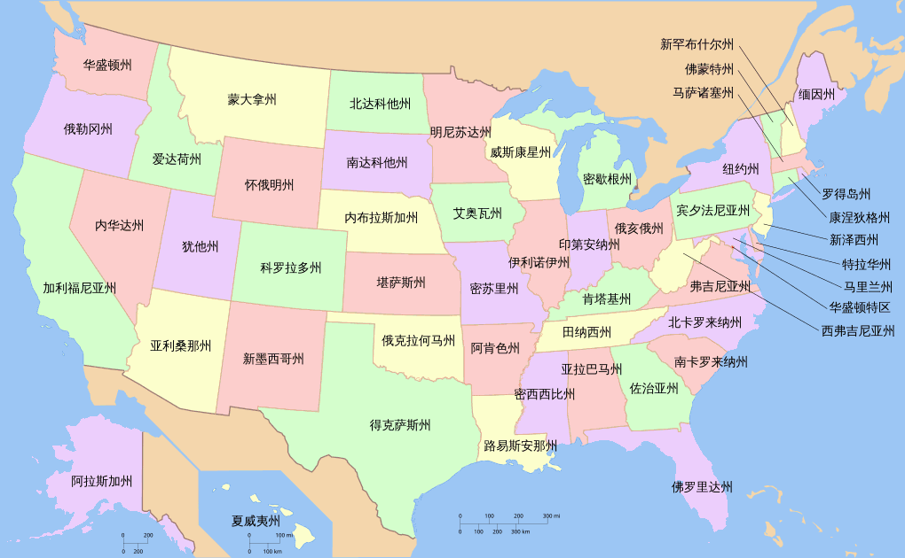
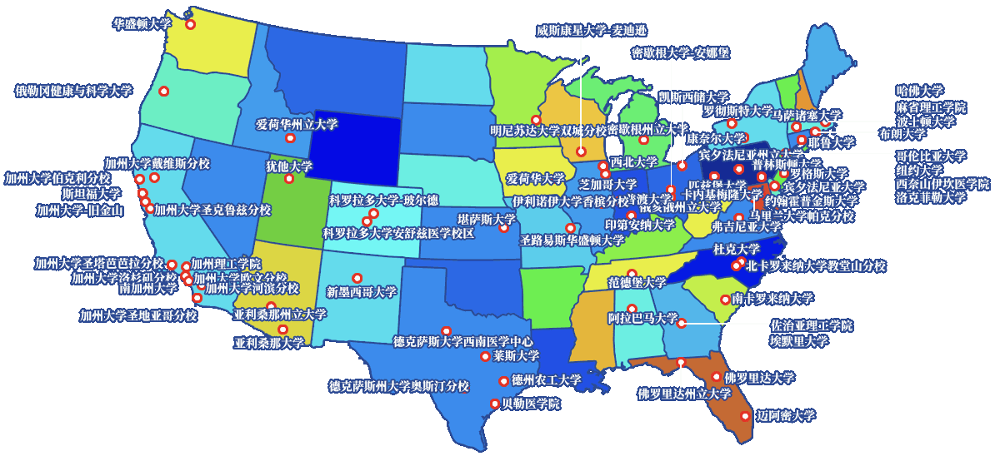

美国院校半边天 👩‍🎓🌿
==============
大萌汇编　202505　收录中…	<base target="_blank">

　　中美两国的大学数量居全球之冠，都有三千来所，各顶地球半边天。本页收录教育部[中国留学服务中心](https://www.cscse.edu.cn/ '中留服认证')认证的美国高等院校**1546-1**所，这个数量是美国全部四年制大学数量的大约一半，就是常说的中国‘承认学历’的美国大学。但是中留服这个网页，没有提供搜索，译名也不规范，比如把 iowa 译为 爱荷华，而不是外交部使用的 艾奥瓦(州)。这会给人们查证院校带来困难。

　　中美两国在社会制度上有根本不同，反映在教育上，美国大学主要依靠商业化运作，有很多著名的私立大学，比如：哈佛、斯坦福、麻省理工、普林斯顿。而且美国的教育部不负责全国的大学认证，完全由社会机构进行，以至出现了俗称的‘野鸡大学’。甚至在2025年3月，美国总统签署了行政命令，启动解散美国教育部的程序。这种区别还反映在，要想查[中国大学的名单](https://Laosheng.top/fuwu/yuanxiao '高等院校三千所')全集，比较容易；而要想查美国的大学名单全集，比较困难。

　　大萌希望缓解上述困难，帮助读者迅速查看一所美国大学的‘段位’。信息正在添加，欢迎提出意见。出国留学的需求广泛而持久，网上有大量商业网站提供服务，本页无意冠上加冠。此页可查到美国大学的中文译名、别名、建校年份、院校[所在州](USA50 '美国五十州')、名校荣誉、大学官网 等等，蓝色的校名点开是大学的官网。请善用浏览器的页面检索功能。

<div id="mulu" align="right">
⏩老生常谈 /<a href="https://Laosheng.top/ydyl/dir" target="_top">【一带一路】</a>
/ 美国院校
</div>

## 简目 　🏛️🏫👩‍🎓👨‍🏫

　　数据来源　收录进度　1.[各州大学标记](#1){:target="_top"}　2.[未分州的大学](#2){:target="_top"}　3.[更多美国大学](#3){:target="_top"}　4.参考文献 



## 数据来源与参考

*	中国留学网 / [认证院校查询](https://yxcx.cscse.edu.cn/rzyxmd) / M-美国 （中留服认证）
*	(北京)指南者留学 / [教育部认证院校查询](https://www.compassedu.hk/certified) / 美国 （可搜索）
*	(辽宁)各国学校排名网 / 美国([按州排序](https://www.university-list.net/meiguo/daxue-1000.htm) )（有网址）
*	(美国留学中介) 续航教育：美国大学[USNews排名](https://www.forwardpathway.com/ranking)（标学费）
*	……
*	University，大学，多指有博士学位的综合大学
*	Institute，学院，研究院
*	College，大学的统称，类似与中国的大学包括本科、大专、高职。

<div align="center">
</div>

## 收录进度

	缩写	州名　　　	收录数		缩写	州名　　　	收录数		缩写	州名　	收录数
											
	AL	亚拉巴马州	16		LA	路易斯安那州	12		OH	俄亥俄州　	43
	AR	阿肯色州　	10		MA	马萨诸塞州	51		OK	俄克拉何马州	19
	AZ	亚利桑那州	8		MD	马里兰州　	20		OR	俄勒冈州　	13
	CA	加利福尼亚州	79		ME	缅因州　　	8		PA	宾夕法尼亚州	73
	CO	科罗拉多州	13		MI	密歇根州　	30		RI	罗得岛州　	9
	CT	康涅狄格州	17		MN	明尼苏达州	15		SC	南卡罗来纳州	19
	DE	特拉华州　	4		MO	密苏里州　	30		SD	南达科他州	6
	FL	佛罗里达州	37		MS	密西西比州	12		TN	田纳西州　	25
	GA	佐治亚州　	35		MT	蒙大拿州　	2		TX	得克萨斯州	55
	HI	夏威夷州　	1		NC	北卡罗来纳州	32		UT	犹他州　　	7
	IA	艾奥瓦州　	16		ND	北达科他州	5		VA	弗吉尼亚州	29
	ID	爱达荷州　	6		NE	内布拉斯加州	7		VT	佛蒙特州　	7
	IL	伊利诺伊州	50		NH	新罕布什尔州	10		WA	华盛顿州　	22
	IN	印第安纳州	26		NJ	新泽西州　	19		WI	威斯康星州	13
	KS	堪萨斯州　	15		NM	新墨西哥州	5		WV	西弗吉尼亚州	10
	KY	肯塔基州　	21		NV	内华达州　	1		WY	怀俄明州　	1
						NY	纽约州　　	59		DC	哥伦比亚特区	10
											GU	关岛　　　	1
											MP	北马里亚纳群岛	1

<div id="1" align="right">Laosheng<a href="#mulu" target="_top">.Top</a>↑</div>


1、各州大学
-----------

　　已为1035所大学填充所在州，按各州分段，按建校年份排序，没有年份的按校名英文排序。蓝色的校名点开是大学的官网。  

　　本节标记的名校荣誉有：🌿 常春藤(私立) 8所、🍃 公立常春藤 30所  
　　专业标记有：🔯 军队院校、⚕️ 医学院校


AL　1831  　	[阿拉巴马大学](http://www.ua.edu/)	　The University of Alabama	  
AL  　	[阿拉巴马州立大学](http://www.alasu.edu/)	　Alabama State University	  
AL  　	[雅典州立大学](http://www.athens.edu/)	　Athens State University	  
AL  　	[奥本大学](http://www.auburn.edu/)	　Auburn University	  
AL  　	[奥本大学蒙哥马利分校](http://www.aum.edu/)	　Auburn University at Montgomery	  
AL  　	[杰克逊维尔州立大学](http://www.jsu.edu/)	　Jacksonville State University	  
AL  　	[迈尔斯学院](http://www.miles.edu/)	　Miles College	  
AL  　	[欧克伍德大学](http://www.oakwood.edu/)	　Oakwood University	  
AL  　	[桑福德大学](http://www.samford.edu/)	　Samford University	  
AL  　	[南阿拉巴马大学](http://www.usouthal.edu/)	　The University of South Alabama	  
AL  　	[特洛伊大学](http://www.troy.edu/)	　Troy University	  
AL  　	[美国体育学院](https://ussa.edu/)	　United States Sports Academy	  
AL  　	[莫比尔大学](http://umobile.edu/)	　University of Mobile	  
AL  　	[蒙特瓦洛大学](http://www.montevallo.edu/)	　University of Montevallo	  
AL  　	[北阿拉巴马大学](https://www.una.edu/)	　University of North Alabama	  
AL  　	[西阿拉巴马大学](http://www.uwa.edu/)	　University of West Alabama	  

AR   ⚕️　	[阿肯色大学医学院](http://www.uams.edu/)	　University of Arkansas for Medical Sciences	  
AR  　	[阿肯色州立大学](http://www.astate.edu/)	　Arkansas State University	  
AR  　	[阿肯色理工大学](http://www.atu.edu/)	　Arkansas Tech University	  
AR  　	[哈丁大学](http://www.harding.edu/)	　Harding University	  
AR  　	[亨德森州立大学](http://www.hsu.edu/)	　Henderson State University	  
AR  　	[亨德里克斯学院](http://www.hendrix.edu/)	　Hendrix College	  
AR  　	[约翰布朗大学](http://www.jbu.edu/)	　John Brown University	  
AR  　	[沃希托浸会大学](http://www.obu.edu/)	　Ouachita Baptist University	  
AR  　	[南阿肯色大学](http://www.saumag.edu/)	　Southern Arkansas University	  
AR  　	[中阿肯色大学](http://uca.edu/)	　University of Central Arkansas	  

AZ　1885  公立  🍃　	[亚利桑那大学](http://www.arizona.edu/)	　The University of Arizona	  
AZ  　	[亚利桑那州立大学](http://www.asu.edu/)	　Arizona State University	  
AZ  　	[安柏瑞德航空航天大学](http://www.erau.edu/)	　Embry-Riddle Aeronautical University	AZ/FL  
AZ  　	[大峡谷大学](http://www.gcu.edu/)	　Grand Canyon University	  
AZ  　	[中北大学](http://www.ncu.edu/)	　Northcentral University	  
AZ  　	[北亚利桑那大学](http://www.nau.edu/)	　Northern Arizona University	  
AZ  　	[普雷斯科特学院](http://www.prescott.edu/)	　Prescott College	  
AZ  　	[先进技术大学](http://www.uat.edu/)	　University of Advancing Technology	  

CA　1868  公立  🍃　	[加州大学伯克利分校](http://www.berkeley.edu/)	　University of California, Berkeley	<sub>加利福尼亚大学伯克利分校 加州大学创始校区</sub>  
CA　1891  公立  🍃　	[斯坦福大学](http://www.stanford.edu/)	　Stanford University	  
CA　1919  公立  🍃　	[加州大学洛杉矶分校](https://www.ucla.edu/)	　University of California, Los Angeles	<sub>加利福尼亚大学洛杉矶分校 </sub>  
CA　1958  公立  🍃　	[加州大学圣巴巴拉分校](https://www.ucsb.edu/)	　University of California, Santa Barbara	<sub>加利福尼亚大学圣芭芭拉分校 1891年的安娜·布雷克学校</sub>  
CA　1959  公立  🍃　	[加州大学戴维斯分校](http://www.ucdavis.edu/)	　University of California, Davis	<sub>加利福尼亚大学戴维斯分校 1905年的加州大学农场</sub>  
CA　1960  公立  🍃　	[加州大学圣迭戈分校](http://www.ucsd.edu/)	　University of California, San Diego	<sub>加利福尼亚大学圣地亚哥分校 加州大学第七个校区</sub>  
CA　1965  公立  🍃　	[加州大学欧文分校](https://www.uci.edu/)	　University of California, Irvine	<sub>加利福尼亚大学尔湾分校 </sub>  
CA   ⚕️　	[西部卫生科学大学](http://www.westernu.edu/)	　Western University of Health Sciences	  
CA  　	[旧金山艺术大学](http://www.academyart.edu/)	　Academy of Art University	  
CA  　	[阿莱恩特国际大学](http://www.alliant.edu/)	　Alliant International University	  
CA  　	[美国电影学院](http://www.afi.com/)	　American Film Institute	  
CA  　	[艺术中心设计学院](http://www.artcenter.edu/)	　Art Center College of Design	  
CA  　	[阿祖萨太平洋大学](http://www.apu.edu/)	　Azusa Pacific University	  
CA  　	[比奥拉大学](http://www.biola.edu/)	　Biola University	  
CA  　	[加利福尼亚浸会大学](http://www.calbaptist.edu/)	　California Baptist University	  
CA  　	[加利福尼亚艺术学院](https://www.cca.edu/)	　California College of the Arts	  
CA  　	[加利福尼亚综合研究学院](http://www.ciis.edu/)	　California Institute of Integral Studies	  
CA  　	[加利福尼亚理工学院](http://www.caltech.edu/)	　California Institute of Technology	  
CA  　	[加利福尼亚艺术学院](http://calarts.edu/)	　California Institute of the Arts	  
CA  　	[加利福尼亚路德大学](http://www.callutheran.edu/)	　California Lutheran University	  
CA  　	[加利福尼亚州立理工大学圣路易斯奥比斯波分校](http://www.calpoly.edu/)	　California Polytechnic State University, San Luis Obispo	  
CA  　	[加利福尼亚州立理工大学波莫纳分校](http://www.cpp.edu/)	　California State Polytechnic University, Pomona	  
CA  　	[查普曼大学](http://www.chapman.edu/)	　Chapman University	  
CA  　	[克莱蒙研究生大学](http://www.cgu.edu/)	　Claremont Graduate University	  
CA  　	[克莱蒙麦肯纳学院](http://www.cmc.edu/)	　Claremont McKenna College	  
CA  　	[克莱蒙神学院](http://cst.edu/)	　Claremont School of Theology	  
CA  　	[加利福尼亚多米尼克大学](http://www.dominican.edu/)	　Dominican University of California	  
CA  　	[服装设计营销学院](http://fidm.edu/)	　Fashion Institute of Design & Merchandising	  
CA  　	[弗雷斯诺太平洋大学](http://www.fresno.edu/)	　Fresno Pacific University	  
CA  　	[富勒神学院](http://fuller.edu/)	　Fuller Theological Seminary	  
CA  　	[金门大学](http://www.ggu.edu/)	　Golden Gate University	  
CA  　	[神学研究联盟](http://gtu.edu/)	　Graduate Theological Union	  
CA  　	[哈维马德学院](https://www.hmc.edu/)	　Harvey Mudd College	  
CA  　	[拉谢拉大学](http://lasierra.edu/)	　La Sierra University	  
CA  　	[洛马琳达大学](http://www.llu.edu/)	　Loma Linda University	  
CA  　	[洛约拉玛丽蒙特大学](http://www.lmu.edu/)	　Loyola Marymount University	  
CA  　	[曼隆学院](http://www.menlo.edu/)	　Menlo College	  
CA  　	[密尔斯学院](http://www.mills.edu/)	　Mills College	  
CA  　	[圣玛丽山大学](http://www.msmu.edu/)	　Mount Saint Mary's University	  
CA  　	[国民大学](http://www.nu.edu/)	　National University	  
CA  　	[纳穆尔圣母大学](http://www.ndnu.edu/)	　Notre Dame de Namur University	  
CA  　	[西方学院](http://www.oxy.edu/)	　Occidental College	  
CA  　	[奥利弗大学](http://www.olivetuniversity.edu/)	　Olivet University	  
CA  　	[太平洋联合学院](http://www.puc.edu/)	　Pacific Union College	  
CA  　	[帕西菲卡研究所](http://www.pacifica.edu/)	　Pacifica Graduate Institute	  
CA  　	[帕洛阿尔托大学](http://www.paloaltou.edu/)	　Palo Alto University	  
CA  　	[佩波戴恩大学](http://www.pepperdine.edu/)	　Pepperdine University	  
CA  　	[皮特泽学院](http://www.pitzer.edu/)	　Pitzer College	  
CA  　	[波音特洛玛拿撒勒大学](http://www.pointloma.edu/)	　Point Loma Nazarene University	  
CA  　	[波莫纳学院](http://www.pomona.edu/)	　Pomona College	  
CA  　	[加利福尼亚圣玛丽学院](http://www.stmarys-ca.edu/)	　Saint Mary's College of California	  
CA  　	[塞缪尔梅里特学院](http://www.samuelmerritt.edu/)	　Samuel Merritt University	  
CA  　	[圣地亚哥基督大学](http://sdcc.edu/)	　San Diego Christian College	  
CA  　	[圣地亚哥州立大学](http://www.sdsu.edu/)	　San Diego State University	  
CA  　	[旧金山艺术学院](http://www.sfai.edu/)	　San Francisco Art Institute	  
CA  　	[旧金山音乐学院](http://www.sfcm.edu/)	　San Francisco Conservatory of Music	  
CA  　	[旧金山州立大学](http://www.sfsu.edu/)	　San Francisco State University	  
CA  　	[圣克拉拉大学](http://www.scu.edu/)	　Santa Clara University	  
CA  　	[斯克里普斯学院](http://www.scrippscollege.edu/)	　Scripps College	  
CA  　	[辛普森大学](http://simpsonu.edu/)	　Simpson University	  
CA  　	[索菲亚大学](http://www.sofia.edu/)	　Sofia University	  
CA  　	[美国创价大学](http://www.soka.edu/)	　Soka University of America	  
CA  　	[索诺玛州立大学](http://www.sonoma.edu/)	　Sonoma State University	  
CA  　	[南加利福尼亚建筑学院](http://www.sciarc.edu/)	　Southern California Institute of Architecture	  
CA  　	[斯克里普斯研究所](http://www.scripps.edu/)	　The Scripps Research Institute	  
CA  　	[赖特学院](http://www.wi.edu/)	　The Wright Institute	  
CA  　	[托马斯阿奎那斯学院](http://www.thomasaquinas.edu/)	　Thomas Aquinas College	  
CA  　	[拉文大学](http://laverne.edu/)	　University of La Verne	  
CA  　	[雷德兰兹大学](http://www.redlands.edu/)	　University of Redlands	  
CA  　	[圣地亚哥大学](http://www.sandiego.edu/)	　University of San Diego	  
CA  　	[旧金山大学](http://www.usfca.edu/)	　University of San Francisco	  
CA  　	[南加利福尼亚大学](http://www.usc.edu/)	　University of Southern California	  
CA  　	[太平洋大学（加利福尼亚州）](http://www.pacific.edu/)	　University of the Pacific	  
CA  　	[西部大学](http://www.uwest.edu/)	　University of the West	  
CA  　	[南加利福尼亚先锋大学](http://www.vanguard.edu/)	　Vanguard University of Southern California	  
CA  　	[威斯蒙特学院](http://www.westmont.edu/)	　Westmont College	  
CA  　	[惠提尔学院](http://www.whittier.edu/)	　Whittier College	  
CA  　	[威廉杰瑟普大学](http://www.jessup.edu/)	　William Jessup University	  
CA  　	[伍德伯里大学](http://woodbury.edu/)	　Woodbury University	  

CO　1876  公立  🍃　	[科罗拉多大学](https://www.colorado.edu/)	　University of Colorado at Boulder	<sub>科罗拉多大学博德分校 科罗拉多大学系统的旗舰校区</sub>  
CO  　	[科罗拉多基督大学](http://www.ccu.edu/)	　Colorado Christian University	  
CO  　	[科罗拉多学院](http://www.coloradocollege.edu/)	　Colorado College	  
CO  　	[科罗拉多梅萨大学](http://www.coloradomesa.edu/)	　Colorado Mesa University	  
CO  　	[科罗拉多矿业学院](http://www.mines.edu/)	　Colorado School of Mines	  
CO  　	[科罗拉多州立大学](http://www.colostate.edu/)	　Colorado State University	  
CO  　	[科罗拉多理工大学](http://www.coloradotech.edu/)	　Colorado Technical University	  
CO  　	[路易斯堡学院](http://www.fortlewis.edu/)	　Fort Lewis College	  
CO  　	[丹佛大都会州立大学](http://www.msudenver.edu/)	　Metropolitan State University of Denver	  
CO  　	[那洛巴大学](http://www.naropa.edu/)	　Naropa University	  
CO  　	[瑞吉斯大学](http://www.regis.edu/)	　Regis University	  
CO  　	[丹佛大学](http://www.du.edu/)	　University of Denver	  
CO  　	[北科罗拉多大学](http://www.unco.edu/)	　University of Northern Colorado	  

CT　1701   🌿　	[耶鲁大学](http://www.yale.edu/)	　Yale University	5位美国总统、65名诺贝尔奖得主  
CT　1823  　	[三一学院](http://www.trincoll.edu/)	　Trinity College	  
CT　1831  　	[卫斯理大学](http://www.wesleyan.edu/)	　Wesleyan University	  
CT　1881  公立  🍃　	[康涅狄格大学](http://uconn.edu/)	　University of Connecticut	  
CT  　	[马格纳斯学院](http://www.albertus.edu/)	　Albertus Magnus College	  
CT  　	[中康涅狄格州立大学](http://www.ccsu.edu/)	　Central Connecticut State University	  
CT  　	[康涅狄格学院](http://camel.conncoll.edu/)	　Connecticut College	  
CT  　	[东康涅狄格州立大学](http://www.easternct.edu/)	　Eastern Connecticut State University	  
CT  　	[费尔菲尔德大学](http://www.fairfield.edu/)	　Fairfield University	  
CT  　	[普斯特大学](http://www.post.edu/)	　Post University	  
CT  　	[昆宁佩克大学](http://www.quinnipiac.edu/)	　Quinnipiac University	  
CT  　	[圣心大学](http://www.sacredheart.edu/)	　Sacred Heart University	  
CT  　	[南康涅狄格州立大学](http://www.southernct.edu/)	　Southern Connecticut State University	  
CT  　	[桥港大学](http://www.bridgeport.edu/)	　University of Bridgeport	  
CT  　	[哈特福德大学](http://www.hartford.edu/)	　University of Hartford	  
CT  　	[纽黑文大学](http://www.newhaven.edu/)	　University of New Haven	  
CT  　	[西康涅狄格州立大学](http://www.wcsu.edu/)	　Western Connecticut State University	  

DC　1789  　	[乔治敦大学](http://www.georgetown.edu/)	　Georgetown University	  
DC  　	[加劳德特大学](http://www.gallaudet.edu/)	　Gallaudet University	  
DC  　	[霍华德大学](http://www.howard.edu/)	　Howard University	  
DC  　	[斯特雷耶大学](http://www.strayer.edu/)	　Strayer University	  
DC  　	[美利坚大学](http://www.american.edu/)	　The American University	  
DC  　	[美国天主教大学](http://www.cua.edu/)	　The Catholic University of America	  
DC  　	[乔治华盛顿大学](http://www.gwu.edu/)	　The George Washington University	  
DC  　	[世界政治学院](http://www.iwp.edu/)	　The Institute of World Politics	  
DC  　	[哥伦比亚特区大学](http://www.udc.edu/)	　University of the District of Columbia	  
DC  　	[波托马克大学](http://www.potomac.edu/)	　University of the Potomac	  

DE　1743  公立  🍃　	[特拉华大学](http://www.udel.edu/)	　University of Delaware	  
DE  　	[特拉华州立大学](http://www.desu.edu/)	　Delaware State University	  
DE  　	[高地毕肯学院](http://www.gbc.edu/)	　Goldey-Beacom College	  
DE  　	[威明顿大学](http://www.wilmu.edu/)	　Wilmington University	  

FL　1853  公立  🍃　	[佛罗里达大学](http://www.ufl.edu/)	　The University of Florida	  
FL  　	[贝瑞大学](http://www.barry.edu/)	　Barry University	  
FL  　	[布劳沃德学院](http://www.broward.edu/)	　Broward College	  
FL  　	[代托纳州立学院](http://www.daytonastate.edu/)	　Daytona State College	  
FL  　	[埃克德学院](http://www.eckerd.edu/)	　Eckerd College	  
FL  　	[弗拉格勒学院](http://www.flagler.edu/)	　Flagler College	  
FL  　	[佛罗里达大西洋大学](http://www.fau.edu/)	　Florida Atlantic University	  
FL  　	[佛罗里达海湾海岸大学](http://www.fgcu.edu/)	　Florida Gulf Coast University	  
FL  　	[佛罗里达理工学院](http://www.fit.edu/)	　Florida Institute of Technology	  
FL  　	[佛罗里达国际大学](http://www.fiu.edu/)	　Florida International University	  
FL  　	[佛罗里达南方学院](http://www.flsouthern.edu/)	　Florida Southern College	<!-- http://floridapolytechnic.org/  
FL  　	[杰克逊维尔佛罗里达州立学院](http://www.fscj.edu/)	　Florida State College at Jacksonville	  
FL  　	[佛罗里达州立大学](http://www.fsu.edu/)	　Florida State University	  
FL  　	[印第安河州立学院](http://www.irsc.edu/)	　Indian River State College	  
FL  　	[杰克逊维尔大学](http://www.ju.edu/)	　Jacksonville University	  
FL  　	[凯泽大学](http://www.keiseruniversity.edu/)	　Keiser University	  
FL  　	[林恩大学](http://www.lynn.edu/)	　Lynn University	  
FL  　	[迈阿密达德学院](http://www.mdc.edu/)	　Miami Dade College	  
FL  　	[新佛罗里达学院](http://www.ncf.edu/)	　New College of Florida	  
FL  　	[诺斯伍徳大学](http://www.northwood.edu/)	　Northwood University	FL / MI / TX  
FL  　	[诺瓦东南大学](http://www.nova.edu/)	　Nova Southeastern University	  
FL  　	[棕榈滩大西洋大学](http://www.pba.edu/)	　Palm Beach Atlantic University	  
FL  　	[彭萨科拉州立学院](http://www.pensacolastate.edu/)	　Pensacola State College	  
FL  　	[波尔克州立学院](http://www.polk.edu/)	　Polk State College	  
FL  　	[若林斯学院](http://www.rollins.edu/)	　Rollins College	  
FL  　	[圣里奥大学](http://www.saintleo.edu/)	　Saint Leo University	  
FL  　	[圣托马斯大学](http://www.stu.edu/)	　Saint Thomas University	  
FL  　	[圣达菲学院](http://www.sfcollege.edu/)	　Santa Fe College	  
FL  　	[佛罗里达塞米诺尔州立学院](http://www.seminolestate.edu/)	　Seminole State College of Florida	  
FL  　	[史丹森大学](http://www.stetson.edu/)	　Stetson University	  
FL  　	[坦帕大学](http://www.ut.edu/)	　The University of Tampa	  
FL  　	[西佛罗里达大学](http://uwf.edu/)	　The University of West Florida	  
FL  　	[中佛罗里达大学](http://www.ucf.edu/)	　University of Central Florida	  
FL  　	[迈阿密大学（佛罗里达州）](http://www.miami.edu/)	　University of Miami	  
FL  　	[北佛罗里达大学](http://www.unf.edu/)	　University of North Florida	  
FL  　	[南佛罗里达大学](http://www.usf.edu/)	　University of South Florida	  
FL  　	[韦伯国际大学](http://webber.edu/)	　Webber International University	  

GA　1785  公立  🍃　	[乔治亚大学](http://www.uga.edu/)	　The University of Georgia	<sub>佐治亚大学 佐治亚大学系统的旗舰大学</sub>  
GA　1836  　	[埃默里大学](http://www.emory.edu/)	　Emory University	  
GA  　	[阿涅斯斯科特学院](http://www.agnesscott.edu/)	　Agnes Scott College	  
GA  　	[奥尔巴尼州立大学](http://www.asurams.edu/)	　Albany State University	  
GA  　	[贝里学院](http://www.berry.edu/)	　Berry College	  
GA  　	[布雷诺大学](http://www.brenau.edu/)	　Brenau University	  
GA  　	[克拉克亚特兰大大学](http://www.cau.edu/)	　Clark Atlanta University	  
GA  　	[克莱顿州立大学](http://www.clayton.edu/)	　Clayton State University	  
GA  　	[哥伦布州立大学](http://www.columbusstate.edu/)	　Columbus State University	  
GA  　	[卡文南特学院](http://www.covenant.edu/)	　Covenant College	  
GA  　	[道尔顿州立大学](http://www.daltonstate.edu/)	　Dalton State College	  
GA  　	[伊曼纽尔学院（马萨诸塞州）](http://www.ec.edu/)	　Emmanuel College	  
GA  　	[瓦利堡州立大学](http://www.fvsu.edu/)	　Fort Valley State University	  
GA  　	[佐治亚学院暨州立大学](http://www.gcsu.edu/)	　Georgia College & State University	  
GA  　	[佐治亚格威内特学院](http://www.ggc.edu/)	　Georgia Gwinnett College	  
GA  　	[佐治亚南方大学](http://www.georgiasouthern.edu/)	　Georgia Southern University	  
GA  　	[佐治亚西南州立大学](http://www.gsw.edu/)	　Georgia Southwestern State University	  
GA  　	[佐治亚州立大学](http://www.gsu.edu/)	　Georgia State University	  
GA  　	[肯尼索州立大学](http://www.kennesaw.edu/)	　Kennesaw State University	  
GA  　	[拉格朗日学院](http://www.lagrange.edu/)	　LaGrange College	  
GA  　	[生命大学](http://www.life.edu/)	　Life University	  
GA  　	[默瑟大学](http://www.mercer.edu/)	　Mercer University	  
GA  　	[中佐治亚州立大学](http://www.mga.edu/)	　Middle Georgia State University	  
GA  　	[莫尔豪斯学院](http://www.morehouse.edu/)	　Morehouse College	  
GA  　	[奥格尔绍普大学](http://www.oglethorpe.edu/)	　Oglethorpe University	  
GA  　	[萨凡纳州立大学](http://www.savannahstate.edu/)	　Savannah State University	  
GA  　	[南方大学](http://www.southuniversity.edu/)	　South University	  
GA  　	[斯佩尔曼学院](http://www.spelman.edu/)	　Spelman College	  
GA  　	[佐治亚理工学院](http://www.gatech.edu/)	　The Georgia Institute of Technology	  
GA  　	[托马斯大学](http://www.thomasu.edu/)	　Thomas University	  
GA  　	[托科阿瀑布学院](http://www.tfc.edu/)	　Toccoa Falls College	  
GA  　	[北佐治亚大学](http://ung.edu/)	　University of North Georgia	  
GA  　	[西佐治亚大学](http://www.westga.edu/)	　University of West Georgia	  
GA  　	[瓦尔多斯塔州立大学](http://www.valdosta.edu/)	　Valdosta State University	  
GA  　	[卫斯理安学院](http://www.wesleyancollege.edu/)	　Wesleyan College	  

GU  　	[关岛大学](http://www.uog.edu/)	　University of Guam	  

HI  　	[夏威夷太平洋大学](http://www.hpu.edu/)	　Hawaii Pacific University	  

IA　1846  　	[格林奈尔学院](http://www.grinnell.edu/)	　Grinnell College	  
IA　1847  公立  🍃　	[艾奥瓦大学](http://www.uiowa.edu/)	　The University of Iowa	<sub>爱荷华大学 艾奥瓦州立大学系统的旗舰校</sub>  
IA　1858  公立 　	[爱荷华州立大学](http://www.iastate.edu/)	　Iowa State University	Iowa State University of Science and Technology  
IA  　	[比尤纳维斯特大学](http://www.bvu.edu/)	　Buena Vista University	  
IA  　	[中央学院](http://www.central.edu/)	　Central College	  
IA  　	[柯伊学院](http://www.coe.edu/)	　Coe College	  
IA  　	[康奈尔学院](http://www.cornellcollege.edu/)	　Cornell College	  
IA  　	[德雷克大学](http://www.drake.edu/)	　Drake University	  
IA  　	[格里斯兰大学](http://www.graceland.edu/)	　Graceland University	  
IA  　	[路德学院](http://www.luther.edu/)	　Luther College	  
IA  　	[摩西山大学](http://www.mtmercy.edu/)	　Mount Mercy University	  
IA  　	[西北学院](http://www.nwciowa.edu/)	　Northwestern College	  
IA  　	[杜比克大学](http://www.dbq.edu/)	　University of Dubuque	  
IA  　	[北爱荷华大学](http://www.uni.edu/)	　University of Northern Iowa	  
IA  　	[上爱荷华大学](http://www.uiu.edu/)	　Upper Iowa University	  
IA  　	[沃特伯格学院](http://www.wartburg.edu/)	　Wartburg College	  

ID  　	[博伊西州立大学](http://www.boisestate.edu/)	　Boise State University	  
ID  　	[爱达荷州立大学](http://www.isu.edu/)	　Idaho State University	  
ID  　	[路易斯克拉克州立大学](http://www.lcsc.edu/)	　Lewis-Clark State College	  
ID  　	[西北拿撒勒大学](http://www.nnu.edu/)	　Northwest Nazarene University	  
ID  　	[爱达荷学院](http://www.collegeofidaho.edu/)	　The College of Idaho	  
ID  　	[爱达荷大学](http://www.uidaho.edu/)	　The University of Idaho	  

IL　1834  　	[威顿学院（伊利诺伊州）](http://www.wheaton.edu/)	　Wheaton College	  
IL　1837  　	[诺克斯学院](http://www.knox.edu/)	　Knox College	  
IL　1867  公立  🍃　	[伊利诺伊大学](https://illinois.edu/)	　University of Illinois at Urbana-Champaign	<sub>伊利诺伊大学香槟分校 伊利诺伊大学系统的创始校区，厄巴纳-香槟分校</sub>  
IL　1890   🌲　	[芝加哥大学](http://www.uchicago.edu/)	　The University of Chicago	石油大王约翰·洛克菲勒创办  
IL  　	[阿德勒大学](http://www.adler.edu/)	　Adler University	  
IL  　	[奥古斯塔娜学院（伊利诺伊州）](http://www.augustana.edu/)	　Augustana College	  
IL  　	[奥罗拉大学](http://www.aurora.edu/)	　Aurora University	  
IL  　	[班尼迪克大学](http://www.ben.edu/)	　Benedictine University	  
IL  　	[布莱克伯恩学院](http://blackburn.edu/)	　Blackburn College	  
IL  　	[布拉德利大学](http://www.bradley.edu/)	　Bradley University	  
IL  　	[天主教神学联盟](http://www.ctu.edu/)	　Catholic Theological Union	  
IL  　	[芝加哥州立大学](http://www.csu.edu/)	　Chicago State University	  
IL  　	[芝加哥哥伦比亚学院](http://www.colum.edu/)	　Columbia College Chicago	  
IL  　	[德保罗大学](http://www.depaul.edu/)	　DePaul University	  
IL  　	[德锐大学](http://www.devry.edu/)	　DeVry University	  
IL  　	[多米尼肯大学](http://www.dom.edu/)	　Dominican University	  
IL  　	[东西大学](http://www.eastwest.edu/)	　East-West University	  
IL  　	[东伊利诺伊大学](http://www.eiu.edu/)	　Eastern Illinois University	  
IL  　	[艾里克森研究院](http://www.erikson.edu/)	　Erikson Institute	  
IL  　	[州长州立大学](http://www.govst.edu/)	　Governors State University	  
IL  　	[伊利诺伊学院](http://www.ic.edu/)	　Illinois College	  
IL  　	[伊利诺伊理工学院](http://www.iit.edu/)	　Illinois Institute of Technology	  
IL  　	[伊利诺伊州立大学](http://illinoisstate.edu/)	　Illinois State University	  
IL  　	[伊利诺伊卫斯理大学](http://www.iwu.edu/)	　Illinois Wesleyan University	  
IL  　	[莱克福里斯特学院](http://www.lakeforest.edu/)	　Lake Forest College	  
IL  　	[莱克福里斯特管理研究生院](http://www.lakeforestmba.edu/)	　Lake Forest Graduate School of Management	  
IL  　	[路易斯大学](http://www.lewisu.edu/)	　Lewis University	  
IL  　	[林肯基督教大学](http://www.lincolnchristian.edu/)	　Lincoln Christian University	  
IL  　	[芝加哥洛约拉大学](http://www.luc.edu/)	　Loyola University Chicago	  
IL  　	[中西大学](http://www.midwestern.edu/)	　Midwestern University	IL/AZ  
IL  　	[密利克大学](http://www.millikin.edu/)	　Millikin University	  
IL  　	[蒙莫斯学院](http://www.monmouthcollege.edu/)	　Monmouth College	  
IL  　	[慕迪圣经学院](http://www.moody.edu/)	　Moody Bible Institute	  
IL  　	[北部中心学院](http://www.northcentralcollege.edu/)	　North Central College	  
IL  　	[北园大学](http://www.northpark.edu/)	　North Park University	  
IL  　	[东北伊利诺伊大学](http://www.neiu.edu/)	　Northeastern Illinois University	  
IL  　	[北伊利诺伊大学](http://www.niu.edu/)	　Northern Illinois University	  
IL  　	[西北大学](http://www.northwestern.edu/)	　Northwestern University	  
IL  　	[奥利弗拿撒勒大学](http://www.olivet.edu/)	　Olivet Nazarene University	  
IL  　	[普林西匹亚学院](http://www.principiacollege.edu/)	　Principia College	  
IL  　	[罗克福德大学](http://www.rockford.edu/)	　Rockford University	  
IL  　	[罗斯福大学](http://www.roosevelt.edu/)	　Roosevelt University	  
IL  　	[拉什大学](http://www.rushu.rush.edu/)	　Rush University	  
IL  　	[圣泽维尔大学](http://www.sxu.edu/)	　Saint Xavier University	  
IL  　	[芝加哥艺术学院](http://www.saic.edu/)	　School of the Art Institute of Chicago	  
IL  　	[丰田工业大学芝加哥分校](http://www.ttic.edu/)	　The Toyota Technological Institute at Chicago	  
IL  　	[三一基督学院](http://www.trnty.edu/)	　Trinity Christian College	  
IL  　	[三一国际大学](http://www.tiu.edu/)	　Trinity International University	  
IL  　	[范德库克音乐学院](http://www.vandercook.edu/)	　VanderCook College of Music	  
IL  　	[西伊利诺伊大学](http://www.wiu.edu/)	　Western Illinois University	  

IN　1820  公立  🍃　	[印第安纳大学](http://bloomington.iu.edu/)	　Indiana University Bloomington	<sub>印第安纳大学布鲁明顿分校 </sub>  
IN　1842  　	[圣母大学](http://www.nd.edu/)	　University of Notre Dame	  
IN　1843  　	[圣十字学院](http://www.hcc-nd.edu/)	　Holy Cross College	  
IN  　	[安德森大学](http://www.anderson.edu/)	　Anderson University	  
IN  　	[波尔州立大学](http://www.bsu.edu/)	　Ball State University	  
IN  　	[巴特勒大学](https://www.butler.edu/)	　Butler University	  
IN  　	[迪堡大学](http://www.depauw.edu/)	　DePauw University	  
IN  　	[厄勒姆学院](http://www.earlham.edu/)	　Earlham College	  
IN  　	[高盛学院](http://www.goshen.edu/)	　Goshen College	  
IN  　	[汉诺威学院](http://www.hanover.edu/)	　Hanover College	  
IN  　	[亨廷顿大学](https://www.huntington.edu/)	　Huntington University	  
IN  　	[印第安纳州立大学](http://www.indstate.edu/)	　Indiana State University	  
IN  　	[印第安纳卫斯里大学](https://www.indwes.edu/)	　Indiana Wesleyan University	  
IN  　	[玛利亚大学](http://www.marian.edu/)	　Marian University	  
IN  　	[普渡大学](http://www.purdue.edu/)	　Purdue University	  
IN  　	[罗斯霍曼理工学院](http://www.rose-hulman.edu/)	　Rose-Hulman Institute of Technology	  
IN  　	[圣玛丽学院](https://www.saintmarys.edu/)	　Saint Mary's College	  
IN  　	[伍德圣玛丽学院](http://www.smwc.edu/)	　Saint Mary-of-the-Woods College	  
IN  　	[泰勒大学](http://www.taylor.edu/)	　Taylor University	  
IN  　	[柴恩大学](http://www.trine.edu/)	　Trine University	  
IN  　	[伊凡斯维尔大学](http://www.evansville.edu/)	　University of Evansville	  
IN  　	[印第安纳波利斯大学](http://www.uindy.edu/)	　University of Indianapolis	  
IN  　	[南印第安纳大学](http://www.usi.edu/)	　University of Southern Indiana	  
IN  　	[瓦尔帕莱索大学](http://www.valpo.edu/)	　Valparaiso University	  
IN  　	[温森斯大学](http://www.vinu.edu/)	　Vincennes University	  
IN  　	[沃巴什学院](http://www.wabash.edu/)	　Wabash College	  

KS  　	[贝克大学](http://www.bakeru.edu/)	　Baker University	  
KS  　	[巴克利学院](http://www.barclaycollege.edu/)	　Barclay College	  
KS  　	[班尼迪克坦学院](http://www.benedictine.edu/)	　Benedictine College	  
KS  　	[堪萨斯中央基督教学院](http://www.centralchristian.edu/)	　Central Christian College of Kansas	  
KS  　	[恩波利亚州立大学](http://www.emporia.edu/)	　Emporia State University	  
KS  　	[富特海斯州立大学](http://www.fhsu.edu/)	　Fort Hays State University	  
KS  　	[堪萨斯州立大学](http://www.k-state.edu/)	　Kansas State University	  
KS  　	[堪萨斯卫斯理大学](http://www.kwu.edu/)	　Kansas Wesleyan University	  
KS  　	[中美拿撒勒大学](http://www.mnu.edu/)	　MidAmerica Nazarene University	  
KS  　	[渥太华大学](http://www.ottawa.edu/)	　Ottawa University	  
KS  　	[匹兹堡州立大学](http://www.pittstate.edu/)	　Pittsburg State University	  
KS  　	[西南学院（堪萨斯州）](http://www.sckans.edu/)	　Southwestern College	  
KS  　	[堪萨斯大学](http://www.ku.edu/)	　The University of Kansas	  
KS  　	[沃西本恩大学](http://www.washburn.edu/)	　Washburn University	  
KS  　	[威奇塔州立大学](http://www.wichita.edu/)	　Wichita State University	  

KY　1780  　	[特兰西瓦尼亚大学](http://www.transy.edu/)	　Transylvania University	  
KY  　	[阿斯伯里神学院](http://asburyseminary.edu/)	　Asbury Theological Seminary	  
KY  　	[阿斯伯里大学](http://www.asbury.edu/)	　Asbury University	  
KY  　	[贝拉明大学](http://www.bellarmine.edu/)	　Bellarmine University	  
KY  　	[伯里亚学院](http://www.berea.edu/)	　Berea College	  
KY  　	[康伯斯威尔大学](http://www.campbellsville.edu/)	　Campbellsville University	  
KY  　	[森特学院](http://www.centre.edu/)	　Centre College	  
KY  　	[东肯塔基大学](http://www.eku.edu/)	　Eastern Kentucky University	  
KY  　	[乔治敦学院](http://www.georgetowncollege.edu/)	　Georgetown College	  
KY  　	[林赛威尔逊学院](http://www.lindsey.edu/)	　Lindsey Wilson College	  
KY  　	[莫海德州立大学](http://www.moreheadstate.edu/)	　Morehead State University	  
KY  　	[莫瑞州立大学](http://www.murraystate.edu/)	　Murray State University	  
KY  　	[北肯塔基大学](http://www.nku.edu/)	　Northern Kentucky University	  
KY  　	[斯伯丁大学](https://spalding.edu/)	　Spalding University	  
KY  　	[沙利文大学](http://sullivan.edu/)	　Sullivan University	  
KY  　	[南部浸会神学院](http://www.sbts.edu/)	　The Southern Baptist Theological Seminary	  
KY  　	[路易斯维尔大学](http://www.louisville.edu/)	　The University of Louisville	  
KY  　	[肯塔基大学](http://www.uky.edu/)	　University of Kentucky	  
KY  　	[派克维尔大学](http://www.upike.edu/)	　University of Pikeville	  
KY  　	[坎伯兰大学](http://www.ucumberlands.edu/)	　University of the Cumberlands	  
KY  　	[西肯塔基大学](http://www.wku.edu/)	　Western Kentucky University	  

LA　1834  　	[杜兰大学](http://www.tulane.edu/)	　Tulane University	  
LA  　	[迪拉徳大学](http://www.dillard.edu/)	　Dillard University	  
LA  　	[格兰布林州立大学](http://www.gram.edu/)	　Grambling State University	  
LA  　	[路易斯安那理工大学](http://www.latech.edu/)	　Louisiana Tech University	  
LA  　	[新奥尔良洛约拉大学](http://www.loyno.edu/)	　Loyola University New Orleans	  
LA  　	[麦克尼斯州立大学](http://www.mcneese.edu/)	　McNeese State University	  
LA  　	[尼科尔斯州立大学](http://www.nicholls.edu/)	　Nicholls State University	  
LA  　	[西北州立大学](http://www.nsula.edu/)	　Northwestern State University	  
LA  　	[东南路易斯安那大学](http://www.southeastern.edu/)	　Southeastern Louisiana University	  
LA  　	[南方大学新奥尔良分校](http://suno.edu/)	　Southern University at New Orleans	  
LA  　	[新奥尔良大学](http://www.uno.edu/)	　University of New Orleans	  
LA  　	[路易斯安那圣泽维尔大学](http://www.xula.edu/)	　Xavier University of Louisiana	  

MA　1636   🌿　	[哈佛大学](http://www.harvard.edu/)	　Harvard University	8名美国总统、161名诺贝尔奖得主。最古老的、最享负盛名的大学。  
MA　1793  　	[威廉姆斯学院](http://www.williams.edu/)	　Williams College	  
MA　1821  　	[阿默斯特学院](http://www.amherst.edu/)	　Amherst College	  
MA　1837  　	[蒙特霍利奥克学院](https://www.mtholyoke.edu/)	　Mount Holyoke College	  
MA　1839  　	[波士顿大学](http://www.bu.edu/)	　Boston University	  
MA　1843  　	[圣十字学院](http://www.holycross.edu/)	　College of the Holy Cross	  
MA　1861   🌲　	[麻省理工学院](http://web.mit.edu/)	　Massachusetts Institute of Technology	  
MA   ⚕️　	[麻省综合医院健康职业学院](http://www.mghihp.edu/)	　MGH Institute of Health Professions	  
MA  　	[安娜玛丽亚学院](http://www.annamaria.edu/)	　Anna Maria College	  
MA  　	[巴布森学院](http://www.babson.edu/)	　Babson College	  
MA  　	[西蒙洛克巴德学院](http://www.simons-rock.edu/)	　Bard College at Simon's Rock	  
MA  　	[贝佩丝大学](http://www.baypath.edu/)	　Bay Path University	  
MA  　	[海湾州立学院](http://www.baystate.edu/)	　Bay State College	  
MA  　	[本特利大学](http://www.bentley.edu/)	　Bentley University	  
MA  　	[伯克利音乐学院](https://www.berklee.edu/)	　Berklee College of Music	  
MA  　	[波士顿学院](http://www.bc.edu/)	　Boston College	  
MA  　	[波士顿精神分析学研究生院](http://www.bgsp.edu/)	　Boston Graduate School of Psychoanalysis	  
MA  　	[布兰戴斯大学](http://www.brandeis.edu/)	　Brandeis University	  
MA  　	[桥水州立大学](http://www.bridgew.edu/)	　Bridgewater State University	  
MA  　	[克拉克大学](http://www.clarku.edu/)	　Clark University	  
MA  　	[库利学院](http://www.curry.edu/)	　Curry College	  
MA  　	[迪恩学院](http://www.dean.edu/)	　Dean College	  
MA  　	[东拿撒勒学院](http://www.enc.edu/)	　Eastern Nazarene College	  
MA  　	[爱默生学院](http://www.emerson.edu/)	　Emerson College	  
MA  　	[恩迪科特学院](http://www.endicott.edu/)	　Endicott College	  
MA  　	[费舍尔学院](http://www.fisher.edu/)	　Fisher College	  
MA  　	[弗雷明汉州立大学](http://www.framingham.edu/)	　Framingham State University	  
MA  　	[富兰克林·欧林工程学院](http://www.olin.edu/)	　Franklin W. Olin College of Engineering	  
MA  　	[戈登学院](http://www.gordon.edu/)	　Gordon College	  
MA  　	[戈登康维尔神学院](http://www.gordonconwell.edu/)	　Gordon-Conwell Theological Seminary	  
MA  　	[罕布什尔学院](http://www.hampshire.edu/)	　Hampshire College	  
MA  　	[霍特国际商学院](http://www.hult.edu/)	　Hult International Business School	  
MA  　	[莱斯利大学](http://www.lesley.edu/)	　Lesley University	  
MA  　	[梅里马克学院](http://www.merrimack.edu/)	　Merrimack College	  
MA  　	[新英格兰音乐学院](http://necmusic.edu/)	　New England Conservatory of Music	  
MA  　	[东北大学](http://www.northeastern.edu/)	　Northeastern University	  
MA  　	[瑞吉斯学院](http://www.regiscollege.edu/)	　Regis College	  
MA  　	[塞勒姆州立大学](http://www.salemstate.edu/)	　Salem State University	  
MA  　	[史密斯学院](http://www.smith.edu/)	　Smith College	  
MA  　	[春田学院](http://www.springfieldcollege.edu/)	　Springfield College	  
MA  　	[石山学院](http://www.stonehill.edu/)	　Stonehill College	  
MA  　	[萨福克大学](http://www.suffolk.edu/)	　Suffolk University	  
MA  　	[波士顿建筑学院](http://www.the-bac.edu/)	　The Boston Architectural College	  
MA  　	[新英格兰视光学院](http://www.neco.edu/)	　The New England College of Optometry	  
MA  　	[塔夫茨大学](http://www.tufts.edu/)	　Tufts University	  
MA  　	[威尔斯利学院](http://www.wellesley.edu/)	　Wellesley College	  
MA  　	[温特沃斯理工学院](http://www.wit.edu/)	　Wentworth Institute of Technology	  
MA  　	[西新英格兰大学](http://www.wne.edu/)	　Western New England University	  
MA  　	[韦斯特菲尔德州立大学](http://www.wsc.ma.edu/)	　Westfield State University	  
MA  　	[伍斯特理工学院](http://www.wpi.edu/)	　Worcester Polytechnic Institute	  
MA  　	[伍斯特州立大学](http://www.worcester.edu/)	　Worcester State University	  

MD　1696  　	[圣约翰学院](https://www.sjc.edu/)	　St. John's College	新墨西哥州NM还有个校区  
MD　1782  　	[华盛顿学院](http://www.washcoll.edu/)	　Washington College	  
MD　1845   🔯　	[美国海军学院](http://www.usna.edu/)	　United States Naval Academy	联邦军事院校，安纳波利斯海军学院  
MD　1856  公立  🍃　	马里兰大学	　University of Maryland, College Park	<sub>马里兰大学帕克分校 马里兰大学科利奇帕克分校</sub>  
MD　1876   ⚕️　	[约翰霍普金斯大学](https://www.jhu.edu)	　The Johns Hopkins University	新冠疫情统计？补充州与年  
MD   ⚕️　	[健康科学统一服务大学](https://www.usuhs.edu/)	　Uniformed Services University of the Health Sciences	  
MD  　	[包伊州立大学](http://www.bowiestate.edu/)	　Bowie State University	  
MD  　	[佛罗斯堡州立大学](http://www.frostburg.edu/)	　Frostburg State University	  
MD  　	[古彻学院](http://www.goucher.edu/)	　Goucher College	  
MD  　	[胡德学院](http://www.hood.edu/)	　Hood College	  
MD  　	[马里兰洛约拉大学](http://www.loyola.edu/)	　Loyola University Maryland	  
MD  　	[马里兰艺术学院](http://www.mica.edu/)	　Maryland Institute College of Art	  
MD  　	[麦克丹尼尔学院](http://www.mcdaniel.edu/)	　McDaniel College	  
MD  　	[摩根州立大学](http://www.morgan.edu/)	　Morgan State University	  
MD  　	[马里兰圣母大学](http://www.ndm.edu/)	　Notre Dame of Maryland University	  
MD  　	[索尔兹伯里大学](http://www.salisbury.edu/)	　Salisbury University	  
MD  　	[史蒂文森大学](http://www.stevenson.edu/)	　Stevenson University	  
MD  　	[巴尔的摩大学](http://www.ubalt.edu/)	　The University of Baltimore	  
MD  　	[陶森大学](http://www.towson.edu/)	　Towson University	  
MD  　	[华盛顿基督复临大学](https://www.wau.edu/)	　Washington Adventist University	  

ME　1794  　	[鲍登学院](http://www.bowdoin.edu/)	　Bowdoin College	  
ME　1813  　	[科比学院](http://www.colby.edu/)	　Colby College	  
ME　1855  　	[贝茨学院](http://www.bates.edu/)	　Bates College	  
ME  　	[哈森大学](http://www.husson.edu/)	　Husson University	  
ME  　	[圣约瑟夫学院（缅因州）](http://www.sjcme.edu/)	　Saint Joseph's College of Maine	  
ME  　	[缅因大学](https://umaine.edu/)	　The University of Maine	  
ME  　	[新英格兰大学](http://www.une.edu/)	　University of New England	  
ME  　	[南缅因大学](http://usm.maine.edu/)	　University of Southern Maine	  

MI　1817  公立  🍃　	[密歇根大学](http://umich.edu/)	　The University of Michigan	  
MI　1855  公立  🍃　	[密歇根州立大学](http://www.msu.edu/)	　Michigan State University	  
MI  　	[艾德里安学院](http://adrian.edu/)	　Adrian College	  
MI  　	[阿尔比恩学院](http://www.albion.edu/)	　Albion College	  
MI  　	[阿尔玛学院](http://www.alma.edu/)	　Alma College	  
MI  　	[安德鲁斯大学](http://www.andrews.edu/)	　Andrews University	  
MI  　	[阿奎那斯学院](http://www.aquinas.edu/)	　Aquinas College	  
MI  　	[贝克学院](http://www.baker.edu/)	　Baker College	  
MI  　	[中密歇根大学](http://www.cmich.edu/)	　Central Michigan University	  
MI  　	[创意研究学院](http://www.collegeforcreativestudies.edu/)	　College for Creative Studies	  
MI  　	[基石大学](https://www.cornerstone.edu/)	　Cornerstone University	  
MI  　	[克兰布鲁克艺术学院](http://cranbrookart.edu/)	　Cranbrook Academy of Art	  
MI  　	[达文波特大学](http://www.davenport.edu/)	　Davenport University	  
MI  　	[东密歇根大学](http://www.emich.edu/)	　Eastern Michigan University	  
MI  　	[费里斯州立大学](http://www.ferris.edu/)	　Ferris State University	  
MI  　	[大河谷州立大学](http://www.gvsu.edu/)	　Grand Valley State University	  
MI  　	[霍普学院](http://www.hope.edu/)	　Hope College	  
MI  　	[卡拉马祖学院](http://www.kzoo.edu/)	　Kalamazoo College	  
MI  　	[凯特琳大学](http://www.kettering.edu/)	　Kettering University	  
MI  　	[劳伦斯理工大学](http://www.ltu.edu/)	　Lawrence Technological University	  
MI  　	[麦当娜大学](http://www.madonna.edu/)	　Madonna University	  
MI  　	[密歇根理工大学](http://www.mtu.edu/)	　Michigan Technological University	  
MI  　	[北密歇根大学](http://www.nmu.edu/)	　Northern Michigan University	  
MI  　	[奥克兰大学](http://www.oakland.edu/)	　Oakland University	  
MI  　	[萨基诺州立大学](http://www.svsu.edu/)	　Saginaw Valley State University	  
MI  　	[锡耶纳高地大学](http://www.sienaheights.edu/)	　Siena Heights University	  
MI  　	[斯普林奥博大学](http://www.arbor.edu/)	　Spring Arbor University	  
MI  　	[底特律梅西大学](http://www.udmercy.edu/)	　University of Detroit Mercy	  
MI  　	[韦恩州立大学](http://wayne.edu/)	　Wayne State University	  
MI  　	[西密歇根大学](http://www.wmich.edu/)	　Western Michigan University	  

MN　1851  公立  🍃　	[明尼苏达大学](https://www.umn.edu)	　University of Minnesota, Twin Cities	<sub>明尼苏达大学双城分校 明尼苏达大学系统的旗舰校区</sub>  
MN   ⚕️　	[西北健康科学大学](http://www.nwhealth.edu/)	　Northwestern Health Sciences University	  
MN  　	[伯米吉州立大学](http://www.bemidjistate.edu/)	　Bemidji State University	  
MN  　	[贝瑟尼路德学院](http://www.blc.edu/)	　Bethany Lutheran College	  
MN  　	[卡尔顿学院](http://www.carleton.edu/)	　Carleton College	  
MN  　	[古斯塔夫斯艾道佛斯学院](http://gustavus.edu/)	　Gustavus Adolphus College	  
MN  　	[哈姆林大学](http://www.hamline.edu/)	　Hamline University	  
MN  　	[麦卡莱斯特学院](http://www.macalester.edu/)	　Macalester College	  
MN  　	[马丁路德学院](http://www.mlc-wels.edu/)	　Martin Luther College	  
MN  　	[大都会州立大学](http://www.metrostate.edu/)	　Metropolitan State University	  
MN  　	[中北大学（明尼苏达州）](http://www.northcentral.edu/)	　North Central University	  
MN  　	[明尼苏达圣玛丽大学](http://www.smumn.edu/)	　Saint Mary's University of Minnesota	  
MN  　	[西南明尼苏达州立大学](http://www.smsu.edu/)	　Southwest Minnesota State University	  
MN  　	[圣斯科勒斯蒂卡学院](http://www.css.edu/)	　The College of Saint Scholastica	  
MN  　	[威诺纳州立大学](http://www.winona.edu/)	　Winona State University	  

MO　1818  　	[圣路易斯大学](http://www.slu.edu/)	　Saint Louis University	  
MO  　	[阿维拉大学](http://www.avila.edu/)	　Avila University	  
MO  　	[欧扎克斯学院](http://www.cofo.edu/)	　College of the Ozarks	  
MO  　	[哥伦比亚学院（密苏里州）](http://www.ccis.edu/)	　Columbia College	  
MO  　	[哥伦比亚学院（加利福尼亚州）](http://www.ccis.edu/)	　Columbia College	  
MO  　	[哥伦比亚学院（南卡罗莱纳州）](http://www.ccis.edu/)	　Columbia College	  
MO  　	[德鲁里大学](http://www.drury.edu/)	　Drury University	  
MO  　	[伊凡格尔大学](http://www.evangel.edu/)	　Evangel University	  
MO  　	[丰博纳大学](http://www.fontbonne.edu/)	　Fontbonne University	  
MO  　	[林肯大学（加利福尼亚州）](http://www.lincolnu.edu/)	　Lincoln University	  
MO  　	[林顿伍德大学](http://www.lindenwood.edu/)	　Lindenwood University	  
MO  　	[洛干大学](http://www.logan.edu/)	　Logan University	  
MO  　	[圣路易斯玛丽维尔大学](http://www.maryville.edu/)	　Maryville University of Saint Louis	  
MO  　	[密苏里浸会大学](http://www.mobap.edu/)	　Missouri Baptist University	  
MO  　	[密苏里南部州立大学](http://www.mssu.edu/)	　Missouri Southern State University	  
MO  　	[密苏里州立大学](http://www.missouristate.edu/)	　Missouri State University	  
MO  　	[西密苏里州立大学](http://www.missouriwestern.edu/)	　Missouri Western State University	  
MO  　	[西北密苏里州立大学](http://www.nwmissouri.edu/)	　Northwest Missouri State University	  
MO  　	[欧扎克基督学院](http://occ.edu/)	　Ozark Christian College	  
MO  　	[帕克大学](http://www.park.edu/)	　Park University	  
MO  　	[罗克赫斯特大学](http://www.rockhurst.edu/)	　Rockhurst University	  
MO  　	[东南密苏里州立大学](http://www.semo.edu/)	　Southeast Missouri State University	  
MO  　	[西南浸会大学](http://www.sbuniv.edu/)	　Southwest Baptist University	  
MO  　	[杜鲁门州立大学](http://www.truman.edu/)	　Truman State University	  
MO  　	[中密苏里大学](http://www.ucmo.edu/)	　University of Central Missouri	  
MO  　	[韦伯斯特大学](http://www.webster.edu/)	　Webster University	  
MO  　	[西敏斯特学院（密苏里州）](http://www.westminster-mo.edu/)	　Westminster College	  
MO  　	[西敏斯特学院（犹他州）](http://www.westminster-mo.edu/)	　Westminster College	  
MO  　	[威廉贾威尔学院](http://www.jewell.edu/)	　William Jewell College	  
MO  　	[威廉伍德大学](http://www.williamwoods.edu/)	　William Woods University	  

MP  　	[北马里亚纳学院](http://www.marianas.edu/)	　Northern Marianas College	  

MS　1848  　	[密西西比大学](http://www.olemiss.edu/)	　University of Mississippi	  
MS  　	[贝翰文大学](http://www.belhaven.edu/)	　Belhaven University	  
MS  　	[三角洲州立大学](http://www.deltastate.edu/)	　Delta State University	  
MS  　	[杰克逊州立大学](http://www.jsums.edu/)	　Jackson State University	  
MS  　	[米尔萨普斯学院](http://www.millsaps.edu/)	　Millsaps College	  
MS  　	[密西西比学院](http://www.mc.edu/)	　Mississippi College	  
MS  　	[密西西比州立大学](http://www.msstate.edu/)	　Mississippi State University	  
MS  　	[密西西比女子大学](http://www.muw.edu/)	　Mississippi University for Women	  
MS  　	[改革宗神学院](http://www.rts.edu/)	　Reformed Theological Seminary	  
MS  　	[南密西西比大学](http://www.usm.edu/)	　The University of Southern Mississippi	  
MS  　	[陶格鲁学院](http://www.tougaloo.edu/)	　Tougaloo College	  
MS  　	[威廉凯瑞大学](http://www.wmcarey.edu/)	　William Carey University	  

MT  　	[卡罗尔学院](http://www.carroll.edu/)	　Carroll College	  
MT  　	[落基山学院](http://www.rocky.edu/)	　Rocky Mountain College	  

NC　1772  　	[塞勒姆学院](http://www.salem.edu/)	　Salem College	  
NC　1789  公立  🍃　	[北卡罗来纳大学](https://www.unc.edu/)	　The University of North Carolina at Chapel Hill	<sub>北卡罗莱纳大学教堂山分校 查珀尔希尔校区，北卡罗来纳大学系统最古老的教育机构</sub>  
NC  　	[阿帕拉契州立大学](http://www.appstate.edu/)	　Appalachian State University	  
NC  　	[巴顿学院](https://www.barton.edu/)	　Barton College	  
NC  　	[坎贝尔大学](http://www.campbell.edu/)	　Campbell University	  
NC  　	[戴维森学院](http://www.davidson.edu/)	　Davidson College	  
NC  　	[杜克大学](http://duke.edu/)	　Duke University	  
NC  　	[东卡罗莱纳大学](http://www.ecu.edu/)	　East Carolina University	  
NC  　	[伊丽莎白城市州立大学](http://www.ecsu.edu/)	　Elizabeth City State University	  
NC  　	[依隆大学](http://www.elon.edu/)	　Elon University	  
NC  　	[菲耶特维尔州立大学](http://www.uncfsu.edu/)	　Fayetteville State University	  
NC  　	[格林斯博罗学院](http://www.greensboro.edu/)	　Greensboro College	  
NC  　	[吉尔福德学院](http://www.guilford.edu/)	　Guilford College	  
NC  　	[海波特大学](http://www.highpoint.edu/)	　High Point University	  
NC  　	[马尔斯希尔大学](http://www.mhu.edu/)	　Mars Hill University	  
NC  　	[梅瑞迪斯学院](http://www.meredith.edu/)	　Meredith College	  
NC  　	[卫理公会大学](http://www.methodist.edu/)	　Methodist University	  
NC  　	[北卡罗莱纳农工州立大学](http://www.ncat.edu/)	　North Carolina A&T State University	  
NC  　	[北卡罗莱纳中央大学](http://www.nccu.edu/)	　North Carolina Central University	  
NC  　	[北卡罗莱纳州立大学](https://www.ncsu.edu/)	　North Carolina State University	  
NC  　	[北卡罗莱纳卫斯理学院](http://www.ncwc.edu/)	　North Carolina Wesleyan College	  
NC  　	[费佛大学](http://www.pfeiffer.edu/)	　Pfeiffer University	  
NC  　	[夏洛特皇后大学](http://www.queens.edu/)	　Queens University of Charlotte	  
NC  　	[萧尔大学](http://www.shawu.edu/)	　Shaw University	  
NC  　	[东南浸会神学院](http://www.sebts.edu/)	　Southeastern Baptist Theological Seminary	  
NC  　	[橄榄山大学](http://www.umo.edu/)	　University of Mount Olive	  
NC  　	[维克森林大学](http://www.wfu.edu/)	　Wake Forest University	  
NC  　	[沃伦威尔逊学院](http://www.warren-wilson.edu/)	　Warren Wilson College	  
NC  　	[西卡罗莱纳大学](http://www.wcu.edu/)	　Western Carolina University	  
NC  　	[威廉匹斯大学](http://www.peace.edu/)	　William Peace University	  
NC  　	[温盖特大学](http://www.wingate.edu/)	　Wingate University	  
NC  　	[温斯顿萨勒姆州立大学](http://www.wssu.edu/)	　Winston-Salem State University	  

ND  　	[迪金森州立大学](http://www.dickinsonstate.edu/)	　Dickinson State University	  
ND  　	[迈诺特州立大学](http://www.minotstateu.edu/)	　Minot State University	  
ND  　	[北达科他州立大学](http://www.ndsu.edu/)	　North Dakota State University	  
ND  　	[玛丽大学](http://www.umary.edu/)	　University of Mary	  
ND  　	[北达科他大学](http://und.edu/)	　University of North Dakota	  

NE   ⚕️　	[内布拉斯加大学医学中心](http://www.unmc.edu/)	　University of Nebraska Medical Center	  
NE  　	[贝尔维尤大学](http://www.bellevue.edu/)	　Bellevue University	  
NE  　	[查德隆州立学院](http://www.csc.edu/)	　Chadron State College	  
NE  　	[克莱顿大学](http://www.creighton.edu/)	　Creighton University	  
NE  　	[米德兰大学](http://www.midlandu.edu/)	　Midland University	  
NE  　	[内布拉斯加卫理公会学院](http://www.methodistcollege.edu/)	　Nebraska Methodist College	  
NE  　	[内布拉斯加卫斯理大学](https://www.nebrwesleyan.edu/)	　Nebraska Wesleyan University	  

NH　1769   🌿　	[达特茅斯学院](http://dartmouth.edu/)	　Dartmouth College	3位诺贝尔奖得主。  
NH  　	[科比索亚学院](http://www.colby-sawyer.edu/)	　Colby-Sawyer College	  
NH  　	[富兰克林皮尔斯大学](http://www.franklinpierce.edu/)	　Franklin Pierce University	  
NH  　	[基恩州立学院](http://www.keene.edu/)	　Keene State College	  
NH  　	[新英格兰学院](http://www.nec.edu/)	　New England College	  
NH  　	[普利茅斯州立大学](http://www.plymouth.edu/)	　Plymouth State University	  
NH  　	[里维尔大学](http://www.rivier.edu/)	　Rivier University	  
NH  　	[圣安瑟伦学院](http://www.anselm.edu/)	　Saint Anselm College	  
NH  　	[南新罕布什尔大学](http://www.snhu.edu/)	　Southern New Hampshire University	  
NH  　	[新罕布什尔大学](http://www.unh.edu/)	　University of New Hampshire	  

NJ　1746   🌿　	[普林斯顿大学](http://www.princeton.edu/)	　Princeton University	2位美国总统、74位诺贝尔奖得主。《美丽心灵》🎦  
NJ　1746  　	[新泽西学院](http://www.tcnj.edu/)	　The College of New Jersey	  
NJ　1766  公立 　	[罗格斯大学](https://www.rutgers.edu/)	　Rutgers, The State University of New Jersey	<sub>罗格斯新泽西州立大学 </sub>  
NJ  　	[伯克利学院](http://www.berkeleycollege.edu/)	　Berkeley College	  
NJ  　	[考德威尔大学](http://www.caldwell.edu/)	　Caldwell University	  
NJ  　	[德鲁大学](http://www.drew.edu/)	　Drew University	  
NJ  　	[费尔利迪金森大学](http://www.fdu.edu/)	　Fairleigh Dickinson University	  
NJ  　	[乔治亚法庭大学](http://www.georgian.edu/)	　Georgian Court University	  
NJ  　	[肯恩大学](http://www.kean.edu/)	　Kean University	  
NJ  　	[蒙莫斯大学](http://www.monmouth.edu/)	　Monmouth University	  
NJ  　	[蒙特克莱州立大学](http://www.montclair.edu/)	　Montclair State University	  
NJ  　	[新泽西城市大学](http://www.njcu.edu/)	　New Jersey City University	  
NJ  　	[新泽西理工学院](http://www.njit.edu/)	　New Jersey Institute of Technology	  
NJ  　	[新泽西瑞曼波学院](http://www.ramapo.edu/)	　Ramapo College of New Jersey	  
NJ  　	[瑞德大学](http://www.rider.edu/)	　Rider University	  
NJ  　	[罗恩大学](http://www.rowan.edu/)	　Rowan University	  
NJ  　	[西顿大学](http://www.shu.edu/)	　Seton Hall University	  
NJ  　	[史蒂文斯理工学院](http://www.stevens.edu/)	　Stevens Institute of Technology	  
NJ  　	[斯托克顿大学](http://www.stockton.edu/)	　Stockton University	  

NM  　	[东新墨西哥大学](http://www.enmu.edu/)	　Eastern New Mexico University	  
NM  　	[新墨西哥高地大学](http://www.nmhu.edu/)	　New Mexico Highlands University	  
NM  　	[新墨西哥州立大学](http://www.nmsu.edu/)	　New Mexico State University	  
NM  　	[新墨西哥大学](http://www.unm.edu/)	　The University of New Mexico	  
NM  　	[西新墨西哥大学](http://wnmu.edu/)	　Western New Mexico University	  

NV  　	[南内华达学院](http://www.csn.edu/)	　College of Southern Nevada	  

NY　1754   🌿　	[哥伦比亚大学](http://www.columbia.edu/)	　Columbia University	3位美国总统、43位诺贝尔奖得主。哥大  
NY　1795  　	[联合学院（纽约州）](https://www.union.edu/)	　Union College 	  
NY　1802   🔯　	[美国军事学院](http://www.usma.edu/)	　United States Military Academy	联邦军事院校，西点军校  
NY　1819  　	[科尔盖特大学](http://www.colgate.edu/)	　Colgate University	  
NY　1822  　	[霍巴特和威廉史密斯学院](http://www.hws.edu/)	　Hobart & William Smith Colleges	  
NY　1824  　	[仁斯利尔理工学院](http://www.rpi.edu/)	　Rensselaer Polytechnic Institute	  
NY　1831  　	[纽约大学](http://www.nyu.edu/)	　New York University	  
NY　1841  　	[福特汉姆大学](http://www.fordham.edu/)	　Fordham University	  
NY　1850  　	[罗切斯特大学](http://www.rochester.edu/)	　University of Rochester	  
NY　1865   🌿　	[康奈尔大学](http://www.cornell.edu/)	　Cornell University	61位诺贝尔奖得主。  
NY　1870  　	[圣约翰大学](http://www.stjohns.edu/)	　Saint John's University	天主教会学校  
NY　1946  公立  🍃　	[宾汉姆顿大学](https://www.binghamton.edu/)	　State University of New York at Binghamton	<sub>纽约州立大学宾汉姆顿分校 </sub>  
NY   ⚕️　	[奥尔巴尼药学与健康科学学院](http://www.acphs.edu/)	　Albany College of Pharmacy and Health Sciences	  
NY   ⚕️　	[奥尔巴尼医学院](http://www.amc.edu/)	　Albany Medical College	  
NY   ⚕️　	[西奈山伊坎医学院](http://icahn.mssm.edu/)	　Icahn School of Medicine at Mount Sinai	  
NY   ⚕️　	[纽约医学院](http://www.nymc.edu/)	　New York Medical College	  
NY  　	[阿德尔菲大学](http://www.adelphi.edu/)	　Adelphi University	  
NY  　	[阿尔弗雷德大学](http://www.alfred.edu/)	　Alfred University	  
NY  　	[银行街教育学院](https://www.bankstreet.edu/)	　Bank Street College of Education	  
NY  　	[巴德学院](http://www.bard.edu/)	　Bard College	  
NY  　	[巴纳德学院](http://www.barnard.edu/)	　Barnard College	🍉协和董小姐  
NY  　	[克拉克森大学](http://www.clarkson.edu/)	　Clarkson University	  
NY  　	[戴维斯学院](http://www.davisny.edu/)	　Davis College	  
NY  　	[艾玛拉学院](http://www.elmira.edu/)	　Elmira College	  
NY  　	[汉密尔顿学院](http://www.hamilton.edu/)	　Hamilton College	  
NY  　	[哈特维克学院](http://www.hartwick.edu/)	　Hartwick College	  
NY  　	[霍夫斯特拉大学](http://www.hofstra.edu/)	　Hofstra University	  
NY  　	[爱纳学院](http://www.iona.edu/)	　Iona College	  
NY  　	[伊萨卡学院](http://www.ithaca.edu/)	　Ithaca College	  
NY  　	[库克学院](http://keuka.edu/)	　Keuka College	  
NY  　	[纽约利姆时装管理学院](http://www.limcollege.edu/)	　LIM College	  
NY  　	[莱莫恩学院](http://lemoyne.edu/)	　Le Moyne College	  
NY  　	[长岛大学](http://www.liu.edu/)	　Long Island University	  
NY  　	[曼哈顿学院](http://manhattan.edu/)	　Manhattan College	  
NY  　	[曼哈顿音乐学院](http://www.msmnyc.edu/)	　Manhattan School of Music	  
NY  　	[曼哈顿维尔学院](http://www.mville.edu/)	　Manhattanville College	  
NY  　	[马里斯特学院](http://www.marist.edu/)	　Marist College	  
NY  　	[玛丽蒙特曼哈顿学院](http://www.mmm.edu/)	　Marymount Manhattan College	  
NY  　	[纽约大都会学院](http://www.mcny.edu/)	　Metropolitan College of New York	  
NY  　	[门罗学院](http://www.monroecollege.edu/)	　Monroe College	  
NY  　	[圣玛丽山学院](http://www.msmc.edu/)	　Mount Saint Mary College	  
NY  　	[纽约理工学院](http://www.nyit.edu/)	　New York Institute of Technology	  
NY  　	[尼亚加拉大学](http://www.niagara.edu/)	　Niagara University	  
NY  　	[佩斯大学](http://www.pace.edu/)	　Pace University	  
NY  　	[普拉特学院](http://www.pratt.edu/)	　Pratt Institute	  
NY  　	[罗切斯特理工学院](http://www.rit.edu/)	　Rochester Institute of Technology	  
NY  　	[萨拉劳伦斯学院](http://www.sarahlawrence.edu/)	　Sarah Lawrence College	  
NY  　	[视觉艺术学院](http://www.sva.edu/)	　School of Visual Arts	  
NY  　	[锡耶纳学院](http://www.siena.edu/)	　Siena College	  
NY  　	[斯克德摩尔学院](http://www.skidmore.edu/)	　Skidmore College	  
NY  　	[锡拉丘兹大学](http://www.syracuse.edu/)	　Syracuse University	  
NY  　	[圣罗斯学院](http://www.strose.edu/)	　The College of Saint Rose	  
NY  　	[美国烹饪学院](http://www.ciachef.edu/)	　The Culinary Institute of America	  
NY  　	[茱莉亚音乐学院](http://www.juilliard.edu/)	　The Juilliard School	  
NY  　	[新学院](http://www.newschool.edu/)	　The New School	  
NY  　	[联合神学院](https://utsnyc.edu/)	　Union Theological Seminary	  
NY  　	[瓦萨尔学院](http://www.vassar.edu/)	　Vassar College	  
NY  　	[瓦格纳学院](http://wagner.edu/)	　Wagner College	  
NY  　	[耶希瓦大学](http://www.yu.edu/)	　Yeshiva University	  

OH　1804  　	[俄亥俄大学](http://www.ohio.edu/)	　The Ohio University	  
OH　1809  公立  🍃　	[迈阿密大学（俄亥俄州）](http://www.miamioh.edu/)	　Miami University	另有佛州同名大学  
OH　1819  　	[辛辛那提大学](http://www.uc.edu/)	　University of Cincinnati	  
OH　1824  　	[凯尼恩学院](http://www.kenyon.edu/)	　Kenyon College	  
OH　1831  　	[丹尼森大学](http://denison.edu/)	　Denison University	  
OH　1833  　	[奥柏林学院](http://www.oberlin.edu/)	　Oberlin College	  
OH　1842  　	[俄亥俄卫斯理大学](http://www.owu.edu/)	　Ohio Wesleyan University	  
OH　1850  　	[代顿大学](http://www.udayton.edu/)	　University of Dayton	  
OH　1870  公立  🍃　	[俄亥俄州立大学](http://www.osu.edu/)	　The Ohio State University	  
OH  　	[阿什兰大学](https://www.ashland.edu/)	　Ashland University	  
OH  　	[鲍灵格林州立大学](http://www.bgsu.edu/)	　Bowling Green State University	  
OH  　	[首都大学](http://www.capital.edu/)	　Capital University	  
OH  　	[凯斯西储大学](http://www.case.edu/)	　Case Western Reserve University	  
OH  　	[锡达维尔大学](http://www.cedarville.edu/)	　Cedarville University	  
OH  　	[中央州立大学](http://www.centralstate.edu/)	　Central State University	  
OH  　	[克利夫兰艺术学院](http://www.cia.edu/)	　Cleveland Institute of Art	  
OH  　	[克利夫兰音乐学院](http://www.cim.edu/)	　Cleveland Institute of Music	  
OH  　	[克利夫兰州立大学](http://www.csuohio.edu/)	　Cleveland State University	  
OH  　	[斯托本弗朗西斯大学](http://www.franciscan.edu/)	　Franciscan University of Steubenville	  
OH  　	[富兰克林大学](http://www.franklin.edu/)	　Franklin University	  
OH  　	[海德堡大学](http://www.heidelberg.edu/)	　Heidelberg University	  
OH  　	[希拉姆学院](http://www.hiram.edu/)	　Hiram College	  
OH  　	[约翰卡罗尔大学](http://www.jcu.edu/)	　John Carroll University	  
OH  　	[肯特州立大学](http://www.kent.edu/)	　Kent State University	  
OH  　	[玛丽埃塔学院](http://www.marietta.edu/)	　Marietta College	  
OH  　	[玛斯金格姆大学](http://www.muskingum.edu/)	　Muskingum University	  
OH  　	[俄亥俄多米尼肯大学](http://www.ohiodominican.edu/)	　Ohio Dominican University	  
OH  　	[俄亥俄北方大学](http://www.onu.edu/)	　Ohio Northern University	  
OH  　	[奥特本大学](http://www.otterbein.edu/)	　Otterbein University	  
OH  　	[约瑟夫宗教学院](http://www.pcj.edu/)	　Pontifical College Josephinum	  
OH  　	[肖尼州立大学](http://www.shawnee.edu/)	　Shawnee State University	  
OH  　	[伍斯特学院](http://www.wooster.edu/)	　The College of Wooster	  
OH  　	[约瑟夫农宗座学院](http://www.pcj.edu/)	　The Pontifical College Josephinum	  
OH  　	[阿克伦大学](http://www.uakron.edu/)	　The University of Akron	  
OH  　	[芬德雷大学](http://www.findlay.edu/)	　The University of Findlay	  
OH  　	[托莱多大学](http://www.utoledo.edu/)	　The University of Toledo	  
OH  　	[蒂芬大学](http://www.tiffin.edu/)	　Tiffin University	  
OH  　	[乌尔苏拉学院](http://www.ursuline.edu/)	　Ursuline College	  
OH  　	[沃尔什大学](https://www.walsh.edu/)	　Walsh University	  
OH  　	[威顿堡大学](http://www.wittenberg.edu/)	　Wittenberg University	  
OH  　	[莱特州立大学](http://www.wright.edu/)	　Wright State University	  
OH  　	[泽维尔大学](http://www.xavier.edu/)	　Xavier University	  
OH  　	[扬斯敦州立大学](http://www.ysu.edu/)	　Youngstown State University	  

OK  　	[巴康学院](http://www.bacone.edu/)	　Bacone College	  
OK  　	[卡梅隆大学](http://www.cameron.edu/)	　Cameron University	  
OK  　	[东中部大学](http://www.ecok.edu/)	　East Central University	  
OK  　	[兰斯顿大学](http://www.langston.edu/)	　Langston University	  
OK  　	[东北州立大学](http://www.nsuok.edu/)	　Northeastern State University	  
OK  　	[俄克拉荷马浸会大学](http://www.okbu.edu/)	　Oklahoma Baptist University	  
OK  　	[俄克拉荷马基督教会大学](http://www.oc.edu/)	　Oklahoma Christian University	  
OK  　	[俄克拉荷马城市大学](http://www.okcu.edu/)	　Oklahoma City University	  
OK  　	[俄克拉荷马狭地州立大学](http://www.opsu.edu/)	　Oklahoma Panhandle State University	  
OK  　	[俄克拉荷马州立大学](http://www.okstate.edu/)	　Oklahoma State University	  
OK  　	[奥勒尔罗伯茨大学](http://www.oru.edu/)	　Oral Roberts University	  
OK  　	[罗杰斯州立大学](http://www.rsu.edu/)	　Rogers State University	  
OK  　	[东南俄克拉荷马州立大学](http://www.se.edu/)	　Southeastern Oklahoma State University	  
OK  　	[南拿撒勒大学](http://snu.edu/)	　Southern Nazarene University	  
OK  　	[西南基督大学](http://swcu.edu/)	　Southwestern Christian University	  
OK  　	[西南俄克拉荷马州立大学](http://www.swosu.edu/)	　Southwestern Oklahoma State University	  
OK  　	[俄克拉荷马大学](http://www.ou.edu/)	　The University of Oklahoma	  
OK  　	[塔尔萨大学](http://utulsa.edu/)	　The University of Tulsa	  
OK  　	[中俄克拉荷马大学](http://www.uco.edu/)	　University of Central Oklahoma	  

OR  　	[东俄勒冈大学](https://www.eou.edu/)	　Eastern Oregon University	  
OR  　	[乔治福克斯大学](http://www.georgefox.edu/)	　George Fox University	  
OR  　	[林菲尔德学院](http://www.linfield.edu/)	　Linfield College	  
OR  　	[俄勒冈州立大学](http://oregonstate.edu/)	　Oregon State University	  
OR  　	[西北太平洋艺术学院](http://www.pnca.edu/)	　Pacific Northwest College of Art	  
OR  　	[太平洋大学（俄勒冈州）](http://www.pacificu.edu/)	　Pacific University	  
OR  　	[波特兰州立大学](http://www.pdx.edu/)	　Portland State University	  
OR  　	[里德学院](http://www.reed.edu/)	　Reed College	  
OR  　	[南俄勒冈大学](http://www.sou.edu/)	　Southern Oregon University	  
OR  　	[俄勒冈大学](http://uoregon.edu/)	　University of Oregon	  
OR  　	[波特兰大学](http://www.up.edu/)	　University of Portland	  
OR  　	[西俄勒冈大学](http://www.wou.edu/)	　Western Oregon University	  
OR  　	[威拉姆特大学](http://www.willamette.edu/)	　Willamette University	  

PA　1740   🌿　	[宾夕法尼亚大学](http://www.upenn.edu/)	　University of Pennsylvania	3位美国总统、36位诺贝尔奖得主。宾大  
PA　1742  　	[摩拉维亚学院](http://www.moravian.edu/)	　Moravian College	  
PA　1773  　	[迪金森学院](http://www.dickinson.edu/)	　Dickinson College	  
PA　1780  　	[华盛顿与杰斐逊学院](http://www.washjeff.edu/)	　Washington & Jefferson College	485与466重复，可删  
PA　1787  　	[富兰克林和马歇尔学院](https://www.fandm.edu/)	　Franklin and Marshall College	美国历史上第25所高等教育机构  
PA　1826  　	[拉法耶特学院](https://www.lafayette.edu/)	　Lafayette College	  
PA　1833  　	[哈弗福德学院](https://www.haverford.edu/)	　Haverford College	  
PA　1846  　	[巴克内尔大学](http://www.bucknell.edu/)	　Bucknell University	  
PA　1855  公立  🍃　	[宾夕法尼亚州立大学](http://www.psu.edu/)	　The Pennsylvania State University	  
PA  　	[奥尔布赖特学院](http://www.albright.edu/)	　Albright College	  
PA  　	[阿勒格尼学院](http://allegheny.edu/)	　Allegheny College	  
PA  　	[艾尔弗尼亚大学](http://www.alvernia.edu/)	　Alvernia University	  
PA  　	[阿卡迪亚大学](https://www.arcadia.edu/)	　Arcadia University	  
PA  　	[布林茅尔学院](http://www.brynmawr.edu/)	　Bryn Mawr College	  
PA  　	[凯恩大学](http://cairn.edu/)	　Cairn University	  
PA  　	[卡罗大学](http://www.carlow.edu/)	　Carlow University	  
PA  　	[卡耐基梅隆大学](http://www.cmu.edu/)	　Carnegie Mellon University	  
PA  　	[西达克瑞斯特学院](http://www.cedarcrest.edu/)	　Cedar Crest College	  
PA  　	[切斯努特山学院](http://www.chc.edu/)	　Chestnut Hill College	  
PA  　	[宾夕法尼亚克拉里恩大学](http://www.clarion.edu/)	　Clarion University of Pennsylvania	  
PA  　	[科蒂斯音乐学院](http://www.curtis.edu/)	　Curtis Institute of Music	  
PA  　	[德雷克塞尔大学](http://www.drexel.edu/)	　Drexel University	  
PA  　	[杜肯大学](http://www.duq.edu/)	　Duquesne University	  
PA  　	[东部大学](http://www.eastern.edu/)	　Eastern University	  
PA  　	[伊丽莎白城学院](http://www.etown.edu/)	　Elizabethtown College	  
PA  　	[甘农大学](http://www.gannon.edu/)	　Gannon University	  
PA  　	[日内瓦学院](http://www.geneva.edu/)	　Geneva College	  
PA  　	[盖茨堡学院](http://www.gettysburg.edu/)	　Gettysburg College	  
PA  　	[格罗夫城市学院](http://www.gcc.edu/)	　Grove City College	  
PA  　	[格温内德梅西大学](http://www.gmercyu.edu/)	　Gwynedd Mercy University	  
PA  　	[伊马库雷塔大学](http://www.immaculata.edu/)	　Immaculata University	  
PA  　	[宾夕法尼亚州印第安纳大学](http://www.iup.edu/)	　Indiana University of Pennsylvania	  
PA  　	[朱尼亚塔学院](http://www.juniata.edu/)	　Juniata College	  
PA  　	[吉斯通学院](http://www.keystone.edu/)	　Keystone College	  
PA  　	[国王学院](http://www.kings.edu/)	　King's College	  
PA  　	[宾夕法尼亚库茨敦大学](http://www.kutztown.edu/)	　Kutztown University of Pennsylvania	  
PA  　	[拉萨尔大学](http://www.lasalle.edu/)	　La Salle University	  
PA  　	[兰卡斯特圣经学院](http://www.lbc.edu/)	　Lancaster Bible College	  
PA  　	[黎巴嫩谷学院](http://www.lvc.edu/)	　Lebanon Valley College	  
PA  　	[里海大学](http://www.lehigh.edu/)	　Lehigh University	  
PA  　	[宾夕法尼亚洛克黑文大学](http://www.lhup.edu/)	　Lock Haven University of Pennsylvania	  
PA  　	[利康明学院](http://www.lycoming.edu/)	　Lycoming College	  
PA  　	[玛丽伍德大学](http://www.marywood.edu/)	　Marywood University	  
PA  　	[梅西赫斯特大学](http://www.mercyhurst.edu/)	　Mercyhurst University	  
PA  　	[宾夕法尼亚米勒斯维尔大学](http://www.millersville.edu/)	　Millersville University of Pennsylvania	  
PA  　	[阿罗修斯山学院](http://www.mtaloy.edu/)	　Mount Aloysius College	  
PA  　	[穆伦堡学院](http://www.muhlenberg.edu/)	　Muhlenberg College	  
PA  　	[诺伊曼大学](http://www.neumann.edu/)	　Neumann University	  
PA  　	[博恩特帕克大学](http://www.pointpark.edu/)	　Point Park University	  
PA  　	[罗伯特莫里斯大学](http://www.rmu.edu/)	　Robert Morris University	  
PA  　	[罗斯蒙特学院](http://www.rosemont.edu/)	　Rosemont College	  
PA  　	[圣弗朗西斯大学（宾夕法尼亚州）](http://francis.edu/)	　Saint Francis University	  
PA  　	[圣约瑟夫大学](http://www.sju.edu/)	　Saint Joseph's University	  
PA  　	[塞拉斯大学](http://www.salus.edu/)	　Salus University	  
PA  　	[斯腾山大学](http://www.setonhill.edu/)	　Seton Hill University	  
PA  　	[宾夕法尼亚州西盆斯贝格大学](http://www.ship.edu/)	　Shippensburg University of Pennsylvania	  
PA  　	[宾夕法尼亚滑石大学](http://www.sru.edu/)	　Slippery Rock University of Pennsylvania	  
PA  　	[萨斯克汉那大学](http://www.susqu.edu/)	　Susquehanna University	  
PA  　	[斯沃斯莫尔学院](http://www.swarthmore.edu/)	　Swarthmore College	  
PA  　	[天普大学](http://www.temple.edu/)	　Temple University	  
PA  　	[匹兹堡大学](http://www.pitt.edu/)	　The University of Pittsburgh	  
PA  　	[艺术大学](http://www.uarts.edu/)	　The University of the Arts	  
PA  　	[Won研究学院](http://www.woninstitute.edu/)	　The Won Institute of Graduate Studies	  
PA  　	[特尔学院](http://www.thiel.edu/)	　Thiel College	  
PA  　	[托马斯杰弗逊大学](http://www.jefferson.edu/university.html)	　Thomas Jefferson University	  
PA  　	[斯克兰顿大学](http://www.scranton.edu/)	　University of Scranton	  
PA  　	[乌尔辛纳斯学院](http://www.ursinus.edu/)	　Ursinus College	  
PA  　	[韦兰诺瓦大学](http://www.villanova.edu/)	　Villanova University	  
PA  　	[宾夕法尼亚州西切斯特大学](http://www.wcupa.edu/)	　West Chester University of Pennsylvania	  
PA  　	[威斯敏斯特神学院](http://www.wts.edu/)	　Westminster Theological Seminary	  
PA  　	[韦德纳大学](http://www.widener.edu/)	　Widener University	  
PA  　	[威尔克斯大学](http://www.wilkes.edu/)	　Wilkes University	  
PA  　	[宾夕法尼亚约克学院](http://www.ycp.edu/)	　York College of Pennsylvania	  

RI　1764   🌿　	[布朗大学](http://www.brown.edu/)	　Brown University	7位诺贝尔奖得主。  
RI  　	[布莱恩特大学](http://www.bryant.edu/)	　Bryant University	  
RI  　	[约翰逊威尔士大学](http://www.jwu.edu/)	　Johnson & Wales University	  
RI  　	[新英格兰理工学院](http://www.neit.edu/)	　New England Institute of Technology	  
RI  　	[普罗维登斯学院](http://www.providence.edu/)	　Providence College	  
RI  　	[罗德岛设计学院](http://www.risd.edu/)	　Rhode Island School of Design	  
RI  　	[罗杰威廉姆斯大学](http://www.rwu.edu/)	　Roger Williams University	  
RI  　	[萨尔夫里贾纳大学](http://www.salve.edu/)	　Salve Regina University	  
RI  　	[罗德岛大学](http://www.uri.edu/)	　University of Rhode Island	  

SC　1770  　	[查尔斯顿学院](http://www.cofc.edu/)	　The College of Charleston	  
SC　1801  　	[南卡罗来纳大学](https://sc.edu/)	　University of South Carolina-Columbia	<sub>南卡罗莱纳大学哥伦比亚分校 南卡罗来纳大学系统的旗舰大学</sub>  
SC　1889  　	[克莱姆森大学](http://www.clemson.edu/)	　Clemson University	  
SC   ⚕️　	[南卡罗来纳医科大学](http://www.musc.edu/)	　Medical University of South Carolina	  
SC  　	[南查尔斯顿大学](http://www.csuniv.edu/)	　Charleston Southern University	  
SC  　	[克拉夫林大学](http://www.claflin.edu/)	　Claflin University	  
SC  　	[卡罗莱纳海岸大学](http://www.coastal.edu/)	　Coastal Carolina University	  
SC  　	[哥伦比亚国际大学](http://www.ciu.edu/)	　Columbia International University	  
SC  　	[康沃斯学院](http://www.converse.edu/)	　Converse College	  
SC  　	[弗朗西斯马里恩大学](http://www.fmarion.edu/)	　Francis Marion University	  
SC  　	[福尔曼大学](http://www.furman.edu/)	　Furman University	  
SC  　	[兰德大学](http://www.lander.edu/)	　Lander University	  
SC  　	[莫里斯学院](http://www.morris.edu/)	　Morris College	  
SC  　	[纽柏利学院](http://www.newberry.edu/)	　Newberry College	  
SC  　	[北格林威尔大学](http://www.ngu.edu/)	　North Greenville University	  
SC  　	[长老会学院](http://www.presby.edu/)	　Presbyterian College	  
SC  　	[南卡罗莱纳州立大学](http://www.scsu.edu/)	　South Carolina State University	  
SC  　	[温斯洛普大学](http://www.winthrop.edu/)	　Winthrop University	  
SC  　	[伍佛德学院](http://www.wofford.edu/)	　Wofford College	  

SD  　	[黑山州立大学](http://www.bhsu.edu/)	　Black Hills State University	  
SD  　	[达科他卫斯理大学](http://www.dwu.edu/)	　Dakota Wesleyan University	  
SD  　	[北方州立大学](http://www.northern.edu/)	　Northern State University	  
SD  　	[新特格莱斯卡大学](http://www.sintegleska.edu/)	　Sinte Gleska University	  
SD  　	[南达科他州立大学](http://www.sdstate.edu/)	　South Dakota State University	  
SD  　	[南达科他大学](http://www.usd.edu/)	　The University of South Dakota	  

TN　1794  公立 　	[田纳西大学](https://www.utk.edu/)	　The University of Tennessee, Knoxville	<sub>田纳西大学诺克斯维尔分校 </sub>  
TN   ⚕️　	[田纳西大学健康医学中心](http://www.uthsc.edu/)	　The University of Tennessee Health Science Center	  
TN  　	[奥斯汀佩伊州立大学](http://www.apsu.edu/)	　Austin Peay State University	  
TN  　	[贝尔蒙特大学](http://www.belmont.edu/)	　Belmont University	  
TN  　	[伯特利大学（田纳西州）](http://www.bethelu.edu/)	　Bethel University	  
TN  　	[伯特利大学（明尼苏达州）](http://www.bethelu.edu/)	　Bethel University	  
TN  　	[卡森纽曼大学](http://www.cn.edu/)	　Carson-Newman University	  
TN  　	[基督兄弟大学](http://www.cbu.edu/)	　Christian Brothers University	  
TN  　	[东田纳西州立大学](http://www.etsu.edu/)	　East Tennessee State University	  
TN  　	[约翰逊大学](http://www.johnsonu.edu/)	　Johnson University	  
TN  　	[李大学](http://www.leeuniversity.edu/)	　Lee University	  
TN  　	[林肯纪念大学](http://www.lmunet.edu/)	　Lincoln Memorial University	  
TN  　	[利普斯科姆大学](http://www.lipscomb.edu/)	　Lipscomb University	  
TN  　	[玛丽维尔学院](http://www.maryvillecollege.edu/)	　Maryville College	  
TN  　	[中田纳西州立大学](http://www.mtsu.edu/)	　Middle Tennessee State University	  
TN  　	[罗德学院](http://www.rhodes.edu/)	　Rhodes College	  
TN  　	[南方学院](http://www.southcollegetn.edu/)	　South College	  
TN  　	[南基督复临大学](http://www1.southern.edu/)	　Southern Adventist University	  
TN  　	[田纳西州立大学](http://www.tnstate.edu/)	　Tennessee State University	  
TN  　	[田纳西理工大学](http://www.tntech.edu/)	　Tennessee Technological University	  
TN  　	[孟菲斯大学](http://www.memphis.edu/)	　The University of Memphis	  
TN  　	[南方大学](http://www.sewanee.edu/)	　The University of the South	  
TN  　	[特里夫卡拿撒勒大学](http://www.trevecca.edu/)	　Trevecca Nazarene University	  
TN  　	[联合大学](http://www.uu.edu/)	　Union University	  
TN  　	[范德比尔特大学](http://www.vanderbilt.edu/)	　Vanderbilt University	  

TX　1845  　	[贝勒大学](http://www.baylor.edu/)	　Baylor University	  
TX　1883  公立  🍃　	[得克萨斯大学](https://www.utexas.edu/)	　The University of Texas at Austin	<sub>德克萨斯大学奥斯汀分校 得克萨斯大学系统的旗舰级大学</sub>  
TX　1927  公立 　	[休斯顿大学](https://uh.edu)	　The University of Houston	休斯敦大学系统的旗舰学府  
TX   🌱　	[AOMA中西医结合研究院](http://aoma.edu/)	　AOMA Graduate School of Integrative Medicine	  
TX   🌱　	[华美中医学院](http://www.acaom.edu/)	　American College of Acupuncture & Oriental Medicine	  
TX   ⚕️　	[贝勒医学院](http://www.bcm.edu/)	　Baylor College of Medicine	  
TX   ⚕️　	[德克萨斯理工大学健康科学中心](http://www.ttuhsc.edu/)	　Texas Tech University Health Sciences Center	  
TX   ⚕️　	[德克萨斯大学休斯顿健康科学中心](http://www.uth.edu/)	　The University of Texas Health Science Center at Houston	  
TX   ⚕️　	[德克萨斯大学圣安东尼奥健康科学中心](http://uthscsa.edu/)	　The University of Texas Health Science Center at San Antonio	  
TX   ⚕️　	[德克萨斯大学加尔维斯顿医学部](http://www.utmb.edu/)	　The University of Texas Medical Branch at Galveston	  
TX   ⚕️　	[德克萨斯大学西南医学中心](https://www.utsouthwestern.edu)	　The University of Texas Southwestern Medical Center	  
TX  　	[阿比林基督大学](http://www.acu.edu/)	　Abilene Christian University	  
TX  　	[安伯顿大学](http://www.amberton.edu/)	　Amberton University	  
TX  　	[安吉洛州立大学](http://www.angelo.edu/)	　Angelo State University	  
TX  　	[奥斯丁学院](http://www.austincollege.edu/)	　Austin College	  
TX  　	[达拉斯浸会大学](http://www.dbu.edu/)	　Dallas Baptist University	  
TX  　	[达拉斯神学院](http://www.dts.edu/)	　Dallas Theological Seminary	  
TX  　	[东德克萨斯浸信会大学](http://www.etbu.edu/)	　East Texas Baptist University	  
TX  　	[哈丁-西蒙斯大学](http://www.hsutx.edu/)	　Hardin-Simmons University	  
TX  　	[霍华德佩恩大学](http://www.hputx.edu/)	　Howard Payne University	  
TX  　	[拉玛尔大学](http://www.lamar.edu/)	　Lamar University	  
TX  　	[拉伯克基督大学](http://www.lcu.edu/)	　Lubbock Christian University	  
TX  　	[麦克默里大学](http://www.mcm.edu/)	　McMurry University	  
TX  　	[中西州立大学](http://www.mwsu.edu/)	　Midwestern State University	  
TX  　	[圣母湖女子大学](http://www.ollusa.edu/)	　Our Lady of the Lake University	  
TX  　	[帕克大学](http://www.parker.edu/)	　Parker University	  
TX  　	[普利维尔农工大学](http://www.pvamu.edu/)	　Prairie View A&M University	  
TX  　	[莱斯大学](http://www.riceinfo.rice.edu/)	　Rice University	  
TX  　	[山姆休斯敦州立大学](http://www.shsu.edu/)	　Sam Houston State University	  
TX  　	[南德克萨斯法学院](http://www.stcl.edu/)	　South Texas College of Law	  
TX  　	[南卫理公会大学](http://www.smu.edu/)	　Southern Methodist University	  
TX  　	[西南基督复临大学](http://www.swau.edu/)	　Southwestern Adventist University	  
TX  　	[西南上帝会大学](http://www.sagu.edu/)	　Southwestern Assemblies of God University	  
TX  　	[西南浸信会神学院](http://www.swbts.edu/)	　Southwestern Baptist Theological Seminary	  
TX  　	[西南大学](http://www.southwestern.edu/)	　Southwestern University	  
TX  　	[斯提芬奥斯汀州立大学](http://www.sfasu.edu/)	　Stephen F. Austin State University	  
TX  　	[苏尔罗斯州立大学](http://www.sulross.edu/)	　Sul Ross State University	  
TX  　	[塔勒顿州立大学](http://www.tarleton.edu/)	　Tarleton State University	  
TX  　	[德克萨斯农工国际大学](http://www.tamiu.edu/)	　Texas A&M International University	  
TX  　	[德克萨斯脊椎指压疗法学院](http://www.txchiro.edu/)	　Texas Chiropractic College	  
TX  　	[德克萨斯基督教大学](http://www.tcu.edu/)	　Texas Christian University	  
TX  　	[德克萨斯学院](http://www.texascollege.edu/)	　Texas College	  
TX  　	[德克萨斯南方大学](http://www.tsu.edu/)	　Texas Southern University	  
TX  　	[德克萨斯理工大学](http://www.ttu.edu/)	　Texas Tech University	  
TX  　	[德克萨斯卫斯理大学](http://txwes.edu/)	　Texas Wesleyan University	  
TX  　	[德克萨斯女子大学](http://www.twu.edu/)	　Texas Woman's University	  
TX  　	[达拉斯大学](http://www.udallas.edu/)	　The University of Dallas	  
TX  　	[德克萨斯大学帕米亚盆地分校](http://www.utpb.edu/)	　The University of Texas of the Permian Basin	  
TX  　	[三一大学](http://www.trinity.edu/)	　Trinity University	  
TX  　	[玛丽哈丁贝勒大学](http://www.umhb.edu/)	　University of Mary Hardin-Baylor	  
TX  　	[北德克萨斯大学](http://www.unt.edu/)	　University of North Texas	  
TX  　	[圣道大学](http://www.uiw.edu/)	　University of the Incarnate Word	  
TX  　	[韦兰浸会大学](http://www.wbu.edu/)	　Wayland Baptist University	  
TX  　	[西德克萨斯农工大学](http://www.wtamu.edu/)	　West Texas A&M University	  
TX  　	[维利学院](http://www.wileyc.edu/)	　Wiley College	  

UT　1850  　	[犹他大学](http://www.utah.edu/)	　The University of Utah	  
UT  　	[杨百翰大学](http://www.byu.edu/)	　Brigham Young University	  
UT  　	[南犹他大学](http://www.suu.edu/)	　Southern Utah University	  
UT  　	[犹他州立大学](http://www.usu.edu/)	　Utah State University	  
UT  　	[犹他山谷大学](http://www.uvu.edu/)	　Utah Valley University	  
UT  　	[韦伯州立大学](http://www.weber.edu/)	　Weber State University	  
UT  　	[西部州长大学](http://www.wgu.edu/)	　Western Governors University	  

VA　1693  公立  🍃　	[威廉玛丽学院](http://www.wm.edu/)	　The College of William and Mary	威廉与玛丽  
VA　1749  　	华盛顿与李大学	　Washington and Lee University	  
VA　1775  　	[汉普顿-悉尼学院](http://www.hsc.edu/)	　Hampden-Sydney College	  
VA　1819  公立  🍃　	[弗吉尼亚大学](http://www.virginia.edu/)	　The University of Virginia	  
VA   🔯　	[弗吉尼亚军事学院](http://www.vmi.edu/)	　Virginia Military Institute	州立  
VA  　	[克里斯托弗纽波特大学](http://cnu.edu/)	　Christopher Newport University	  
VA  　	[东海岸理工大学](http://www.ecpi.edu/)	　ECPI University	  
VA  　	[东门诺大学](http://www.emu.edu/)	　Eastern Mennonite University	  
VA  　	[费鲁姆学院](http://www.ferrum.edu/)	　Ferrum College	  
VA  　	[乔治梅森大学](http://www.gmu.edu/)	　George Mason University	  
VA  　	[汉普顿大学](http://www.hamptonu.edu/)	　Hampton University	  
VA  　	[霍林斯大学](https://www.hollins.edu/)	　Hollins University	  
VA  　	[詹姆斯麦迪逊大学](http://www.jmu.edu/)	　James Madison University	  
VA  　	[自由大学](http://www.liberty.edu/)	　Liberty University	  
VA  　	[朗沃德大学](http://www.longwood.edu/)	　Longwood University	  
VA  　	[玛丽蒙特大学](http://www.marymount.edu/)	　Marymount University	  
VA  　	[诺福克州立大学](http://www.nsu.edu/)	　Norfolk State University	  
VA  　	[欧道明大学](http://www.odu.edu/)	　Old Dominion University	  
VA  　	[瑞德福大学](http://www.radford.edu/)	　Radford University	  
VA  　	[兰道夫学院](http://www.randolphcollege.edu/)	　Randolph College	  
VA  　	[瑞金大学](http://www.regent.edu/)	　Regent University	  
VA  　	[罗诺克学院](http://www.roanoke.edu/)	　Roanoke College	  
VA  　	[山南道大学](http://www.su.edu/)	　Shenandoah University	  
VA  　	[斯威特布莱尔学院](http://www.sbc.edu/)	　Sweet Briar College	  
VA  　	[玛丽华盛顿大学](http://www.umw.edu/)	　University of Mary Washington	  
VA  　	[里士满大学](http://www.richmond.edu/)	　University of Richmond	  
VA  　	[弗吉尼亚联邦大学](http://www.vcu.edu/)	　Virginia Commonwealth University	  
VA  　	[弗吉尼亚州立大学](http://www.vsu.edu/)	　Virginia State University	  
VA  　	[弗吉尼亚联合大学](http://www.vuu.edu/)	　Virginia Union University	  

VT　1791  　	[佛蒙特大学](http://www.uvm.edu/)	　The University of Vermont	  
VT　1800  　	[明德大学](http://www.middlebury.edu/)	　Middlebury College	<sub>米德尔伯里学院 </sub>  
VT　1819  　	[诺威治大学](http://www.norwich.edu/)	　Norwich University	  
VT  　	[贝宁顿学院](http://www.bennington.edu/)	　Bennington College	  
VT  　	[查普林学院](http://www.champlain.edu/)	　Champlain College	  
VT  　	[戈达德学院](http://www.goddard.edu/)	　Goddard College	  
VT  　	[圣迈克尔学院](http://www.smcvt.edu/)	　Saint Michael's College	  

WA　1861  公立  🍃　	[华盛顿大学](http://www.washington.edu/)	　The University of Washington	  
WA  　	[巴斯帝尔大学](http://www.bastyr.edu/)	　Bastyr University	  
WA  　	[贝尔维尤学院](http://www.bellevuecollege.edu/)	　Bellevue College	  
WA  　	[中华盛顿大学](http://www.cwu.edu/)	　Central Washington University	  
WA  　	[西雅图城市大学](http://www.cityu.edu/)	　City University of Seattle	  
WA  　	[考尼什艺术学院](http://www.cornish.edu/)	　Cornish College of the Arts	  
WA  　	[东华盛顿大学](http://www.ewu.edu/)	　Eastern Washington University	  
WA  　	[贡萨格大学](http://www.gonzaga.edu/)	　Gonzaga University	  
WA  　	[西北大学（华盛顿州）](http://www.northwestu.edu/)	　Northwest University	  
WA  　	[奥林匹克学院](http://www.olympic.edu/)	　Olympic College	  
WA  　	[太平洋路德大学](http://www.plu.edu/)	　Pacific Lutheran University	  
WA  　	[半岛学院](http://www.pencol.edu/)	　Peninsula College	  
WA  　	[圣马丁大学](http://www.stmartin.edu/)	　Saint Martin's University	  
WA  　	[西雅图太平洋大学](http://www.spu.edu/)	　Seattle Pacific University	  
WA  　	[西雅图大学](http://www.seattleu.edu/)	　Seattle University	  
WA  　	[常青州立学院](http://www.evergreen.edu/)	　The Evergreen State College	  
WA  　	[普吉特海湾大学](http://www.pugetsound.edu/)	　University of Puget Sound	  
WA  　	[沃拉沃拉大学](http://www.wallawalla.edu/)	　Walla Walla University	  
WA  　	[华盛顿州立大学](https://wsu.edu/)	　Washington State University	  
WA  　	[西华盛顿大学](http://www.wwu.edu/)	　Western Washington University	  
WA  　	[惠特曼学院](https://www.whitman.edu/)	　Whitman College	  
WA  　	[惠特沃斯大学](http://www.whitworth.edu/)	　Whitworth University	  

WI　1846  　	[贝洛伊特学院](http://www.beloit.edu/)	　Beloit College	  
WI　1848  公立  🍃　	[威斯康星大学](https://www.wisc.edu/)	　University of Wisconsin-Madison	<sub>威斯康星大学麦迪逊分校 威斯康星大学系统的旗舰分校</sub>  
WI   ⚕️　	[威斯康星医学院](http://www.mcw.edu/)	　The Medical College of Wisconsin	  
WI  　	[卡罗尔大学](http://www.carrollu.edu/)	　Carroll University	  
WI  　	[迦太基学院](https://www.carthage.edu/)	　Carthage College	  
WI  　	[埃奇伍德大学](http://www.edgewood.edu/)	　Edgewood College	  
WI  　	[荷晶大学](https://www.herzing.edu/)	　Herzing University	  
WI  　	[劳伦斯大学](http://www.lawrence.edu/)	　Lawrence University	  
WI  　	[马凯特大学](http://www.mu.edu/)	　Marquette University	  
WI  　	[密尔沃基工程学院](http://www.msoe.edu/)	　Milwaukee School of Engineering	  
WI  　	[里彭学院](http://www.ripon.edu/)	　Ripon College	  
WI  　	[维特博大学](http://www.viterbo.edu/)	　Viterbo University	  
WI  　	[威斯康星路德学院](http://www.wlc.edu/)	　Wisconsin Lutheran College	  

WV   🔯　	[美国军事大学](http://www.amu.apus.edu/)	　American Military University	私立？  
WV  　	[阿帕拉契圣经学院](http://www.abc.edu/)	　Appalachian Bible College	  
WV  　	[康考德大学](http://www.concord.edu/)	　Concord University	  
WV  　	[费尔蒙特州立大学](http://www.fairmontstate.edu/)	　Fairmont State University	  
WV  　	[马歇尔大学](http://www.marshall.edu/)	　Marshall University	  
WV  　	[谢伯德大学](http://www.shepherd.edu/)	　Shepherd University	  
WV  　	[查尔斯顿大学](http://www.ucwv.edu/)	　University of Charleston	  
WV  　	[西自由大学](http://westliberty.edu/)	　West Liberty University	  
WV  　	[西弗吉尼亚州立大学](http://www.wvstateu.edu/)	　West Virginia State University	  
WV  　	[西弗吉尼亚大学](http://www.wvu.edu/)	　West Virginia University	  

WY  　	[怀俄明大学](http://www.uwyo.edu/)	　University of Wyoming	  


<div id="2" align="right">Laosheng<a href="#mulu" target="_top">.Top</a>↑</div>


2、未分州的大学
---------------

　　还剩511所院校需要补充基本资料，暂按校名英文排序。

　 金合欢大学　Acacia University   
　 亚当斯州立大学　Adams State University   
　 阿拉巴马农工大学　Alabama Agricultural and Mechanical University   
　 奥尔巴尼法学院　Albany Law School   
 ⚕️阿尔罕布拉医科大学　Alhambra Medical University   
　 美国公共大学系统　American Public University System   
　 美属萨摩亚社区学院　American Samoa Community College   
　 天使学院工业城校区　Angeles College, City of Industry   
　 安提亚克大学　Antioch University   
　 安提亚克大学西雅图分校　Antioch University Seattle   
　 大西洋海角社区学院　Atlantic Cape Community College   
 🌱　大西洋中医学院　Atlantic Institute of Oriental Medicine   
　 奥斯堡大学　Augsburg University   
　 奥古斯塔大学　Augusta University   
　 奥古斯塔娜大学　Augustana University   
　 鲍德温华莱士大学　Baldwin Wallace University   
　 纽约市立大学巴鲁克学院　Baruch College of the City University of New York   
　 卑尔根社区学院　Bergen Community College   
　 贝塞斯达大学　Bethesda University   
　 白求恩库曼大学　Bethune - Cookman University   
　 伯明翰南方学院　Birmingham Southern College   
　 黑鹰学院　Black Hawk College   
　 鲍勃琼斯大学　Bob Jones University   
　 布拉佐斯波特学院　Brazosport College   
　 布里奇沃特学院　Bridgewater college   
　 杨百翰大学爱达荷分校　Brigham Young University - Idaho   
　 杨百翰大学夏威夷分校　Brigham Young University-Hawaii   
　 布鲁克林法学院　Brooklyn Law School   
　 邦克山社区学院　Bunker Hill Community College   
　 巴特勒社区学院（埃尔多拉多）　Butler Community College（El Dorado）   
　 巴特学院　Butte College   
　 卡布里洛学院　Cabrillo College   
　 加利福尼亚高级管理学院　California Institute of Advanced Management   
　 加利福尼亚科技大学　California Science and Technology University   
　 加利福尼亚州立理工大学洪堡分校　California State Polytechnic University, Humboldt   
　 加利福尼亚州立大学海峡群岛分校　California State University Channel Islands   
　 加利福尼亚州立大学贝克斯菲尔德分校　California State University, Bakersfield   
　 加利福尼亚州立大学奇科分校　California State University, Chico   
　 加利福尼亚州立大学多明斯山分校　California State University, Dominguez Hills   
　 加利福尼亚州立大学东湾分校　California State University, East Bay   
　 加利福尼亚州立大学弗雷斯诺分校　California State University, Fresno   
　 加利福尼亚州立大学富勒顿分校　California State University, Fullerton   
　 加利福尼亚州立大学长滩分校　California State University, Long Beach   
　 加利福尼亚州立大学洛杉矶分校　California State University, Los Angeles   
　 加利福尼亚州立大学蒙特雷湾分校　California State University, Monterey Bay   
　 加利福尼亚州立大学北岭分校　California State University, Northridge   
　 加利福尼亚州立大学萨克拉门托分校　California State University, Sacramento   
　 加利福尼亚州立大学圣伯纳迪诺分校　California State University, San Bernardino   
　 加利福尼亚州立大学圣马可斯分校　California State University, San Marcos   
　 加利福尼亚州立大学特洛克分校　California State University, Stanislaus   
　 西加利福尼亚法学院　California Western School of Law   
　 卡尔文大学　Calvin University   
　 剑桥学院　Cambridge College   
　 卡姆登郡学院　Camden County College   
　 卡罗琳大学　Caroline University   
　 卡斯卡迪亚学院　Cascadia College   
　 肯尼亚达学院　Cañada College   
　 森坦纳瑞大学　Centenary University   
　 中央皮特蒙特社区学院　Central Piedmont Community College   
　 中央弗吉尼亚州社区学院　Central Virginia Community College   
　 中怀俄明学院　Central Wyoming College   
　 塞波特学院　Chabot College   
　 查费学院　Chaffey College   
　 檀香山夏曼纳德大学　Chaminade University of Honolulu   
　 查塔姆大学　Chatham University   
　 查塔努加州立社区学院　Chattanooga State Community College   
　 Chi大学　Chi University   
　 西勒斯学院　Citrus College   
　 旧金山城市学院　City College of San Francisco   
　 芝加哥城市学院哈罗德华盛顿学院　City Colleges of Chicago, Harold Washington College   
　 克拉克学院　Clark College   
　 克拉克高峰大学　Clarks Summit University   
　 克洛弗帕克技术学院　Clover Park Technical College   
　 本德海岸学院　Coastal Bend College   
　 海岸线学院　Coastline College   
　 考克大学　Coker University   
　 科尔比社区学院　Colby Community College   
　 冷泉港实验室　Cold Spring Harbor Laboratory   
　 阿拉梅达学院　College of Alameda   
　 埃尔姆斯女子学院　College of Our Lady of the Elms   
　 圣贝尼迪克学院　College of Saint Benedict   
　 圣马泰奥学院　College of San Mateo   
　 峡谷学院　College of the Canyons   
　 沙漠学院　College of the Desert   
　 马绍尔群岛学院　College of the Marshall Islands   
　 考林县社区学院　Collin County Community College District   
　 科罗拉多州立大学普韦布洛分校　Colorado State University-Pueblo   
　 哥伦布艺术与设计学院　Columbus College of Art and Design   
　 哥伦布州立社区学院　Columbus State Community College   
　 丹佛社区学院　Community College of Denver   
　 费城社区学院　Community College of Philadelphia   
　 康考迪亚学院 （明尼苏达州）　Concordia College   
　 康考迪亚大学（内布拉斯加州）　Concordia University   
　 康考迪亚大学（威斯康星州）　Concordia University   
　 康考迪亚大学尔湾分校　Concordia University Irvine   
　 康考迪亚大学德克萨斯分校　Concordia University Texas   
　 康考迪亚大学圣保罗分校　Concordia University, St. Paul   
　 孔特拉科斯塔学院　Contra Costa College   
　 康沃斯大学　Converse University   
　 库伯高级科学艺术联合学院　Cooper Union for the Advancement of Science and Art   
　 莫里斯郡学院　County College of Morris   
　 达拉斯学院　Dallas College   
　 达拉斯国际大学　Dallas International University   
 🌱　道家传统中医学院　Daoist Traditions College of Chinese Medical Arts   
　 德安萨学院　De Anza College   
　 纽约德锐学院　DeVry College of New York   
　 特拉华社区技术学院　Delaware Technical Community College   
　 特拉华谷大学　Delaware Valley University   
　 得梅因地区社区学院　Des Moines Area Community College   
　 圣地亚哥设计研究所　Design Institute of San Diego   
　 迪亚波罗谷学院　Diablo Valley College   
　 迪吉彭理工学院　DigiPen Institute of Technology   
　 多恩大学　Doane University   
　 东洛杉矶学院　East Los Angeles College   
　 东斯特劳斯堡大学　East Stroudsburg University   
　 埃德蒙学院　Edmonds College   
　 埃德蒙社区学院　Edmonds Community College   
　 萨尔瓦多卡米诺学院　El Camino College   
　 埃尔金社区学院　Elgin Community College   
 ⚕️　埃尔梅齐分子医学研究生院　Elmezzi Graduate School of Molecular Medicine   
　 埃默里与亨利学院　Emory and Henry College   
 🌱　黄帝东洋汉医科大学　Emperor's College of Traditional Oriental Medicine   
　 伊利社区学院　Erie Community College   
　 埃塞克斯郡学院　Essex County College   
　 尤肯国际大学　Eucon International University   
　 埃弗雷特社区学院　Everett Community College   
　 费利西安大学　Felician University   
　 纽约市立大学费烈罗H.拉瓜迪亚社区学院　Fiorello H. LaGuardia Community College of the City University of New York   
　 五系大学　Five Branches University, Graduate School of Traditional Chinese Medicine   
　 佛罗里达农工大学　Florida Agricultural and Mechanical University   
 🌱　佛州中医学院　Florida College of Integrative Medicine   
　 富特希尔学院　Foothill College   
　 福赛斯技术社区学院　Forsyth Technical Community College   
　 弗雷斯诺城市学院　Fresno City College   
　 福赛大学　Full Sail University   
　 富勒研究生院　Fuller Graduate Schools   
　 富勒顿学院　Fullerton College   
　 富尔顿蒙哥马利社区学院　Fulton-Montgomery Community College   
　 盖特威神学院　Gateway Seminary   
　 格伦代尔社区学院　Glendale Community College   
　 戈尔登西部学院　Golden West College   
　 格雷斯教会大学　Grace Mission University   
　 绿河学院　Green River College   
　 绿河社区学院　Green River Community College   
　 格林威尔大学　Greenville University   
　 格罗斯蒙特学院　Grossmont College   
　 汉尼拔拉格朗日大学　Hannibal-LaGrange University   
　 哈里斯堡社区学院　Harrisburg Area Community College   
　 夏威夷东海国际学院　Hawaii Tokai International College   
　 鹰眼社区学院　Hawkeye Community College   
　 亨利福特学院　Henry Ford College   
　 赫尔基摩郡社区学院　Herkimer County Community College   
　 海莱恩学院　Highline College   
　 海莱恩社区学院　Highline Community College   
　 希尔学院　Hill College   
　 希尔斯堡社区学院　Hillsborough Community College   
　 圣使徒神学院　Holy Apostles College and Seminary   
　 休斯敦社区学院　Houston Community College   
　 霍华德社区学院　Howard Community College   
　 汉弗莱斯大学　Humphreys University   
　 哈金森社区学院　Hutchinson Community College   
　 印第安纳大学东部分校　Indiana University East   
　 印第安纳大学科科莫分校　Indiana University Kokomo   
　 印第安纳大学西北分校　Indiana University Northwest   
　 印第安纳大学-普渡大学印第安纳波利斯分校　Indiana University Purdue University at Indianapolis   
　 印第安纳大学南本德分校　Indiana University South Bend   
　 国际美国大学　International American University   
　 国际技术大学　International Technological University   
　 爱荷华湖社区学院　Iowa Lakes Community College   
　 伊雷尔与马内拉希望之城生物科学研究生院　Irell & Manella Graduate School of Biological Sciences at City of Hope   
　 尔湾谷学院　Irvine Valley College   
　 常春藤技术社区学院　Ivy Tech Community College   
　 杰克逊学院　Jackson College   
 ⚕️　约翰帕特里克健康与应用科学大学　John Patrick University of Health and Applied Sciences   
　 约翰伍德社区学院　John Wood Community College   
　 约翰逊C.史密斯大学　Johnson C.Smith University   
　 约翰逊郡社区学院　Johnson County Community College   
　 卡比奥拉尼社区学院　Kapi'olani Community College   
　 纽约市立大学金斯堡社区学院　Kingsborough Community College of the City University of New York   
　 拉罗什大学　La Roche University   
　 纽约市立大学拉瓜迪亚社区学院　LaGuardia Community College of the City University of New York   
　 拉古纳艺术与设计学院　Laguna College of Art and Design   
　 华盛顿湖理工学院　Lake Washington Institute of Technology   
　 湖滨大学　Lakeland University   
　 拉马尔理工学院　Lamar Institute of Technology   
　 雷恩社区学院　Lane Community College   
　 莱尼学院　Laney College   
　 拉勒米郡社区学院　Laramie County Community College   
　 拉斯维加斯塔斯学院　Las Positas College   
　 拉塞尔大学　Lasell University   
　 利哈伊碳社区学院　Lehigh Carbon Community College   
　 莱图尔诺大学　Letourneau University   
　 路易斯克拉克学院　Lewis and Clark College   
 ⚕️　生命脊骨神经医学院（西部）　Life Chiropractic College West   
　 林菲尔德大学　Linfield University   
　 林恩-本顿社区学院　Linn-Benton Community College   
　 正道福音神学院　Logos Evangelical Seminary   
　 长岛商学院　Long Island Business Institute   
　 洛杉矶城市学院　Los Angeles City College   
　 洛杉矶音乐学院　Los Angeles College of Music   
　 洛杉矶海港学院　Los Angeles Harbor College   
 ⚕️　纪念斯隆-凯特琳癌症中心小路易斯·V·郭士纳生物医学研究生院　Louis V. Gerstner, Jr. Graduate School of Biomedical Sciences at Memorial Sloan-Kettering Cancer Center   
 ⚕️　路易斯安纳州立大学健康科学中心新奥尔良分校　Louisiana State University Health Sciences Center at New Orleans   
　 路易斯安那州立大学和农工学院　Louisiana State University and Agricultural and Mechanical College   
　 路易斯安那州立大学什里夫波特分校　Louisiana State University at Shreveport   
 ⚕️　麻省药科与健康科学大学　MCPHS University   
　 麦迪逊区技术学院　Madison Area Technical College   
　 玛赫西国际大学　Maharishi International University   
　 马歇尔敦社区学院　Marshalltown Community College   
　 马萨诸塞湾社区学院　Massachusetts Bay Community College   
　 马萨诸塞艺术与设计学院　Massachusetts College of Art and Design   
　 马萨诸塞文科学院　Massachusetts College of Liberal Arts   
 ⚕️　马萨诸塞药学与健康科学学院　Massachusetts College of Pharmacy and Health Sciences   
 ⚕️　梅奥临床医学院　Mayo Clinic College of Medicine and Science   
　 默塞徳学院　Merced College   
　 梅里特学院　Merritt College   
　 弥赛亚大学　Messiah University   
　 大都会社区学院　Metropolitan Community College   
　 迈阿密国际艺术与设计大学　Miami International University of Art and Design   
　 中密歇根学院　Mid Michigan College   
　 中西部大学　Midwest University   
　 密尔沃基艺术与设计学院　Milwaukee Institute of Art and Design   
　 密涅瓦大学　Minerva University   
　 明尼阿波利斯艺术设计学院　Minneapolis College of Art and Design   
　 明尼苏达州立大学摩海德分校　Minnesota State University Moorhead   
　 明尼苏达州立大学曼凯托分校　Minnesota State University, Mankato   
　 米拉科斯塔学院　Mira Costa College   
　 密苏里科技大学　Missouri University of Science and Technology   
　 莫伯利区社区学院　Moberly Area Community College   
　 莫德斯托专科学院　Modesto Junior College   
　 莫霍克谷社区学院　Mohawk Valley Community College   
　 门罗社区学院　Monroe Community College   
　 蒙大拿州立大学比灵斯分校　Montana State University Billings   
　 蒙大拿州立大学波兹曼分校　Montana State University Bozeman   
　 蒙大拿州立大学北部分校　Montana State University Northern   
　 蒙哥马利学院　Montgomery College   
　 蒙哥马利郡社区学院　Montgomery County Community College   
　 穆尔帕克学院　Moorpark College   
　 摩拉维亚大学　Moravian University   
　 芒特圣安东尼奥学院　Mt San Antonio College   
　 芒特圣哈辛托学院　Mt. San Jacinto College   
　 音乐家学院　Musicians Institute   
　 纽约州立大学拿骚社区学院　Nassau Community College, State University of New York College   
　 路易斯大学　National Louis University   
 ⚕️　国家自然医学大学　National University of Natural Medicine   
　 新英格兰法学院　New England Law | Boston   
　 新墨西哥矿业技术学院　New Mexico Institute of Mining and Technology   
　 新河社区学院　New River Community College   
　 纽约美术学院　New York Academy of Art   
 🌱　纽约中医学院　New York College of Traditional Chinese Medicine   
　 纽约电影学院　New York Film Academy   
　 纽约法学院　New York Law School   
　 纽约室内设计学院　New York School of Interior Design   
　 新建筑与设计学院　NewSchool of Architecture and Design   
　 北美大学（德克萨斯州）　North American University   
　 北中央州立学院　North Central State College   
　 北爱达荷学院　North Idaho College   
　 北西雅图学院　North Seattle College   
　 东北初级学院　Northeastern Junior College   
　 北弗吉尼亚社区学院　Northern Virginia Community College   
　 西北阿肯色社区学院　Northwest Arkansas Community College   
　 西北密歇根学院　Northwestern Michigan College   
　 奥隆学院　Ohlone College   
　 俄克拉荷马城市社区学院　Oklahoma City Community College   
　 俄克拉荷马州立大学技术学院　Oklahoma State University Institute of Technology   
　 奥兰治海岸学院　Orange Coast College   
 ⚕️　俄勒冈健康与科学大学　Oregon Health and Science University   
　 奥蒂斯艺术与设计学院　Otis College of Art and Design   
 ⚕️　太平洋健康与科学学院　Pacific College of Health and Science   
　 太平洋诸州大学　Pacific States University   
 ⚕️　帕默脊骨神经医学院（佛罗里达校区）　Palmer College of Chiropractic    
 ⚕️　帕默脊骨神经医学院（西校区）　Palmer College of Chiropractic    
　 帕洛马尔学院　Palomar College   
　 帕克兰学院　Parkland College   
　 帕萨迪纳城市学院　Pasadena City College   
　 派里希比州立社区学院　Pellissippi State Community College   
　 宾夕法尼亚美术学院　Pennsylvania Academy of the Fine Arts   
　 彭萨科拉基督教学院　Pensacola Christian College   
　 皮尔斯学院　Pierce College   
　 皮马社区学院　Pima Community College   
　 波特兰社区学院　Portland Community College   
　 职业高尔夫球手职业学院　Professional Golfers Career College   
　 普渡大学韦恩堡分校　Purdue University Fort Wayne   
　 普渡大学西北分校　Purdue University Northwest   
　 昆藤商业与技术学院　Quantic School of Business and Technology   
　 纽约市立大学皇后区社区学院　Queensborough Community College of the City University of New York   
　 昆西学院　Quincy College   
　 接力教育研究生院　Relay Graduate School of Education   
　 瑞格林艺术与设计学院　Ringling College of Art and Design   
　 里奥洪多学院　Rio Hondo College   
　 里沃兰德社区学院　Riverland Community College   
　 河滨城市学院　Riverside City College   
　 罗伯茨卫斯理大学　Roberts Wesleyan University   
 ⚕️　罗莎琳德富兰克林医科大学　Rosalind Franklin University of Medicine and Science   
　 萨克拉门托市立学院　Sacramento City College   
　 萨德尔巴克学院　Saddleback College   
　 纽约圣约瑟夫学院　Saint Joseph's College, New York   
　 塞伦大学　Salem University   
　 盐湖城社区学院　Salt Lake Community College   
　 旧金山湾大学　San Francisco Bay University   
　 圣华金三角洲学院　San Joaquin Delta College   
　 圣荷塞市立学院　San Jose City College   
　 圣何塞州立大学　San Jose State University   
　 圣安那学院　Santa Ana College   
　 圣巴巴拉城市学院　Santa Barbara City College   
　 圣莫尼卡学院　Santa Monica College   
　 圣罗莎初级学院　Santa Rosa Junior College   
　 圣地亚哥峡谷学院　Santiago Canyon College   
　 萨凡纳艺术与设计学院　Savannah College of Art and Design   
　 席勒国际大学　Schiller International University   
　 西雅图中央学院　Seattle Central College   
　 西雅图中央社区学院　Seattle Central Community College   
　 西雅图电影学院　Seattle Film Institute   
　 雪兰社区学院　Shoreline Community College   
　 锡耶拉学院　Sierra College   
　 西蒙斯大学　Simmons University   
　 辛克莱社区学院　Sinclair Community College   
　 斯卡吉特谷学院　Skagit Valley College   
　 蓝天学院　Skyline College   
　 斯诺学院　Snow College   
　 苏富比艺术学院　Sotheby's Institute of Art   
　 南达科他矿业与技术学院　South Dakota School of Mines and Technology   
　 南原学院　South Plains College   
　 南普吉湾社区学院　South Puget Sound Community College   
　 南西雅图学院　South Seattle College   
　 南伊利诺伊大学卡本代尔分校　Southern Illinois University Carbondale   
　 南伊利诺伊大学爱德华兹维尔分校　Southern Illinois University Edwardsville   
　 南方大学与农工学院　Southern University and A & M College   
　 西南社区学院　Southwestern Community College   
　 西南法学院　Southwestern Law School   
　 西南俄勒冈社区学院　Southwestern Oregon Community College   
　 斯巴达航空技术学院　Spartan College of Aeronautics and Technology   
　 斯波坎社区学院　Spokane Community College   
　 斯波坎瀑布社区学院　Spokane Falls Community College   
　 圣安布鲁斯大学　St. Ambrose University   
　 圣文德大学　St. Bonaventure University   
　 圣凯瑟琳大学　St. Catherine University   
　 圣克劳德州立大学　St. Cloud State University   
　 圣爱德华大学　St. Edward's University   
　 圣弗朗西斯学院　St. Francis College   
　 圣劳伦斯大学　St. Lawrence University   
　 马里兰州圣玛丽学院　St. Mary's College of Maryland   
　 圣玛丽大学　St. Mary's University   
　 德克萨斯圣安东尼奥圣玛丽大学　St. Mary's University of San Antonio, Texas   
　 圣奥拉夫学院　St. Olaf College   
　 圣彼得堡学院　St. Petersburg College   
　 圣托马斯大学（佛罗里达州）　St. Thomas University   
　 纽约州立大学布法罗州立大学　State University of New York Buffalo State University   
　 纽约州立大学古西堡学院　State University of New York College at Old Westbury   
　 纽约州立大学帕切斯分校　State University of New York College at Purchase   
　 纽约州立大学莫里斯维尔农业技术学院　State University of New York College of Agriculture & Technology at Morrisville   
　 纽约州立大学科贝尔斯基农业技术学院　State University of New York College of Agriculture and Technology at Cobleskill   
　 纽约州立大学环境科学与林业学院　State University of New York College of Environmental Science and Forestry   
　 纽约州立大学视光学院　State University of New York College of Optometry   
　 纽约州立大学坎顿分校　State University of New York College of Technology at Canton   
 ⚕️　纽约州立大学下州医学中心　State University of New York Downstate Medical Center   
　 纽约州立大学海事学院　State University of New York Maritime College   
　 纽约州立大学纽帕兹分校　State University of New York New Paltz   
　 纽约州立大学理工学院　State University of New York Polytechnic Institute   
　 纽约州立大学帕切斯分校　State University of New York Purchase College   
 ⚕️　纽约州立大学上州医科大学　State University of New York Upstate Medical University   
　 纽约州立大学奥尔巴尼分校　State University of New York at Albany   
　 纽约州立大学弗雷多尼亚分校　State University of New York at Fredonia   
　 纽约州立大学杰尼索欧分校　State University of New York at Geneseo   
　 纽约州立大学奥斯威戈分校　State University of New York at Oswego   
　 纽约州立大学石溪分校　State University of New York at Stony Brook   
　 纽约州立大学波兹坦分校　State University of New York, College at Potsdam   
　 纽约州立大学阿尔弗雷德分校　State University of New York, College of Technology at Alfred   
　 纽约州立大学德里分校　State University of New York, College of Technology at Delhi   
　 纽约州立大学法明代尔州立学院　State University of New York, Farmingdale State College   
　 纽约州立大学时装技术学院　State University of New York, Fashion Institute of Technology   
 ⚕️　斯道尔斯医学研究所　Stowers Institute for Medical Research   
　 萨福克郡社区学院　Suffolk County Community College   
　 沙利文郡社区大学　Sullivan County Community College   
　 塔科马社区学院　Tacoma Community College   
　 德克萨斯农工大学　Texas A & M University   
　 德克萨斯农工大学科默斯分校　Texas A&M University-Commerce   
　 德克萨斯农工大学科珀斯科里斯蒂分校　Texas A&M University-Corpus Christi   
　 德克萨斯农工大学金斯维尔分校　Texas A&M University-Kingsville   
　 德克萨斯农工大学特克萨卡纳分校　Texas A&M University-Texarkana   
　 德克萨斯州立大学　Texas State University   
　 教育艺术大学　The Art of Education University   
 🔯　南卡罗莱纳军事学院　The Citadel Military College of South Carolina   
　 纽约市立大学曼哈顿社区学院　The City University of New York, Borough of Manhattan Community College   
　 纽约市立大学布朗克斯社区学院　The City University of New York, Bronx Community College   
　 纽约市立大学布鲁克林学院　The City University of New York, Brooklyn College   
　 纽约市立大学约翰杰伊刑事司法学院　The City University of New York, John Jay College of Criminal Justice   
　 纽约市立大学纽约市立技术学院　The City University of New York, New York City College of Technology   
　 纽约市立大学皇后学院　The City University of New York, Queens College   
　 纽约市立大学巴鲁克学院　The City University of New York, The Bernard M. Baruch College   
　 纽约市立大学研究生院及大学中心　The City University of New York, The Graduate School and University Center   
　 科本学院　The Colburn School   
　 哈里斯堡科技大学　The Harrisburg University of Science and Technology   
　 洛杉矶电影学院　The Los Angeles Film School   
　 洛克菲勒大学　The Rockefeller University   
　 圣芭芭拉与文图拉法学院　The Santa Barbara and Ventura Colleges of Law   
　 阿拉巴马大学伯明翰分校　The University of Alabama at Birmingham   
　 阿拉巴马大学亨茨维尔分校　The University of Alabama in Huntsville   
　 路易斯安那大学门罗分校　The University of Louisiana at Monroe   
　 密歇根大学迪尔伯恩分校　The University of Michigan, Dearborn   
　 密歇根大学弗林特分校　The University of Michigan, Flint   
　 蒙大拿大学密苏拉分校　The University of Montana-Missoula   
　 内布拉斯加大学科尼分校　The University of Nebraska at Kearney   
　 内布拉斯加大学林肯分校　The University of Nebraska-Lincoln   
　 北卡罗莱纳大学阿什维尔分校　The University of North Carolina at Asheville   
　 北卡罗莱纳大学夏洛特分校　The University of North Carolina at Charlotte   
　 北卡罗莱纳大学格林斯博罗分校　The University of North Carolina at Greensboro   
　 北卡罗莱纳大学彭布罗克分校　The University of North Carolina at Pembroke   
　 北卡罗莱纳大学威明顿分校　The University of North Carolina at Wilmington   
　 田纳西大学查塔努加分校　The University of Tennessee at Chattanooga   
　 田纳西大学马丁分校　The University of Tennessee at Martin   
 ⚕️　德克萨斯大学安德森癌症中心　The University of Texas M. D. Anderson Cancer Center   
　 德克萨斯大学帕米亚盆地分校　The University of Texas Permian Basin   
　 德克萨斯大学里奥格兰德谷分校　The University of Texas Rio Grande Valley   
　 德克萨斯大学阿灵顿分校　The University of Texas at Arlington   
　 德克萨斯大学达拉斯分校　The University of Texas at Dallas   
　 德克萨斯大学埃尔帕索分校　The University of Texas at El Paso   
　 德克萨斯大学圣安东尼奥分校　The University of Texas at San Antonio   
　 德克萨斯大学泰勒分校　The University of Texas at Tyler   
　 托马斯爱迪生州立大学　Thomas Edison State University   
　 托马斯杰弗逊法学院　Thomas Jefferson School of Law   
　 托罗大学　Touro University   
　 阿拉斯加大学安克雷奇分校　University of Alaska Anchorage   
　 阿拉斯加大学费尔班克斯分校　University of Alaska Fairbanks   
　 阿拉斯加大学东南分校　University of Alaska Southeast   
　 阿肯色大学史密斯堡分校　University of Arkansas at Fort Smith   
　 阿肯色大学小石城分校　University of Arkansas at Little Rock   
　 阿肯色大学菲耶特维尔分校　University of Arkansas, Fayetteville   
　 加利福尼亚大学旧金山法学院　University of California College of the Law, San Francisco   
　 加利福尼亚大学默塞德分校　University of California, Merced   
　 加利福尼亚大学河滨分校　University of California, Riverside   
　 加利福尼亚大学旧金山分校　University of California, San Francisco   
　 加利福尼亚大学圣克鲁斯分校　University of California, Santa Cruz   
　 科罗拉多大学科罗拉多斯普林斯分校　University of Colorado at Colorado Springs   
　 科罗拉多大学丹佛分校　University of Colorado at Denver   
 ⚕️　国际医药大学　University of East-West Medicine   
　 夏威夷大学希罗分校　University of Hawaii at Hilo   
　 夏威夷大学马诺分校　University of Hawaii at Manoa   
　 夏威夷大学西欧胡分校　University of Hawaii at West Oahu   
　 休斯顿大学明湖分校　University of Houston-Clear Lake   
　 休斯顿大学市中心分校　University of Houston-Downtown   
　 休斯顿大学维多利亚分校　University of Houston-Victoria   
　 公立 　伊利诺伊大学芝加哥分校　University of Illinois at Chicago   
　 伊利诺伊大学春田分校　University of Illinois at Springfield   
　 路易斯安那大学拉斐特分校　University of Louisiana at Lafayette   
　 缅因大学奥格斯塔分校　University of Maine at Augusta   
　 缅因大学法明顿分校　University of Maine at Farmington   
　 美国马里兰东海岸大学　University of Maryland Eastern Shore   
　 马里兰大学巴尔的摩分校　University of Maryland, Baltimore   
　 马里兰大学巴尔的摩郡分校　University of Maryland, Baltimore County   
　 马萨诸塞大学阿默斯特分校　University of Massachusetts Amherst   
　 马萨诸塞大学波士顿分校　University of Massachusetts Boston   
 ⚕️　马萨诸塞大学陈氏医学院　University of Massachusetts Chan Medical School   
　 马萨诸塞大学达特茅斯分校　University of Massachusetts Dartmouth   
　 马萨诸塞大学罗威尔分校　University of Massachusetts Lowell   
　 明尼苏达大学克鲁克斯顿分校　University of Minnesota, Crookston   
　 明尼苏达大学德鲁斯分校　University of Minnesota, Duluth   
　 明尼苏达大学莫里斯分校　University of Minnesota, Morris   
　 密苏里大学哥伦比亚分校　University of Missouri-Columbia   
　 密苏里大学堪萨斯分校　University of Missouri-Kansas City   
　 密苏里大学圣路易斯分校　University of Missouri-St. Louis   
　 内布拉斯加大学奥马哈分校　University of Nebraska-Omaha   
　 内华达大学拉斯维加斯分校　University of Nevada, Las Vegas   
　 内华达大学里诺分校　University of Nevada, Reno   
　 北卡罗莱纳大学艺术学院　University of North Carolina School of the Arts   
 ⚕️　北德克萨斯大学沃思堡健康科学中心　University of North Texas Health Science Center at Fort Worth   
　 圣保罗西北大学　University of Northwestern - St.Paul   
　 圣弗朗西斯大学韦恩堡分校　University of Saint Francis-Fort Wayne   
　 圣约瑟夫大学（康涅狄格州）　University of Saint Joseph    
　 南卡罗莱纳大学上州分校　University of South Carolina Upstate   
　 南卡罗莱纳大学艾肯分校　University of South Carolina-Aiken   
 ⚕️　圣奥古斯汀健康科学大学　University of St. Augustine for Health Sciences   
　 圣弗朗西斯大学（伊利诺伊州）　University of St. Francis   
　 圣托马斯大学（德克萨斯州）　University of St. Thomas   
　 圣托马斯大学（明尼苏达州）　University of St. Thomas   
　 西洛杉矶大学　University of West Los Angeles   
　 威斯康星大学欧克莱尔分校　University of Wisconsin-Eau Claire   
　 威斯康星大学绿湾分校　University of Wisconsin-Green Bay   
　 威斯康星大学拉克罗斯分校　University of Wisconsin-La Crosse   
　 威斯康星大学密尔沃基分校　University of Wisconsin-Milwaukee   
　 威斯康星大学奥什科什分校　University of Wisconsin-Oshkosh   
　 威斯康星大学帕克赛德分校　University of Wisconsin-Parkside   
　 威斯康星大学普拉特维尔分校　University of Wisconsin-Platteville   
　 威斯康星大学河城分校　University of Wisconsin-River Falls   
　 威斯康星大学史蒂文分校　University of Wisconsin-Stevens Point   
　 威斯康星大学斯托特分校　University of Wisconsin-Stout   
　 威斯康星大学苏必利尔分校　University of Wisconsin-Superior   
　 威斯康星大学白水分校　University of Wisconsin-Whitewater   
　 民众大学　University of the People   
　 犹他理工大学　Utah Tech University   
　 瓦伦西亚学院　Valencia college   
　 范安德尔研究所研究生院　Van Andel Institute Graduate School   
　 沃恩航空科技学院　Vaughn College of Aeronautics and Technology   
　 弗吉尼亚理工大学　Virginia Polytechnic Institute and State University   
　 弗吉尼亚卫斯理大学　Virginia Wesleyan University   
　 维克技术社区学院　Wake Technical Community College   
　 沃尔什会计与工商管理学院　Walsh College of Accountancy and Business Administration   
　 圣路易斯华盛顿大学　Washington University in St. Louis   
　 华盛顿杰斐逊学院　Washington and Jefferson College 485与466重复，可删  
　 沃什特瑙社区学院　Washtenaw Community College   
　 韦纳奇谷学院　Wenatchee Valley College   
　 西谷学院　West Valley College   
　 威彻斯特社区学院　Westchester Community College   
　 西崖大学　Westcliff University   
　 霍特科社区学院　Whatcom Community College   
　 威顿学院（马萨诸塞州）　Wheaton College    
　 新泽西威廉佩特森大学　William Paterson University of New Jersey   
　 霍巴特和威廉史密斯学院（威廉史密斯学院）　William Smith College, Hobart and William Smith Colleges   
　 威廉姆森学院　Williamson College   
 🌱　友三中医大学　Yo San University of Traditional Chinese Medicine   
　 纽约市立大学约克学院　York College of the City University of New York   


<div id="3" align="right">Laosheng<a href="#mulu" target="_top">.Top</a>↑</div>


3、更多美国大学
---------------

　　如果某所美国的大学名字在上面找不到，有以下几种可能：

* 1、搜索的名称不规范，因为英文名称可能存在简写（比如 and 简写为 &）、中文译名没有统一（比如 加利福尼亚大学尔湾分校 和 加州大学欧文分校 是同一个学校）。
* 2、该校通过了中方认证但没有被赶上页面更新窗口，中留服的网页大概五年更新一次。
* 3、该校没有通过中方认证，俗称‘野鸡大学’。
* 4、该校没有通过美方认证，属于非法办学。

　　虽然美国的高等教育权力分散，但法律规定一所大学需要经过‘政府批准’和‘机构认证’两个阶段，而且教育部需要提供全国的认证机构名单。如果遇到本页上找不到的美国大学，可以到美国教育部网站查找该校是否通过美方认证。

*	美国教育部 [ED](https://www.ed.gov) Department of Education 
	* #[DAPIP](https://ope.ed.gov/dapip/#/home) 查找高校

<div align="right">Laosheng<a href="#mulu" target="_top">.Top</a>↑</div>


4、参考文献
-----------

*	2025-03-21，[光明网](https://m.gmw.cn/2025-03/21/content_1303996740.htm)：特朗普签令：正式启动解散美国教育部
*	2024-4-19，盘点名字相似度高达90%的美国大学！ - [国际教育联盟](https://www.jingsailian.com/news/735828.html)
*	卡内基国际学生学会：美国高等教育[地区性认证机构](https://www.cisi-edu.org/regional-accreditation/)


<div align="right"><a href="#" target="_top">↑ Top</a></div>

　　节约您的搜寻时间，欢迎[提出宝贵意见](https://Laosheng.Top/c/author)，谢谢！🙇

```
	老生常谈 © 2019-2025 大萌 知识共享 3.0
	https://Laosheng.top/ydyl/usa.edu
	美国院校半边天 v0.3.2	202505
```

回到首页<a href=".." title="返回老生常谈首页"></a>  
https://Laosheng.top
